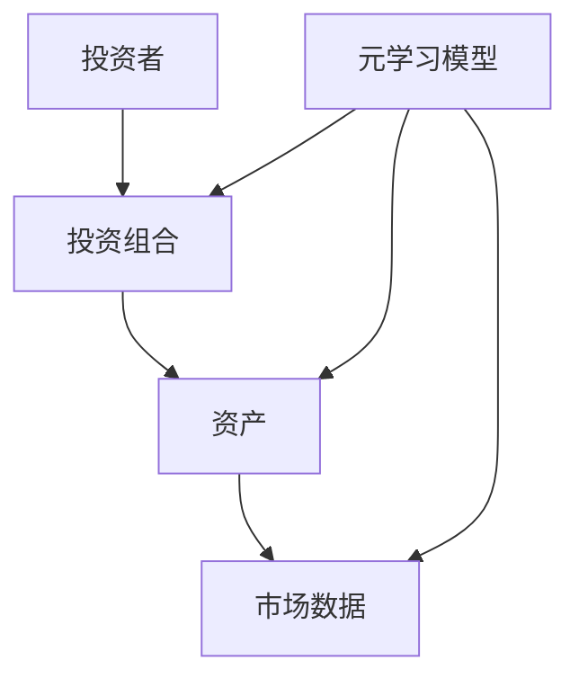
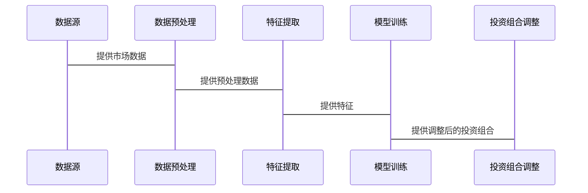

                 


# 《金融领域元学习在投资组合快速调整中的应用》

## 关键词：金融，元学习，投资组合优化，机器学习，快速调整

## 摘要：  
本文深入探讨了元学习在金融领域投资组合优化中的应用，详细分析了元学习的核心概念、算法原理及其在投资组合快速调整中的优势。通过结合实际案例和系统设计，本文展示了如何利用元学习技术提升投资组合优化的效率和准确性，为金融领域的从业者提供了新的思路和实践指南。

---

# 第一部分: 金融领域元学习的背景与基础

## 第1章: 元学习与投资组合优化概述

### 1.1 元学习的基本概念
元学习是一种机器学习范式，旨在通过学习如何学习来解决新任务。与传统机器学习不同，元学习的核心在于“快速适应”新任务的能力。  

#### 1.1.1 元学习的定义  
元学习（Meta-Learning）是一种通过在多个任务上进行训练，从而在新任务上快速适应的学习方法。其目标是学习一种能够高效迁移和泛化的模型，而不是直接解决单一任务。  

#### 1.1.2 元学习的核心特点  
- **快速适应性**：元学习模型能够在新任务上快速调整，无需大量数据。  
- **任务通用性**：元学习模型适用于多种任务，具有较强的泛化能力。  
- **元优化**：通过优化元学习算法的参数，使得模型能够在新任务上快速收敛。  

#### 1.1.3 元学习与传统机器学习的区别  
| 特性 | 传统机器学习 | 元学习 |
|------|--------------|--------|
| 数据需求 | 需要大量数据 | 数据需求少，快速适应 |
| 任务泛化 | 适用于单一任务 | 适用于多个任务 |
| 学习目标 | 学习具体任务 | 学习如何学习 |

### 1.2 投资组合优化的基本原理  
投资组合优化是指在给定的资产集合中，通过合理配置资产权重，以实现投资目标（如最大化收益、最小化风险）的过程。  

#### 1.2.1 投资组合优化的定义  
投资组合优化是金融领域的重要问题，旨在在满足一定约束条件下，找到最优资产配置方案。  

#### 1.2.2 投资组合优化的目标与约束  
- **目标**：最大化收益或最小化风险。  
- **约束**：如资产权重之和为1，投资比例限制等。  

#### 1.2.3 投资组合优化的常见方法  
- **均值-方差优化**：马科维茨提出的方法，基于资产的期望收益和协方差矩阵。  
- **因子模型**：如CAPM模型，基于资产的系统性风险和非系统性风险。  

### 1.3 元学习在投资组合优化中的应用前景  
元学习在金融领域的潜力巨大，尤其是在投资组合优化中，其快速适应性和任务通用性使其成为理想的选择。  

#### 1.3.1 元学习在金融领域的潜力  
- 元学习可以快速适应市场变化，优化投资组合配置。  

#### 1.3.2 元学习在投资组合优化中的优势  
- 元学习可以快速调整投资组合，适应市场波动。  

#### 1.3.3 元学习在投资组合优化中的挑战  
- 元学习模型的训练需要大量计算资源。  

---

## 第2章: 元学习的核心概念与联系

### 2.1 元学习的核心原理  
元学习的核心在于“学习如何学习”。其数学模型通常涉及元优化和任务间的关系。  

#### 2.1.1 元学习的数学模型  
$$ \min_{\theta} \sum_{i=1}^{N} \mathcal{L}_i(\theta) $$  
其中，$\theta$是元学习模型的参数，$\mathcal{L}_i$是任务$i$的损失函数。  

#### 2.1.2 元学习的算法框架  
元学习的算法通常包括预训练和适应阶段：  
1. **预训练**：在多个任务上训练元学习模型。  
2. **适应**：在新任务上快速调整模型参数。  

#### 2.1.3 元学习的优化目标  
元学习的目标是通过优化$\theta$，使得模型在新任务上的表现最优。  

### 2.2 元学习与传统机器学习的对比  
元学习与传统机器学习的主要区别在于其“快速适应”的能力。  

#### 2.2.1 传统机器学习的特点  
- 数据需求大，适应新任务时需要重新训练模型。  

#### 2.2.2 元学习的独特优势  
- 元学习可以在新任务上快速调整，无需重新训练整个模型。  

#### 2.2.3 元学习与传统机器学习的结合  
- 元学习可以作为传统机器学习的补充，提升模型的泛化能力。  

### 2.3 元学习在金融领域的实体关系图  


---

## 第3章: 元学习算法原理与数学模型

### 3.1 元学习算法概述  
元学习算法主要分为基于梯度的元学习算法和基于模型的元学习算法。  

#### 3.1.1 基于梯度的元学习算法  
- 常见算法：MAML（Meta-AntiGradient Descent Learning）。  

#### 3.1.2 基于模型的元学习算法  
- 常见算法：Reptile。  

#### 3.1.3 元学习算法的对比  
| 算法 | 基于梯度 | 基于模型 |
|------|----------|----------|
| 代表 | MAML     | Reptile   |
| 优势 | 梯度计算高效 | 模型表达能力强 |
| 动作 | 梯度下降 | 基于优化器 |

### 3.2 元学习算法的数学模型  
元学习算法的核心是通过优化元学习模型的参数，使得模型在新任务上表现最优。  

#### 3.2.1 元学习的优化目标  
$$ \min_{\theta} \sum_{i=1}^{N} \mathcal{L}_i(\theta) $$  

#### 3.2.2 元学习的梯度计算  
$$ \nabla_{\theta} \mathcal{L}_i(\theta) $$  

#### 3.2.3 元学习的优化器  
$$ \theta_{t+1} = \theta_t - \eta \nabla_{\theta} \mathcal{L}_i(\theta) $$  

### 3.3 元学习算法的实现  
元学习算法的实现通常需要结合深度学习框架（如PyTorch）。  

#### 3.3.1 基于PyTorch的元学习算法实现  
```python
import torch
from torch import nn, optim

class MetaLearner(nn.Module):
    def __init__(self, meta_params):
        super(MetaLearner, self).__init__()
        self.meta_params = meta_params
        # 元学习模型的具体结构
        self.model = nn.Sequential(
            nn.Linear(10, 5),
            nn.ReLU(),
            nn.Linear(5, 1)
        )
    
    def forward(self, x, task_params):
        # 使用任务参数更新元学习模型
        for param, meta_param in zip(task_params, self.meta_params):
            meta_param.grad = param.grad
        # 前向传播
        return self.model(x)
    
    def update(self, learning_rate=0.1):
        # 更新元学习模型的参数
        optimizer = optim.SGD(self.meta_params, lr=learning_rate)
        optimizer.step()
```

---

# 第四部分: 系统分析与架构设计

## 第4章: 元学习在投资组合优化中的系统架构

### 4.1 问题场景介绍  
投资组合优化的场景通常包括数据获取、特征提取、模型训练和结果分析。  

### 4.2 系统功能设计  
投资组合优化的系统通常包括以下功能模块：  
- 数据预处理模块：处理市场数据，提取特征。  
- 特征提取模块：基于深度学习模型提取特征。  
- 模型训练模块：训练元学习模型。  
- 投资组合调整模块：根据模型输出调整投资组合。  

### 4.3 系统架构设计  


### 4.4 系统接口设计  
- 数据接口：从数据源获取市场数据。  
- 模型接口：训练和调整元学习模型。  
- 输出接口：输出投资组合调整结果。  

### 4.5 系统交互流程  


---

## 第5章: 项目实战

### 5.1 环境安装  
- 安装Python和相关库（如PyTorch、numpy）。  

### 5.2 系统核心实现  
```python
import torch
import numpy as np

# 数据预处理
def preprocess_data(data):
    # 假设data是市场数据
    return normalized_data

# 特征提取
def extract_features(data):
    # 假设data是预处理后的数据
    return features

# 模型训练
def train_model(features, labels):
    # 训练元学习模型
    pass

# 投资组合调整
def adjust_portfolio(model, data):
    # 根据模型输出调整投资组合
    pass
```

### 5.3 案例分析  
- 假设市场数据为股票价格，特征为股票的收益率和波动率。  

### 5.4 代码实现  
```python
import torch
from torch import nn, optim

class PortfolioAdjuster(nn.Module):
    def __init__(self, input_dim, output_dim):
        super(PortfolioAdjuster, self).__init__()
        self.fc = nn.Linear(input_dim, output_dim)
    
    def forward(self, x):
        return self.fc(x)

# 训练模型
def train_model(model, optimizer, criterion, data_loader):
    for epoch in range(num_epochs):
        for inputs, labels in data_loader:
            outputs = model(inputs)
            loss = criterion(outputs, labels)
            optimizer.zero_grad()
            loss.backward()
            optimizer.step()

# 调整投资组合
def adjust_portfolio(model, data):
    with torch.no_grad():
        outputs = model(data)
        return outputs.numpy()
```

---

## 第6章: 最佳实践与小结

### 6.1 最佳实践  
- 在实际应用中，建议结合市场数据和实际业务需求，调整元学习模型的参数。  

### 6.2 小结  
元学习在投资组合优化中的应用具有广阔的前景，其快速适应性和任务通用性使其成为金融领域的重要工具。  

### 6.3 注意事项  
- 元学习模型的训练需要大量计算资源。  
- 需要结合实际业务需求，合理选择模型参数。  

### 6.4 拓展阅读  
- 推荐阅读相关论文和书籍，深入了解元学习的数学模型和算法实现。  

---

# 作者：AI天才研究院/AI Genius Institute & 禅与计算机程序设计艺术 /Zen And The Art of Computer Programming

