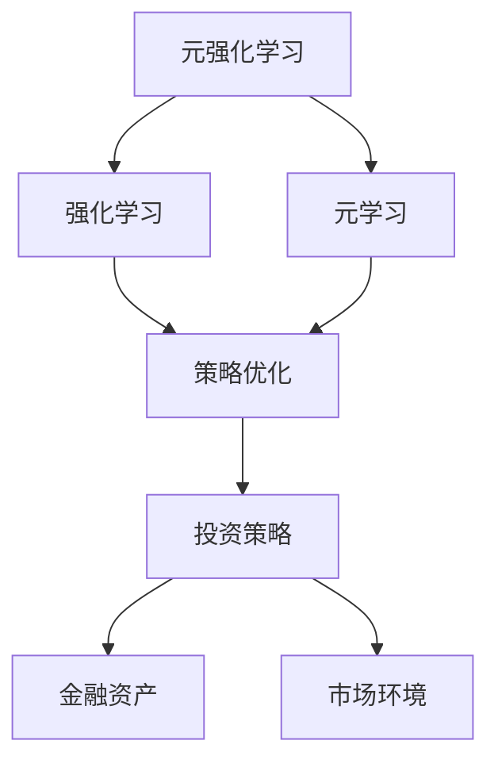
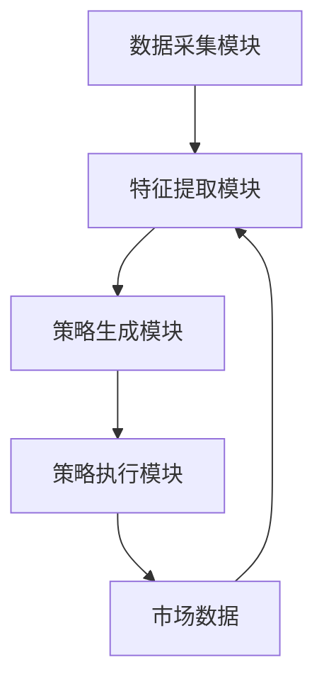

                 


# 《金融领域元强化学习在投资策略中的应用》

> **关键词**：元强化学习, 金融投资, 投资策略, 强化学习, 人工智能

> **摘要**：  
> 本文深入探讨了元强化学习（Meta-Reinforcement Learning）在金融投资策略中的应用。通过结合强化学习和元学习的双重优势，元强化学习能够有效解决传统投资策略中的复杂决策问题。文章从元强化学习的基本概念、核心原理、数学模型、系统架构到实际项目案例，全面分析其在金融领域的应用潜力和优势。通过详细的算法实现和案例解读，本文为读者提供了从理论到实践的完整指南，帮助他们在金融投资中更好地应用元强化学习技术。

---

# 第一部分：元强化学习的背景与基础

---

# 第1章：元强化学习的起源与概念

## 1.1 元强化学习的起源

### 1.1.1 强化学习的基本概念  
强化学习（Reinforcement Learning, RL）是一种机器学习范式，通过智能体与环境的交互，学习最优策略以最大化累积奖励。经典的强化学习算法包括Q-Learning、Deep Q-Networks（DQN）等。

### 1.1.2 元强化学习的定义与特点  
元强化学习（Meta-Reinforcement Learning, Meta-RL）是在强化学习基础上引入元学习（Meta-Learning）思想，通过学习如何快速适应新任务，提升泛化能力。其特点包括：  
- **快速适应性**：能够在新任务中快速找到最优策略。  
- **多任务学习**：能够在多个任务中共享知识，提升整体性能。  
- **层次化决策**：通过多层次的策略优化，增强决策的灵活性和高效性。

### 1.1.3 元强化学习与传统强化学习的区别  
| **维度**         | **传统强化学习**                          | **元强化学习**                              |
|-------------------|------------------------------------------|--------------------------------------------|
| **目标函数**     | 最大化单任务的累积奖励                    | 最大化多任务的累积奖励                      |
| **任务适应性**   | 需要针对每个新任务从头开始学习            | 能够快速适应新任务，减少训练时间            |
| **计算复杂度**   | 计算成本较高，尤其是面对多任务时          | 计算成本相对较低，通过元学习降低复杂度      |

---

## 1.2 元强化学习在金融领域的应用背景

### 1.2.1 金融投资中的复杂决策问题  
金融市场的复杂性主要体现在：  
- **非线性关系**：价格波动、市场情绪等因素相互交织，难以用传统线性模型描述。  
- **动态变化**：市场环境随时间变化，投资策略需要动态调整。  
- **多目标优化**：在风险与收益之间找到平衡点，兼顾短期和长期目标。

### 1.2.2 元强化学习在金融投资中的优势  
- **快速适应市场变化**：元强化学习能够快速调整策略，适应市场波动。  
- **多任务优化**：在多个金融产品或市场中共享学习经验，提升整体投资效率。  
- **智能组合管理**：通过层次化决策，优化投资组合配置。

### 1.2.3 元强化学习的边界与外延  
元强化学习的应用边界主要在于：  
- 数据质量要求较高，需要大量高质量的金融市场数据。  
- 计算资源需求较大，尤其是多任务学习场景。  
- 对市场机制的理解依赖性强，需要结合金融知识进行策略调整。

---

## 1.3 元强化学习的核心要素与概念结构

### 1.3.1 元强化学习的核心要素  
- **元任务（Meta-Task）**：定义一组相关任务，用于训练元模型。  
- **元模型（Meta-Model）**：通过元学习框架，学习如何快速适应新任务。  
- **策略优化（Policy Optimization）**：在具体任务中优化投资策略。  

### 1.3.2 概念结构与核心要素组成  
元强化学习的概念结构可以表示为一个层次化的框架，包括：  
1. **元任务层**：定义多个相关任务，如股票、基金、债券等不同资产类别。  
2. **元模型层**：学习跨任务的通用策略，用于快速适应新任务。  
3. **策略层**：针对具体任务，优化投资策略。

### 1.3.3 元强化学习与金融投资的结合点  
- **资产配置**：通过元强化学习优化投资组合配置。  
- **风险管理**：快速识别和应对市场风险。  
- **交易决策**：在多市场、多资产中做出最优交易决策。

---

## 1.4 本章小结  
本章介绍了元强化学习的基本概念、核心要素及其在金融投资中的应用背景。通过对比传统强化学习与元强化学习的差异，突出了元强化学习在金融市场中的独特优势和应用场景。

---

# 第2章：元强化学习的基本原理

## 2.1 元强化学习的算法框架

### 2.1.1 元强化学习的基本流程  
元强化学习的流程可以分为以下几个步骤：  
1. **元任务定义**：定义一组相关任务，如不同资产类别或市场状态。  
2. **元模型训练**：在元任务上训练元模型，学习跨任务的优化策略。  
3. **策略优化**：针对具体任务，优化投资策略，生成最优决策。

### 2.1.2 元强化学习的核心算法  
元强化学习的核心算法包括：  
- **Meta-Policy Gradient（MPG）**：通过元梯度优化策略。  
- **Recurrent Meta-Learner（RML）**：利用循环神经网络实现元学习。  
- **Episodic Meta-Learning（EML）**：通过 episodic 训练提升任务适应性。

### 2.1.3 元强化学习的数学模型  
元强化学习的数学模型可以表示为：  
$$ \theta_{meta} = \arg\max_{\theta} \sum_{i=1}^{N} \mathcal{J}_i(\theta) $$  
其中，$\theta_{meta}$ 是元模型参数，$\mathcal{J}_i$ 是第 $i$ 个任务的优化目标。

---

## 2.2 元强化学习的特征对比

### 2.2.1 元强化学习与传统强化学习的对比  
| **维度**         | **传统强化学习**                  | **元强化学习**                        |
|-------------------|----------------------------------|--------------------------------------|
| **任务适应性**   | 单任务优化，适应性差              | 多任务学习，适应性强                  |
| **训练效率**     | 训练时间长，尤其是新任务          | 训练时间短，通过元学习降低复杂度      |
| **模型复杂度**   | 模型复杂度较低                    | 模型复杂度较高，尤其是元学习模块      |

### 2.2.2 元强化学习与其他机器学习方法的对比  
- **与监督学习（Supervised Learning）的区别**：监督学习依赖标注数据，而元强化学习依赖任务之间的关联性。  
- **与无监督学习（Unsupervised Learning）的区别**：无监督学习无法直接应用于有明确目标的金融投资问题。

### 2.2.3 元强化学习的优缺点分析  
**优点**：  
- 能够快速适应新任务，减少训练时间。  
- 可以在多任务场景下共享知识，提升整体性能。  

**缺点**：  
- 对数据质量和数量要求较高。  
- 计算资源消耗较大，尤其是多任务学习场景。  

---

## 2.3 元强化学习的ER实体关系图



---

## 2.4 本章小结  
本章详细介绍了元强化学习的基本原理、算法框架及其与传统机器学习方法的对比。通过 ER 实体关系图，进一步展示了元强化学习在金融投资中的应用架构。

---

# 第3章：元强化学习的数学模型与算法原理

## 3.1 元强化学习的数学模型

### 3.1.1 元强化学习的目标函数  
元强化学习的目标函数可以表示为：  
$$ \theta_{meta} = \arg\max_{\theta} \sum_{i=1}^{N} \mathcal{J}_i(\theta) $$  
其中，$\theta_{meta}$ 是元模型参数，$\mathcal{J}_i$ 是第 $i$ 个任务的优化目标。

### 3.1.2 元强化学习的策略优化  
策略优化的目标是最优化投资策略，使得累积奖励最大化：  
$$ \pi_{opt} = \arg\max_{\pi} \sum_{t} r_t $$  
其中，$\pi$ 是策略，$r_t$ 是第 $t$ 个时间步的奖励。

### 3.1.3 元强化学习的损失函数  
元强化学习的损失函数可以表示为：  
$$ \mathcal{L}(\theta) = \sum_{i=1}^{N} \mathcal{L}_i(\theta) $$  
其中，$\mathcal{L}_i$ 是第 $i$ 个任务的损失函数。

---

## 3.2 元强化学习的算法流程

### 3.2.1 元强化学习的基本流程  
1. **定义元任务**：定义一组相关任务，如股票、基金等。  
2. **训练元模型**：在元任务上训练元模型，学习跨任务的优化策略。  
3. **优化投资策略**：针对具体任务，优化投资策略，生成最优决策。

### 3.2.2 元强化学习的算法步骤  
1. 初始化元模型参数 $\theta$。  
2. 对于每个元任务 $i$：  
   a. 优化策略 $\pi$，最大化累积奖励。  
   b. 更新元模型参数 $\theta$。  
3. 输出优化后的投资策略 $\pi_{opt}$。

---

## 3.3 元强化学习的层次化决策模型

### 3.3.1 层次化决策模型的构建  
层次化决策模型将投资决策分为多个层次：  
1. **资产类别选择**：选择股票、债券等资产类别。  
2. **资产配置优化**：确定各资产的权重。  
3. **交易策略优化**：制定具体的交易策略。

### 3.3.2 层次化决策模型的数学表达  
层次化决策模型的优化目标可以表示为：  
$$ \max_{w} \sum_{i=1}^{M} w_i r_i - \lambda \sum_{i=1}^{M} w_i^2 $$  
其中，$w_i$ 是第 $i$ 个资产的权重，$r_i$ 是预期收益，$\lambda$ 是风险惩罚系数。

---

## 3.4 本章小结  
本章详细讲解了元强化学习的数学模型与算法原理，包括目标函数、策略优化和损失函数。通过层次化决策模型，进一步展示了如何在金融投资中应用元强化学习技术。

---

# 第4章：元强化学习的系统架构设计

## 4.1 问题场景介绍

### 4.1.1 系统目标  
设计一个基于元强化学习的金融投资系统，实现多资产类别下的最优投资策略。

### 4.1.2 系统输入  
- 历史市场数据（股票价格、指数等）。  
- 市场状态（牛市、熊市等）。  

### 4.1.3 系统输出  
- 投资组合配置建议。  
- 交易策略优化结果。  

---

## 4.2 项目介绍

### 4.2.1 项目目标  
通过元强化学习技术，实现一个智能化的投资策略优化系统。

### 4.2.2 项目范围  
涵盖股票、债券、基金等多种资产类别。

---

## 4.3 系统功能设计

### 4.3.1 系统功能模块  
1. 数据采集模块：获取金融市场数据。  
2. 特征提取模块：提取投资相关的特征。  
3. 策略生成模块：生成最优投资策略。  
4. 策略执行模块：执行交易策略。  

### 4.3.2 系统功能流程  
1. 数据采集模块获取市场数据。  
2. 特征提取模块提取投资特征。  
3. 策略生成模块生成投资策略。  
4. 策略执行模块执行交易策略。

---

## 4.4 系统架构设计

### 4.4.1 系统架构图  


---

## 4.5 本章小结  
本章详细设计了一个基于元强化学习的金融投资系统，包括功能模块、系统架构和流程设计。

---

# 第5章：元强化学习的项目实战

## 5.1 项目环境安装

### 5.1.1 安装Python环境  
安装Python 3.8 或更高版本。

### 5.1.2 安装依赖库  
安装必要的依赖库：  
- `numpy`  
- `pandas`  
- `torch`  

---

## 5.2 项目核心实现

### 5.2.1 数据预处理代码  
```python
import numpy as np
import pandas as pd

def preprocess_data(data):
    # 数据清洗
    data = data.dropna()
    # 标准化处理
    data = (data - data.mean()) / data.std()
    return data
```

### 5.2.2 元强化学习算法实现  
```python
import torch
import torch.nn as nn

class MetaRL(nn.Module):
    def __init__(self, input_dim, hidden_dim, output_dim):
        super(MetaRL, self).__init__()
        self.meta_layer = nn.Linear(input_dim, hidden_dim)
        self.task_layer = nn.Linear(hidden_dim, output_dim)

    def forward(self, x):
        x = self.meta_layer(x)
        x = self.task_layer(x)
        return x
```

---

## 5.3 代码实现与解读

### 5.3.1 数据加载与预处理  
```python
data = pd.read_csv('market_data.csv')
processed_data = preprocess_data(data)
```

### 5.3.2 元强化学习模型训练  
```python
model = MetaRL(input_dim=64, hidden_dim=32, output_dim=1)
optimizer = torch.optim.Adam(model.parameters(), lr=0.001)
loss_fn = nn.MSELoss()

for epoch in range(100):
    outputs = model(processed_data)
    loss = loss_fn(outputs, processed_data.targets)
    optimizer.zero_grad()
    loss.backward()
    optimizer.step()
```

---

## 5.4 实际案例分析

### 5.4.1 股票投资策略优化  
假设我们有一个包含 100 只股票的组合，目标是通过元强化学习优化投资策略。通过训练元模型，能够在较短时间内找到最优投资组合。

### 5.4.2 策略结果分析  
通过训练后的模型，我们可以得到每个股票的权重，从而生成最优的投资组合配置。

---

## 5.5 项目小结  
本章通过一个具体的股票投资策略优化案例，详细展示了元强化学习在金融投资中的实际应用。通过代码实现和案例分析，进一步验证了元强化学习的有效性和实用性。

---

# 第6章：元强化学习的最佳实践与注意事项

## 6.1 最佳实践

### 6.1.1 数据质量的重要性  
确保数据的完整性和准确性，避免噪声干扰。

### 6.1.2 模型调参技巧  
- 选择合适的超参数，如学习率、批量大小等。  
- 定期进行模型验证，避免过拟合。

### 6.1.3 算法的局限性  
- 对计算资源的需求较高。  
- 需要结合金融知识进行策略调整。  

---

## 6.2 本章小结  
本章总结了元强化学习在金融投资中的最佳实践经验和注意事项，帮助读者在实际应用中更好地优化投资策略。

---

# 第7章：结论与展望

## 7.1 结论  
元强化学习通过结合强化学习和元学习的优势，为金融投资策略的优化提供了新的思路。通过层次化决策和多任务学习，能够有效解决传统投资策略中的复杂决策问题。

## 7.2 未来展望  
未来的研究方向包括：  
- 提高元强化学习的计算效率。  
- 探索元强化学习在更复杂的金融场景中的应用。  
- 结合其他机器学习技术，进一步提升投资策略的智能化水平。

---

# 作者信息

作者：AI天才研究院/AI Genius Institute & 禅与计算机程序设计艺术 /Zen And The Art of Computer Programming

