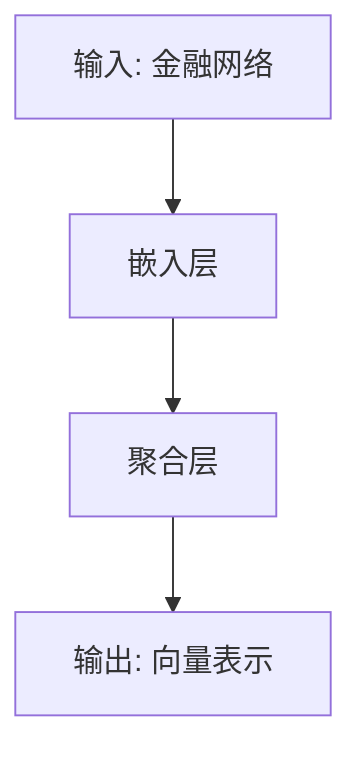
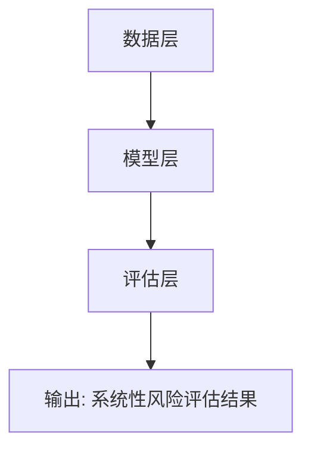

                 


# 《金融领域图表示学习在系统性风险度量中的应用》

---

## 关键词：
- 图表示学习
- 系统性风险
- 金融网络
- 异常检测
- 风险传播

---

## 摘要：
本文深入探讨了图表示学习在金融领域系统性风险度量中的应用。通过分析系统性风险的网络表示、图嵌入方法以及实际应用场景，本文揭示了图表示学习在金融风险管理中的潜力和优势。从理论基础到算法实现，再到系统设计和项目实战，本文为读者提供了一个全面的技术视角，帮助理解和应用图表示学习来应对系统性风险的挑战。

---

# 第一章：系统性风险与图表示学习背景

## 1.1 系统性风险的基本概念

### 1.1.1 系统性风险的定义
系统性风险是指由于金融系统中某些关键因素的变化，导致整个系统发生连锁反应，引发大规模金融波动或危机的风险。这种风险通常来源于金融机构之间的高度关联性和相互依赖性。

### 1.1.2 系统性风险的影响
系统性风险的影响是全局性的，一旦发生，可能会引发市场崩盘、金融机构破产以及经济衰退等严重后果。因此，准确度量和预警系统性风险对于金融稳定具有重要意义。

### 1.1.3 传统风险度量方法的局限性
传统的风险度量方法通常基于单个金融机构的个体风险，难以捕捉系统性风险的网络特征和相互关联性。例如，VaR（Value at Risk）和CVaR（Conditional Value at Risk）等方法仅考虑单个资产或机构的风险，忽略了系统性风险的传播路径和网络结构。

---

## 1.2 图表示学习的背景与意义

### 1.2.1 图表示学习的定义
图表示学习是一种将图结构数据中的节点或边映射到低维向量空间的技术，旨在保留图的结构特征和语义信息。通过图表示学习，可以将复杂的金融网络简化为易于处理的向量表示。

### 1.2.2 图表示学习在金融领域的优势
在金融领域，图表示学习可以有效捕捉金融机构之间的关联性，揭示系统性风险的传播路径和关键节点。相比于传统方法，图表示学习能够更好地应对金融网络的动态变化和复杂性。

### 1.2.3 系统性风险度量中的应用潜力
通过图表示学习，可以构建金融网络的低维嵌入，用于识别系统性风险的关键节点、检测异常交易模式以及评估风险传播的路径和影响。

---

## 1.3 本章小结
本章介绍了系统性风险的基本概念及其对金融稳定的影响，分析了传统风险度量方法的局限性，并提出了图表示学习在系统性风险度量中的潜力和意义。

---

# 第二章：图表示学习的核心概念

## 2.1 图论基础

### 2.1.1 图的基本概念
- **节点**：图中的基本单元，表示金融机构、资产或交易。
- **边**：连接节点的边，表示金融机构之间的关联性或资产之间的交易关系。
- **图的属性**：包括节点度、边权重、图的密度等。

### 2.1.2 图的表示方式
- **邻接矩阵**：直接表示节点之间的连接关系。
- **邻接列表**：以列表形式表示节点的邻居。
- **图的特征向量**：通过矩阵分解或特征分解提取图的特征。

### 2.1.3 图的属性特征
- **节点度**：节点的连接边数，反映节点的重要性和影响力。
- **中心性**：节点在图中的中心程度，包括度中心性、中间中心性等。
- **社区结构**：图中节点的聚类特征，反映金融机构之间的集群关系。

---

## 2.2 图表示学习的基本原理

### 2.2.1 节点表示
节点表示的目标是将图中的每个节点映射到低维向量空间，同时保留节点的局部和全局特征。例如，使用Node2Vec算法可以通过随机游走生成节点表示。

### 2.2.2 边表示
边表示的目标是捕捉节点之间关系的语义信息，例如使用边嵌入模型（如GraphSAGE）来生成边的向量表示。

### 2.2.3 图结构信息的捕获
图表示学习需要捕捉图的全局结构信息，例如图的连通性、社区结构等。可以通过图卷积网络（Graph Convolutional Networks, GCNs）等方法实现。

---

## 2.3 图嵌入方法

### 2.3.1 基于矩阵分解的图嵌入
- **方法**：通过矩阵分解（如SVD）将图的邻接矩阵分解为低维向量。
- **优点**：计算效率高，易于实现。
- **缺点**：难以捕捉图的非线性特征。

### 2.3.2 基于神经网络的图嵌入
- **方法**：使用深度学习模型（如GCN、GraphSAGE）进行图嵌入。
- **优点**：能够捕捉图的非线性特征和高层次语义信息。
- **缺点**：计算复杂度较高，需要大量训练数据。

### 2.3.3 对比学习在图嵌入中的应用
- **方法**：通过对比学习，将图中的节点或边映射到统一的向量空间。
- **优点**：能够有效区分不同节点或边的特征。
- **缺点**：需要设计合适的对比损失函数。

---

## 2.4 本章小结
本章介绍了图表示学习的核心概念，包括图论基础、图表示学习的基本原理以及常用的图嵌入方法。

---

# 第三章：系统性风险的金融网络建模

## 3.1 系统性风险的网络表示

### 3.1.1 金融机构间的相互作用
- **金融机构**：节点表示金融机构，边表示它们之间的关联性。
- **金融资产**：节点表示金融资产，边表示资产之间的交易或持有关系。

### 3.1.2 金融网络的构建方法
- **基于交易的网络**：通过交易数据构建金融机构之间的关联网络。
- **基于资产的网络**：通过资产持有数据构建金融机构之间的关联网络。

### 3.1.3 网络中的风险传播路径
- **直接传播**：节点之间的直接连接。
- **间接传播**：通过中间节点传播。

---

## 3.2 典型金融网络模型

### 3.2.1 基于交易的网络模型
- **定义**：通过金融机构之间的交易数据构建网络。
- **特点**：反映金融机构之间的直接交易关系。

### 3.2.2 资产关联网络模型
- **定义**：通过金融机构持有的资产数据构建网络。
- **特点**：反映金融机构之间的资产关联性。

### 3.2.3 系统性风险的网络度量指标
- **节点度**：反映金融机构的重要性和影响力。
- **中心性**：反映金融机构在风险传播中的关键地位。

---

## 3.3 本章小结
本章介绍了系统性风险的网络表示方法，分析了典型的金融网络模型，并提出了系统性风险的网络度量指标。

---

# 第四章：图表示学习在系统性风险中的应用

## 4.1 系统性风险的异常检测

### 4.1.1 异常检测的基本原理
- **定义**：通过图表示学习将金融网络映射到低维空间，识别异常节点或边。
- **方法**：使用聚类分析、支持向量机（SVM）或深度学习模型进行异常检测。

### 4.1.2 图表示学习在异常检测中的应用
- **案例**：通过图表示学习识别异常交易行为或异常资产波动。

### 4.1.3 实际案例分析
- **案例分析**：某次金融危机中，使用图表示学习识别出异常交易行为，提前预警系统性风险。

---

## 4.2 系统性风险的风险传播分析

### 4.2.1 风险传播的网络模型
- **定义**：通过图表示学习构建风险传播网络，分析风险从一个节点向其他节点传播的路径。

### 4.2.2 图表示学习在风险传播中的应用
- **方法**：使用图卷积网络（GCN）进行风险传播分析，识别关键节点和风险传播路径。

### 4.2.3 案例分析与结果解读
- **案例分析**：某金融机构的倒闭引发连锁反应，通过图表示学习分析风险传播路径，识别关键影响节点。

---

## 4.3 系统性风险的压力测试

### 4.3.1 压力测试的定义
- **定义**：通过模拟极端市场条件，评估金融机构在压力下的表现。

### 4.3.2 图表示学习在压力测试中的应用
- **方法**：使用图表示学习构建压力测试场景，评估系统性风险的影响范围和程度。

### 4.3.3 实际案例分析
- **案例分析**：在某次金融危机中，使用图表示学习进行压力测试，评估不同金融机构在压力下的表现。

---

## 4.4 本章小结
本章探讨了图表示学习在系统性风险中的应用，包括异常检测、风险传播分析和压力测试，并通过实际案例分析展示了图表示学习在系统性风险度量中的潜力。

---

# 第五章：算法原理

## 5.1 图表示学习的算法流程

### 5.1.1 算法步骤
1. **输入**：金融网络的邻接矩阵或边列表。
2. **嵌入层**：通过神经网络生成节点或边的向量表示。
3. **聚合层**：聚合节点或边的嵌入，生成图的全局表示。
4. **输出**：节点或边的向量表示。

### 5.1.2 mermaid流程图


---

## 5.2 图表示学习的数学模型

### 5.2.1 嵌入层
- **数学模型**：使用神经网络生成节点嵌入，例如：
  $$ E = \text{GCN}(A) $$
  其中，\( A \) 是邻接矩阵，\( E \) 是节点嵌入矩阵。

### 5.2.2 聚合层
- **数学模型**：通过聚合节点嵌入生成图的全局表示，例如：
  $$ G = \text{Aggregation}(E) $$

---

## 5.3 本章小结
本章详细介绍了图表示学习的算法流程和数学模型，为后续的应用提供了理论基础。

---

# 第六章：系统性风险度量的系统分析与架构设计

## 6.1 问题场景分析

### 6.1.1 系统性风险的识别与预警
- **目标**：识别潜在的系统性风险，提前预警。

### 6.1.2 风险传播路径的分析
- **目标**：分析风险在金融网络中的传播路径，识别关键节点。

### 6.1.3 风险影响的评估
- **目标**：评估系统性风险对整个金融系统的影响程度。

---

## 6.2 系统功能设计

### 6.2.1 数据预处理
- **功能**：清洗和标准化金融数据，构建金融网络。

### 6.2.2 模型训练
- **功能**：使用图表示学习算法训练模型，生成节点或边的向量表示。

### 6.2.3 风险评估
- **功能**：基于模型输出，评估系统性风险的传播路径和影响。

---

## 6.3 系统架构设计

### 6.3.1 分层架构
- **数据层**：存储和处理金融数据。
- **模型层**：实现图表示学习算法，生成节点或边的向量表示。
- **评估层**：评估系统性风险的传播路径和影响。

### 6.3.2 mermaid架构图


---

## 6.4 本章小结
本章分析了系统性风险度量的问题场景，设计了系统的功能模块和架构，并通过mermaid图展示了系统的整体架构。

---

# 第七章：项目实战

## 7.1 环境安装

### 7.1.1 安装依赖
- **Python**：3.6+
- **库**：numpy、pandas、networkx、pytorch、tensorflow

### 7.1.2 安装命令
```bash
pip install numpy pandas networkx pytorch tensorflow
```

---

## 7.2 数据收集与预处理

### 7.2.1 数据来源
- **数据集**：虚构的金融机构交易数据，包括交易金额、时间戳、机构ID等。

### 7.2.2 数据预处理
- **清洗数据**：处理缺失值和异常值。
- **构建网络**：将交易数据转换为图结构，节点表示金融机构，边表示交易关系。

---

## 7.3 模型实现

### 7.3.1 图表示学习模型实现
```python
import torch
import torch.nn as nn

class GCN(nn.Module):
    def __init__(self, input_dim, hidden_dim, output_dim):
        super(GCN, self).__init__()
        self.embeddings = nn.Parameter(torch.randn(input_dim, hidden_dim))
        self.W = nn.Parameter(torch.randn(hidden_dim, output_dim))
    
    def forward(self, A, x):
        x = torch.matmul(A, x)
        x = torch.matmul(x, self.embeddings)
        x = torch.relu(x)
        x = torch.matmul(x, self.W)
        return x
```

### 7.3.2 训练模型
```python
model = GCN(input_dim=100, hidden_dim=64, output_dim=32)
optimizer = torch.optim.Adam(model.parameters(), lr=0.001)
criterion = nn.MSELoss()

for epoch in range(100):
    outputs = model(A, x)
    loss = criterion(outputs, labels)
    optimizer.zero_grad()
    loss.backward()
    optimizer.step()
```

---

## 7.4 结果分析与案例解读

### 7.4.1 模型输出
- **节点嵌入**：表示每个金融机构的向量表示。
- **风险传播路径**：通过模型输出分析风险从一个节点向其他节点传播的路径。

### 7.4.2 案例解读
- **案例分析**：某金融机构的嵌入异常，可能表明该机构存在较高的系统性风险。

---

## 7.5 本章小结
本章通过实际项目展示了图表示学习在系统性风险度量中的应用，从数据预处理到模型实现，再到结果分析，为读者提供了完整的实战参考。

---

# 第八章：最佳实践与小结

## 8.1 最佳实践

### 8.1.1 数据质量
- 数据清洗和预处理是关键，确保数据的准确性和完整性。

### 8.1.2 模型选择
- 根据具体场景选择合适的图表示学习算法，例如GCN、GraphSAGE等。

### 8.1.3 实时监控
- 实时监控金融网络的变化，及时发现潜在的系统性风险。

---

## 8.2 小结

通过本文的探讨，我们深入分析了图表示学习在系统性风险度量中的应用，从理论基础到实际应用，从算法实现到系统设计，为读者提供了一个全面的技术视角。图表示学习作为一种新兴的技术，为金融风险管理提供了新的思路和方法。

---

## 8.3 注意事项

- 系统性风险的度量需要结合实际业务场景，避免模型的泛化性问题。
- 数据隐私和安全问题需要高度重视，确保数据的合法合规使用。

---

## 8.4 拓展阅读

- 《Graph Neural Networks: A Review of Methods, Applications, and Open Challenges》
- 《Network Theory and Financial Risk》

---

## 作者信息

作者：AI天才研究院/AI Genius Institute & 禅与计算机程序设计艺术 /Zen And The Art of Computer Programming

---

以上是《金融领域图表示学习在系统性风险度量中的应用》的完整目录和内容框架，您可以根据需要进行补充和调整。

