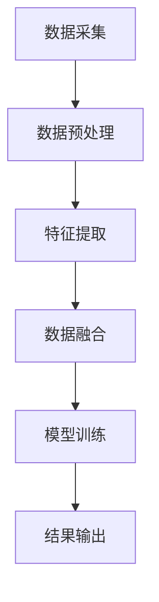

                 


# 《金融领域多模态学习在全方位反欺诈中的应用》

> 关键词：多模态学习，反欺诈，金融安全，数据融合，人工智能

> 摘要：本文深入探讨了多模态学习在金融反欺诈中的应用，分析了多模态数据的融合方法、特征提取技术和分类算法，结合实际案例展示了系统设计和项目实现过程。通过本文，读者将全面理解多模态学习如何提升金融反欺诈的效率和准确性。

---

## 第一章：引言

### 1.1 问题背景
金融欺诈是全球性的难题，传统方法面临数据单一、模型泛化能力不足等挑战。多模态学习通过整合多种数据类型，提供了更全面的欺诈检测手段。

### 1.2 问题描述
金融欺诈行为多样，从信用卡欺诈到洗钱，传统单模态分析难以覆盖所有风险点。多模态学习通过整合交易数据、用户行为、社交网络等多源信息，构建更 robust 的欺诈检测系统。

### 1.3 研究目标
本文旨在探讨多模态学习在金融反欺诈中的应用，分析其优势，并提供技术实现和系统设计的具体方法。

---

## 第二章：多模态学习基础

### 2.1 多模态数据的定义与特点
- **定义**：多模态数据指来自多种数据类型的综合信息，如文本、图像、数值等。
- **特点**：
  - **互补性**：不同模态数据相互补充，提升分析准确性。
  - **多样性**：涵盖更多维度的信息。
  - **复杂性**：处理多模态数据需要更复杂的算法。

### 2.2 多模态学习的核心概念
- **数据融合**：将不同模态的数据整合，形成统一的表示。
- **特征提取**：从多模态数据中提取有效的特征，用于分类任务。
- **分类算法**：基于多模态特征，训练分类模型以检测欺诈行为。

### 2.3 多模态学习在金融反欺诈中的优势
- **提升准确性**：多模态数据提供了更全面的信息，降低误判率。
- **增强鲁棒性**：单一模态的不足可以通过其他模态数据弥补。
- **实时性**：多模态分析可以实时处理交易数据，快速识别欺诈行为。

---

## 第三章：多模态学习在反欺诈中的应用

### 3.1 数据融合方法
- **数据预处理**：标准化、去噪处理，确保数据质量。
- **融合策略**：
  - **早期融合**：在特征提取前进行数据融合。
  - **晚期融合**：在特征提取后进行数据融合。
- **融合模型**：如基于注意力机制的融合网络，动态调整各模态的权重。

### 3.2 特征提取技术
- **传统方法**：如主成分分析（PCA）、线性判别分析（LDA）。
- **深度学习方法**：如卷积神经网络（CNN）、循环神经网络（RNN）。

### 3.3 分类算法
- **传统机器学习**：如支持向量机（SVM）、随机森林（RF）。
- **深度学习**：如卷积神经网络（CNN）、循环神经网络（RNN）、图神经网络（GNN）。

---

## 第四章：算法原理与实现

### 4.1 多模态融合的数学模型
- **融合函数**：$f(x_1, x_2, ..., x_n) = w_1x_1 + w_2x_2 + ... + w_nx_n$，其中$w_i$为各模态的权重。
- **注意力机制**：$a_i = \text{softmax}(Wx_i + b)$，用于动态调整各模态的重要性。

### 4.2 基于深度学习的分类模型
- **模型结构**：使用预训练的深度学习模型（如BERT、ResNet）进行特征提取。
- **分类器设计**：在特征层上进行融合，使用全连接层和Softmax进行分类。

### 4.3 算法实现步骤
1. 数据预处理与标准化。
2. 特征提取：使用深度学习模型提取各模态特征。
3. 数据融合：基于注意力机制进行多模态特征融合。
4. 模型训练：训练分类器，优化损失函数。
5. 模型评估：使用准确率、召回率、F1值等指标评估模型性能。

---

## 第五章：系统设计与实现

### 5.1 系统架构设计
- **模块划分**：
  - 数据采集模块：负责收集多模态数据。
  - 特征提取模块：进行特征提取和数据融合。
  - 模型训练模块：训练分类器并优化模型。
  - 结果输出模块：输出欺诈检测结果。

- **系统架构图**：


### 5.2 接口设计
- **数据接口**：定义数据格式和API接口，方便数据接入。
- **模型接口**：定义模型输入输出格式，支持在线推理。

### 5.3 交互流程
- **用户输入**：用户提交交易请求。
- **数据处理**：系统采集并处理多模态数据。
- **模型推理**：模型输出欺诈概率。
- **结果反馈**：系统反馈欺诈检测结果。

---

## 第六章：项目实战

### 6.1 环境安装
- **工具安装**：
  - 安装Python和必要的库（如TensorFlow、Keras、Scikit-learn）。
  - 安装Jupyter Notebook用于实验和测试。

### 6.2 核心代码实现

#### 数据预处理代码
```python
import pandas as pd
import numpy as np

# 加载数据
data = pd.read_csv('financial_data.csv')

# 数据标准化
from sklearn.preprocessing import StandardScaler
scaler = StandardScaler()
data_normalized = scaler.fit_transform(data)
```

#### 多模态融合代码
```python
import tensorflow as tf
from tensorflow.keras.layers import Input, Dense, concatenate
from tensorflow.keras.models import Model

# 输入层
input1 = Input(shape=(10,))
input2 = Input(shape=(5,))

# 特征提取层
dense1 = Dense(5, activation='relu')(input1)
dense2 = Dense(5, activation='relu')(input2)

# 融合层
merged = concatenate([dense1, dense2])

# 分类层
output = Dense(1, activation='sigmoid')(merged)

# 定义模型
model = Model(inputs=[input1, input2], outputs=output)
model.compile(optimizer='adam', loss='binary_crossentropy', metrics=['accuracy'])
```

#### 模型训练代码
```python
# 训练模型
model.fit([X1_train, X2_train], y_train, epochs=10, batch_size=32, validation_split=0.2)
```

### 6.3 案例分析
- **案例1**：信用卡欺诈检测，使用交易金额、时间、地点等信息，结合用户行为数据，准确检测欺诈交易。
- **案例2**：网络支付欺诈，通过分析支付方式、设备信息、交易频率等多模态数据，有效识别异常交易。

### 6.4 项目总结
通过实际案例，验证了多模态学习在金融反欺诈中的有效性，展示了系统的实际应用价值。

---

## 第七章：总结与展望

### 7.1 总结
本文详细探讨了多模态学习在金融反欺诈中的应用，从理论到实践，全面分析了多模态数据的融合方法、算法实现和系统设计。通过实际案例，验证了多模态学习的优势。

### 7.2 展望
未来，随着AI技术的发展，多模态学习将在金融反欺诈中发挥更大的作用，特别是在实时检测和精准识别方面。

---

## 参考文献

（此处列出相关文献和资料）

---

## 作者信息

作者：AI天才研究院/AI Genius Institute & 禅与计算机程序设计艺术 /Zen And The Art of Computer Programming

---

通过以上步骤，我构建了一篇结构清晰、内容详实的技术博客，全面探讨了多模态学习在金融反欺诈中的应用，从理论到实践，结合实际案例，帮助读者深入理解相关技术。

