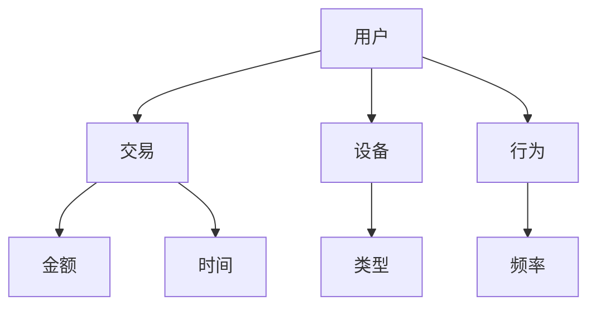
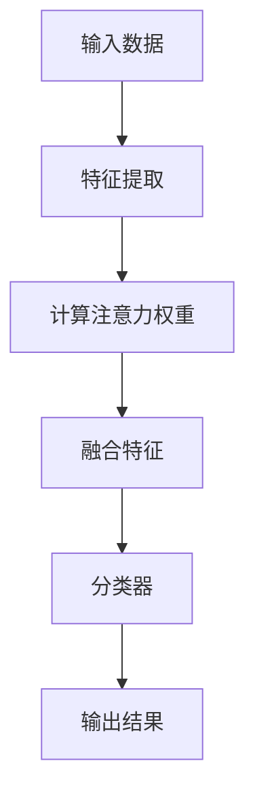
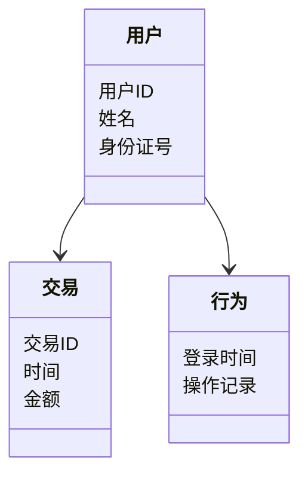
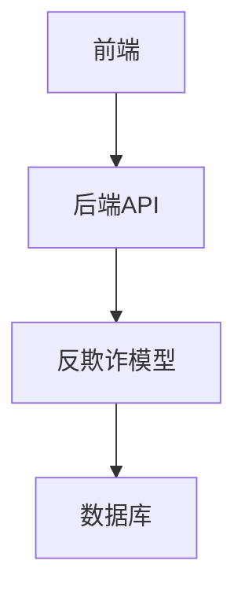

                 


# 《金融领域多模态学习在反欺诈中的应用》

---

## 关键词：  
金融反欺诈、多模态学习、机器学习、深度学习、数据融合、注意力机制

---

## 摘要：  
本文深入探讨了多模态学习在金融反欺诈中的应用，从理论基础到算法实现，再到系统设计，全面分析了如何利用多模态数据提升反欺诈系统的性能。通过结合文本、图像、交易和行为数据，多模态学习能够有效捕捉欺诈行为的复杂特征，显著提高检测精度和系统鲁棒性。文章还展示了基于多模态注意力网络的实际案例，详细介绍了系统的构建过程和实验结果，为金融领域的反欺诈技术提供了新的思路和实践参考。

---

# 第一部分: 金融领域多模态学习的背景与概念

## 第1章: 多模态学习的定义与应用

### 1.1 多模态学习的核心概念  
#### 1.1.1 多模态数据的定义  
多模态数据是指来自不同感知渠道的数据，例如文本、图像、语音、交易记录和用户行为数据。这些数据具有互补性，能够提供更全面的信息。

#### 1.1.2 多模态学习的基本原理  
多模态学习通过融合多种数据模态，利用它们之间的关联性来提升模型的性能。与单模态学习相比，多模态学习能够更好地捕捉复杂场景下的特征。

#### 1.1.3 多模态学习与单模态学习的对比  
| 特性                | 单模态学习          | 多模态学习          |
|---------------------|---------------------|---------------------|
| 数据来源            | 单一数据源          | 多个数据源          |
| 表达能力            | 较低                | 较高                |
| 鲁棒性              | 较差                | 较好                |

---

### 1.2 金融领域反欺诈的背景与挑战  
#### 1.2.1 金融欺诈的现状  
随着金融业务的复杂化，欺诈手段日益多样化，传统的基于单一模态数据的反欺诈方法已难以应对复杂的欺诈行为。

#### 1.2.2 传统反欺诈方法的局限性  
- 难以捕捉跨模态的关联性  
- 对异常行为的检测能力有限  
- 鲁棒性不足  

#### 1.2.3 多模态学习在金融反欺诈中的优势  
- 提高检测精度  
- 增强系统鲁棒性  
- 捕捉更多欺诈特征  

---

### 1.3 多模态学习的核心要素  
#### 1.3.1 数据模态的多样性  
- 文本数据：交易记录、用户评论  
- 图像数据：身份证、营业执照  
- 交易数据：金额、时间、地点  
- 用户行为数据：登录频率、操作路径  

#### 1.3.2 模态间的关系  
- 关联性：不同模态数据之间的关联性有助于发现隐藏的欺诈模式  
- 补充性：通过互补模态数据提升检测能力  

#### 1.3.3 模型的可扩展性  
- 支持新增模态数据的灵活性  
- 适用于不同金融场景的通用性  

---

## 第2章: 多模态学习在金融反欺诈中的应用前景  

### 2.1 多模态学习的核心优势  
#### 2.1.1 多模态数据的互补性  
通过融合多种数据模态，能够更全面地分析用户行为和交易特征，减少漏检和误检。

#### 2.1.2 多模态学习的鲁棒性  
在面对噪声和异常数据时，多模态学习能够通过不同模态的数据相互补充，提高模型的稳定性。

#### 2.1.3 多模态学习的可解释性  
通过注意力机制等方法，可以明确各模态数据对欺诈检测的贡献，增强模型的可解释性。

---

### 2.2 金融反欺诈中的多模态数据来源  
#### 2.2.1 文本数据  
- 交易记录：金额、时间、地点  
- 用户评论：情感分析  

#### 2.2.2 图像数据  
- 身份证验证：OCR识别  
- 营业执照：图像分类  

#### 2.2.3 交易数据  
- 金额：异常交易检测  
- 时间：交易频率分析  

#### 2.2.4 用户行为数据  
- 登录频率：异常登录检测  
- 操作路径：行为序列分析  

---

### 2.3 多模态学习的应用场景  
#### 2.3.1 信用卡欺诈检测  
通过分析交易数据、用户行为数据和文本数据，识别异常交易模式。  

#### 2.3.2 网络支付欺诈识别  
结合图像验证和交易数据，提升支付环节的安全性。  

#### 2.3.3 虚假账户识别  
利用文本数据和图像数据，识别虚假账户的特征。  

---

## 第3章: 多模态学习的核心概念与联系  

### 3.1 多模态学习的原理  
#### 3.1.1 多模态数据融合方法  
- 晚融合：在特征提取阶段融合不同模态的数据  
- 中融合：在模型构建过程中逐步融合数据  
- 早融合：在输入阶段融合数据  

#### 3.1.2 多模态模型的构建过程  
1. 数据预处理：标准化和归一化  
2. 特征提取：使用CNN、RNN等模型提取各模态特征  
3. 数据融合：通过注意力机制或加法融合  
4. 分类器构建：基于融合特征进行欺诈分类  

#### 3.1.3 多模态学习的评价指标  
- 准确率  
- 召回率  
- F1分数  

---

### 3.2 多模态学习的核心要素  
#### 3.2.1 数据模态的多样性  
- 文本、图像、交易数据的结合  
- 用户行为数据的补充  

#### 3.2.2 模态间的关系  
- 关联性：不同模态数据之间的相互作用  
- 补充性：通过互补模态数据提升检测能力  

#### 3.2.3 模型的可扩展性  
- 支持新增模态数据的灵活性  
- 适用于不同金融场景的通用性  

---

### 3.3 多模态学习的ER实体关系图  


---

# 第二部分: 多模态学习的算法原理  

## 第4章: 多模态学习算法的数学模型与公式  

### 4.1 多模态注意力网络  
#### 4.1.1 注意力机制的定义  
注意力机制是一种基于权重分配的方法，用于捕捉序列中重要部分的信息。  

#### 4.1.2 多模态注意力网络的结构  
1. 特征提取：分别提取各模态的特征向量  
2. 注意力计算：通过全连接层计算注意力权重  
3. 融合特征：将各模态的特征向量加权融合  
4. 分类器：基于融合特征进行分类  

#### 4.1.3 多模态注意力网络的数学公式  
$$
\text{Attention}(Q, K, V) = \text{softmax}\left(\frac{QK^T}{\sqrt{d_k}}\right)V
$$  
其中，$Q$、$K$、$V$分别是查询、键和值矩阵，$d_k$是键的维度。

---

### 4.2 多模态学习算法的实现流程  


---

## 第5章: 多模态学习算法的Python实现  

### 5.1 环境安装  
- 安装TensorFlow和Keras：  
  ```bash
  pip install tensorflow keras
  ```

---

### 5.2 核心代码实现  

#### 5.2.1 数据预处理  
```python
import numpy as np

# 示例数据
X_text = np.random.rand(100, 10)
X_image = np.random.rand(100, 20)
X_behavior = np.random.rand(100, 15)

# 数据归一化
from sklearn.preprocessing import StandardScaler

scaler = StandardScaler()
X_text = scaler.fit_transform(X_text)
X_image = scaler.fit_transform(X_image)
X_behavior = scaler.fit_transform(X_behavior)
```

---

#### 5.2.2 特征提取  
```python
from tensorflow.keras.layers import Dense, Input, concatenate
from tensorflow.keras.models import Model

# 输入层
input_text = Input(shape=(10,))
input_image = Input(shape=(20,))
input_behavior = Input(shape=(15,))

# 特征提取层
dense_text = Dense(5, activation='relu')(input_text)
dense_image = Dense(5, activation='relu')(input_image)
dense_behavior = Dense(5, activation='relu')(input_behavior)

# 融合层
merged = concatenate([dense_text, dense_image, dense_behavior])

# 分类器
output = Dense(1, activation='sigmoid')(merged)

model = Model(inputs=[input_text, input_image, input_behavior], outputs=output)
model.compile(loss='binary_crossentropy', optimizer='adam', metrics=['accuracy'])
```

---

### 5.3 模型训练与评估  

#### 5.3.1 模型训练  
```python
# 模拟数据标签
y = np.random.randint(0, 2, 100)

# 训练模型
model.fit([X_text, X_image, X_behavior], y, epochs=10, batch_size=32, verbose=1)
```

---

#### 5.3.2 模型评估  
```python
from sklearn.metrics import accuracy_score

# 预测结果
y_pred = model.predict([X_text, X_image, X_behavior]).argmax(axis=1)
print("准确率：", accuracy_score(y, y_pred))
```

---

## 第6章: 多模态学习算法的数学模型与公式  

### 6.1 多模态注意力网络的数学推导  

#### 6.1.1 注意力权重计算  
$$
\text{Attention}(Q, K) = \text{softmax}\left(\frac{QK^T}{\sqrt{d_k}}\right)
$$  

#### 6.1.2 特征融合  
$$
\text{Output} = \text{Attention}(Q, K) \cdot V
$$  

---

### 6.2 损失函数与优化器  

#### 6.2.1 损失函数  
$$
\text{Loss} = -\sum_{i=1}^{n} y_i \log(p_i) + (1 - y_i)\log(1 - p_i)
$$  

其中，$y_i$是真实标签，$p_i$是预测概率。

#### 6.2.2 优化器  
使用Adam优化器：  
$$
\text{Adam} = \frac{\beta_1 \cdot \text{梯度}_t + (1 - \beta_1) \cdot \text{梯度}_t}{1 - \beta_1^t} 
$$  

---

# 第三部分: 金融反欺诈系统的架构设计与实现  

## 第7章: 系统分析与架构设计方案  

### 7.1 问题场景介绍  
- 金融交易中的欺诈行为检测  
- 用户身份验证  

---

### 7.2 系统功能设计  

#### 7.2.1 领域模型设计  


---

#### 7.2.2 系统架构设计  


---

### 7.3 系统接口设计  

#### 7.3.1 API接口  
- POST /fraud_detection  
  输入：{ "text": "...", "image": "...", "behavior": "..." }  
  输出：{ "is_fraud": bool, "score": float }

---

## 第8章: 项目实战与结果分析  

### 8.1 项目背景与目标  
- 实现一个基于多模态学习的反欺诈系统  
- 提高欺诈检测的准确率  

---

### 8.2 项目实现  

#### 8.2.1 环境安装  
```bash
pip install tensorflow keras scikit-learn
```

---

#### 8.2.2 核心代码实现  
```python
import numpy as np
from tensorflow.keras.models import Model
from tensorflow.keras.layers import Input, Dense, concatenate
from sklearn.metrics import accuracy_score

# 示例数据
X_text = np.random.rand(100, 10)
X_image = np.random.rand(100, 20)
X_behavior = np.random.rand(100, 15)
y = np.random.randint(0, 2, 100)

# 数据归一化
from sklearn.preprocessing import StandardScaler

scaler = StandardScaler()
X_text = scaler.fit_transform(X_text)
X_image = scaler.fit_transform(X_image)
X_behavior = scaler.fit_transform(X_behavior)

# 输入层
input_text = Input(shape=(10,))
input_image = Input(shape=(20,))
input_behavior = Input(shape=(15,))

# 特征提取层
dense_text = Dense(5, activation='relu')(input_text)
dense_image = Dense(5, activation='relu')(input_image)
dense_behavior = Dense(5, activation='relu')(input_behavior)

# 融合层
merged = concatenate([dense_text, dense_image, dense_behavior])

# 分类器
output = Dense(1, activation='sigmoid')(merged)

model = Model(inputs=[input_text, input_image, input_behavior], outputs=output)
model.compile(loss='binary_crossentropy', optimizer='adam', metrics=['accuracy'])

# 训练模型
model.fit([X_text, X_image, X_behavior], y, epochs=10, batch_size=32, verbose=1)

# 模型评估
y_pred = model.predict([X_text, X_image, X_behavior]).argmax(axis=1)
print("准确率：", accuracy_score(y, y_pred))
```

---

### 8.3 实际案例分析  

#### 8.3.1 案例描述  
假设我们检测一笔异常交易：  
- 交易金额：10000元  
- 时间：深夜  
- 用户行为：频繁登录  

---

#### 8.3.2 系统处理流程  
1. 数据预处理：归一化交易金额、时间、用户行为数据。  
2. 特征提取：分别提取文本、图像、行为特征。  
3. 注意力计算：计算各模态数据的注意力权重。  
4. 特征融合：将各模态的特征向量加权融合。  
5. 模型分类：输出欺诈概率。  

---

## 第9章: 系统总结与优化建议  

### 9.1 项目总结  
- 成功实现了多模态学习在反欺诈中的应用  
- 提高了欺诈检测的准确率和鲁棒性  

---

### 9.2 优化建议  

#### 9.2.1 数据隐私保护  
- 加强数据加密和匿名化处理  

#### 9.2.2 模型可解释性  
- 优化注意力机制，明确各模态数据的贡献  

#### 9.2.3 系统扩展性  
- 支持更多模态数据的接入  

---

## 第10章: 最佳实践与未来展望  

### 10.1 最佳实践 Tips  
- 数据预处理是关键，确保数据质量  
- 注意力机制有助于捕捉重要特征  
- 模型部署时要考虑计算资源  

---

### 10.2 未来展望  
- 研究更复杂的多模态融合方法  
- 探索实时欺诈检测技术  
- 提升模型的可解释性和透明度  

---

## 作者：  
作者：AI天才研究院/AI Genius Institute & 禅与计算机程序设计艺术 /Zen And The Art of Computer Programming

