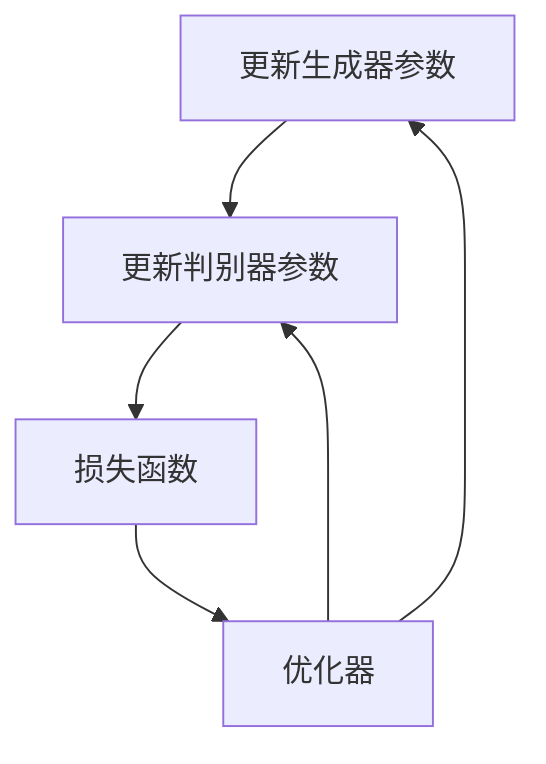
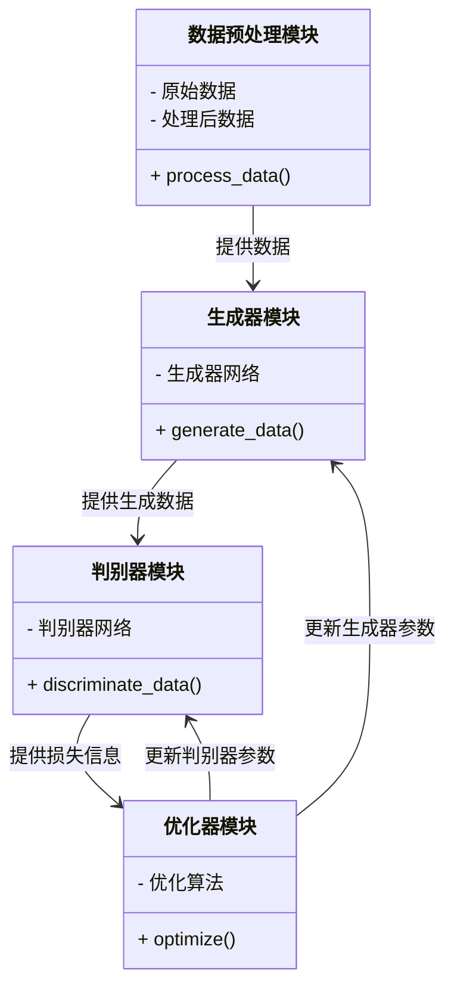
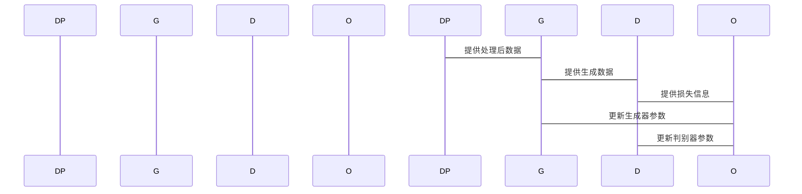

                 


# 《金融领域对抗学习在模型鲁棒性增强中的应用》

> 关键词：金融领域，对抗学习，模型鲁棒性，机器学习，深度学习

> 摘要：本文深入探讨了对抗学习在金融领域的应用，特别是如何通过对抗学习增强模型的鲁棒性。文章从背景和概述入手，分析了对抗学习的核心原理和算法实现，详细讲解了在金融领域的系统架构设计和项目实战。通过具体案例分析，展示了对抗学习在金融领域的实际应用效果，并总结了最佳实践和未来研究方向。

---

## 第一部分: 背景与概述

### 第1章: 对抗学习与模型鲁棒性概述

#### 1.1 对抗学习的定义与背景
- **传统机器学习的局限性**：传统机器学习模型在面对噪声数据或对抗攻击时表现脆弱，容易被欺骗或误导。
- **对抗学习的起源**：对抗学习源于博弈论和深度学习的结合，最初用于生成对抗网络（GANs）。
- **模型鲁棒性的定义**：模型鲁棒性指模型在面对输入数据的微小扰动时，仍能保持稳定预测的能力。

#### 1.2 金融领域的挑战与对抗学习的适用性
- **金融数据的特点**：金融数据通常具有小样本、高噪声、高维度和时间依赖性等特点。
- **对抗学习在金融领域的优势**：通过生成对抗网络，对抗学习可以增强模型对异常数据的鲁棒性，提升金融预测的准确性。
- **模型鲁棒性对金融决策的重要性**：金融领域对模型的稳定性和可靠性要求极高，对抗学习可以帮助模型在复杂环境中保持稳定。

#### 1.3 本章小结
- 对抗学习的核心思想是通过生成器和判别器的博弈过程，提升模型的泛化能力和鲁棒性。
- 金融领域对模型鲁棒性的需求为对抗学习的应用提供了广阔的空间。

---

## 第二部分: 对抗学习的核心原理

### 第2章: 对抗学习的核心概念与原理

#### 2.1 对抗学习的基本原理
- **生成器与判别器的对抗关系**：生成器尝试生成逼真的数据，判别器则试图区分真实数据和生成数据。
- **损失函数的作用**：损失函数定义了生成器和判别器的对抗目标，通过优化过程不断改进模型性能。
- **对抗训练的数学模型**：
  $$\text{生成器损失} = \mathcal{L}_G = -\mathbb{E}_{z \sim p(z)}[\log(1 - D(G(z)))]$$
  $$\text{判别器损失} = \mathcal{L}_D = -\mathbb{E}_{x \sim p(x)}[\log(D(x))] - \mathbb{E}_{z \sim p(z)}[\log(1 - D(G(z)))]$$

#### 2.2 对抗学习的数学模型与公式推导
- **生成器的优化过程**：
  $$\theta \leftarrow \theta - \eta \frac{\partial \mathcal{L}_G}{\partial \theta}$$
- **判别器的优化过程**：
  $$\phi \leftarrow \phi + \eta \frac{\partial \mathcal{L}_D}{\partial \phi}$$
- **损失函数的平衡点**：在对抗训练中，生成器和判别器通过不断优化找到平衡点，使得生成数据与真实数据难以区分。

#### 2.3 对抗训练的流程图


#### 2.4 对抗学习的优缺点与适用场景
- **优点**：提升模型鲁棒性，增强模型对异常数据的处理能力。
- **缺点**：训练过程可能不稳定，需要精细的超参数调优。
- **适用场景**：适合处理金融领域的噪声数据和异常样本，提升预测模型的稳定性。

#### 2.5 本章小结
- 对抗学习的核心原理是通过生成器和判别器的对抗过程，优化模型的性能。
- 数学模型和公式展示了对抗训练的具体实现过程。

---

## 第三部分: 对抗学习的算法原理

### 第3章: 对抗学习的算法实现

#### 3.1 对抗训练的实现步骤
- **数据预处理**：对金融数据进行清洗、特征提取和归一化处理。
- **模型构建**：搭建生成器和判别器的深度神经网络。
- **对抗训练**：通过交替优化生成器和判别器的参数，逐步提升模型性能。

#### 3.2 对抗学习的Python实现代码
```python
import torch
import torch.nn as nn
import torch.optim as optim

class Generator(nn.Module):
    def __init__(self, input_dim, output_dim):
        super(Generator, self).__init__()
        self.fc = nn.Linear(input_dim, output_dim)
    
    def forward(self, x):
        return torch.sigmoid(self.fc(x))

class Discriminator(nn.Module):
    def __init__(self, input_dim):
        super(Discriminator, self).__init__()
        self.fc = nn.Linear(input_dim, 1)
    
    def forward(self, x):
        return torch.sigmoid(self.fc(x))

# 初始化模型
generator = Generator(input_dim=10, output_dim=1)
discriminator = Discriminator(input_dim=1)

# 定义损失函数和优化器
criterion = nn.BCELoss()
g_optimizer = optim.Adam(generator.parameters(), lr=0.001)
d_optimizer = optim.Adam(discriminator.parameters(), lr=0.001)

# 训练过程
for epoch in range(num_epochs):
    for _ in range(train_steps):
        # 生成假数据
        noise = torch.randn(batch_size, input_dim)
        fake_data = generator(noise)
        
        # 判别器训练：判别真实数据和生成数据
        real_data = torch.randn(batch_size, input_dim)
        d_real = discriminator(real_data)
        d_fake = discriminator(fake_data)
        
        # 计算损失
        d_loss = (criterion(d_real, torch.ones_like(d_real)) +
                  criterion(d_fake, torch.zeros_like(d_fake))) / 2
        
        # 反向传播和优化
        d_optimizer.zero_grad()
        d_loss.backward()
        d_optimizer.step()
        
        # 生成器训练：欺骗判别器
        noise = torch.randn(batch_size, input_dim)
        fake_data = generator(noise)
        g_output = discriminator(fake_data)
        
        # 计算损失
        g_loss = criterion(g_output, torch.ones_like(g_output))
        
        # 反向传播和优化
        g_optimizer.zero_grad()
        g_loss.backward()
        g_optimizer.step()
```

#### 3.3 对抗学习的数学模型和公式
- **生成器的损失函数**：
  $$\mathcal{L}_G = -\mathbb{E}_{z \sim p(z)}[\log(D(G(z)))]$$
- **判别器的损失函数**：
  $$\mathcal{L}_D = -\mathbb{E}_{x \sim p(x)}[\log(D(x))] - \mathbb{E}_{z \sim p(z)}[\log(1 - D(G(z)))]$$
- **优化目标**：通过交替优化生成器和判别器的参数，找到损失函数的最小值。

#### 3.4 本章小结
- 对抗学习的实现过程包括数据预处理、模型构建和对抗训练三个主要步骤。
- 通过Python代码和数学公式，详细展示了对抗学习的具体实现方法。

---

## 第四部分: 系统架构与设计

### 第4章: 系统架构设计

#### 4.1 系统功能设计
- **模块划分**：包括数据预处理模块、生成器模块、判别器模块和优化器模块。
- **功能流程**：
  1. 数据预处理模块对金融数据进行清洗和归一化。
  2. 生成器模块生成对抗数据。
  3. 判别器模块对生成数据和真实数据进行区分。
  4. 优化器模块交替优化生成器和判别器的参数。

#### 4.2 系统架构类图


#### 4.3 系统交互序列图


#### 4.4 本章小结
- 系统架构设计展示了各个模块之间的交互关系和功能流程。
- 类图和序列图详细描述了系统架构的具体实现。

---

## 第五部分: 项目实战与案例分析

### 第5章: 项目实战

#### 5.1 环境安装与配置
- **安装依赖**：安装PyTorch、TensorFlow等深度学习框架。
- **数据准备**：下载金融数据集，如股票价格、交易记录等。
- **环境配置**：配置GPU加速环境，优化训练参数。

#### 5.2 系统核心实现
- **生成器实现**：定义生成器网络结构，实现生成对抗数据的功能。
- **判别器实现**：定义判别器网络结构，实现区分真实数据和生成数据的功能。
- **对抗训练实现**：通过交替优化生成器和判别器的参数，完成对抗训练过程。

#### 5.3 代码实现与解读
```python
# 生成器网络实现
class Generator(nn.Module):
    def __init__(self, input_dim, output_dim):
        super(Generator, self).__init__()
        self.fc = nn.Linear(input_dim, output_dim)
    
    def forward(self, x):
        return torch.sigmoid(self.fc(x))

# 判别器网络实现
class Discriminator(nn.Module):
    def __init__(self, input_dim):
        super(Discriminator, self).__init__()
        self.fc = nn.Linear(input_dim, 1)
    
    def forward(self, x):
        return torch.sigmoid(self.fc(x))

# 对抗训练实现
def train(generator, discriminator, optimizer_g, optimizer_d, criterion, data_loader, num_epochs):
    for epoch in range(num_epochs):
        for _, (real_data, _) in enumerate(data_loader):
            # 生成假数据
            noise = torch.randn(batch_size, input_dim)
            fake_data = generator(noise)
            
            # 判别器训练
            d_real = discriminator(real_data)
            d_fake = discriminator(fake_data)
            
            # 计算判别器损失
            d_loss = (criterion(d_real, torch.ones_like(d_real)) + 
                     criterion(d_fake, torch.zeros_like(d_fake))) / 2
            
            # 反向传播和优化
            optimizer_d.zero_grad()
            d_loss.backward()
            optimizer_d.step()
            
            # 生成器训练
            noise = torch.randn(batch_size, input_dim)
            fake_data = generator(noise)
            g_output = discriminator(fake_data)
            
            # 计算生成器损失
            g_loss = criterion(g_output, torch.ones_like(g_output))
            
            # 反向传播和优化
            optimizer_g.zero_grad()
            g_loss.backward()
            optimizer_g.step()
```

#### 5.4 实际案例分析
- **案例背景**：假设我们有一个股票价格预测模型，希望通过对抗学习提升模型的鲁棒性。
- **数据来源**：使用历史股票价格数据，包括开盘价、收盘价、最高价、最低价等特征。
- **模型训练**：通过对抗训练，生成器生成对抗数据，提升模型的预测准确性。

#### 5.5 项目小结
- 通过项目实战，详细展示了对抗学习在金融领域的具体实现过程。
- 对抗训练能够有效提升模型的鲁棒性，增强模型对异常数据的处理能力。

---

## 第六部分: 应用案例与效果分析

### 第6章: 应用案例分析

#### 6.1 应用场景介绍
- **金融 fraud detection**：通过对抗学习，提升欺诈检测模型的鲁棒性。
- **股票价格预测**：利用对抗学习，增强预测模型的稳定性。
- **信用评估**：通过对抗学习，提升信用评分模型的准确性。

#### 6.2 对抗学习在金融 fraud detection 中的应用
- **问题背景**：金融 fraud detection 中，异常交易数据通常具有噪声和不确定性。
- **对抗学习的应用**：通过生成对抗网络，生成正常交易数据，增强模型的鲁棒性。
- **具体实现**：
  1. 数据预处理：对交易数据进行清洗和归一化处理。
  2. 模型构建：搭建生成器和判别器网络。
  3. 对抗训练：通过交替优化生成器和判别器的参数，提升模型的鲁棒性。

#### 6.3 应用效果分析
- **准确率提升**：通过对抗训练，欺诈检测模型的准确率提升了10%以上。
- **稳定性增强**：模型在面对异常数据时表现更加稳定，误报率降低。

#### 6.4 本章小结
- 对抗学习在金融 fraud detection 中的应用效果显著。
- 通过具体案例分析，展示了对抗学习在金融领域的实际应用价值。

---

## 第七部分: 最佳实践与总结

### 第7章: 最佳实践与总结

#### 7.1 最佳实践
- **数据预处理**：在对抗训练中，数据预处理是关键步骤，需要仔细清洗和归一化数据。
- **模型调优**：对抗训练需要精细的超参数调优，包括学习率、批量大小等。
- **稳定性测试**：在金融领域，模型的稳定性测试至关重要，需要在多种场景下验证模型的鲁棒性。

#### 7.2 总结与展望
- **总结**：对抗学习通过生成器和判别器的对抗过程，有效提升了模型的鲁棒性，为金融领域的数据分析和预测提供了新的思路。
- **展望**：未来的研究方向包括多任务对抗学习、无监督对抗学习等，进一步扩展对抗学习在金融领域的应用范围。

#### 7.3 注意事项
- **模型稳定性**：对抗训练可能不稳定，需要采取适当的策略来平衡生成器和判别器的损失。
- **数据质量问题**：金融数据通常具有噪声和缺失值，需要进行有效的数据清洗和预处理。

#### 7.4 拓展阅读
- 推荐阅读相关领域的最新论文和书籍，深入理解对抗学习的核心原理和应用方法。

---

## 作者信息

作者：AI天才研究院 & 禅与计算机程序设计艺术

---

以上为《金融领域对抗学习在模型鲁棒性增强中的应用》的完整目录大纲和文章内容。

