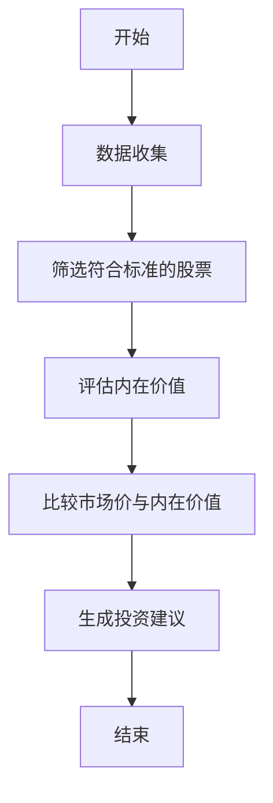
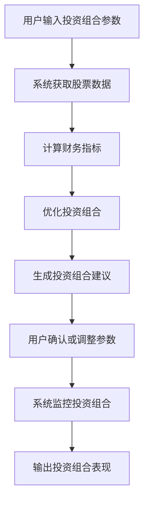

                 


# 长期投资者的思维方式：彼得·林奇的启示

## 关键词：长期投资、彼得·林奇、价值投资、投资策略、风险管理

## 摘要：  
本文通过分析彼得·林奇的投资理念，探讨长期投资者的思维方式。从价值投资、长期持有、分散投资等核心策略出发，结合实际案例和系统分析，帮助投资者建立科学的投资框架，克服心理障碍，实现稳健的财富增长。

---

# 第1章：长期投资的背景与重要性

## 1.1 投资的基本概念  
### 1.1.1 投资的定义与分类  
- **投资**：将资金投入特定资产以获取未来收益的行为。  
- 分类：股票、债券、房地产、基金等。  

### 1.1.2 长期投资的核心理念  
- 长期投资注重企业的基本面，而非短期市场波动。  
- 目标：通过持有优质资产实现财富的长期增长。  

### 1.1.3 投资与投机的区分  
- 投资：基于基本面分析，追求长期收益。  
- 投机：基于市场情绪，追求短期收益。  

## 1.2 彼得·林奇的贡献  
### 1.2.1 彼得·林奇的生平简介  
- 被誉为“最伟大的股票基金经理”，管理富达麦哲伦基金长达13年。  
- 以选股能力闻名，创造了年化13%的超额收益。  

### 1.2.2 林奇在投资界的地位  
- 价值投资的倡导者，强调深入研究企业基本面。  
- 《彼得·林奇的成功投资》等书籍影响了无数投资者。  

### 1.2.3 林奇的投资哲学  
- **买入并持有**：长期持有优质企业股票。  
- **分散投资**：降低风险，避免过度集中。  

## 1.3 长期投资的必要性  
### 1.3.1 长期投资的优势  
- 时间复利效应：长期持有能最大化收益。  
- 降低交易成本：频繁交易增加费用。  

### 1.3.2 短期投资的风险  
- 市场波动大，难以预测短期走势。  
- 交易成本高，影响净收益。  

### 1.3.3 长期投资与财富积累  
- 通过复利效应实现财富的指数级增长。  
- 长期持有优质资产抵御通货膨胀。  

---

# 第2章：彼得·林奇的核心投资理念  

## 2.1 价值投资的原理  
### 2.1.1 价值投资的定义  
- 价值投资：以低于内在价值的价格买入优质股票。  
- 核心：寻找市场先生的错误定价。  

### 2.1.2 林奇对价值投资的诠释  
- **买入优秀企业**：选择具有强大竞争优势的企业。  
- **安全边际**：买入价格低于内在价值。  

### 2.1.3 价值投资的步骤与方法  
1. **研究企业基本面**：关注财务报表、盈利能力、竞争优势。  
2. **评估内在价值**：使用DCF模型估算企业价值。  
3. **寻找安全边际**：买入价格低于估算价值。  

## 2.2 长期持有的策略  
### 2.2.1 长期持有的优势  
- 避免频繁交易的摩擦成本。  
- 利用复利效应最大化收益。  

### 2.2.2 如何选择长期持有的股票  
1. **选择优秀企业**：具备强大竞争优势和管理团队。  
2. **关注财务健康**：低负债率、稳定的现金流。  
3. **估值合理**：买入价格低于内在价值。  

### 2.2.3 长期持有的风险管理  
- 定期复盘：评估企业基本面变化。  
- 分散投资：避免过度集中于单一股票。  

## 2.3 分散投资的重要性  
### 2.3.1 分散投资的定义  
- 将资金分配到不同资产或行业中，降低风险。  

### 2.3.2 林奇的分散投资策略  
- 避免集中投资于单一股票或行业。  
- 通过多样化降低非系统性风险。  

### 2.3.3 分散投资的风险管理  
- 定期调整投资组合，适应市场变化。  
- 保持适度分散，避免过于分散影响收益。  

## 2.4 投资组合的构建  
### 2.4.1 投资组合的基本概念  
- 投资组合：将资金分配到不同资产或股票的集合。  
- 目标：平衡风险与收益，实现长期稳健增长。  

### 2.4.2 林奇的投资组合管理方法  
1. **定期评估**：检查每只股票的表现和潜在。  
2. **动态调整**：根据市场变化和企业基本面调整持仓。  
3. **保持分散**：避免集中风险。  

### 2.4.3 投资组合的动态调整  
- 定期审视市场变化和企业基本面。  
- 根据市场环境调整资产配置比例。  

---

# 第3章：彼得·林奇的投资策略  

## 3.1 选择优质企业的标准  
### 3.1.1 企业的基本面分析  
- 关注财务报表：收入、利润、现金流。  
- 分析管理团队：能力和战略眼光。  

### 3.1.2 企业的财务指标评估  
- 利润率：净利润率、毛利率。  
- 负债率：衡量财务健康。  
- 现金流：企业运营的血液。  

### 3.1.3 企业的竞争优势  
- 技术优势：独特的技术或专利。  
- 市场地位：行业龙头或寡头垄断。  
- 核心竞争力：难以被模仿或替代的优势。  

## 3.2 市场波动与投资机会  
### 3.2.1 市场波动的定义与影响  
- 市场波动：价格偏离内在价值的短期波动。  
- 影响：短期价格波动带来的投资机会或风险。  

### 3.2.2 如何利用市场波动  
- 逆向投资：市场恐慌时买入优质资产。  
- 分批建仓：逐步买入，摊低成本。  

### 3.2.3 林奇的逆向投资策略  
- 在市场恐慌时寻找被低估的股票。  
- 坚持长期持有，等待市场回归理性。  

## 3.3 风险管理的技巧  
### 3.3.1 风险管理的定义  
- 风险管理：识别、评估和控制投资风险的过程。  

### 3.3.2 林奇的风险管理方法  
1. **分散投资**：降低非系统性风险。  
2. **设置止损**：避免重大亏损。  
3. **定期复盘**：及时发现和纠正错误。  

### 3.3.3 风险与收益的平衡  
- 高风险不一定带来高收益。  
- 理性评估自身风险承受能力。  

## 3.4 投资决策的逻辑  
### 3.4.1 投资决策的基本步骤  
1. **研究企业基本面**：了解公司的财务状况、竞争优势。  
2. **评估内在价值**：使用DCF等方法估算。  
3. **比较市场价与内在价值**：寻找被低估的股票。  
4. **制定投资计划**：决定买入数量和时机。  

### 3.4.2 林奇的决策框架  
- 以基本面分析为基础。  
- 结合市场情绪做出决策。  

### 3.4.3 投资决策中的心理因素  
- 避免贪婪与恐惧的干扰。  
- 坚持长期思维，避免短期波动影响判断。  

---

# 第4章：彼得·林奇的投资心理学  

## 4.1 投资者的心理误区  
### 4.1.1 过度自信的陷阱  
- 认为自己能准确预测市场走势。  
- 过度自信可能导致错误决策。  

### 4.1.2 惶恐与贪婪的影响  
- 贪婪：追逐高收益，忽视风险。  
- 惶恐：过度担忧市场下跌，错失投资机会。  

### 4.1.3 追涨杀跌的误区  
- 追涨：高价买入热门股票。  
- 杀跌：低价卖出优质股票。  

## 4.2 如何克服心理障碍  
### 4.2.1 建立理性的投资心态  
- 避免情绪化决策，坚持基本面分析。  
- 保持耐心，长期持有优质资产。  

### 4.2.2 培养独立思考能力  
- 不盲目跟风，独立分析判断。  
- 坚持自己的投资策略，不受市场情绪影响。  

### 4.2.3 定期复盘与反思  
- 分析投资决策的正确性。  
- 总结经验教训，改进投资方法。  

---

# 第5章：彼得·林奇投资理念的实际应用  

## 5.1 经典投资案例分析  
### 5.1.1 麦哲伦基金的成功案例  
- 投资策略：买入优质企业，长期持有。  
- 成功因素：坚持价值投资，注重基本面分析。  

### 5.1.2 林奇的选股技巧  
- 寻找具有强大竞争优势的企业。  
- 买入价格低于内在价值。  

## 5.2 投资组合管理的实战经验  
### 5.2.1 投资组合的构建  
- 根据市场环境调整资产配置。  
- 保持分散投资，降低风险。  

### 5.2.2 动态调整策略  
- 定期评估投资组合表现。  
- 根据市场变化调整持仓。  

## 5.3 风险控制与投资心态  
### 5.3.1 风险管理的重要性  
- 设置止损，避免重大亏损。  
- 定期复盘，及时发现问题。  

### 5.3.2 投资心态的培养  
- 保持耐心，长期持有优质资产。  
- 避免贪婪与恐惧的干扰。  

---

# 第6章：系统化投资决策框架  

## 6.1 投资决策的系统化流程  
### 6.1.1 系统化投资框架的定义  
- 系统化：基于逻辑和数据的投资决策方法。  

### 6.1.2 构建系统化投资框架的步骤  
1. **确定投资目标**：明确投资目的和风险承受能力。  
2. **制定投资策略**：选择价值投资、成长投资等策略。  
3. **建立筛选标准**：制定选股的财务指标和行业标准。  
4. **制定交易计划**：包括买入、持有和卖出的规则。  
5. **监控与调整**：定期评估投资组合表现，及时调整。  

## 6.2 投资决策的算法实现  
### 6.2.1 基于基本面分析的选股算法  
- 输入：财务数据、行业分析、市场情绪。  
- 输出：推荐的股票列表。  

### 6.2.2 算法流程图  


### 6.2.3 Python代码实现  
```python
def get_intrinsic_value(stock_data):
    # 示例代码，计算股票的内在价值
    # stock_data 包含收入、利润、现金流等数据
    return stock_data['现金流'] * (1 + 0.05)  # 简单示例

def main():
    import pandas as pd
    stock_data = pd.read_csv('stock_data.csv')
    intrinsic_values = stock_data.apply(get_intrinsic_value)
    current_prices = stock_data['price']
    undervalued_stocks = intrinsic_values[ intrinsic_values < current_prices ]
    print("被低估的股票：", undervalued_stocks.index)

if __name__ == "__main__":
    main()
```

---

# 第7章：项目实战：基于彼得·林奇理念的投资组合管理系统  

## 7.1 环境安装与配置  
### 7.1.1 安装Python与必要的库  
- Python 3.8+  
- 导入库：pandas、numpy、scikit-learn、matplotlib  

### 7.1.2 数据源获取  
- 从Yahoo Finance获取股票数据。  

## 7.2 投资组合管理系统的实现  
### 7.2.1 数据采集与处理  
```python
import pandas as pd
import yfinance as yf

def fetch_data(tickers, start_date, end_date):
    data = yf.download(tickers, start=start_date, end=end_date)
    return data['Adj Close']

tickers = ['AAPL', 'MSFT', 'GOOGL']
data = fetch_data(tickers, '2020-01-01', '2023-12-31')
```

### 7.2.2 财务指标计算  
```python
def calculate_metrics(stock_data):
    metrics = {}
    # 示例：计算市盈率
    stock_data['PE'] = stock_data['Close'] / stock_data['EPS']
    return stock_data

metrics_data = calculate_metrics(data)
```

### 7.2.3 投资组合构建与优化  
```python
from pypfopt import EfficientFrontier

# 示例：优化投资组合
ef = EfficientFrontier(n_assets=len(tickers), mu=0.02, sigma=0.2)
weights = ef.solve()
print(weights.portfolio_weights())
```

## 7.3 投资组合管理系统功能解读  
### 7.3.1 系统功能模块  
- 数据采集与处理：从Yahoo Finance获取股票数据。  
- 财务指标计算：计算市盈率、市净率等指标。  
- 投资组合优化：基于财务指标构建最优投资组合。  
- 系统监控与反馈：实时监控投资组合的表现。  

### 7.3.2 系统交互流程  


## 7.4 实际案例分析  
### 7.4.1 投资组合构建案例  
- 假设投资组合包含科技股：AAPL、MSFT、GOOGL。  
- 根据市盈率和市净率筛选出具有吸引力的股票。  

### 7.4.2 投资组合监控与调整  
- 定期评估投资组合表现，根据市场变化调整持仓。  
- 根据企业基本面变化重新评估内在价值。  

## 7.5 项目小结  
- 系统化投资决策框架的优势：减少人为干扰，提高决策效率。  
- 通过实战项目理解林奇的投资理念。  

---

# 第8章：最佳实践与投资智慧  

## 8.1 长期投资的智慧  
### 8.1.1 长期思维的重要性  
- 长期持有优质资产，利用复利效应实现财富增长。  

### 8.1.2 风险管理的核心地位  
- 通过分散投资和止损控制风险。  

## 8.2 投资实战中的注意事项  
### 8.2.1 避免过度交易  
- 频繁交易增加成本，影响收益。  

### 8.2.2 定期复盘与反思  
- 分析投资决策的正确性，总结经验教训。  

## 8.3 拓展阅读与进一步学习  
### 8.3.1 推荐书籍  
- 《彼得·林奇的成功投资》  
- 《投资学原理》  
- 《证券分析》  

### 8.3.2 在线资源  
- 彼得·林奇的演讲视频。  
- 投资论坛和社区，分享投资经验。  

## 8.4 投资心态的培养  
### 8.4.1 保持耐心  
- 长期投资需要耐心，避免急于求成。  

### 8.4.2 保持理性  
- 避免情绪化决策，坚持基本面分析。  

### 8.4.3 保持学习  
- 不断学习投资知识，提升自身能力。  

---

# 结语  

彼得·林奇的长期投资理念为我们提供了宝贵的启示。通过深入分析企业基本面，坚持价值投资，保持长期思维，我们可以更好地应对市场波动，实现稳健的财富增长。投资不仅是技术的较量，更是心理的博弈。希望本书能帮助读者建立科学的投资框架，克服心理障碍，实现投资成功。

---

# 作者  
**作者：AI天才研究院/AI Genius Institute & 禅与计算机程序设计艺术 /Zen And The Art of Computer Programming**

