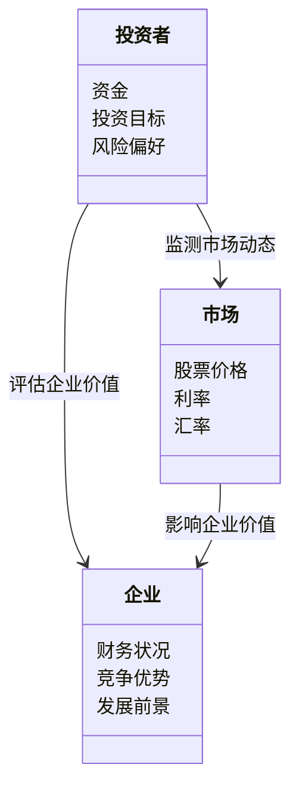
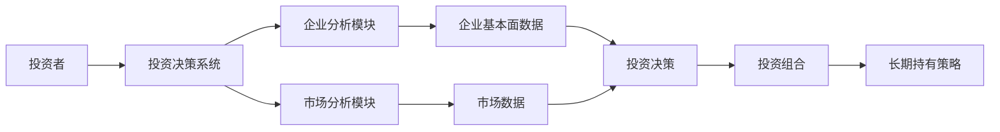
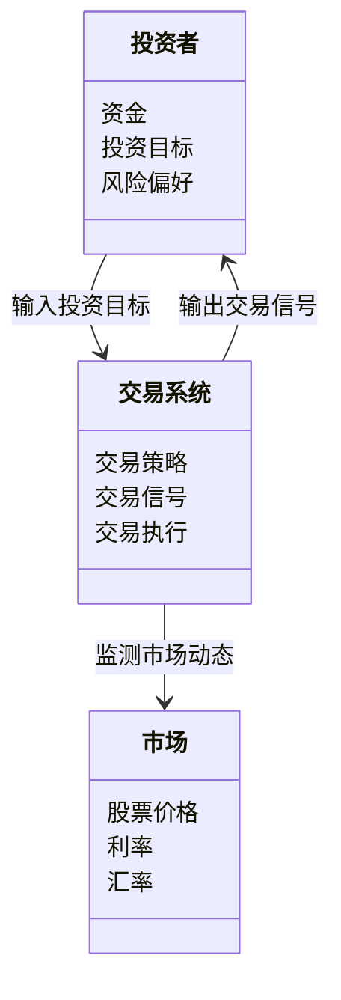
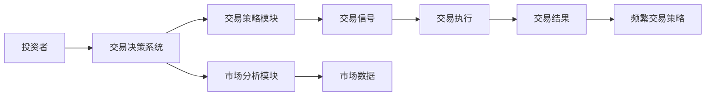

                 

# 长期持有vs频繁交易：巴菲特的选择

## 关键词
长期持有, 频繁交易, 巴菲特, 投资策略, 投资理念, 复利效应, 风险管理

## 摘要
本文深入探讨了长期持有与频繁交易两种投资策略的对比，分析了巴菲特为何选择长期持有，并从技术角度详细解析了长期持有策略的优势、系统架构及数学模型，帮助读者理解投资策略的选择对投资结果的重大影响。

---

## 第一部分: 长期持有与频繁交易的对比分析

### 第1章: 长期持有与频繁交易的定义与背景

#### 1.1 长期持有投资的定义与特点
##### 1.1.1 长期持有的核心概念
长期持有是一种投资策略，强调买入优质资产后长期持有，不因短期市场波动而频繁买卖。其核心在于选择具有持续竞争优势和良好发展前景的企业进行投资，通过复利效应实现财富的长期增长。

##### 1.1.2 长期持有与频繁交易的主要区别
- **持有时间**：长期持有强调长期投资，通常跨度数年甚至数十年；频繁交易则强调短期操作，交易频率高，通常以日、周为单位。
- **交易成本**：长期持有由于交易次数少，交易成本低；频繁交易由于频繁买卖，交易成本较高。
- **市场依赖性**：长期持有更注重企业的内在价值，对短期市场波动不敏感；频繁交易则依赖于对市场短期走势的准确判断。

##### 1.1.3 长期持有在投资组合中的作用
长期持有策略通常作为投资组合的核心配置，能够提供稳定的收益和较低的波动性，而频繁交易则作为卫星策略，用于捕捉短期市场机会或对冲风险。

#### 1.2 频繁交易的定义与特点
##### 1.2.1 频繁交易的定义
频繁交易是一种投资策略，强调通过频繁买卖资产，在较短时间内获取收益。其核心在于通过市场波动、技术分析或基本面变化，捕捉短期价格波动机会。

##### 1.2.2 频繁交易的主要特征
- **高流动性**：频繁交易要求投资者能够快速进出市场，抓住短期机会。
- **高交易成本**：由于交易频率高，交易手续费、税费和滑点成本较高。
- **市场时机依赖性**：频繁交易的成功高度依赖于对市场短期走势的判断，对市场时机的选择要求极高。

##### 1.2.3 频繁交易的风险与挑战
- **高风险**：频繁交易容易受到市场波动的影响，尤其是在市场下跌时，频繁交易可能导致更大的亏损。
- **心理压力**：频繁交易需要投资者时刻关注市场动态，容易导致心理压力和决策疲劳。
- **交易成本侵蚀收益**：频繁交易的高交易成本会显著侵蚀投资者的收益。

---

### 第2章: 长期持有与频繁交易的优劣势对比

#### 2.1 长期持有策略的优势
##### 2.1.1 长期持有的复利效应
复利效应是长期持有策略的核心优势之一。通过长期持有优质资产，投资者可以享受复利带来的收益增长。例如，假设年收益率为7%，初始投资100元，30年后的价值为：
$$ FV = 100 \times (1 + 0.07)^{30} \approx 610.51 \text{元} $$

##### 2.1.2 长期持有降低交易成本
长期持有策略由于交易次数少，交易成本（如手续费、税费）相对较低。假设每次交易成本为0.1%，对于长期持有策略，交易成本对总收益的影响较小，而频繁交易则会显著增加交易成本。

##### 2.1.3 长期持有与市场波动的抗性
长期持有策略能够较好地应对市场波动，因为投资者关注的是企业的长期价值，而非短期价格波动。例如，在2008年全球金融危机期间，长期持有的投资者能够通过持有优质企业股票，最终获得更高的收益。

#### 2.2 频繁交易策略的优劣势
##### 2.2.1 频繁交易的高流动性
频繁交易策略能够快速变现，适合需要短期资金需求的投资者。例如，投资者可以通过高频交易在短时间内赚取利润，满足紧急的资金需求。

##### 2.2.2 频繁交易的高交易成本
频繁交易的高交易成本是其主要劣势之一。例如，假设每次交易成本为0.1%，年交易次数为100次，初始投资为100,000元，则每年的交易成本为：
$$ TC = 100,000 \times 0.001 \times 100 = 10,000 \text{元} $$

##### 2.2.3 频繁交易的市场时机依赖性
频繁交易的成功高度依赖于对市场短期走势的判断。如果市场走势与预期相反，频繁交易可能导致更大的亏损。例如，在2020年新冠疫情爆发期间，频繁交易的投资者可能因为误判市场走势而遭受重大损失。

---

### 第3章: 巴菲特的投资理念与长期持有策略

#### 3.1 巴菲特的投资哲学
##### 3.1.1 巴菲特的价值投资理念
巴菲特的价值投资理念强调买入具有良好基本面和持续竞争优势的企业，长期持有，等待企业价值的实现。他认为市场先生是机会的提供者，而非价格的决定者。

##### 3.1.2 巴菲特对市场的长期看法
巴菲特认为市场在长期内是有效的，但短期内可能受情绪影响出现波动。因此，长期持有优质资产是抵御短期市场波动的有效策略。

##### 3.1.3 巴菲特对投资纪律的要求
巴菲特强调投资纪律的重要性，认为投资者应坚持长期持有优质资产，避免因短期市场波动而做出错误决策。

#### 3.2 巴菲特与长期持有的具体实践
##### 3.2.1 巴菲特的经典投资案例
例如，巴菲特在1988年买入可口可乐公司股票，并长期持有。通过长期持有，巴菲特不仅获得了可口可乐公司分红的收益，还享受了公司股价上涨带来的资本收益。

##### 3.2.2 巴菲特对长期持有的心理准备
巴菲特认为，长期持有优质资产需要极大的心理耐力，尤其是在市场低迷时。他强调，投资者应专注于企业的内在价值，而非市场的短期波动。

##### 3.2.3 巴菲特对市场短期波动的应对策略
巴菲特认为，市场短期波动无法预测，因此长期持有优质资产是应对短期波动的最佳策略。他建议投资者将注意力集中在企业的基本面，而非市场的短期走势。

---

### 第4章: 长期持有策略的系统分析与架构设计

#### 4.1 长期持有策略的系统模型
##### 4.1.1 长期持有策略的领域模型

##### 4.1.2 长期持有策略的系统架构

##### 4.1.3 长期持有策略的接口设计
- **输入接口**：投资者的资金、风险偏好、投资目标。
- **输出接口**：投资组合、投资策略、投资建议。

#### 4.2 长期持有策略的数学模型与公式
##### 4.2.1 复利计算公式
$$ FV = PV \times (1 + r)^n $$
其中：
- \( FV \)：未来价值
- \( PV \)：现值
- \( r \)：年化收益率
- \( n \)：投资期限（年）

##### 4.2.2 投资组合风险模型
$$ \sigma_p = \sqrt{\sum_{i=1}^n w_i^2 \sigma_i^2 + \sum_{i \neq j} w_i w_j \sigma_{ij}} $$
其中：
- \( \sigma_p \)：投资组合的标准差
- \( w_i \)：第i种资产的权重
- \( \sigma_i \)：第i种资产的标准差
- \( \sigma_{ij} \)：第i种资产和第j种资产之间的协方差

#### 4.3 长期持有策略的算法实现
##### 4.3.1 简单的长期持有算法

---

### 第5章: 频繁交易策略的系统分析与架构设计

#### 5.1 频繁交易策略的系统模型
##### 5.1.1 频繁交易策略的领域模型

##### 5.1.2 频繁交易策略的系统架构

##### 5.1.3 频繁交易策略的接口设计
- **输入接口**：投资者的资金、风险偏好、交易策略。
- **输出接口**：交易信号、交易执行、交易结果。

#### 5.2 频繁交易策略的数学模型与公式
##### 5.2.1 交易成本计算公式
$$ TC = n \times t \times c $$
其中：
- \( n \)：交易次数
- \( t \)：每次交易成本
- \( c \)：其他成本（如税费、滑点）

##### 5.2.2 交易时机优化模型
$$ max \sum_{t=1}^T (p_t - p_{t-1}) \times q_t - TC $$
其中：
- \( p_t \)：第t时刻的价格
- \( q_t \)：第t时刻的交易量
- \( TC \)：总交易成本

#### 5.3 频繁交易策略的算法实现
##### 5.3.1 简单的高频交易算法

---

## 第二部分: 巴菲特选择长期持有的智慧

### 第6章: 巴菲特的投资哲学与长期持有策略的结合

#### 6.1 巴菲特的价值投资理念与长期持有的结合
巴菲特的价值投资理念强调买入优质资产并长期持有，这与长期持有策略的核心理念高度契合。他认为，优质资产的内在价值会随着时间的推移而增长，因此长期持有是实现财富增长的最佳方式。

#### 6.2 巴菲特对市场的看法与长期持有策略的结合
巴菲特认为，市场在长期内是有效的，但短期内可能受情绪影响出现波动。因此，长期持有优质资产是抵御短期市场波动的有效策略。他建议投资者关注企业的基本面，而非市场的短期走势。

#### 6.3 巴菲特对投资纪律的要求与长期持有策略的结合
巴菲特强调投资纪律的重要性，认为投资者应坚持长期持有优质资产，避免因短期市场波动而做出错误决策。他建议投资者制定明确的投资计划，并严格按照计划执行。

---

### 第7章: 长期持有策略的数学模型与风险管理

#### 7.1 长期持有策略的数学模型
##### 7.1.1 复利计算公式
$$ FV = PV \times (1 + r)^n $$
其中：
- \( FV \)：未来价值
- \( PV \)：现值
- \( r \)：年化收益率
- \( n \)：投资期限（年）

##### 7.1.2 投资组合风险模型
$$ \sigma_p = \sqrt{\sum_{i=1}^n w_i^2 \sigma_i^2 + \sum_{i \neq j} w_i w_j \sigma_{ij}} $$
其中：
- \( \sigma_p \)：投资组合的标准差
- \( w_i \)：第i种资产的权重
- \( \sigma_i \)：第i种资产的标准差
- \( \sigma_{ij} \)：第i种资产和第j种资产之间的协方差

#### 7.2 长期持有策略的风险管理
##### 7.2.1 投资组合分散化
通过分散投资，降低投资组合的整体风险。例如，投资多个行业的优质企业，以降低行业风险。

##### 7.2.2 定期再平衡
定期对投资组合进行再平衡，确保投资组合的权重与初始计划一致，降低市场波动对投资组合的影响。

##### 7.2.3 风险承受能力评估
投资者应根据自身的风险承受能力，选择合适的投资组合。例如，风险承受能力较低的投资者应选择波动性较小的资产。

---

## 结论

长期持有和频繁交易是两种截然不同的投资策略，各有优劣。长期持有策略通过复利效应实现财富的长期增长，但需要投资者具备长期持有的心理准备和投资纪律。频繁交易策略则通过捕捉短期市场机会实现快速收益，但需要投资者具备较高的市场判断能力和交易技巧。

巴菲特选择长期持有策略的原因在于其对市场的深刻理解。他认为，市场在长期内是有效的，优质资产的内在价值会随着时间的推移而增长。因此，长期持有优质资产是实现财富增长的最佳方式。

投资者在选择投资策略时，应根据自身的投资目标、风险承受能力和市场判断能力，综合考虑长期持有和频繁交易的优劣势，做出明智的投资决策。

---

## 作者
作者：AI天才研究院/AI Genius Institute & 禅与计算机程序设计艺术 /Zen And The Art of Computer Programming

