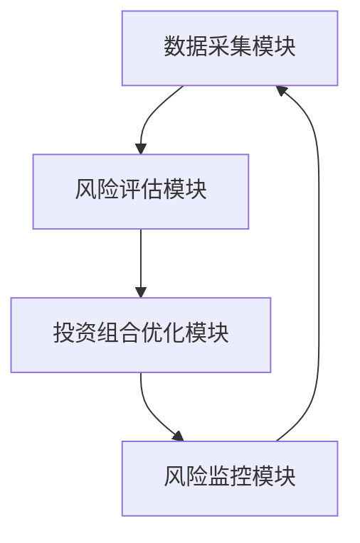

                 


# 雷·达里奥的风险平价投资策略

> 关键词：雷·达里奥、风险平价、投资策略、资产配置、风险管理、投资组合优化、量化投资

> 摘要：本文深入探讨了雷·达里奥的风险平价投资策略，从其背景、核心概念、数学模型、系统架构到实际项目实战，全面解析了风险平价的投资理念、优化算法和实际应用。通过详细分析，本文旨在为读者提供一个全面的技术视角，理解风险平价策略在现代投资中的重要性及其在系统设计中的具体实现。

---

# 第1章: 风险平价投资策略的背景与概念

## 1.1 风险平价的定义与核心思想

### 1.1.1 风险平价的基本概念
风险平价是一种投资策略，旨在通过优化投资组合中各资产的风险贡献，使每种资产对整体组合的风险贡献相等。这种策略不同于传统的基于回报的资产配置，而是基于风险来分配权重。

### 1.1.2 风险平价与传统投资策略的区别
- **传统投资策略**：通常基于预期回报或历史表现来分配资产权重，忽视了资产之间在不同市场环境下的风险贡献。
- **风险平价**：根据资产的风险贡献来分配权重，确保每种资产对组合的风险影响相等，从而实现真正的分散化。

### 1.1.3 风险平价在投资组合中的作用
风险平价通过平衡各资产的风险贡献，降低组合的整体波动性和潜在损失，同时提高组合的鲁棒性。

---

## 1.2 风险平价的理论基础

### 1.2.1 现代投资组合理论（MPT）的简介
MPT由哈里·马科维茨提出，强调通过分散化来优化投资组合的风险和回报。MPT的核心是通过优化资产配置，使组合的预期回报最大化，同时最小化风险。

### 1.2.2 风险平价与MPT的关系
风险平价可以看作是对MPT的一种扩展，它不仅考虑资产的预期回报，还考虑了资产在不同市场环境下的风险贡献。

### 1.2.3 风险平价的数学基础
风险平价的核心是通过优化算法，将资产的权重调整为与其风险贡献成比例。

---

## 1.3 风险平价投资策略的历史与发展

### 1.3.1 风险平价的起源
风险平价的概念可以追溯到20世纪80年代，但真正流行起来是在2008年金融危机之后，尤其是在量化投资领域。

### 1.3.2 风险平价在实践中的发展
随着量化技术的进步，风险平价策略逐渐从理论走向实践，成为机构投资者的重要工具。

### 1.3.3 风险平价在现代投资中的应用
风险平价策略广泛应用于资产配置、对冲基金和养老金管理等领域。

---

## 1.4 风险平价的核心优势与局限性

### 1.4.1 风险平价的优势
- **分散化效果好**：通过平衡风险贡献，降低组合的整体风险。
- **适应性强**：能够应对不同市场环境下的风险变化。

### 1.4.2 风险平价的局限性
- **对市场假设的敏感性**：依赖于对资产风险特性的准确估计。
- **实施成本高**：需要复杂的计算和持续的监控。

### 1.4.3 风险平价的适用场景
- 机构投资者、养老金管理、对冲基金等。

---

## 1.5 本章小结
本章介绍了风险平价的基本概念、理论基础、发展历程及其优缺点。风险平价作为一种先进的投资策略，通过平衡各资产的风险贡献，为投资者提供了更稳健的投资方式。

---

# 第2章: 风险平价投资策略的数学模型与算法

## 2.1 风险平价的数学模型

### 2.1.1 风险平价的优化目标
目标是通过调整各资产的权重，使得每种资产的风险贡献相等，同时最大化组合的预期回报。

### 2.1.2 投资组合的风险度量
风险通常用波动率或 Value-at-Risk (VaR) 来衡量，这里我们采用波动率。

### 2.1.3 风险平价的权重分配
权重分配的目标是使得每种资产对组合的总风险的贡献相等。

---

## 2.2 风险平价的算法实现

### 2.2.1 风险平价的优化方法
通过优化算法（如拉格朗日乘数法）来调整资产权重，使得风险贡献相等。

### 2.2.2 风险平价的权重计算
假设资产的风险权重为 $w_i$，则总风险贡献为 $\sum w_i^2$，通过调整使得每个资产的贡献相等。

### 2.2.3 风险平价的组合调整
定期根据市场变化调整权重，以保持风险贡献的平衡。

---

## 2.3 风险平价的数学公式

### 2.3.1 风险平价的权重计算公式
$$ w_i = \frac{1}{\sqrt{\sum_{j} \sigma_{ij}}} $$

其中，$\sigma_{ij}$ 表示资产 $i$ 和 $j$ 的协方差。

### 2.3.2 投资组合的风险度量公式
$$ \text{组合波动率} = \sqrt{\sum_{i} \sum_{j} w_i w_j \sigma_{ij}} $$

### 2.3.3 风险平价的优化目标函数
$$ \min_{w} \sum_{i} \sum_{j} w_i w_j \sigma_{ij} \quad \text{subject to} \quad \sum_{i} w_i = 1 $$

---

## 2.4 本章小结
本章通过数学公式详细推导了风险平价的实现方法，包括权重分配、风险度量和优化目标的设定。

---

# 第3章: 风险平价投资策略的系统架构设计

## 3.1 系统架构概述

### 3.1.1 系统的整体架构
- 数据采集模块
- 风险评估模块
- 投资组合优化模块
- 风险监控模块

### 3.1.2 系统的功能模块划分
每个模块负责特定的功能，如数据采集、风险评估等。

### 3.1.3 系统的输入输出设计
- 输入：市场数据、投资目标
- 输出：优化后的投资组合、风险监控报告

---

## 3.2 系统功能模块设计

### 3.2.1 数据采集模块
负责收集市场数据，包括资产的收益率、波动率等。

### 3.2.2 风险评估模块
计算各资产的风险贡献，评估组合的整体风险。

### 3.2.3 投资组合优化模块
根据风险平价策略，调整资产权重，优化组合。

### 3.2.4 风险监控模块
实时监控组合的风险变化，及时调整。

---

## 3.3 系统架构图



---

## 3.4 本章小结
本章通过系统架构设计，展示了风险平价策略在实际中的应用，包括功能模块划分和系统流程设计。

---

# 第4章: 风险平价投资策略的项目实战

## 4.1 项目背景与目标

### 4.1.1 项目背景
假设我们有一个包含股票、债券和商品的投资组合，目标是通过风险平价策略优化组合。

### 4.1.2 项目目标
实现风险平价策略，优化投资组合，降低整体风险。

### 4.1.3 项目范围
包括数据采集、风险评估、优化组合和风险监控。

---

## 4.2 环境搭建与数据准备

### 4.2.1 环境安装
安装Python、Pandas、NumPy等工具。

### 4.2.2 数据来源与处理
从Yahoo Finance获取历史数据，清洗和处理。

### 4.2.3 数据清洗与预处理
去除缺失值，标准化数据。

---

## 4.3 核心算法实现

### 4.3.1 风险平价权重计算代码
```python
import numpy as np

def compute_risk_parity_weights(cov_matrix):
    # 初始化权重
    weights = np.ones(len(cov_matrix)) / len(cov_matrix)
    # 迭代优化权重
    for _ in range(100):
        # 计算风险贡献
        risk_contribution = np.diag(weights.T @ cov_matrix @ weights)
        # 标准化贡献
        contribution_norm = np.sqrt(risk_contribution.mean())
        # 调整权重
        weights = risk_contribution / contribution_norm
        weights = weights / weights.sum()
    return weights
```

### 4.3.2 投资组合优化代码
```python
def optimize_portfolio(weights, returns, cov_matrix):
    n_assets = len(weights)
    # 定义目标函数
    def objective(x):
        return (x.T @ returns @ x).item()
    # 定义约束条件
    constraints = [
        {'type': 'eq', 'fun': lambda x: sum(x) - 1},
        {'type': 'eq', 'fun': lambda x: sum(weights * x) - 1}
    ]
    # 使用SLSQP求解
    from scipy.optimize import minimize
    result = minimize(objective, weights, constraints=constraints, method='SLSQP')
    return result.x
```

### 4.3.3 风险监控代码
```python
def monitorRisk(weights, returns, cov_matrix):
    portfolio_var = weights.T @ cov_matrix @ weights
    return np.sqrt(portfolio_var)
```

---

## 4.4 项目案例分析

### 4.4.1 案例背景
假设我们有三类资产：股票、债券和商品。

### 4.4.2 数据分析与处理
使用历史数据计算协方差矩阵。

### 4.4.3 投资组合优化与风险监控
通过代码实现权重优化，计算优化后的组合波动率。

---

## 4.5 项目总结与优化建议

### 4.5.1 项目总结
成功实现风险平价策略，优化了投资组合的风险。

### 4.5.2 优化建议
- 定期重新计算权重
- 引入更多资产类别
- 结合其他策略（如动量策略）

### 4.5.3 未来展望
探索多因子模型，结合人工智能技术优化风险平价策略。

---

## 4.6 本章小结
本章通过项目实战，详细展示了风险平价策略的实现过程，包括环境搭建、数据处理、算法实现和案例分析。

---

# 第5章: 风险平价投资策略的最佳实践与注意事项

## 5.1 风险平价策略的最佳实践

### 5.1.1 理解风险平价的核心思想
风险平价的核心是平衡风险贡献，而不是简单的资产配置。

### 5.1.2 合理选择资产类别
选择多样化的资产类别，提高分散化效果。

### 5.1.3 定期调整投资组合
根据市场变化，定期调整权重。

### 5.1.4 风险监控与预警
实时监控组合风险，及时预警。

---

## 5.2 风险平价策略的注意事项

### 5.2.1 理解策略的局限性
风险平价依赖于对资产风险特性的准确估计，存在一定的假设性。

### 5.2.2 避免过度优化
避免过度追求数学上的最优解，忽视实际市场情况。

### 5.2.3 保持长期视角
风险平价策略适合长期投资，短期波动可能影响表现。

### 5.2.4 风险管理的重要性
风险管理是风险平价策略成功的关键。

---

## 5.3 本章小结
本章总结了风险平价策略的最佳实践和注意事项，强调了理解和实施策略时的关键点。

---

# 作者：AI天才研究院/AI Genius Institute & 禅与计算机程序设计艺术 /Zen And The Art of Computer Programming

