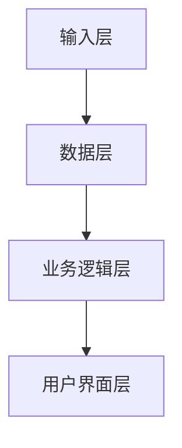
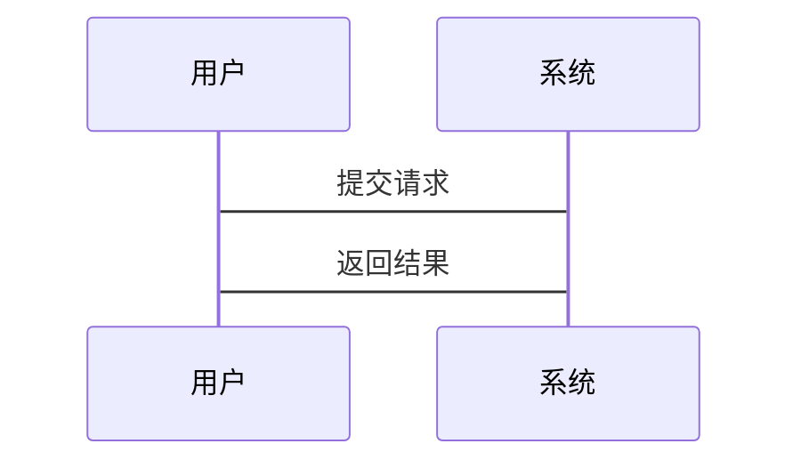

                 


# 霍华德·马克斯的信贷周期分析方法

> 关键词：信贷周期、霍华德·马克斯、投资分析、经济周期、资产定价

> 摘要：本文系统地介绍霍华德·马克斯的信贷周期分析方法，从理论基础到实际应用，结合数学模型和系统架构设计，详细阐述其在投资分析中的应用和实践。

---

## 第一部分: 霍华德·马克斯的信贷周期分析方法概述

### 第1章: 信贷周期概述

#### 1.1 信贷周期的定义与背景

信贷周期是指信贷市场从扩张到收缩，再从收缩到扩张的循环过程。它与经济周期密切相关，是理解金融市场波动的重要工具。

**1.1.1 信贷周期的基本概念**  
信贷周期的核心在于信贷市场的扩张与收缩。扩张阶段通常伴随着资产价格的上涨和信贷的增长，而收缩阶段则伴随着资产价格的下跌和信贷的收缩。

**1.1.2 信贷周期的历史演变**  
信贷周期并非新现象，它贯穿于金融历史的各个时期。从19世纪的铁路泡沫到2008年的次贷危机，信贷周期的规律性表现得非常明显。

**1.1.3 信贷周期与经济波动的关系**  
信贷周期是经济波动的重要驱动力。通过分析信贷周期，投资者可以更好地理解经济周期的变化，从而做出更明智的投资决策。

#### 1.2 霍华德·马克斯的生平与投资理念

**1.2.1 霍华德·马克斯的个人经历**  
霍华德·马克斯是橡树资本的联合创始人，他的投资理念以价值投资和风险管理为核心，强调逆向思维和对市场的深刻理解。

**1.2.2 马克斯的投资哲学**  
马克斯认为，市场并非总是理性的。他强调通过分析信贷周期来识别市场的过度乐观或悲观情绪，从而找到投资机会。

**1.2.3 马克斯与橡树资本的成就**  
橡树资本通过长期的实践，将信贷周期分析方法应用于投资决策，取得了显著的成绩，尤其是在危机时期表现尤为突出。

### 第2章: 信贷周期的核心概念与理论框架

#### 2.1 信贷周期的阶段划分

**2.1.1 扩张阶段**  
在扩张阶段，信贷需求旺盛，贷款利率较低，银行和投资者倾向于增加信贷资产。

**2.1.2 衰退阶段**  
衰退阶段通常伴随着信贷资产质量下降，违约率上升，银行开始收紧信贷。

**2.1.3 调整阶段**  
调整阶段是信贷市场从衰退转向扩张的过渡期，信贷政策逐渐放松，市场信心逐步恢复。

**2.1.4 下一个周期的启动**  
当市场信心恢复，信贷需求再次上升时，新的信贷周期开始启动。

#### 2.2 信贷周期的驱动因素

**2.2.1 经济基本面**  
经济基本面是信贷周期的核心驱动因素，包括GDP增长率、就业率、通胀率等。

**2.2.2 利率政策**  
央行的利率政策对信贷周期有直接影响，低利率通常会刺激信贷扩张。

**2.2.3 市场情绪**  
投资者情绪的变化是信贷周期的重要推动力，过度乐观会导致信贷扩张，过度悲观则导致信贷收缩。

**2.2.4 金融机构的行为**  
银行和其他金融机构的信贷发放行为直接影响信贷周期的变化。

#### 2.3 信贷周期与资产价格的关系

**2.3.1 股票市场的周期性**  
信贷周期影响企业的融资成本和盈利水平，从而影响股票市场的表现。

**2.3.2 债券市场的周期性**  
信贷周期影响债券的违约风险和利率水平，进而影响债券价格。

**2.3.3 房地产市场的周期性**  
房地产市场的信贷周期表现得尤为明显，信贷扩张通常会导致房地产价格上涨，而信贷收缩则会导致价格下跌。

**2.3.4 商品市场的周期性**  
信贷周期也会影响商品市场的波动，特别是在大宗商品市场中，信贷扩张通常会推高价格。

### 第3章: 信贷周期分析的核心要素

#### 3.1 贷款质量与资产质量

**3.1.1 贷款分类标准**  
贷款通常分为正常、关注、次级、可疑和损失五类，分类标准直接影响信贷资产的质量评估。

**3.1.2 资产质量评估**  
资产质量评估需要考虑借款人的信用状况、担保情况、还款能力等因素。

**3.1.3 贷款违约风险**  
违约风险是信贷周期分析的重要指标，可以通过违约概率模型进行评估。

#### 3.2 利率与货币政策

**3.2.1 利率政策对信贷周期的影响**  
低利率政策通常会刺激信贷扩张，而高利率政策则会抑制信贷需求。

**3.2.2 货币政策工具的作用**  
央行通过调整存款准备金率、公开市场操作等工具来影响信贷市场。

**3.2.3 利率周期与信贷周期的关系**  
利率周期通常是信贷周期的先导指标，利率下降通常预示着信贷扩张的开始。

#### 3.3 市场参与者的行为

**3.3.1 银行与金融机构的行为**  
银行在信贷周期中的行为受到监管政策和市场环境的影响，通常在扩张阶段增加信贷发放。

**3.3.2 投资者与投机者的行为**  
投资者在信贷周期中的行为受到市场情绪的影响，通常在扩张阶段过度乐观，而在衰退阶段过度悲观。

**3.3.3 政府与监管机构的作用**  
政府和监管机构在信贷周期中的作用主要体现在制定和实施监管政策，维护金融稳定。

### 第4章: 信贷周期的数学模型与分析

#### 4.1 信贷周期的定量分析模型

**4.1.1 贷款违约概率模型**  
贷款违约概率模型（PD模型）是信贷周期分析的重要工具，可以通过历史数据和统计方法进行预测。

**4.1.2 资产价格波动模型**  
资产价格波动模型可以帮助投资者预测资产价格的变化趋势，从而制定投资策略。

**4.1.3 经济周期波动模型**  
经济周期波动模型通过分析经济指标的变化，预测信贷周期的变化趋势。

#### 4.2 基于时间序列的信贷周期分析

**4.2.1 时间序列分析方法**  
时间序列分析是一种常用的信贷周期分析方法，通过分析历史数据，预测未来的信贷周期变化。

**4.2.2 周期性分解**  
周期性分解是时间序列分析的重要步骤，通常通过傅里叶变换或经验模态分解等方法进行。

---

## 第二部分: 系统分析与架构设计

### 第5章: 系统分析与架构设计方案

#### 5.1 问题场景介绍

信贷周期分析需要综合考虑经济指标、市场数据和金融机构行为等多种因素，是一个复杂的系统工程。

#### 5.2 系统功能设计

**5.2.1 领域模型设计**  
领域模型设计包括经济指标、市场数据、金融机构行为等核心要素，通过ER图展示各要素之间的关系。

```mermaid
erd
    图表标题: 领域模型设计

    经济指标 --> 经济基本面
    经济指标 --> 利率政策
    市场数据 --> 资产价格
    市场数据 --> 市场情绪
    金融机构行为 --> 信贷发放
    金融机构行为 --> 投资行为
```

**5.2.2 系统架构设计**  
系统架构设计采用分层架构，包括数据层、业务逻辑层和用户界面层。



**5.2.3 系统接口设计**  
系统接口设计需要考虑数据输入、数据处理和数据输出三个部分，通过RESTful API实现模块之间的通信。

**5.2.4 系统交互设计**  
系统交互设计通过序列图展示用户与系统之间的交互流程。



---

## 第三部分: 项目实战

### 第6章: 项目实战

#### 6.1 环境安装

需要安装Python、Pandas、NumPy、Matplotlib等库，用于数据处理和可视化。

#### 6.2 系统核心实现源代码

以下是一个基于Python的信贷周期分析代码示例：

```python
import pandas as pd
import numpy as np
import matplotlib.pyplot as plt

# 示例数据
data = {
    '经济指标': [1, 2, 3, 4, 5],
    '资产价格': [100, 110, 120, 115, 105],
    '市场情绪': [0.8, 0.9, 0.7, 0.6, 0.5]
}

df = pd.DataFrame(data)

# 数据可视化
plt.figure(figsize=(10, 6))
plt.plot(df['经济指标'], label='经济指标')
plt.plot(df['资产价格'], label='资产价格')
plt.plot(df['市场情绪'], label='市场情绪')
plt.legend()
plt.show()
```

#### 6.3 代码应用解读与分析

以上代码展示了如何通过Python进行数据可视化，帮助投资者理解经济指标、资产价格和市场情绪之间的关系。

#### 6.4 实际案例分析

以房地产行业为例，分析信贷周期对资产价格的影响。通过历史数据和模型预测，识别当前所处的信贷周期阶段，并制定相应的投资策略。

#### 6.5 项目小结

通过项目实战，读者可以更好地理解信贷周期分析的实际应用，并能够将理论知识应用于实际投资决策中。

---

## 第四部分: 总结与展望

### 第7章: 总结与展望

#### 7.1 总结

霍华德·马克斯的信贷周期分析方法为投资者提供了一个系统的分析框架，帮助他们在复杂的金融市场中做出更明智的投资决策。

#### 7.2 注意事项

在实际应用中，投资者需要注意数据的准确性和模型的适用性，避免因模型误用而导致投资损失。

#### 7.3 拓展阅读

推荐阅读霍华德·马克斯的《投资最重要的事情》和《信贷周期：理论与实践》等书籍，进一步深入理解信贷周期分析的方法和应用。

---

## 作者

作者：AI天才研究院/AI Genius Institute & 禅与计算机程序设计艺术 /Zen And The Art of Computer Programming

---

通过以上内容，读者可以系统地学习霍华德·马克斯的信贷周期分析方法，并能够在实际投资中灵活运用这些方法。

