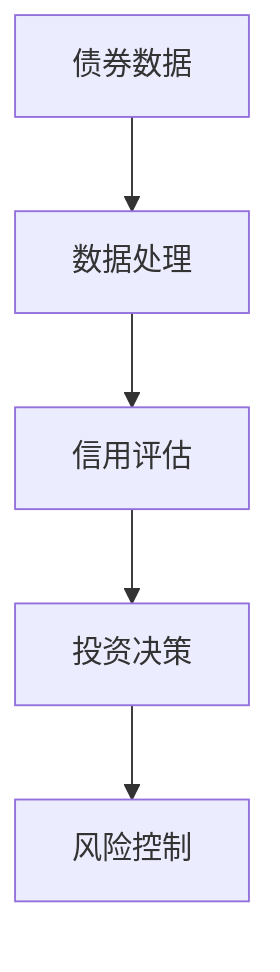
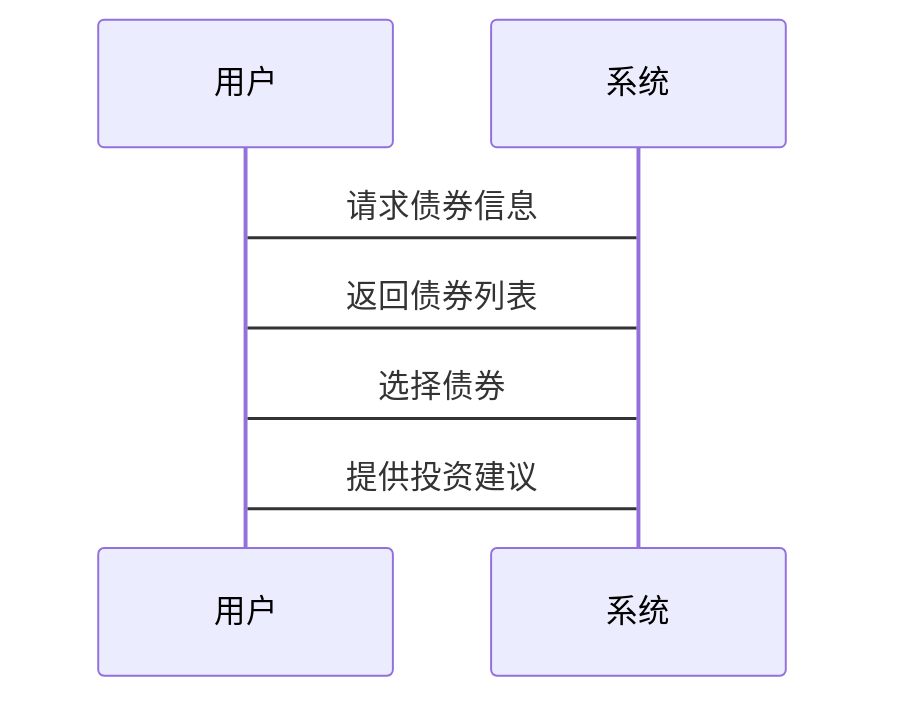

                 


# 霍华德·马克斯的债券价值投资：固定收益中的机会

> 关键词：霍华德·马克斯, 债券投资, 价值投资, 固定收益, 投资策略, 风险管理

> 摘要：本文深入探讨了霍华德·马克斯的债券价值投资理念，分析了其在固定收益投资中的机会和策略。通过详细讲解核心概念、数学模型和系统架构设计，结合实际案例，为读者提供了全面的视角，帮助他们在债券市场中发现低估机会，制定有效的投资策略。

---

## 第1章: 债券投资的基本概念

### 1.1 债券的基本定义与特性

#### 1.1.1 债券的定义
债券是一种债务工具，发行人承诺在特定时间内支付利息并偿还本金。债券的价值由其面值、票面利率和剩余期限决定。

#### 1.1.2 债券的主要特性
- **面值（Par Value）**：债券的本金，通常在到期时偿还。
- **票面利率（Coupon Rate）**：债券每年支付的利息，通常为年利率。
- **到期日（Maturity Date）**：债券偿还本金的日期。
- **流动性**：债券在市场上的交易频率和交易价格的稳定性。

#### 1.1.3 债券的分类与市场结构
债券可以按发行人、期限、利率类型等分类。例如：
- **政府债券**：由政府发行，风险较低。
- **公司债券**：由公司发行，风险较高。
- **零息债券**：没有票面利息，到期时按面值偿还。

---

### 1.2 债券市场的运作机制

#### 1.2.1 债券市场的参与者
- **发行人**：政府、企业或其他实体。
- **投资者**：个人、机构或基金。
- **中介**：券商、交易商和做市商。

#### 1.2.2 债券的发行与交易流程
1. **发行**：发行人通过招标或私募方式发行债券。
2. **交易**：债券在一级市场或二级市场进行交易，价格受市场供需影响。

#### 1.2.3 债券价格的决定因素
- **市场利率**：市场利率下降，债券价格上涨。
- **信用风险**：债券发行人违约风险影响价格。
- **流动性**：流动性高的债券价格波动较小。

---

### 1.3 债券投资的基本原理

#### 1.3.1 债券收益率的计算方法
债券的收益率包括当前收益率和到期收益率：
- **当前收益率**：票面利息 / 市场价格。
- **到期收益率**：购买债券到到期的内含收益率，考虑复利和再投资风险。

#### 1.3.2 利率风险与信用风险
- **利率风险**：债券价格受市场利率变化的影响。
- **信用风险**：债券发行人违约的风险。

#### 1.3.3 债券定价的理论基础
债券价格由其未来现金流的现值决定，使用现金流贴现模型（DCF）进行评估。

---

### 1.4 价值投资的基本理念

#### 1.4.1 价值投资的定义
价值投资是一种寻找市场价格低于内在价值的证券进行投资的策略。

#### 1.4.2 价值投资的核心原则
- **安全边际**：买入价格低于内在价值，确保有足够的安全空间。
- **长期视角**：关注企业的长期价值，而非短期市场波动。

#### 1.4.3 价值投资在债券市场中的应用
寻找市场低估的债券，通过分析发行人财务状况和市场环境，识别潜在的投资机会。

---

### 1.5 霍华德·马克斯的投资理念

#### 1.5.1 马克斯的背景与投资风格
霍华德·马克斯是橡树资本的创始人，以价值投资和逆向投资闻名。

#### 1.5.2 马克斯的投资哲学
- **逆向投资**：在市场恐慌时寻找机会。
- **安全边际**：买入价格远低于内在价值的债券。

#### 1.5.3 马克斯对债券市场的独特见解
债券市场波动性较低，适合寻找低估机会，尤其是信用债券。

---

## 第2章: 固定收益投资的核心概念

### 2.1 债券的定价模型

#### 2.1.1 利率的期限结构
长期债券的价格波动性高于短期债券。

#### 2.1.2 债券定价的现金流贴现法
使用DCF模型计算债券的内在价值。

#### 2.1.3 利率风险的衡量指标
- **久期（Duration）**：衡量债券价格对利率变化的敏感性。
- **凸性（Convexity）**：久期变化的敏感性。

---

### 2.2 信用评级与信用风险

#### 2.2.1 信用评级的定义与分类
- **信用评级**：由评级机构（如穆迪、标普）对债券信用质量的评估。
- **评级分类**：从AAA（最高）到D（违约）。

#### 2.2.2 不同信用评级的债券风险与收益分析
低评级债券风险高，但可能有更高的收益。

#### 2.2.3 信用风险的管理策略
分散投资、风险定价和动态调整。

---

### 2.3 债券组合管理的基本原理

#### 2.3.1 债券组合的目标与策略
- **目标**：最大化收益，最小化风险。
- **策略**：期限匹配、信用分散和流动性管理。

#### 2.3.2 债券组合的风险调整收益分析
使用夏普比率衡量风险调整后的收益。

#### 2.3.3 债券组合的再平衡与优化
定期调整组合以应对市场变化。

---

### 2.4 价值投资在固定收益中的应用

#### 2.4.1 价值投资的核心要素
- **内在价值**：债券的公平市场价值。
- **市场低估**：买入价格低于内在价值。

#### 2.4.2 识别市场低估债券的方法
分析市场情绪、信用状况和宏观经济环境。

#### 2.4.3 价值投资与债券市场周期的关系
在市场低迷时寻找低估债券，避免追高。

---

## 第3章: 霍华德·马克斯的投资策略

### 3.1 马克斯的投资策略概述

#### 3.1.1 马克斯的投资风格
逆向投资和安全边际为核心。

#### 3.1.2 马克斯的债券投资策略
寻找市场低估的高息债券，注重信用质量和市场环境。

---

### 3.2 马克斯的市场分析方法

#### 3.2.1 市场周期的分析
- **牛市**：价格高估，风险增加。
- **熊市**：价格低估，机会增加。

#### 3.2.2 市场情绪与投资者行为
市场恐慌时，债券可能被低估，适合投资。

---

### 3.3 马克斯的债券筛选标准

#### 3.3.1 信用质量的评估
选择信用评级较高的债券，降低违约风险。

#### 3.3.2 利率水平的分析
关注市场利率变化，选择有利的债券。

#### 3.3.3 债券流动性的影响
流动性高的债券更容易变现，降低交易成本。

---

### 3.4 马克斯的风险管理策略

#### 3.4.1 风险分散与组合管理
通过分散投资降低风险。

#### 3.4.2 风险调整后的收益分析
使用夏普比率衡量风险调整后的收益。

#### 3.4.3 风险控制的动态调整
根据市场变化动态调整组合。

---

## 第4章: 债券价值投资的数学模型与算法

### 4.1 债券定价的数学模型

#### 4.1.1 利率的期限结构模型
- **零息债券**：价格 = 面值 / (1 + r)^t
- **到期收益率**：r = (C / P) + [(F - P) / T]

#### 4.1.2 债券现金流贴现模型
$$ P = \sum_{t=1}^{n} \frac{C}{(1 + r)^t} + \frac{F}{(1 + r)^n} $$

---

### 4.2 信用风险评估的算法

#### 4.2.1 信用评分模型
- **PD（违约概率）**：企业违约的概率。
- **LGD（违约损失率）**：违约时的损失比例。

---

### 4.3 债券组合优化的数学方法

#### 4.3.1 债券组合的收益-风险优化
使用均值-方差优化模型。

#### 4.3.2 基于现代投资组合理论的优化
最大化收益，最小化风险。

#### 4.3.3 基于遗传算法的组合优化
通过模拟进化过程优化组合。

---

## 第5章: 系统架构与投资组合管理

### 5.1 系统架构设计

#### 5.1.1 项目介绍
构建一个基于马克斯策略的债券投资系统。

#### 5.1.2 系统功能设计
- **数据采集**：获取债券市场数据。
- **信用评估**：分析债券信用质量。
- **投资决策**：筛选低估债券。
- **风险控制**：动态调整组合。

#### 5.1.3 系统架构图



---

### 5.2 系统接口设计

#### 5.2.1 数据接口
- **API**：从第三方获取债券数据。
- **数据清洗**：处理缺失或异常数据。

#### 5.2.2 用户接口
- **前端**：展示债券信息和投资建议。
- **后端**：处理投资决策和风险控制。

---

### 5.3 系统交互流程图



---

## 第6章: 项目实战

### 6.1 环境安装

#### 6.1.1 安装Python
使用Anaconda安装Python环境。

#### 6.1.2 安装必要的库
安装Pandas、NumPy和Matplotlib。

---

### 6.2 系统核心实现源代码

#### 6.2.1 数据获取
```python
import pandas as pd

# 获取债券数据
bond_data = pd.read_csv('bond.csv')
```

#### 6.2.2 信用评估
```python
def calculate_pd(bond_data):
    # 计算违约概率
    return bond_data['违约概率']
```

---

### 6.3 代码应用解读与分析

#### 6.3.1 数据分析
使用Pandas进行数据清洗和分析。

#### 6.3.2 模型应用
应用信用评分模型进行债券筛选。

---

### 6.4 实际案例分析和详细讲解剖析

#### 6.4.1 案例背景
选择一家公司发行的债券，分析其信用状况。

#### 6.4.2 数据分析
计算债券的内在价值和市场价格。

#### 6.4.3 投资决策
根据分析结果，决定是否投资该债券。

---

### 6.5 项目小结

通过实际案例分析，验证了马克斯策略的有效性，强调了信用评估和市场分析的重要性。

---

## 第7章: 总结与最佳实践

### 7.1 总结

霍华德·马克斯的债券价值投资策略在固定收益领域提供了独特的视角，通过逆向投资和安全边际，帮助投资者发现市场低估的机会。

---

### 7.2 最佳实践 tips

- **长期视角**：关注债券的长期价值。
- **风险控制**：分散投资，动态调整组合。
- **持续学习**：保持对市场变化的敏感性。

---

### 7.3 注意事项

- **市场风险**：债券价格受市场利率和信用状况影响。
- **流动性风险**：低流动性债券可能难以变现。

---

### 7.4 拓展阅读

推荐阅读霍华德·马克斯的书籍《投资最重要的事》和《债券市场分析》。

---

## 作者信息

作者：AI天才研究院/AI Genius Institute & 禅与计算机程序设计艺术/Zen And The Art of Computer Programming

--- 

希望这篇文章能够为读者提供深入的视角，帮助他们在固定收益投资中发现机会，实现长期稳健的收益。

