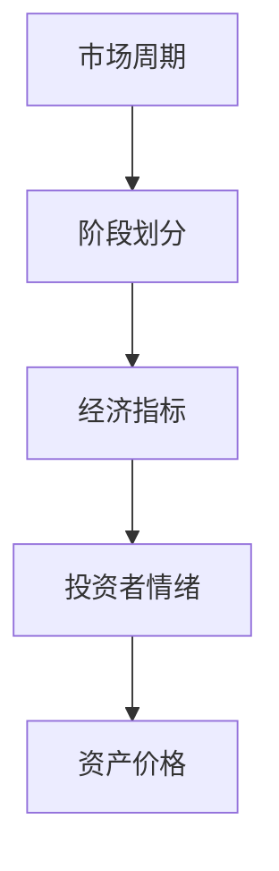
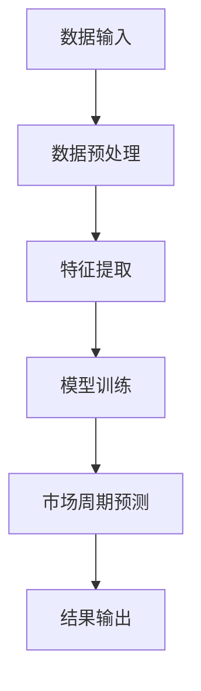
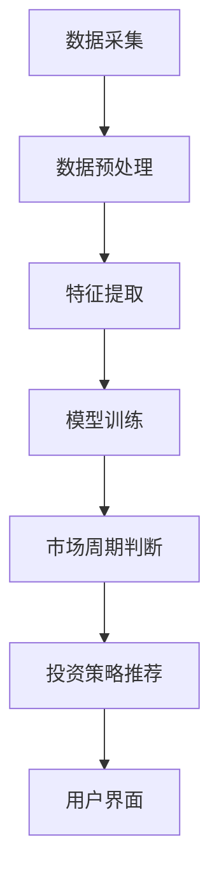
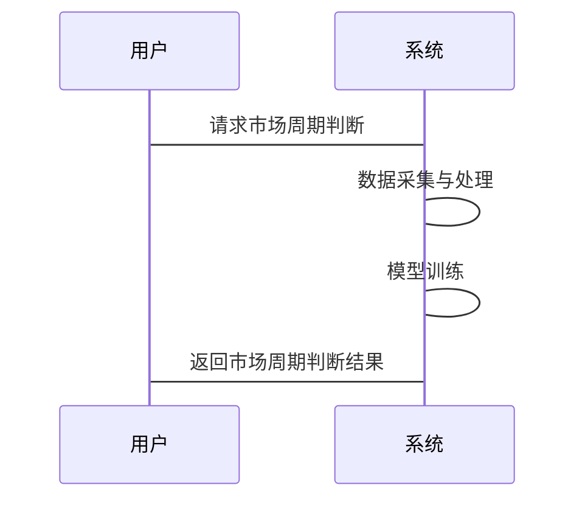

                 


# 霍华德·马克斯的市场周期定位技巧

## 关键词：市场周期，投资定位，霍华德·马克斯，逆向投资，动态时间序列分析

## 摘要：  
本文详细探讨了霍华德·马克斯的市场周期定位技巧，结合技术分析和投资策略，深入解读其核心理念。通过系统分析和算法实现，为读者提供实用的市场周期预测方法，并结合实际案例，展示如何在投资决策中应用这些技巧。

---

## 第1章: 市场周期与投资定位概述

### 1.1 市场周期的基本概念

#### 1.1.1 市场周期的定义与特点  
市场周期是指市场在经济发展过程中经历的波动性阶段，通常包括繁荣、衰退、萧条和复苏四个阶段。每个阶段的特点如下：  
- **繁荣阶段**：市场高度活跃，资产价格上涨，投资者情绪乐观。  
- **衰退阶段**：市场开始下跌，资产价格回落，投资者情绪转向谨慎。  
- **萧条阶段**：市场低迷，资产价格达到低点，投资者情绪悲观。  
- **复苏阶段**：市场逐渐恢复，资产价格回升，投资者情绪逐步回暖。  

市场周期的核心在于其波动性和周期性，投资者需要准确识别所处阶段，以制定相应的投资策略。

#### 1.1.2 市场周期与其他经济指标的关系  
市场周期与许多经济指标密切相关，如GDP增长率、失业率、通胀率、利率等。这些指标的变化会影响市场的供需关系，从而影响资产价格的波动。例如，低利率环境通常会刺激市场上涨，而高利率则可能导致市场下跌。

#### 1.1.3 市场周期在投资中的重要性  
准确识别市场周期可以帮助投资者做出更明智的投资决策。在繁荣阶段，投资者可以积极参与市场；在衰退阶段，投资者应保持谨慎，避免盲目投资；在萧条阶段，投资者可以逢低吸纳，布局长期机会；在复苏阶段，投资者可以逐步增加仓位。

### 1.2 霍华德·马克斯的投资理念

#### 1.2.1 霍华德·马克斯的市场周期理论  
霍华德·马克斯认为，市场周期的核心是投资者情绪的变化。在市场繁荣时，投资者情绪过度乐观，容易忽视风险；在市场低迷时，投资者情绪过度悲观，容易错失机会。因此，逆向投资是其核心策略之一。

#### 1.2.2 逆向投资策略的核心思想  
逆向投资是指在市场低迷时买入，在市场繁荣时卖出。马克斯强调，投资者应避免随大流，而应在市场非理性时做出理性决策。他认为，市场的波动性为长期投资者提供了低成本的机会。

#### 1.2.3 霍华德·马克斯的成功投资案例  
马克斯的成功投资案例包括在2008年金融危机期间逆向投资，购买优质资产。他的投资策略在市场低迷时表现尤为突出，为投资者带来了丰厚的回报。

---

## 第2章: 市场周期的核心概念与联系

### 2.1 市场周期的原理

#### 2.1.1 市场周期的阶段划分  
市场周期通常分为四个阶段：  
1. **繁荣阶段**：市场上涨，投资者情绪乐观。  
2. **衰退阶段**：市场下跌，投资者情绪谨慎。  
3. **萧条阶段**：市场低迷，投资者情绪悲观。  
4. **复苏阶段**：市场回升，投资者情绪回暖。  

#### 2.1.2 市场周期的驱动因素  
市场周期的驱动因素包括经济基本面、政策变化、投资者情绪等。例如，经济复苏通常会推动市场进入繁荣阶段，而政策紧缩可能导致市场进入衰退阶段。

#### 2.1.3 市场周期的影响因素  
市场周期的影响因素包括全球经济状况、地缘政治风险、市场流动性等。这些因素会通过影响投资者情绪和市场供需关系，进而影响市场周期的演变。

### 2.2 核心概念对比分析

#### 2.2.1 不同市场周期阶段的特征对比  
以下表格对比了不同市场周期阶段的特征：  

| 阶段       | 市场表现       | 投资者情绪 | 资产价格 |
|------------|----------------|------------|----------|
| 繁荣阶段    | 上涨           | 乐观        | 高        |
| 衰退阶段    | 下跌           | 谨慎        | 中        |
| 萧条阶段    | 低迷           | 悲观        | 低        |
| 复苏阶段    | 回升           | 感乐观       | 中高       |

#### 2.2.2 投资者情绪与市场周期的关系  
投资者情绪是市场周期的重要驱动力。在繁荣阶段，情绪过于乐观可能导致市场泡沫；在萧条阶段，情绪过于悲观可能导致市场低估。

#### 2.2.3 资产价格波动与市场周期的关联  
资产价格波动与市场周期密切相关。在繁荣阶段，资产价格上涨；在衰退阶段，资产价格下跌；在萧条阶段，资产价格达到低点；在复苏阶段，资产价格逐步回升。

### 2.3 市场周期的ER实体关系图



---

## 第3章: 市场周期定位的算法原理

### 3.1 动态时间序列分析

#### 3.1.1 动态时间序列的基本原理  
动态时间序列分析是一种用于预测市场周期的方法。它通过分析时间序列数据的变化趋势，识别市场周期的阶段。

#### 3.1.2 市场周期预测的数学模型  
动态时间序列分析的核心模型是ARIMA（自回归积分滑动平均模型）。其数学表达式为：  
$$ARIMA(p, d, q)$$  
其中，p为自回归阶数，d为差分阶数，q为滑动平均阶数。

#### 3.1.3 市场周期定位的算法流程  
算法流程如下：  
1. 数据预处理：对时间序列数据进行平稳化处理。  
2. 特征提取：提取关键特征，如均值、方差等。  
3. 模型训练：使用ARIMA模型训练数据。  
4. 市场周期预测：基于训练好的模型，预测未来市场周期阶段。

### 3.2 市场周期定位算法的实现

#### 3.2.1 数据预处理与特征提取  
以下是Python代码示例：  
```python
import pandas as pd
import numpy as np

# 数据预处理
data = pd.read_csv('market_data.csv')
data['log_returns'] = np.log(data['price'].pct_change().add(1))

# 特征提取
features = data[['log_returns', 'volume']]
```

#### 3.2.2 基于动态时间序列的市场周期预测  
以下是Python代码示例：  
```python
from statsmodels.tsa.arima_model import ARIMA

# 模型训练
model = ARIMA(features['log_returns'], order=(1, 1, 1))
model_fit = model.fit()

# 市场周期预测
forecast = model_fit.forecast(steps=10)
```

#### 3.2.3 算法流程图  


### 3.3 算法原理的数学模型  
ARIMA模型的数学公式为：  
$$ARIMA(p, d, q) = y_t - \theta_1 y_{t-1} - \cdots - \theta_q y_{t-q} = \epsilon_t$$  
其中，$y_t$为观测值，$\epsilon_t$为白噪声。

---

## 第4章: 系统分析与架构设计

### 4.1 投资决策支持系统

#### 4.1.1 系统功能设计  
投资决策支持系统的主要功能包括：  
1. 数据采集与处理：收集市场数据，进行预处理。  
2. 市场周期判断：基于动态时间序列分析，判断当前市场周期阶段。  
3. 投资策略推荐：根据市场周期阶段，推荐相应的投资策略。  

#### 4.1.2 系统架构设计  
以下是系统架构图：  



#### 4.1.3 系统接口设计  
以下是系统接口设计：  



---

## 第5章: 项目实战

### 5.1 环境安装与配置

#### 5.1.1 安装Python与相关库  
以下是Python代码示例：  
```bash
pip install pandas numpy statsmodels
```

#### 5.1.2 数据获取与预处理  
以下是Python代码示例：  
```python
import pandas as pd
import numpy as np

# 数据获取
data = pd.read_csv('market_data.csv')

# 数据预处理
data['log_returns'] = np.log(data['price'].pct_change().add(1))
```

### 5.2 核心代码实现

#### 5.2.1 动态时间序列分析  
以下是Python代码示例：  
```python
from statsmodels.tsa.arima_model import ARIMA

# 模型训练
model = ARIMA(data['log_returns'], order=(1, 1, 1))
model_fit = model.fit()

# 市场周期预测
forecast = model_fit.forecast(steps=10)
```

#### 5.2.2 投资策略推荐  
以下是Python代码示例：  
```python
def get_investment_strategy(current_phase):
    if current_phase == '繁荣':
        return '增加仓位'
    elif current_phase == '衰退':
        return '减少仓位'
    elif current_phase == '萧条':
        return '逢低吸纳'
    elif current_phase == '复苏':
        return '逐步加仓'
```

### 5.3 实际案例分析

#### 5.3.1 数据分析与处理  
以下是Python代码示例：  
```python
import pandas as pd
import numpy as np

data = pd.read_csv('market_data.csv')
data['log_returns'] = np.log(data['price'].pct_change().add(1))
```

#### 5.3.2 市场周期判断  
以下是Python代码示例：  
```python
from statsmodels.tsa.arima_model import ARIMA

model = ARIMA(data['log_returns'], order=(1, 1, 1))
model_fit = model.fit()

forecast = model_fit.forecast(steps=10)
```

#### 5.3.3 投资策略推荐  
以下是Python代码示例：  
```python
def get_investment_strategy(current_phase):
    if current_phase == '繁荣':
        return '增加仓位'
    elif current_phase == '衰退':
        return '减少仓位'
    elif current_phase == '萧条':
        return '逢低吸纳'
    elif current_phase == '复苏':
        return '逐步加仓'

current_phase = '萧条'
investment_strategy = get_investment_strategy(current_phase)
print(investment_strategy)
```

### 5.4 项目小结  
通过实际案例分析，我们可以看到，动态时间序列分析在市场周期定位中的应用非常有效。投资者可以根据系统的判断和推荐，制定相应的投资策略，从而在市场波动中获得更好的收益。

---

## 第6章: 最佳实践与小结

### 6.1 最佳实践

#### 6.1.1 定期回顾与调整  
投资者应定期回顾市场周期判断结果，并根据实际情况调整投资策略。

#### 6.1.2 风险管理  
在市场周期定位中，风险管理是至关重要的。投资者应设定止损点，避免过度亏损。

#### 6.1.3 多策略结合  
投资者可以结合多种市场周期定位方法，如技术分析、基本面分析等，以提高判断的准确性。

### 6.2 小结  
本文详细探讨了霍华德·马克斯的市场周期定位技巧，并结合动态时间序列分析，为投资者提供了实用的市场周期预测方法。通过系统分析和实际案例，展示了如何在投资决策中应用这些技巧。

### 6.3 注意事项  
市场周期定位是一项复杂的工作，投资者应保持谨慎，避免过度依赖单一方法。同时，市场周期定位结果仅供参考，具体投资决策需结合实际情况。

### 6.4 拓展阅读  
推荐阅读霍华德·马克斯的《投资最重要的事情》，以深入理解其投资理念和市场周期理论。

---

## 作者：AI天才研究院/AI Genius Institute & 禅与计算机程序设计艺术 /Zen And The Art of Computer Programming

