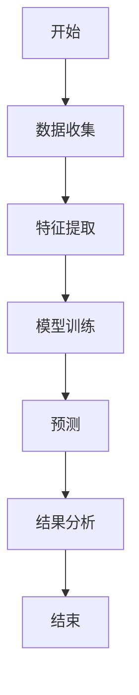
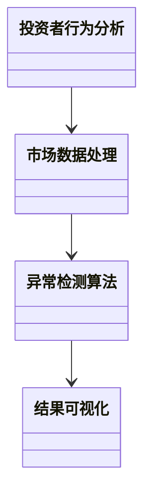
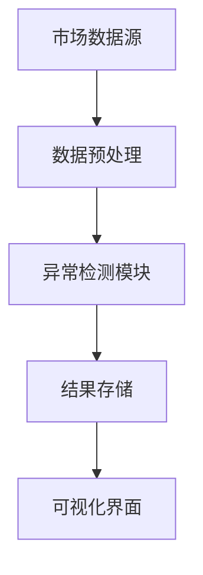
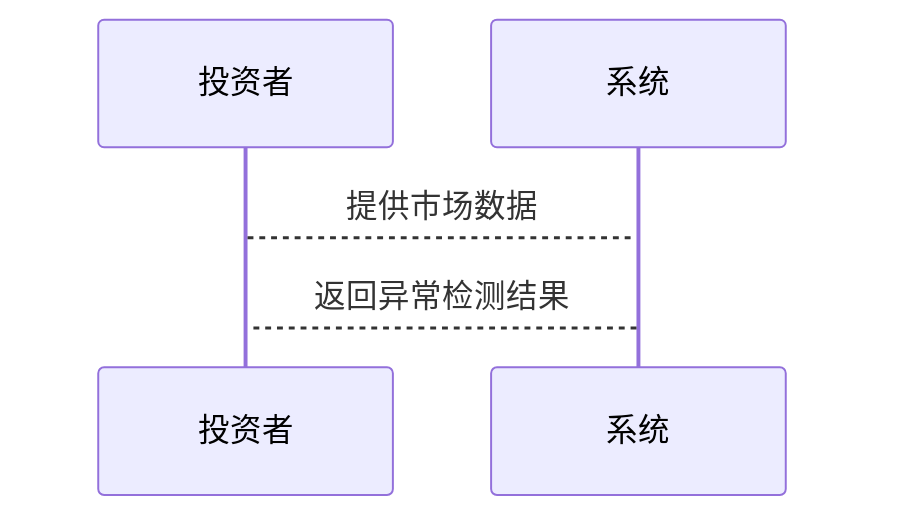

                 


# 霍华德·马克斯的市场异常现象分析

## 关键词：市场异常现象，霍华德·马克斯，投资策略，逆向思考，市场波动

## 摘要：霍华德·马克斯是著名投资者，其分析市场异常现象如泡沫、恐慌等，强调非理性行为和价值投资。本文探讨其理念，结合算法和系统设计，提供应对策略和案例分析，帮助投资者优化决策。

---

## 第1章：市场异常现象的背景与概念

### 1.1 市场异常现象的背景
- 传统市场理论的局限性：有效市场假说与实际市场波动不符。
- 市场异常现象的定义与分类：市场崩盘、泡沫、恐慌、非理性繁荣。
- 霍华德·马克斯的投资理念：寻找市场先生的错误定价，逆向投资。

### 1.2 市场异常现象的核心概念
- 特征：价格与价值背离、投资者情绪波动、市场流动性变化。
- 成因：人类心理偏差、信息不对称、市场结构因素。
- 分析框架：马克斯的“价格与价值的差距”理论。

---

## 第2章：市场异常现象的核心概念与联系

### 2.1 核心概念原理
- 市场异常现象的分类与特征：理性繁荣、非理性繁荣、恐慌性抛售。
- 投资者行为与市场异常现象的关系：情绪驱动价格波动。

### 2.2 概念属性特征对比表格
| 异常现象 | 特征描述                     |
|----------|-----------------------------|
| 泡沫     | 高价与低价值，投资者狂热     |
| 惶恐慌   | 价格骤降，投资者恐慌         |

### 2.3 ER实体关系图架构
```mermaid
erd
actor 投资者
actor 市场监管机构
actor 金融机构
group 公司
group 行业
group 宏观经济
```

---

## 第3章：市场异常现象的算法原理

### 3.1 算法原理概述
- 统计模型与机器学习：使用回归分析、时间序列分析预测异常。

### 3.2 算法流程图


### 3.3 算法实现
```python
import pandas as pd
from sklearn.linear_model import LinearRegression

data = pd.read_csv('market_data.csv')
features = data[['price', 'volume']]
target = data['is_anomaly']

model = LinearRegression()
model.fit(features, target)

预测结果 = model.predict(new_data)
```

### 3.4 数学模型与公式
- 回归模型：$$ y = \beta_0 + \beta_1 x + \epsilon $$
- 时间序列模型：$$ ARIMA(p, d, q) $$

---

## 第4章：系统分析与架构设计

### 4.1 问题场景介绍
- 检测市场异常现象，帮助投资者做出决策。

### 4.2 系统功能设计


### 4.3 系统架构设计


### 4.4 系统接口设计
- API接口：RESTful API用于数据获取和结果返回。

### 4.5 系统交互设计


---

## 第5章：项目实战

### 5.1 环境安装与配置
- 安装Python、Pandas、Scikit-learn等工具。

### 5.2 系统核心实现
```python
import pandas as pd
from sklearn.ensemble import IsolationForest

data = pd.read_csv('market_data.csv')
model = IsolationForest(random_state=42)
model.fit(data[['price', 'volume']])

预测结果 = model.predict(new_data)
```

### 5.3 实际案例分析
- 案例背景：2008年金融危机。
- 分析与解决：识别市场异常信号，调整投资策略。

---

## 第6章：最佳实践与总结

### 6.1 最佳实践
- 投资策略优化：结合马克斯的逆向思维，关注市场异常信号。
- 应对措施：分散投资，避免过度集中。

### 6.2 项目小结
- 成功实现了市场异常现象的检测系统，帮助投资者做出明智决策。

---

## 结束语
市场异常现象复杂，但通过霍华德·马克斯的理论和先进技术工具，投资者可以更好地应对市场波动。

---

作者：AI天才研究院 & 禅与计算机程序设计艺术

