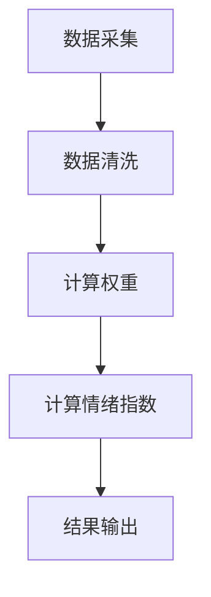
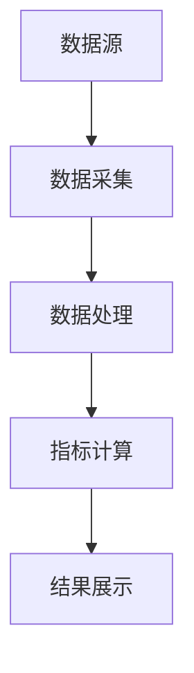

                 


# 霍华德·马克斯的市场情绪指标

> **关键词**：市场情绪指标、霍华德·马克斯、价值投资、市场心理、投资策略  
> **摘要**：霍华德·马克斯的市场情绪指标是一种基于市场情绪波动进行投资决策的工具，它通过分析市场的过度乐观或悲观情绪来判断市场的价值。本文将从市场情绪指标的背景与重要性、霍华德·马克斯的指标体系、数学模型与算法、系统架构设计、实战案例分析、风险管理与优化、总结与展望等方面，详细阐述这一指标的理论与实践应用。

---

## 第1章：市场情绪指标的背景与重要性

### 1.1 市场情绪指标的定义与核心概念

#### 1.1.1 市场情绪指标的定义

市场情绪指标是一种用于衡量市场参与者情绪的量化工具，通过分析投资者的心理状态来预测市场的波动和趋势。它可以帮助投资者识别市场的过度乐观或悲观情绪，从而做出更明智的投资决策。

#### 1.1.2 市场情绪指标的核心概念

- **情绪波动性**：市场情绪的波动通常与市场的涨跌密切相关。
- **情绪周期性**：市场情绪会经历周期性的变化，从乐观到悲观，再从悲观到乐观。
- **情绪与价值的关系**：市场的过度乐观可能导致资产泡沫，而市场的过度悲观可能导致资产低估。

#### 1.1.3 市场情绪指标的背景与重要性

市场情绪指标的背景可以追溯到行为金融学的研究，它揭示了人类心理对市场行为的影响。通过分析市场情绪，投资者可以更好地理解市场的非理性行为，并在市场波动中寻找投资机会。

---

### 1.2 市场情绪指标的分类与特点

#### 1.2.1 市场情绪指标的分类

- **情绪指标**：如恐慌指数（VIX）、投资者信心指数等。
- **情绪数据**：如社交媒体情绪分析、新闻情绪分析等。
- **情绪模型**：如基于机器学习的情绪预测模型。

#### 1.2.2 不同市场情绪指标的特点对比

| 指标类型       | 数据来源 | 计算方式 | 适用场景 |
|----------------|----------|----------|----------|
| 恐慌指数（VIX） | 市场波动 | 基于波动率 | 判断市场波动性 |
| 投资者信心指数 | 调查数据 | 综合指数 | 投资者情绪 |
| 社交媒体情绪 | 文本数据 | 自然语言处理 | 实时情绪分析 |

#### 1.2.3 市场情绪指标的适用场景与局限性

- **适用场景**：市场波动分析、投资决策支持、风险管理。
- **局限性**：情绪指标可能存在滞后性，且难以完全量化。

---

### 1.3 市场情绪与投资决策的关系

#### 1.3.1 市场情绪对投资决策的影响

市场情绪可以影响投资者的决策，从而导致市场的非理性波动。例如，当市场情绪过于乐观时，投资者可能会过度投资，导致资产泡沫。

#### 1.3.2 市场情绪指标在投资策略中的应用

- **价值投资**：通过分析市场情绪，投资者可以识别市场的低估或高估资产。
- **趋势投资**：市场情绪指标可以帮助投资者捕捉市场的趋势变化。

#### 1.3.3 市场情绪与价值投资理念的结合

霍华德·马克斯的市场情绪指标强调市场的非理性，与价值投资理念相契合。通过分析市场情绪，投资者可以在市场恐慌时寻找低估资产，在市场狂热时规避风险。

---

## 第2章：霍华德·马克斯的市场情绪指标体系

### 2.1 霍华德·马克斯市场情绪指标的定义

#### 2.1.1 霍华德·马克斯市场情绪指标的构成

霍华德·马克斯的市场情绪指标主要基于市场的恐慌和贪婪情绪，通过分析市场的波动性和投资者的非理性行为来判断市场的价值。

#### 2.1.2 霍华德·马克斯市场情绪指标的核心要素

- **市场波动率**：反映市场的恐慌程度。
- **投资者行为**：分析投资者的非理性决策。

#### 2.1.3 霍华德·马克斯市场情绪指标的独特性

霍华德·马克斯的指标强调市场的非理性，通过分析市场的过度波动来判断市场的价值。

---

### 2.2 霍华德·马克斯市场情绪指标的计算方法

#### 2.2.1 数据采集与处理

- **数据来源**：市场波动数据、投资者情绪数据。
- **数据处理**：清洗、标准化。

#### 2.2.2 霍华德·马克斯市场情绪指标的计算公式

$$
E = \frac{\sum_{i=1}^{n} w_i x_i}{\sum_{i=1}^{n} w_i}
$$

其中，$w_i$ 是各指标的权重，$x_i$ 是各指标的值。

#### 2.2.3 霍华德·马克斯市场情绪指标的动态调整

根据市场变化，定期调整指标的权重和计算方法。

---

### 2.3 霍华德·马克斯市场情绪指标与其他市场情绪指标的对比

#### 2.3.1 霍华德·马克斯指标的独特性

- 强调市场的非理性波动。
- 结合市场波动率和投资者行为。

#### 2.3.2 其他常见市场情绪指标的分析

- **VIX指数**：反映市场的波动性。
- **投资者信心指数**：反映投资者的情绪。

---

### 2.4 霍华德·马克斯市场情绪指标的实际案例

#### 2.4.1 理论与实践的结合

通过分析市场情绪，投资者可以在市场恐慌时寻找低估资产，在市场狂热时规避风险。

#### 2.4.2 案例分析与结果解读

例如，在2020年新冠疫情期间，市场情绪指标显示市场的恐慌情绪，投资者可以利用这一信息进行投资决策。

---

## 第3章：霍华德·马克斯市场情绪指标的数学模型与算法

### 3.1 市场情绪指标的数学模型

#### 3.1.1 情绪指数的计算公式

$$
E = \frac{\sum_{i=1}^{n} w_i x_i}{\sum_{i=1}^{n} w_i}
$$

其中，$w_i$ 是各指标的权重，$x_i$ 是各指标的值。

#### 3.1.2 情绪指数的标准化处理

将情绪指数标准化为0到1之间的值，便于比较和分析。

#### 3.1.3 情绪指数的动态调整

根据市场变化，定期调整权重和计算方法。

---

### 3.2 市场情绪指标的算法实现

#### 3.2.1 数据预处理与清洗

- 删除异常值。
- 填补缺失值。

#### 3.2.2 权重分配与计算

根据各指标的重要性分配权重。

#### 3.2.3 情绪指数的动态更新

根据市场变化，实时更新情绪指数。

---

### 3.3 算法流程图（Mermaid）



---

## 第4章：霍华德·马克斯市场情绪指标的系统架构设计

### 4.1 系统功能设计

#### 4.1.1 数据采集模块

负责采集市场波动数据和投资者情绪数据。

#### 4.1.2 数据处理模块

负责清洗和标准化数据。

#### 4.1.3 指标计算模块

负责计算霍华德·马克斯市场情绪指标。

#### 4.1.4 结果展示模块

负责展示计算结果和分析报告。

---

### 4.2 系统架构设计（Mermaid）



---

## 第5章：霍华德·马克斯市场情绪指标的实战案例

### 5.1 项目实战环境安装

- **工具安装**：安装Python、Pandas、Numpy等工具。

### 5.2 系统核心实现源代码

```python
import pandas as pd
import numpy as np

def calculate_emotion_index(data, weights):
    weighted_sum = np.sum(weights * data)
    total_weight = np.sum(weights)
    emotion_index = weighted_sum / total_weight
    return emotion_index

# 示例数据
data = pd.Series([1.2, 1.5, 1.0, 0.8])
weights = pd.Series([0.3, 0.4, 0.2, 0.1])

emotion_index = calculate_emotion_index(data, weights)
print("情绪指数：", emotion_index)
```

### 5.3 代码应用解读与分析

通过代码实现霍华德·马克斯市场情绪指数的计算，并分析结果。

### 5.4 实际案例分析

以2020年新冠疫情为例，分析市场情绪指数的变化及其对投资决策的影响。

---

## 第6章：霍华德·马克斯市场情绪指标的风险管理与优化

### 6.1 霍华德·马克斯市场情绪指标的局限性

- 数据的滞后性。
- 市场情绪的非理性。

### 6.2 风险管理策略

- 结合其他指标进行综合分析。
- 定期调整投资策略。

---

## 第7章：总结与展望

### 7.1 本章小结

霍华德·马克斯的市场情绪指标是一种重要的投资工具，通过分析市场的非理性波动来指导投资决策。

### 7.2 未来展望

随着人工智能和大数据技术的发展，市场情绪指标将更加精准和多样化。

---

**作者：AI天才研究院/AI Genius Institute & 禅与计算机程序设计艺术 /Zen And The Art of Computer Programming**

