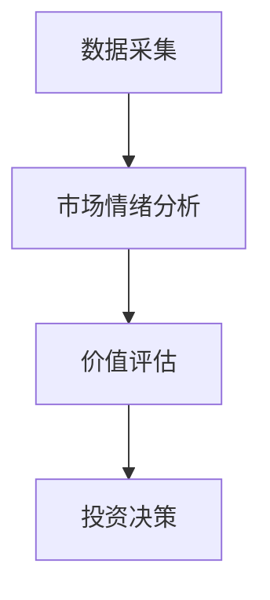
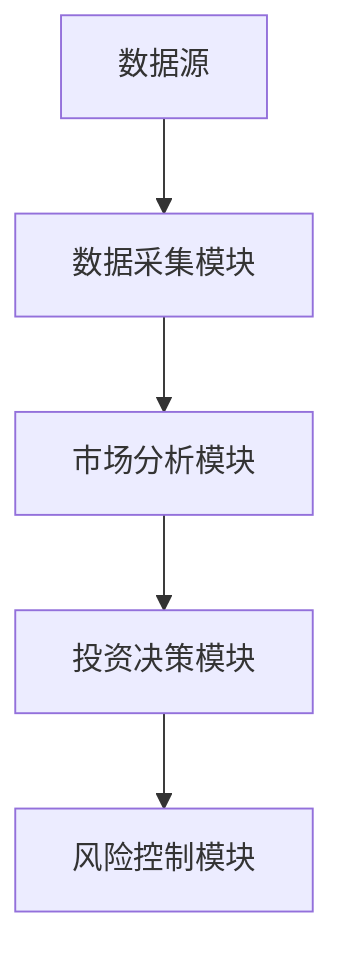

                 


# 霍华德·马克斯的逆向投资哲学

> 关键词：霍华德·马克斯，逆向投资，投资哲学，市场情绪，价值评估，风险控制

> 摘要：霍华德·马克斯的逆向投资哲学是一种独特且深刻的投资理念，强调在市场低谷时寻找投资机会，避免随市场趋势波动。本文将从逆向投资的背景、核心概念、算法原理、系统架构、项目实战以及最佳实践等方面，全面剖析这一投资哲学的内在逻辑和实际应用，帮助读者理解其独特价值和操作方法。

---

## 第一部分：逆向投资的背景与核心概念

### 第1章：逆向投资的背景与定义

#### 1.1 投资领域的传统思维与局限性

传统的投资方法通常依赖于市场趋势和价格波动，投资者倾向于在市场高点时买入，在市场低谷时卖出。这种“随波逐流”的策略虽然在某些情况下能带来收益，但也存在显著的局限性。例如，投资者往往受到市场情绪的影响，容易陷入羊群效应，导致决策失误。

#### 1.2 逆向投资的起源与发展

逆向投资作为一种反传统的投资策略，起源于对市场非理性行为的深刻洞察。霍华德·马克斯是这一领域的代表人物，他强调在市场恐慌时寻找低估资产，在市场狂热时保持冷静。这种方法的核心在于利用市场的非理性波动，捕捉价值低估的投资机会。

#### 1.3 霍华德·马克斯与逆向投资

霍华德·马克斯是逆向投资的倡导者和实践者。他在《投资最重要的事情》一书中，详细阐述了逆向投资的哲学和方法。他认为，市场的波动性和投资者的非理性行为为逆向投资者提供了独特的套利机会。

---

### 第2章：逆向投资的核心概念

#### 2.1 市场情绪与投资决策的关系

市场情绪是逆向投资的核心关注点之一。当市场情绪高涨时，资产价格往往被高估；当市场情绪低落时，资产价格可能被低估。逆向投资者通过分析市场情绪，寻找与资产真实价值的偏离点。

#### 2.2 价值评估的内在逻辑

逆向投资强调对资产内在价值的深入分析，而非关注市场价格的短期波动。通过基本面分析，投资者可以识别那些被市场低估的资产，并在市场低谷时进行投资。

#### 2.3 风险与收益的动态平衡

逆向投资并不意味着完全忽视风险，而是通过识别市场的非理性行为，降低投资组合的整体风险。这种方法能够在市场波动中保持稳健的收益。

---

## 第二部分：逆向投资的算法与系统架构

### 第3章：逆向投资的算法原理

#### 3.1 投资决策算法概述

逆向投资的算法通常包括以下几个步骤：

1. **数据采集**：收集市场数据，包括资产价格、成交量、市场情绪指标等。
2. **市场情绪分析**：通过算法计算市场情绪指数，判断市场处于牛市还是熊市。
3. **价值评估**：基于基本面分析，计算资产的内在价值。
4. **投资决策**：根据市场情绪和价值评估结果，决定是否买入或卖出资产。

#### 3.2 算法流程图



### 第4章：数学模型与公式

#### 4.1 市场情绪分析模型

市场情绪指数可以通过以下公式计算：

$$
\text{市场情绪指数} = \frac{\sum (\text{价格波动} \times \text{成交量})}{\text{市场资本总额}}
$$

#### 4.2 价值评估模型

内在价值可以通过现金流折现模型计算：

$$
\text{内在价值} = \frac{\text{自由现金流}}{\text{折现率}}
$$

---

## 第三部分：项目实战与系统架构

### 第5章：系统架构设计

#### 5.1 系统功能模块

1. **数据采集模块**：负责收集市场数据。
2. **市场分析模块**：分析市场情绪和资产价值。
3. **投资决策模块**：根据分析结果做出投资决策。
4. **风险控制模块**：监控投资组合的风险。

#### 5.2 系统架构图



### 第6章：项目实战

#### 6.1 环境安装

安装必要的库和工具，例如Python的Pandas和NumPy库。

#### 6.2 核心代码实现

```python
import pandas as pd
import numpy as np

def calculate_market_sentiment(prices, volumes):
    return (prices * volumes).mean() / prices.mean()

def calculate_intrinsic_value(free_cash_flow, discount_rate):
    return free_cash_flow / discount_rate

# 示例数据
prices = [100, 105, 98, 102, 101]
volumes = [1000, 800, 1200, 900, 1100]
discount_rate = 0.05
free_cash_flow = 10000

market_sentiment = calculate_market_sentiment(prices, volumes)
intrinsic_value = calculate_intrinsic_value(free_cash_flow, discount_rate)

print("市场情绪指数:", market_sentiment)
print("内在价值:", intrinsic_value)
```

---

## 第四部分：总结与展望

### 第7章：总结与最佳实践

#### 7.1 小结

霍华德·马克斯的逆向投资哲学通过关注市场情绪和内在价值，帮助投资者在市场波动中找到机会。这种方法不仅需要对市场有深刻的理解，还需要对资产进行详细的分析和评估。

#### 7.2 注意事项

- 投资者需保持独立思考，避免受到市场情绪的干扰。
- 在实际操作中，应结合多种因素进行综合分析。
- 定期审视投资组合，及时调整策略。

#### 7.3 拓展阅读

- 霍华德·马克斯的《投资最重要的事情》。
- 《逆向思维：如何在投资中逆风而行》。

---

## 作者

作者：AI天才研究院（AI Genius Institute） & 禅与计算机程序设计艺术（Zen And The Art of Computer Programming）

---

这篇博客文章通过系统的分析和详细的讲解，全面剖析了霍华德·马克斯的逆向投资哲学，帮助读者理解其内在逻辑和实际应用。

