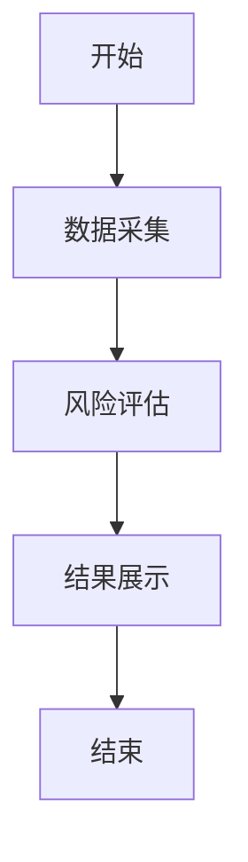
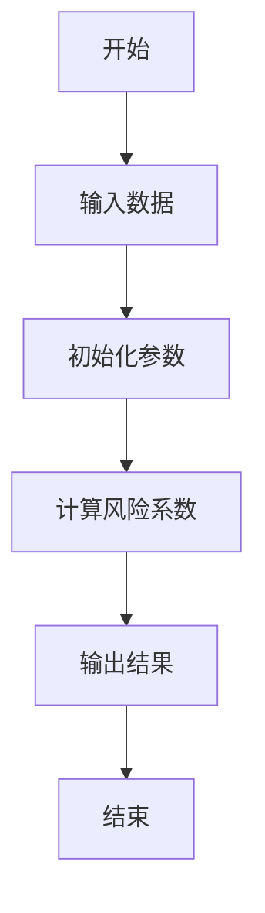

                 


# 霍华德·马克斯的风险评估框架

> 关键词：霍华德·马克斯，风险评估，价值投资，安全边际，资产定价，风险调整

摘要：本文深入探讨了霍华德·马克斯的风险评估框架，详细介绍了其核心概念、算法原理、系统架构及项目实战。通过对安全边际、风险调整和资产定价模型的分析，结合实际案例，展示了如何在投资决策中应用这一框架。文章最后总结了最佳实践和未来研究方向，为读者提供了全面的指导。

---

# 第一部分: 霍华德·马克斯风险评估框架概述

# 第1章: 风险评估的基本概念与框架

## 1.1 风险的定义与特征

风险是指在特定条件下，某一事件可能发生的概率及其可能带来的损失程度。在投资领域，风险通常与收益密切相关，高风险可能意味着高收益，但也可能带来重大损失。霍华德·马克斯的风险评估框架将风险视为投资决策的核心要素之一。

### 风险的特征：
1. **不确定性**：未来事件的可能性和影响程度无法完全预测。
2. **潜在损失**：风险可能导致收益减少或资本损失。
3. **可量化性**：通过数学模型和数据分析，风险可以被量化和评估。

---

## 1.2 霍华德·马克斯框架的背景与起源

霍华德·马克斯是价值投资的倡导者，他的投资理念强调安全边际和长期价值。他认为，市场的波动性和非理性行为使得风险评估在投资决策中至关重要。马克斯框架的核心在于通过分析资产的内在价值和市场价格之间的差异，评估潜在风险并制定相应的投资策略。

### 马克斯框架与其他风险评估方法的对比：
| 对比维度       | 马克斯框架                     | 其他传统方法                 |
|----------------|-------------------------------|-----------------------------|
| 核心理念       | 安全边际与逆境中的机会         | 风险-收益分析               |
| 应用领域       | 投资决策                      | 金融市场、保险等领域         |
| 方法特点       | 强调价值与价格的差异           | 基于统计模型和概率论         |

---

## 1.3 风险评估的边界与外延

### 风险评估的适用范围：
- **股票投资**：评估个股的内在价值与市场价格。
- **资产组合管理**：优化投资组合的风险与收益平衡。
- **企业决策**：评估项目风险和资本预算。

### 风险评估的局限性：
- **假设的简化**：模型假设可能与实际市场情况不符。
- **数据依赖**：结果高度依赖于输入数据的准确性和完整性。
- **黑天鹅事件**：极端风险事件难以预测。

---

# 第2章: 安全边际与风险调整

## 2.1 安全边际的概念与计算

### 安全边际的定义：
安全边际是资产的市场价格与其内在价值之间的差额。当市场价格低于内在价值时，资产被认为具有安全边际，风险较低。

### 安全边际的计算公式：
$$ \text{安全边际} = \text{内在价值} - \text{市场价格} $$

### 安全边际在风险评估中的应用：
- 确定资产的潜在购买价格。
- 识别高风险资产。

---

## 2.2 风险调整的原理与步骤

### 风险调整的基本原理：
通过调整资产的预期收益，反映其潜在风险。风险调整后的收益用于评估资产的真正吸引力。

### 风险调整的具体步骤：
1. **计算资产的内在价值**。
2. **确定市场价格**。
3. **计算安全边际**。
4. **调整预期收益**。

### 风险调整与投资决策的关系：
- 风险调整后的收益帮助投资者做出更理性的投资决策。
- 安全边际高的资产通常被视为更具吸引力。

---

## 2.3 霍华德·马克斯框架中的关键公式

### 资产定价公式：
$$ P = \frac{C}{1 + r} $$
其中，\( C \) 是预期收益，\( r \) 是风险调整后的收益率。

### 风险调整后的价值计算：
$$ V_{\text{adjusted}} = V_{\text{original}} \times (1 - r) $$

---

# 第3章: 风险评估系统的功能设计

## 3.1 系统功能模块划分

### 数据采集模块：
- 收集市场数据（如股价、宏观经济指标）。
- 获取资产基本面数据（如利润表、资产负债表）。

### 风险评估模块：
- 计算资产的内在价值。
- 确定安全边际。
- 输出风险评估结果。

### 结果展示模块：
- 以图表形式展示风险评估结果。
- 提供投资建议。

---

## 3.2 系统架构设计

### 分层架构设计：
- 数据层：存储原始数据。
- 业务逻辑层：处理数据并执行风险评估。
- 表现层：展示结果。

### 模块间交互关系：
- 数据层与业务逻辑层双向交互。
- 业务逻辑层向表现层传递结果。

---

## 3.3 系统流程图



---

# 第4章: 风险评估算法的数学模型

## 4.1 资产定价模型

### 函数定义：
$$ f(x) = \frac{1}{1 + e^{-x}} $$

### 风险调整系数计算：
$$ r = \alpha \times \beta $$

### 综合评估公式：
$$ V = \sum_{i=1}^{n} w_i \times v_i $$

---

## 4.2 算法实现步骤

### 数据预处理：
- 清洗数据。
- 标准化数据。

### 参数初始化：
- 设置初始参数值。

### 风险评估计算：
- 计算内在价值。
- 确定市场价格。
- 计算安全边际。

### 结果输出：
- 展示评估结果。

---

## 4.3 算法流程图



---

# 第5章: 项目实战

## 5.1 环境安装

### 安装Python和相关库：
```bash
pip install numpy pandas matplotlib
```

---

## 5.2 核心实现源代码

```python
import numpy as np
import pandas as pd

def calculate_intrinsic_value(revenue, profit_margin):
    return revenue * profit_margin

def calculate_market_price(intrinsic_value, risk_adjustment):
    return intrinsic_value / (1 + risk_adjustment)

# 示例数据
revenue = 1000000
profit_margin = 0.1
risk_adjustment = 0.05

intrinsic_value = calculate_intrinsic_value(revenue, profit_margin)
market_price = calculate_market_price(intrinsic_value, risk_adjustment)

print(f"内在价值: {intrinsic_value}")
print(f"市场价格: {market_price}")
print(f"安全边际: {intrinsic_value - market_price}")
```

---

## 5.3 实际案例分析

### 案例分析：
假设某公司年收入为100万美元，净利润率为10%，风险调整系数为5%。计算其内在价值和市场价格。

### 结果解读：
- 内在价值：100万美元 × 10% = 100万美元。
- 市场价格：100万美元 / (1 + 0.05) ≈ 95.24万美元。
- 安全边际：100万美元 - 95.24万美元 = 4.76万美元。

---

# 第6章: 最佳实践与总结

## 6.1 最佳实践

1. **定期更新数据**：确保评估结果基于最新数据。
2. **结合定性分析**：风险评估应与市场趋势和公司基本面分析结合。
3. **控制风险敞口**：避免过度集中投资。

---

## 6.2 小结

霍华德·马克斯的风险评估框架通过安全边际和风险调整，帮助投资者在不确定性中做出更明智的决策。本文详细介绍了框架的核心概念、算法实现和实际应用，为读者提供了全面的指导。

---

作者：AI天才研究院/AI Genius Institute & 禅与计算机程序设计艺术 /Zen And The Art of Computer Programming

