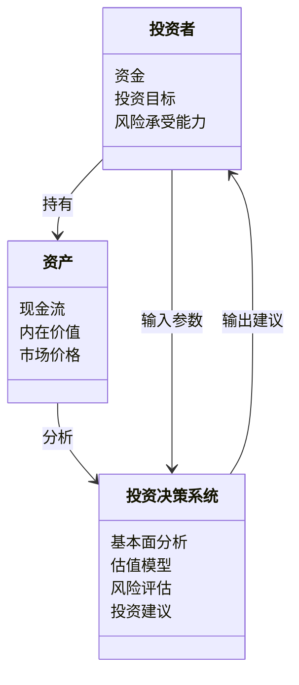
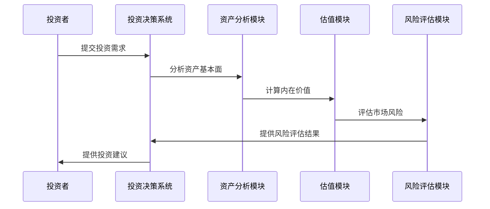

                 


# 霍华德马克斯的投资备忘录启示

## 关键词：
- 霍华德·马克斯
- 投资备忘录
- 价值投资
- 风险管理
- 投资策略

## 摘要：
霍华德·马克斯的投资备忘录是价值投资领域的经典之作，他强调深入分析、长期视角和风险管理。本文将从投资的基本概念、马克斯的哲学背景、备忘录的核心概念、算法原理、系统架构到实际案例分析，全面解读其对投资实践的启示。

---

# 第一部分：投资的基本概念与背景

## 第1章：投资的基本概念与问题背景

### 1.1 投资的基本概念
- **资产与投资的定义**：资产是能够产生未来现金流的经济资源，投资是将资金投入特定资产以获取收益的行为。
- **投资的分类与特点**：投资可分为股票、债券、房地产等多种形式，具有风险性、收益性、流动性等特点。
- **投资的基本问题与挑战**：市场波动、信息不对称、人性的贪婪与恐惧是投资的主要挑战。

### 1.2 霍华德·马克斯的投资哲学
- **价值投资的定义与核心要素**：价值投资强调以低于内在价值的价格买入优质资产，核心要素包括基本面分析、安全边际和长期视角。
- **马克斯投资哲学的演变**：从早期的“价格与价值分离”到后来的“情绪与市场周期”，马克斯不断完善其投资框架。
- **备忘录的核心价值与意义**：备忘录不仅是投资指南，更是对人性弱点的深刻洞察，帮助投资者避免常见错误。

## 第2章：霍华德·马克斯投资备忘录的背景与特点

### 2.1 备忘录的起源与发展
- **创作背景**：20世纪80年代，马克斯开始撰写备忘录，分享他对市场的看法和投资策略。
- **核心目标与受众**：备忘录旨在向机构投资者传递价值投资的理念，强调理性思考和长期视角。
- **传播与影响**：备忘录通过网络广泛传播，成为投资界的重要参考资料。

### 2.2 备忘录的特点与优势
- **独特视角**：马克斯从心理和行为角度分析市场，强调情绪对投资决策的影响。
- **深度与广度**：备忘录涵盖市场分析、估值方法和投资策略，内容丰富且具有前瞻性。
- **实用性和可操作性**：通过具体案例和逻辑推理，备忘录为投资者提供了可操作的指导。

---

# 第二部分：霍华德·马克斯投资备忘录的核心概念与联系

## 第3章：价值投资的核心概念与原理

### 3.1 价值投资的定义与核心要素
- **定义**：价值投资是一种以低于内在价值的价格买入优质资产的投资策略。
- **核心要素**：基本面分析、安全边际、长期视角。
- **内在逻辑**：市场的短期波动为价值投资者提供了以合理价格买入优质资产的机会。

### 3.2 风险管理与投资组合优化
- **风险管理的定义与重要性**：风险管理是控制投资组合损失的策略，是实现长期收益的关键。
- **投资组合优化的原理与方法**：通过分散投资和合理配置资产，降低风险并提高收益。
- **风险与收益的平衡策略**：在追求收益的同时，合理控制风险，避免过度冒险。

## 第4章：霍华德·马克斯备忘录的核心概念与联系

### 4.1 备忘录的核心概念
- **逻辑框架**：马克斯强调情绪、市场周期和基本面分析的结合。
- **核心要素**：安全边际、长期视角和风险管理。
- **内在联系**：备忘录将价值投资的理念与实际操作相结合，形成完整的投资体系。

### 4.2 备忘录与价值投资的关系
- **对价值投资的深化**：马克斯通过备忘录进一步完善了价值投资的理论框架。
- **对风险管理的强化**：强调在投资决策中考虑风险因素，避免过度集中投资。
- **对投资决策的指导作用**：通过案例分析和逻辑推理，帮助投资者做出更明智的决策。

---

# 第三部分：霍华德·马克斯投资备忘录的算法原理与数学模型

## 第5章：霍华德·马克斯备忘录的算法原理

### 5.1 价值评估的数学模型
- **内在价值的计算公式**：  
  $$ \text{内在价值} = \sum_{t=1}^{n} \frac{\text{现金流}_t}{(1 + r)^t} $$
  其中，r是折现率，n是估计的持有期限。

### 5.2 投资决策的算法流程
- **步骤与流程**：  
  1. 确定投资目标和时间 horizon。  
  2. 进行基本面分析，估算内在价值。  
  3. 确定安全边际，即内在价值与市场价格的差额。  
  4. 考虑市场情绪和宏观经济因素，调整投资策略。  
  5. 构建投资组合，分散风险。

### 5.3 投资组合优化的数学模型
- **数学公式**：  
  最优化投资组合问题可以用以下公式表示：  
  $$ \min_w \left( \sigma^2 \right) \quad \text{subject to} \quad w^T \mu = \text{目标收益}, \quad w^T 1 = 1 $$
  其中，w是投资权重向量，σ²是组合的方差，μ是资产收益向量。

## 第6章：霍华德·马克斯备忘录的数学公式与实例分析

### 6.1 内在价值的数学公式
- **现金流折现法**：  
  以某公司为例，假设未来5年的现金流分别为100, 120, 140, 160, 180万元，折现率为10%。  
  内在价值计算如下：  
  $$ V = \frac{100}{1.1} + \frac{120}{1.1^2} + \frac{140}{1.1^3} + \frac{160}{1.1^4} + \frac{180}{1.1^5} $$

### 6.2 投资案例的数学分析
- **案例分析**：假设某股票当前价格为50元，内在价值为60元，安全边际为20%。  
  投资者可以以低于60元的价格买入该股票，以获得安全边际。

---

# 第四部分：系统分析与架构设计

## 第7章：霍华德·马克斯投资备忘录的系统架构

### 7.1 问题场景介绍
- 投资者需要在复杂的市场环境中做出理性的决策，避免情绪干扰。

### 7.2 项目介绍
- 开发一个基于马克斯投资理念的投资决策系统，帮助投资者进行价值评估和风险管理。

### 7.3 系统功能设计（领域模型 Mermaid 类图）


### 7.4 系统架构设计（Mermaid 架构图）


### 7.5 系统接口设计
- 输入接口：投资者输入资金、目标和风险偏好。
- 输出接口：系统输出投资建议和风险评估。

### 7.6 系统交互（Mermaid 序列图）


---

# 第五部分：项目实战

## 第8章：环境安装与核心实现

### 8.1 环境安装
- 安装Python、Pandas、NumPy等工具。
- 安装Jupyter Notebook用于数据分析和建模。

### 8.2 核心实现（Python代码）
```python
import pandas as pd
import numpy as np

def calculate_intrinsic_value(cash_flows, discount_rate):
    return sum(cash_flow / (1 + discount_rate)**t for t, cash_flow in enumerate(cash_flows))

# 示例数据
cash_flows = [100, 120, 140, 160, 180]
discount_rate = 0.1

iv = calculate_intrinsic_value(cash_flows, discount_rate)
print(f"内在价值：{iv:.2f}")
```

### 8.3 代码应用解读
- 代码实现现金流折现法，计算资产的内在价值。
- 输入现金流和折现率，输出计算结果。

## 第9章：案例分析与项目小结

### 9.1 案例分析
- 分析某公司的现金流和市场环境，计算其内在价值和安全边际。
- 结合市场情绪，提出投资建议。

### 9.2 项目小结
- 通过实际案例，验证备忘录理念的可行性。
- 总结投资实践中的关键点，如安全边际和风险管理。

---

# 第六部分：总结与展望

## 第10章：总结与最佳实践

### 10.1 最佳实践 tips
- **保持理性**：避免情绪化决策，坚持价值投资理念。
- **长期视角**：关注企业的内在价值，耐心持有优质资产。
- **风险管理**：合理分散投资，控制整体风险。

### 10.2 小结
霍华德·马克斯的投资备忘录不仅提供了深刻的投资理念，还为投资者提供了实际的操作指南。通过系统化的方法和风险管理，投资者可以在复杂多变的市场中实现稳健收益。

### 10.3 注意事项
- **持续学习**：市场环境不断变化，投资者需要不断更新知识和策略。
- **谨慎决策**：在实际操作中，结合市场环境和个人情况，灵活调整投资策略。

### 10.4 拓展阅读
- 马克斯的其他著作，如《投资最重要的事情》。
- 其他价值投资经典书籍，如巴菲特的《聪明的投资者》。

---

# 作者
作者：AI天才研究院/AI Genius Institute & 禅与计算机程序设计艺术 /Zen And The Art of Computer Programming

