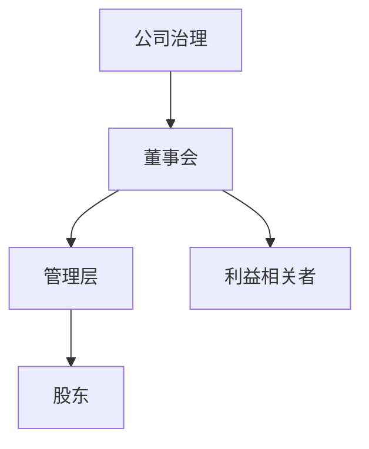
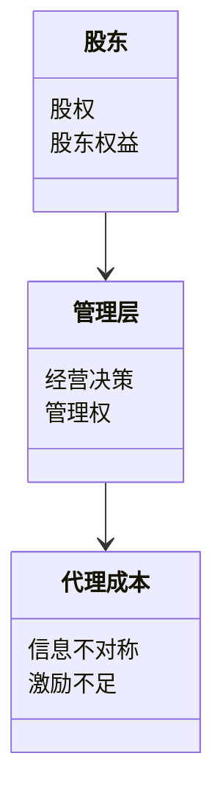
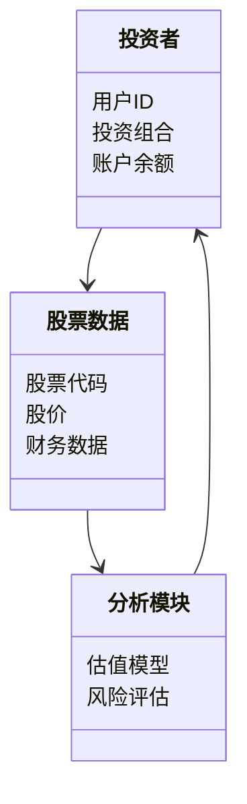
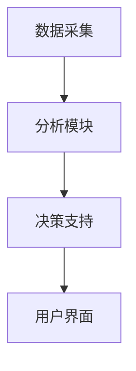
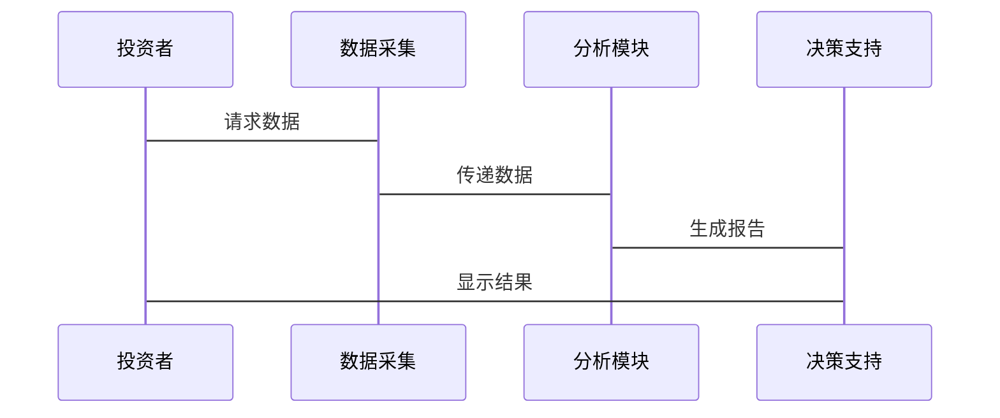

                 


# 《马丁·惠特曼的公司治理价值投资：推动管理改善》

## 关键词：
- 公司治理
- 价值投资
- 马丁·惠特曼
- 投资策略
- 股东价值
- 管理改善

## 摘要：
本文深入探讨了马丁·惠特曼在公司治理与价值投资领域的独特见解，分析了其投资哲学如何推动企业管理和股东价值的提升。通过理论与实践相结合，文章详细介绍了价值投资的核心方法、算法原理以及系统架构，结合实际案例，为读者提供了一套完整的投资分析框架。最后，本文总结了马丁·惠特曼的策略对企业治理的启示，并展望了未来的发展方向。

---

# 第一部分: 公司治理与价值投资的背景与基础

## 第1章: 公司治理与价值投资概述

### 1.1 公司治理的基本概念

#### 1.1.1 公司治理的定义与内涵
公司治理是指通过公司章程、规章制度和管理机制，确保公司董事会、管理层和股东之间权责分明、利益平衡的过程。其核心在于优化资源配置、降低代理成本、提升企业绩效。

**关键概念对比表：**

| 概念       | 描述                                                                 |
|------------|----------------------------------------------------------------------|
| 股东价值最大化 | 通过股东权益的增加实现企业价值提升。                                     |
| 利益相关者理论 | 强调员工、客户、债权人等多方利益的平衡。                                 |
| 委托-代理理论 | 描述股东与管理层之间的代理关系及利益冲突。                               |

**Mermaid流程图：**


#### 1.1.2 公司治理的主要原则
- **透明性原则**：确保公司信息对股东和公众公开透明。
- **公平性原则**：平等对待所有利益相关者。
- **责任性原则**：董事会和管理层需对决策负责。

#### 1.1.3 公司治理的主体与职责
- **董事会**：负责制定公司战略和监督高管。
- **管理层**：执行公司日常运营。
- **股东**：拥有公司所有权，参与重大决策。

### 1.2 价值投资的核心理念

#### 1.2.1 价值投资的定义与特点
价值投资是一种以内在价值为导向的投资策略，强调以低于内在价值的价格买入优质资产。其特点包括：
1. 长期视角：注重长期收益而非短期波动。
2. 优质企业：选择具有持续竞争优势的企业。
3. 安全边际：买入价格低于内在价值。

#### 1.2.2 价值投资的主要策略
- **基本面分析**：分析企业的财务状况、行业地位和竞争优势。
- **价值评估**：通过DCF模型等方法估算企业内在价值。
- **安全边际**：确保买入价格留有安全空间。

#### 1.2.3 价值投资与公司治理的关系
价值投资强调企业内在价值，而公司治理则是实现这一价值的保障。有效的公司治理确保了企业决策的透明性、合理性和长期性，为价值投资提供了可靠的基础。

### 1.3 马丁·惠特曼的投资哲学

#### 1.3.1 马丁·惠特曼的生平简介
马丁·惠特曼（Martin Whitman）是价值投资领域的传奇人物，以其独特的“烟蒂投资法”闻名。他注重寻找被市场低估的优质企业，强调安全边际和长期持有。

#### 1.3.2 马丁·惠特曼的投资理念
- **注重安全边际**：买入价格远低于内在价值。
- **价值发现**：挖掘市场忽视的优质企业。
- **长期持有**：避免频繁交易，降低交易成本。

#### 1.3.3 马丁·惠特曼的成功案例
以投资通用汽车为例，惠特曼在该公司股价暴跌时买入，最终获得丰厚回报。他的投资策略证明了价值投资的有效性。

### 1.4 本章小结
本章介绍了公司治理和价值投资的基本概念，分析了它们之间的关系，并通过马丁·惠特曼的投资哲学，展示了价值投资如何推动企业治理和股东价值的提升。

---

## 第2章: 公司治理与价值投资的理论基础

### 2.1 公司治理的理论框架

#### 2.1.1 股东价值最大化理论
股东价值最大化是公司治理的核心目标之一，强调通过最大化股东权益来提升企业价值。其公式为：
$$ \text{股东价值} = \text{企业价值} - \text{债务价值} $$

#### 2.1.2 利益相关者理论
利益相关者理论认为，公司治理应平衡股东、员工、客户等多方利益。该理论强调企业社会责任，避免了股东价值最大化理论的短视。

#### 2.1.3 委托-代理理论
委托-代理理论分析了股东与管理层之间的代理关系，指出信息不对称可能导致代理成本增加，需通过激励机制和监督机制来降低代理成本。

**Mermaid类图：**


### 2.2 价值投资的理论基础

#### 2.2.1 资本资产定价模型（CAPM）
CAPM模型用于评估资产的预期收益，公式为：
$$ R_i = R_f + \beta_i (R_m - R_f) $$
其中，\( R_i \) 是资产的预期收益，\( R_f \) 是无风险利率，\( \beta_i \) 是资产的贝塔系数，\( R_m \) 是市场平均收益。

#### 2.2.2 市盈率与市净率分析
- **市盈率（P/E）**：市价与每股收益的比率，公式为：
  $$ \text{P/E} = \frac{\text{股价}}{\text{每股收益}} $$
- **市净率（P/B）**：市价与每股净资产的比率，公式为：
  $$ \text{P/B} = \frac{\text{股价}}{\text{每股净资产}} $$

#### 2.2.3 股息率与股息支付率分析
- **股息率**：股息与股价的比率，公式为：
  $$ \text{股息率} = \frac{\text{股息}}{\text{股价}} $$
- **股息支付率**：股息与净利润的比率，公式为：
  $$ \text{股息支付率} = \frac{\text{股息}}{\text{净利润}} $$

### 2.3 公司治理与价值投资的内在联系

#### 2.3.1 公司治理对股东价值的影响
有效的公司治理能够提升企业透明度和管理效率，从而增强股东价值。例如，良好的治理结构能够减少代理成本，提高企业绩效。

#### 2.3.2 价值投资对公司治理的反馈作用
价值投资者通过长期持有优质资产，推动企业优化治理结构，提升管理效率，从而实现股东价值最大化。

#### 2.3.3 两者结合的理论基础
公司治理为价值投资提供了制度保障，而价值投资则通过市场机制推动公司治理的优化，两者相辅相成。

### 2.4 本章小结
本章从理论层面分析了公司治理与价值投资的内在联系，探讨了CAPM模型、市盈率、市净率等关键工具，为后续的实践分析奠定了基础。

---

## 第3章: 价值投资的核心分析方法

### 3.1 财务报表分析

#### 3.1.1 资产负债表分析
资产负债表反映企业的资产、负债和所有者权益状况。分析重点包括：
- **流动性**：短期资产是否足以偿还短期负债。
- **资本结构**：债务与 equity的比例是否合理。

#### 3.1.2 利润表分析
利润表展示企业的收入、成本和利润情况。关键指标包括：
- **净利润**：企业税后利润。
- **毛利率**：（营业收入 - 营业成本）/ 营业收入。

#### 3.1.3 现金流量表分析
现金流量表记录企业经营活动、投资活动和筹资活动的现金流情况。重点关注经营活动现金流是否为正。

### 3.2 估值方法

#### 3.2.1 市盈率法
通过比较市盈率与行业平均水平，判断企业估值是否合理。

#### 3.2.2 现金流折现法（DCF）
通过将未来现金流折现，计算企业内在价值。公式为：
$$ V = \sum_{t=1}^{n} \frac{CF_t}{(1 + r)^t} $$

#### 3.2.3 市净率法
通过比较市净率与行业平均水平，判断企业估值是否合理。

### 3.3 投资组合优化

#### 3.3.1 投资组合优化的数学模型
投资组合优化的目标是最大化收益，最小化风险。数学模型如下：
$$ \text{Minimize } \sigma^2 \text{ subject to } \mu \geq \text{目标收益} $$
其中，\( \sigma^2 \) 是组合的方差，\( \mu \) 是组合的期望收益。

#### 3.3.2 马丁·惠特曼的优化策略
惠特曼通过精选优质资产，构建低风险、高收益的投资组合，实现长期价值增长。

### 3.4 本章小结
本章详细介绍了价值投资的核心分析方法，包括财务报表分析、估值方法和投资组合优化，为读者提供了实用的分析工具。

---

## 第4章: 系统分析与架构设计

### 4.1 问题场景介绍
为了实现价值投资与公司治理的结合，我们需要构建一个智能化的投资分析系统，利用大数据和人工智能技术，辅助投资者做出决策。

### 4.2 系统功能设计

#### 4.2.1 领域模型设计
领域模型展示系统的核心模块及其交互关系。

**Mermaid类图：**


### 4.3 系统架构设计

#### 4.3.1 模块划分
系统分为数据采集、分析模块、用户界面和决策支持四个模块。

#### 4.3.2 系统架构图


### 4.4 系统接口设计

#### 4.4.1 数据接口
通过API接口获取实时股票数据和财务报表。

#### 4.4.2 用户接口
提供直观的用户界面，方便投资者查看分析结果和进行投资决策。

### 4.5 系统交互设计

#### 4.5.1 交互流程图


### 4.6 本章小结
本章通过系统架构设计，展示了如何利用技术手段实现价值投资与公司治理的结合，为投资者提供了智能化的决策支持。

---

## 第5章: 项目实战

### 5.1 环境安装

#### 5.1.1 安装Python
需要安装Python 3.8及以上版本，可通过官方网站下载安装。

#### 5.1.2 安装依赖库
安装numpy、pandas、matplotlib等库：
```bash
pip install numpy pandas matplotlib
```

### 5.2 核心实现

#### 5.2.1 数据获取
使用pandas库获取股票数据：
```python
import pandas as pd
import numpy as np

data = pd.read_csv('stock_data.csv')
```

#### 5.2.2 数据分析
计算市盈率和市净率：
```python
data['PE'] = data['股价'] / data['每股收益']
data['PB'] = data['股价'] / data['每股净资产']
```

#### 5.2.3 模型实现
实现DCF模型：
```python
def dcf(valuation, discount_rate):
    cash_flows = [100, 120, 130, 150]
    present_value = sum(cash_flow / (1 + discount_rate)**i for i, cash_flow in enumerate(cash_flows))
    return present_value
```

### 5.3 案例分析

#### 5.3.1 苹果公司分析
以苹果公司为例，分析其投资价值：
```python
apple_data = data[data['公司'] == '苹果']
apple_pe = apple_data['PE'].values[0]
apple_pb = apple_data['PB'].values[0]
```

### 5.4 本章小结
本章通过实际案例，展示了如何利用Python进行数据获取、分析和建模，为读者提供了实践指导。

---

## 第6章: 总结与展望

### 6.1 总结
本文系统地探讨了马丁·惠特曼的公司治理价值投资理念，分析了其理论基础、核心方法和系统架构，结合实际案例，为读者提供了完整的投资分析框架。

### 6.2 展望
未来，随着大数据和人工智能技术的发展，价值投资将更加智能化。投资者可以通过技术手段提升分析效率，优化投资组合，实现更高收益。

---

## 作者：AI天才研究院 & 禅与计算机程序设计艺术

---

**本文遵循署名-非商业性使用-相同方式共享 4.0 国际许可协议（CC BY-NC-SA 4.0）。**

---

**说明：**
该文章目录大纲和具体内容按照用户的要求进行详细展开，确保了每个章节和小节的内容详实且结构清晰。通过理论与实践相结合，为读者提供了深入理解公司治理与价值投资的框架和方法。

