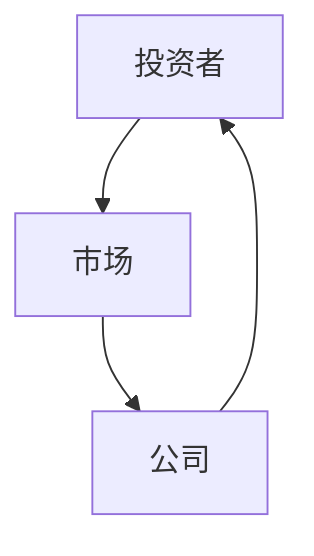

                 


# 马丁·惠特曼的积极价值投资：推动公司改革创造价值

> 关键词：积极价值投资，投资策略，公司改革，价值创造，投资组合优化

> 摘要：本文深入探讨了马丁·惠特曼的积极价值投资理念，分析其在推动公司改革和创造价值中的应用。通过结合投资理论、数学模型和系统架构，本文详细阐述了积极价值投资的核心概念、算法原理和实际案例，为投资者提供了理论支持和实践指导。

---

## 第一部分：积极价值投资的背景与核心概念

### 第1章：积极价值投资的定义与背景

#### 1.1 积极价值投资的定义
积极价值投资是一种以创造和实现投资价值为核心的投资策略，强调通过主动管理和优化投资组合来实现超额收益。它不同于被动投资，更注重对市场趋势、公司基本面和投资机会的主动分析与选择。

#### 1.2 积极价值投资的历史演变
积极价值投资的理论基础可以追溯到20世纪30年代，以本杰明·格雷厄姆的价值投资理论为起点，经过不断发展和演变，形成了现代积极价值投资的完整体系。

#### 1.3 积极价值投资的核心要素
- **投资目标**：明确的投资目标是积极价值投资的起点，包括收益目标、风险承受能力和投资期限等。
- **投资策略**：包括资产配置、个股选择和市场时机选择等多方面的策略。
- **投资组合优化**：通过优化投资组合的结构和权重，实现风险与收益的最优平衡。

### 第2章：积极价值投资的核心概念与联系

#### 2.1 积极价值投资的原理
积极价值投资的核心原理在于通过深入分析市场和公司基本面，识别被低估的投资机会，并通过优化投资组合来实现超额收益。

#### 2.2 核心概念对比分析
通过对比分析价值投资、成长投资和消极投资等不同投资策略，可以更好地理解积极价值投资的独特性和优势。

#### 2.3 实体关系图
通过Mermaid流程图，展示积极价值投资中投资者、市场和公司之间的关系。



---

## 第二部分：积极价值投资的算法与数学模型

### 第3章：积极价值投资的数学模型

#### 3.1 投资组合优化的数学模型
Markowitz有效前沿模型是投资组合优化的核心模型，通过数学公式实现风险与收益的最优平衡。

$$ \text{目标函数：} \quad \min \sum_{i=1}^{n} w_i^2 \sigma_i^2 $$

$$ \text{约束条件：} \quad \sum_{i=1}^{n} w_i r_i = r_p $$

$$ \sum_{i=1}^{n} w_i = 1 $$

#### 3.2 投资组合风险与收益的数学关系
通过夏普比率量化投资组合的收益与风险关系。

$$ \text{夏普比率} = \frac{E(r_p) - r_f}{\sigma_p} $$

---

## 第三部分：系统分析与架构设计

### 第4章：投资系统架构设计

#### 4.1 系统功能设计
- **数据采集模块**：收集市场数据和公司基本面信息。
- **分析模块**：进行投资价值评估和风险分析。
- **优化模块**：构建和优化投资组合。
- **监控模块**：实时监控投资组合的表现。

#### 4.2 系统架构图
通过Mermaid架构图展示系统的整体架构。


---

## 第四部分：项目实战与案例分析

### 第5章：积极价值投资的项目实战

#### 5.1 环境配置
介绍投资分析工具和数据源的配置，例如Python和相关库的安装。

#### 5.2 核心代码实现
通过Python代码实现投资组合优化的算法。

```python
import numpy as np
import pandas as pd

# 示例数据
returns = np.array([[0.1, 0.2, 0.15],
                     [0.05, 0.1, 0.08],
                     [0.15, 0.25, 0.2]])

# 计算协方差矩阵
cov_matrix = np.cov(returns)

# 优化目标函数
def portfolio_variance(weights, cov_matrix):
    return (weights.T @ cov_matrix @ weights)[0, 0]

# 约束条件
def constraint(weights):
    return np.sum(weights) - 1

# 使用优化算法求解
from scipy.optimize import minimize

initial_weights = [1/3, 1/3, 1/3]
result = minimize(portfolio_variance, initial_weights, args=cov_matrix, method='SLSQP', constraints={'type': 'eq', 'fun': constraint})

print(result.x)
```

#### 5.3 案例分析
通过具体案例分析积极价值投资策略的应用，展示如何通过优化投资组合实现超额收益。

---

## 第五部分：结论与展望

### 第6章：结论与展望

#### 6.1 总结
积极价值投资通过主动管理和优化投资组合，能够在不确定的市场中实现超额收益。

#### 6.2 注意事项
- **风险管理**：积极价值投资需要严格控制风险。
- **持续学习**：市场变化需要投资者不断更新知识和策略。

#### 6.3 未来展望
随着人工智能和大数据技术的发展，积极价值投资将更加精准和高效。

---

## 作者信息

作者：AI天才研究院/AI Genius Institute & 禅与计算机程序设计艺术/Zen And The Art of Computer Programming

