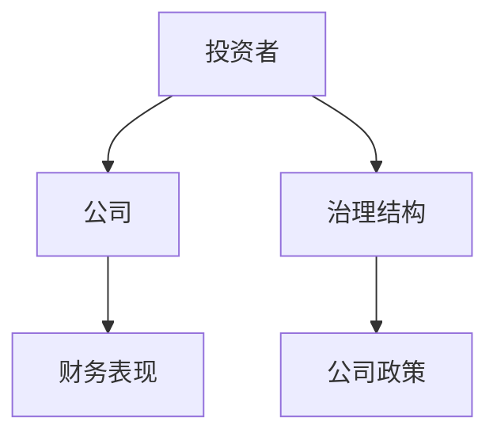
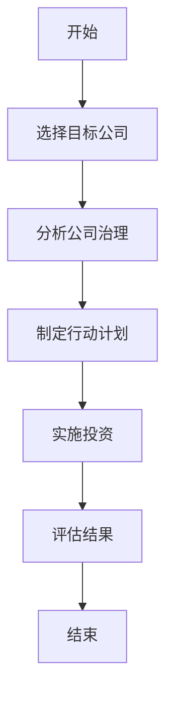
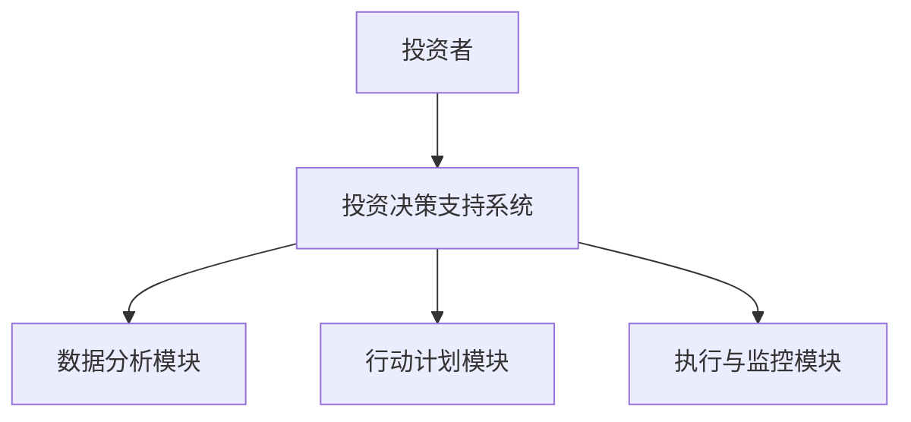

                 


# 马丁·惠特曼的行动主义价值投资：推动公司变革

> 关键词：行动主义价值投资，公司治理，投资者权益，投资策略，企业变革，投资决策

> 摘要：本文探讨了行动主义价值投资的理论基础、算法原理、系统架构以及实际案例，分析了马丁·惠特曼如何通过积极介入公司治理推动变革，为投资者提供深度的理论与实践指导。

---

## 第一部分：引言

### 第1章：行动主义价值投资的背景与概念

#### 1.1 行动主义价值投资的定义
- 投资者的角色转变
- 行动主义与传统投资的区别
- 行动主义投资的核心目标

#### 1.2 行动主义价值投资的兴起
- 全球经济环境的变化
- 社会责任投资的兴起
- 技术进步对投资的影响

---

## 第二部分：理论基础

### 第2章：行动主义价值投资的背景介绍

#### 2.1 问题背景
- 当前企业治理中的问题
- 投资者与管理层的利益冲突
- 社会责任与企业价值的关系

#### 2.2 问题描述
- 行动主义投资的目标
- 投资者如何推动公司变革
- 行动主义投资的边界与外延

#### 2.3 问题解决
- 行动主义投资的核心要素
- 投资者如何选择目标公司
- 行动主义投资的实施步骤

### 第3章：行动主义价值投资的核心概念与联系

#### 3.1 核心概念原理
- 投资者的权利与义务
- 行动主义投资的策略与方法
- 投资者如何影响公司治理

#### 3.2 核心概念属性特征对比
- 行动主义投资与被动投资的对比
- 不同类型投资者的策略差异
- 行动主义投资的长期与短期效果

#### 3.3 ER实体关系图


---

## 第三部分：算法与方法论

### 第4章：行动主义价值投资的算法原理

#### 4.1 算法原理概述
- 投资组合优化的数学模型
- 行动主义投资的决策树
- 投资者如何评估公司变革的潜力

#### 4.2 算法流程图


#### 4.3 Python源代码实现
```python
def investment_strategy(company_data):
    # 输入：
    # company_data: 包含公司治理、财务表现等信息的数据结构
    # 输出：
    # 推荐的投资策略和行动计划
    pass
```

---

## 第四部分：系统架构与实施

### 第5章：行动主义价值投资的系统架构

#### 5.1 问题场景介绍
- 投资者如何通过系统支持进行决策
- 系统功能需求
- 系统架构设计

#### 5.2 系统功能设计
- 领域模型mermaid类图


#### 5.3 系统架构设计


---

## 第五部分：项目实战

### 第6章：行动主义价值投资的项目实战

#### 6.1 环境安装
- 安装必要的数据分析库（如Pandas、NumPy）
- 安装可视化工具（如Matplotlib、Seaborn）

#### 6.2 核心代码实现
```python
import pandas as pd
import numpy as np

def evaluate_company(data):
    # 数据分析和评估函数
    return pd.DataFrame(data)
```

#### 6.3 代码应用解读与分析
- 代码功能解读
- 数据分析结果展示
- 实际案例分析

---

## 第六部分：案例分析

### 第7章：行动主义价值投资的案例分析

#### 7.1 成功案例分析
- 案例背景
- 投资策略
- 实施过程
- 结果分析

#### 7.2 失败案例分析
- 案例背景
- 投资策略
- 实施过程
- 结果分析

#### 7.3 经验总结
- 成功因素
- 失败教训
- 改进建议

---

## 第七部分：结论与展望

### 第8章：结论与展望

#### 8.1 全文总结
- 核心观点回顾
- 主要结论
- 实际应用价值

#### 8.2 未来展望
- 技术进步对行动主义投资的影响
- 未来研究方向
- 投资趋势预测

---

## 作者：AI天才研究院/AI Genius Institute & 禅与计算机程序设计艺术 /Zen And The Art of Computer Programming

---

通过以上目录大纲，我们可以看到，文章从理论到实践，系统地介绍了马丁·惠特曼的行动主义价值投资，分析了其在推动公司变革中的作用，并通过实际案例和系统架构设计提供了深度的指导和参考。

