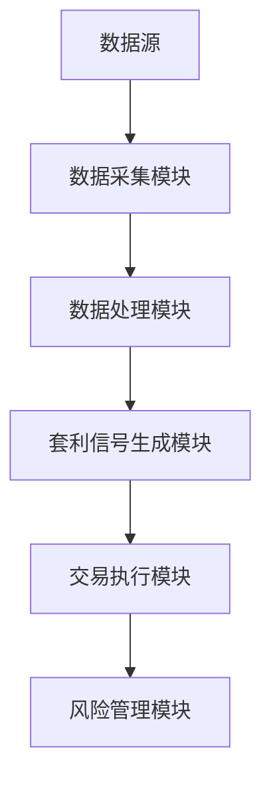

                 

# 马丁·惠特曼的资产负债表套利方法

> 关键词：资产负债表套利、马丁·惠特曼、套利策略、金融市场、金融建模、风险控制  
> 摘要：本文深入探讨了马丁·惠特曼的资产负债表套利方法，分析了其理论基础、数学模型、算法实现和实际应用场景。通过详细讲解套利的核心原理、风险控制策略以及系统架构设计，本文为读者提供了全面的视角，帮助他们在金融市场中有效应用资产负债表套利策略。

---

## 第一部分：资产负债表套利的背景与基础

### 第1章：套利的基本概念与马丁·惠特曼的贡献

#### 1.1 套利的定义与核心思想
套利是一种利用资产价格差异进行无风险或低风险投资的行为。其核心思想在于通过同时买入低估资产和卖出高估资产，从中获取无风险收益。套利不仅存在于传统金融市场，还广泛应用于外汇、股票、债券和衍生品市场。

#### 1.2 马丁·惠特曼的背景与贡献
马丁·惠特曼（Martin Whitman）是美国著名的价值投资者和套利专家，以其在困境投资和套利领域的卓越成就闻名。他的套利方法基于对资产负债表的深入分析，结合市场定价偏差，寻找套利机会。

#### 1.3 资产负债表套利的定义与特点
- **定义**：资产负债表套利是指通过分析公司资产负债表中的资产和负债价值差异，利用市场定价偏差进行套利交易。
- **特点**：
  - 基于财务报表分析。
  - 利用市场定价偏差。
  - 需要较高的市场流动性支持。

#### 1.4 与传统套利的对比
- **传统套利**：基于价格差异，通常在相近资产之间进行套利。
- **资产负债表套利**：基于资产负债表中的资产和负债价值差异，具有更强的市场适用性和策略深度。

---

## 第二部分：资产负债表套利的核心原理

### 第2章：资产负债表套利的理论基础

#### 2.1 套利的理论框架
套利的理论基础包括无套利定价定理和资本资产定价模型（CAPM）。无套利定价定理指出，如果存在套利机会，市场将自动消除这种机会。

#### 2.2 资产负债表套利的数学模型
$$ \text{套利机会识别公式} = \frac{\text{资产公允价值}}{\text{负债账面价值}} $$

---

## 第三部分：资产负债表套利的类型与应用场景

### 第3章：套利的类型与应用场景

#### 3.1 套利的主要类型
- **跨市场套利**：利用不同市场之间的价格差异进行套利。
- **跨期套利**：利用同一资产在不同时间点的价格差异进行套利。
- **套利定价**：基于资产定价模型进行套利。

#### 3.2 资产负债表套利的应用场景
- **外汇市场**：利用汇率差异进行套利。
- **股票市场**：基于资产负债表分析进行套利。
- **债券市场**：利用债券价格与面值的差异进行套利。

---

## 第四部分：资产负债表套利的算法实现

### 第4章：套利算法的实现步骤

#### 4.1 数据获取与预处理
- 数据来源：金融市场数据 API（如Yahoo Finance、Quandl）。
- 数据清洗：处理缺失值和异常值。

#### 4.2 套利信号生成
- 使用机器学习算法（如随机森林、支持向量机）对数据进行分类，识别套利机会。

#### 4.3 交易执行与风险管理
- 自动化交易系统：基于套利信号生成订单，执行交易。
- 风险管理：设置止损和止盈点，控制风险敞口。

---

## 第五部分：资产负债表套利的风险控制与优化

### 第5章：风险控制策略

#### 5.1 市场风险
- 分散投资：通过多样化降低市场风险。
- 风险对冲：使用衍生品对冲价格波动风险。

#### 5.2 操作风险
- 内部控制：建立严格的交易和结算流程。
- 系统监控：实时监控交易系统，防止技术故障。

---

## 第六部分：系统架构与项目实战

### 第6章：系统架构设计

#### 6.1 系统功能设计
- 数据采集模块：获取市场数据。
- 套利信号生成模块：基于算法生成套利信号。
- 交易执行模块：执行交易指令。
- 风险管理模块：实时监控和调整交易策略。

#### 6.2 系统架构图

#### 6.3 项目实战
- 选择外汇市场作为案例，设计一个套利系统。
- 实现数据采集、信号生成、交易执行和风险管理模块。
- 通过回测验证系统的有效性和稳定性。

---

## 第七部分：总结与展望

### 第7章：总结与展望

#### 7.1 本章总结
资产负债表套利是一种基于财务报表分析的套利方法，通过识别市场定价偏差，利用资产和负债价值差异进行套利交易。马丁·惠特曼的套利方法为投资者提供了重要的策略参考。

#### 7.2 未来展望
随着人工智能和大数据技术的发展，资产负债表套利将更加智能化和自动化。未来的研究方向包括算法优化、风险管理模型改进以及多市场套利策略的开发。

---

## 附录

### 附录A：术语表
- 套利：利用价格差异进行无风险投资。
- 资产负债表套利：基于资产负债表分析的套利方法。

### 附录B：工具推荐
- 数据分析工具：Python、R。
- 交易系统：Interactive Brokers、MetaTrader。

### 附录C：数据源
- 股票数据：Yahoo Finance。
- 债券数据：Quandl。

### 附录D：参考文献
- 马丁·惠特曼的著作。
- 相关金融建模文献。

---

## 作者信息

作者：AI天才研究院 & 禅与计算机程序设计艺术

---

以上是文章的详细结构和内容，涵盖了从基础理论到实际应用的各个方面，确保读者能够系统地理解和掌握资产负债表套利的方法和策略。

