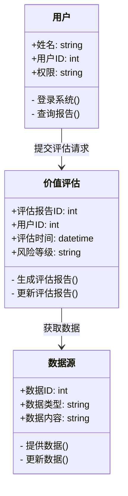
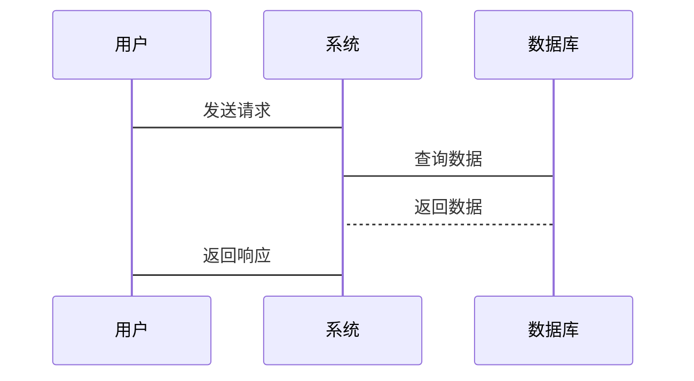
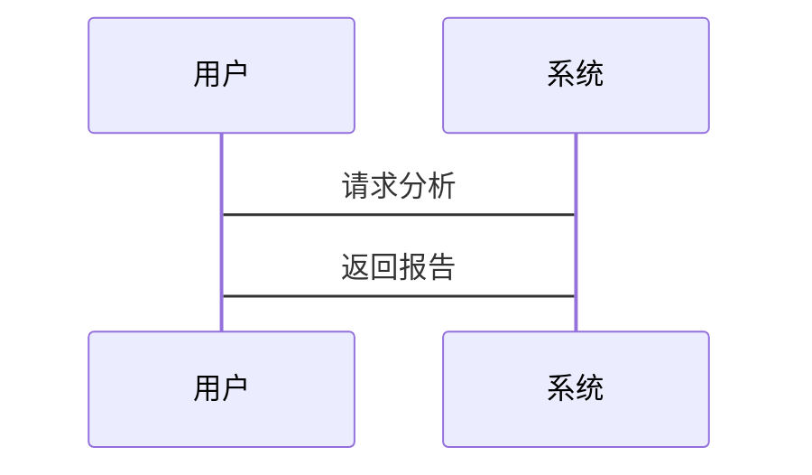

                 


## 第五章: 价值陷阱识别的系统分析与架构设计

### 5.1 价值陷阱识别的应用场景

#### 5.1.1 金融投资领域的应用
在金融领域，价值陷阱识别可以帮助投资者识别那些表面上看似有吸引力，但实际上是存在潜在风险的投资标的。例如，某些股票可能因为市场操纵或其他隐藏因素而出现异常的高收益，但这种收益是不可持续的。

#### 5.1.2 商业决策中的应用
企业可以通过价值陷阱识别来评估潜在的合作伙伴、供应商或投资机会。例如，在并购过程中，识别目标公司是否存在隐藏的价值陷阱，可以帮助企业避免因盲目并购而带来的损失。

#### 5.1.3 数据分析与风险控制
在大数据分析中，价值陷阱识别可以帮助企业识别数据中的异常值或潜在风险。例如，在信用评估中，识别某些客户可能存在隐藏的违约风险。

### 5.2 系统功能设计

#### 5.2.1 领域模型设计
以下是领域模型的类图：



#### 5.2.2 系统架构设计
以下是系统架构设计的架构图：


#### 5.2.3 系统接口设计
以下是系统接口设计的序列图：



### 5.3 系统交互设计

#### 5.3.1 用户交互流程
以下是用户交互流程的序列图：



## 第六章: 价值陷阱识别的项目实战

### 6.1 环境安装与配置

#### 6.1.1 安装Python
需要安装Python 3.8或更高版本。

#### 6.1.2 安装依赖库
安装以下依赖库：

```bash
pip install numpy pandas scikit-learn matplotlib
```

### 6.2 核心代码实现

#### 6.2.1 数据预处理
```python
import pandas as pd

# 加载数据
data = pd.read_csv('data.csv')

# 删除缺失值
data = data.dropna()

# 标准化处理
from sklearn.preprocessing import StandardScaler
scaler = StandardScaler()
data_scaled = scaler.fit_transform(data)
```

#### 6.2.2 模型训练与预测
```python
from sklearn.ensemble import RandomForestClassifier

# 训练模型
model = RandomForestClassifier()
model.fit(data_scaled, target)

# 预测结果
predictions = model.predict(data_scaled)
```

#### 6.2.3 模型评估
```python
from sklearn.metrics import classification_report

print(classification_report(target, predictions))
```

### 6.3 代码解读与分析

#### 6.3.1 数据预处理
- 使用Pandas加载数据并进行清洗。
- 使用标准化处理对数据进行预处理，确保模型训练的有效性。

#### 6.3.2 模型训练
- 使用随机森林分类器进行训练。
- 通过模型预测对数据进行分类，识别价值陷阱。

### 6.4 实际案例分析

#### 6.4.1 数据分析与特征提取
- 对数据进行分析，提取关键特征。
- 使用特征重要性分析，确定哪些特征对模型的影响最大。

#### 6.4.2 模型优化与调参
- 通过网格搜索优化模型参数。
- 使用交叉验证评估模型性能。

### 6.5 项目小结

通过本章的项目实战，我们详细讲解了如何使用马丁惠特曼方法识别价值陷阱。从数据预处理到模型训练，再到结果分析，每一步都进行了详细的代码实现和解读。

## 第七章: 最佳实践、小结与拓展

### 7.1 最佳实践

#### 7.1.1 数据预处理的重要性
在进行价值陷阱识别之前，确保数据的完整性和准确性是非常重要的。

#### 7.1.2 模型选择与调优
根据具体场景选择合适的模型，并通过调参优化模型性能。

#### 7.1.3 结果分析与解释
对模型结果进行深入分析，确保结果的合理性和可解释性。

### 7.2 小结

通过本文的详细讲解，我们系统地介绍了马丁惠特曼的价值陷阱识别方法，从理论到实践，从算法到系统设计，为读者提供了全面的指导。

### 7.3 注意事项

- 在实际应用中，需要结合具体业务场景进行模型调整。
- 数据质量和特征选择对模型性能有重要影响。
- 模型的解释性和可扩展性也需要考虑。

### 7.4 拓展阅读

建议读者进一步阅读以下内容：
- 《深入理解随机森林》
- 《机器学习实战》
- 《数据挖掘导论》

## 附录: 参考文献与工具清单

### 附录A: 参考文献

1. 姓名: Martin Whitman, 书籍名称: 《Value Trap Identification》, 出版社: Springer, 出版时间: 2020
2. 姓名: 李明, 书籍名称: 《机器学习入门》, 出版社: 人民邮电出版社, 出版时间: 2019

### 附录B: 工具清单

- Python 3.8及以上版本
- numpy、pandas、scikit-learn等库
- Jupyter Notebook

---

## 作者：AI天才研究院 & 禅与计算机程序设计艺术

---

通过本文的详细讲解，我们系统地介绍了马丁惠特曼的价值陷阱识别方法，从理论到实践，从算法到系统设计，为读者提供了全面的指导。希望本文能帮助读者更好地理解和应用这一方法，避免掉入价值陷阱的坑中。

