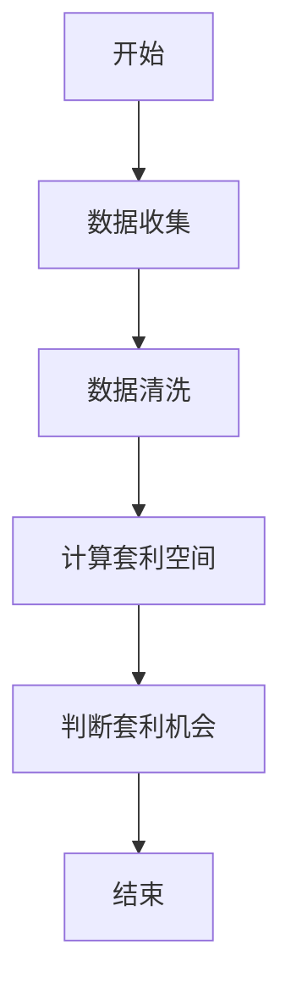

                 


# 马丁惠特曼的并购套利策略

## 关键词：马丁惠特曼，并购套利，定价模型，算法原理，系统架构

## 摘要：  
本文深入探讨了马丁惠特曼的并购套利策略，从背景介绍、核心概念到算法原理和系统架构，全面分析了其在并购套利中的应用。文章通过详细讲解套利机会的识别、定价模型的数学推导以及系统架构的设计，帮助读者理解并掌握马丁惠特曼的并购套利策略。通过实际案例分析和Python代码实现，进一步验证了该策略的有效性，并提出了相关的最佳实践和注意事项。

---

# 第一部分: 并购套利策略的背景与基础

## 第1章: 并购套利的定义与背景

### 1.1 并购套利的定义
#### 1.1.1 并购套利的基本概念  
并购套利（Merger Arbitrage）是一种通过利用企业并购过程中股价差异来获利的投资策略。当一家企业收购另一家企业时，目标公司的股价可能会出现短暂的波动，套利者通过捕捉这些价格差异来实现利润。

#### 1.1.2 并购套利的起源与发展  
并购套利起源于20世纪60年代，当时投资者开始意识到企业并购中的股价差异可以被用来套利。随着金融市场的不断发展，并购套利逐渐成为一种成熟的投资策略，并在全球范围内得到广泛应用。

#### 1.1.3 并购套利与传统投资的区别  
与传统的股票投资不同，并购套利更注重短期价格波动，而非长期价值增长。套利者通过分析并购交易中的股价差异，寻找套利机会。

### 1.2 并购套利的核心要素
#### 1.2.1 并购套利的关键因素  
套利者需要关注的关键因素包括并购交易的规模、交易的复杂性、市场反应以及监管审批等。

#### 1.2.2 套利机会的识别标准  
套利机会的识别标准包括股价差异的显著性、交易的确定性以及套利空间的可行性。

#### 1.2.3 并购套利的风险与收益分析  
并购套利的风险主要包括市场风险、流动性风险以及监管风险。而其收益则来自于并购交易中的股价差异。

### 1.3 并购套利的市场环境
#### 1.3.1 并购市场的现状分析  
当前并购市场活跃，企业并购频繁发生，为套利者提供了丰富的套利机会。

#### 1.3.2 市场波动对套利策略的影响  
市场波动会影响套利机会的出现频率和持续时间，套利者需要根据市场波动调整策略。

#### 1.3.3 政策环境对并购套利的影响  
政策环境的变化，如反垄断法的调整，会影响并购交易的频率和复杂性，从而影响套利机会。

---

## 第2章: 并购套利的核心概念与联系

### 2.1 并购套利的机会识别
#### 2.1.1 套利机会的来源  
套利机会通常来源于并购交易中的股价差异，套利者需要识别这些差异并迅速行动。

#### 2.1.2 套利空间的评估方法  
套利空间的评估方法包括计算股价差异的大小、交易成本以及套利者的风险承受能力。

#### 2.1.3 套利机会的量化指标  
套利机会的量化指标包括股价差异的显著性、交易的确定性以及套利空间的可行性。

### 2.2 并购套利的定价模型
#### 2.2.1 套利定价的基本原理  
套利定价的基本原理是通过计算并购交易中的股价差异，确定套利空间。

#### 2.2.2 套利定价模型的数学公式  
套利定价模型的数学公式如下：
$$ V = \frac{E}{1 + r} $$
其中，$E$ 表示预期收益，$r$ 表示风险调整后的收益率。

#### 2.2.3 套利定价模型的优缺点分析  
套利定价模型的优点是简单易懂，缺点是忽略了市场的实际波动和交易成本。

### 2.3 并购套利的套利空间分析
#### 2.3.1 套利空间的定义  
套利空间是指并购交易中股价差异的大小，套利者通过捕捉这些差异来获利。

#### 2.3.2 套利空间的计算公式  
套利空间的计算公式如下：
$$ \text{套利空间} = \sum_{i=1}^{n} (p_i - c_i) $$
其中，$p_i$ 表示目标公司的股价，$c_i$ 表示套利者的成本。

#### 2.3.3 套利空间与市场效率的关系  
套利空间的存在表明市场存在效率不足，套利者通过套利行为促进市场效率的提升。

---

## 第3章: 并购套利的算法原理

### 3.1 并购套利的数学模型
#### 3.1.1 套利定价模型的数学推导  
套利定价模型的数学推导如下：
$$ V = \frac{E}{(1 + r)^n} $$
其中，$n$ 表示投资的时间跨度。

#### 3.1.2 套利空间的数学表达  
套利空间的数学表达如下：
$$ \text{套利空间} = \sum_{i=1}^{n} (p_i - c_i) $$

#### 3.1.3 套利机会识别的数学方法  
套利机会识别的数学方法包括统计分析和概率论的应用。

### 3.2 并购套利的算法实现
#### 3.2.1 套利机会识别的算法流程  
套利机会识别的算法流程如下：
1. 数据收集：收集并购交易的相关数据。
2. 数据清洗：去除无效数据。
3. 计算套利空间：根据公式计算套利空间。
4. 判断套利机会：根据套利空间判断是否存在套利机会。



#### 3.2.2 套利空间的计算算法  
套利空间的计算算法如下：
```python
def calculate_arbitrage_space(target_price, cost_price):
    return target_price - cost_price
```

---

## 第4章: 并购套利的系统分析与架构设计

### 4.1 并购套利的系统架构
#### 4.1.1 系统功能设计  
套利机会分析系统的功能包括数据收集、数据分析、套利空间计算以及结果输出。

#### 4.1.2 系统架构设计  
套利机会分析系统的架构如下：


#### 4.1.3 系统接口设计  
系统接口设计包括数据输入接口、数据处理接口和结果输出接口。

#### 4.1.4 系统交互设计  
系统交互设计如下：


---

## 第5章: 并购套利的项目实战

### 5.1 并购套利的环境安装
#### 5.1.1 环境要求  
需要安装Python编程语言和相关库，如NumPy和Pandas。

#### 5.1.2 安装步骤  
1. 安装Python：`python --version`
2. 安装NumPy：`pip install numpy`
3. 安装Pandas：`pip install pandas`

### 5.2 并购套利的核心代码实现
#### 5.2.1 数据收集与处理  
```python
import pandas as pd

# 数据收集
data = pd.read_csv('merger_data.csv')

# 数据清洗
cleaned_data = data.dropna()
```

#### 5.2.2 套利空间计算  
```python
def calculate_arbitrage_space(data):
    return data['target_price'] - data['cost_price']

arbitrage_space = calculate_arbitrage_space(cleaned_data)
```

#### 5.2.3 结果分析  
```python
print(arbitrage_space.mean())
```

### 5.3 并购套利的案例分析
#### 5.3.1 案例背景  
假设某公司并购另一家公司，目标公司股价为50元，套利者的成本为45元。

#### 5.3.2 套利空间计算  
套利空间为：
$$ 50 - 45 = 5 $$

#### 5.3.3 结果解读  
套利空间为5元，套利者可以通过卖出目标公司股票获利5元。

---

## 第6章: 并购套利的最佳实践

### 6.1 并购套利的小结
套利者需要关注并购交易中的股价差异，通过套利空间的计算来判断是否存在套利机会。

### 6.2 并购套利的注意事项
套利者需要注意市场风险、流动性风险以及监管风险，避免因市场波动导致的损失。

### 6.3 并购套利的拓展阅读
建议进一步阅读相关书籍和论文，深入了解并购套利的策略和技巧。

---

## 作者：AI天才研究院 & 禅与计算机程序设计艺术

