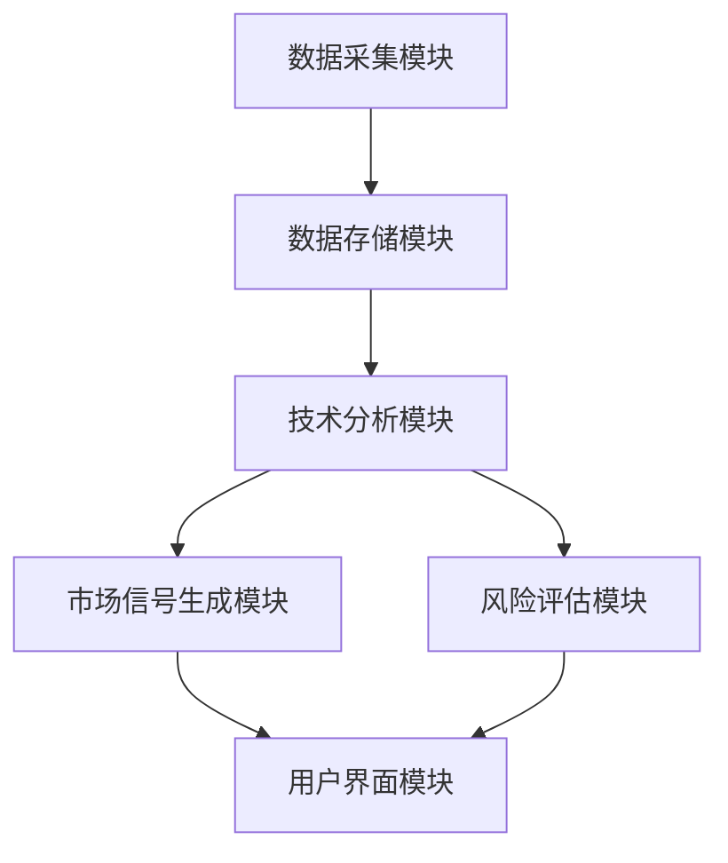

                 


# 马丁惠特曼的特殊情况投资

> 关键词：马丁惠特曼，特殊情况投资，投资策略，风险管理，市场分析，技术分析，数学模型

> 摘要：本文深入探讨了马丁惠特曼的特殊情况投资策略，从背景介绍、核心概念、技术分析方法、数学模型、系统架构设计、项目实战到最佳实践，全面解析了如何在特殊情况下进行有效的投资。

---

## 第一部分: 特殊情况投资的背景与重要性

### 第1章: 特殊情况投资的定义与背景

#### 1.1 特殊情况投资的定义

##### 1.1.1 投资的定义与分类

投资是指将资金投入到某种资产或项目中，以期在未来获得收益或资本增值的行为。根据投资对象的不同，可以将投资分为以下几类：

- **股票投资**：通过购买公司股份成为股东，获得股息和资本增值。
- **债券投资**：购买政府或企业发行的债券，定期获得利息收益。
- **房地产投资**：通过购买房地产资产，获得租金收入和资产增值。
- **基金投资**：通过购买共同基金、指数基金等，间接参与股票、债券等资产的投资。
- **外汇投资**：通过买卖不同货币，利用汇率波动获得收益。

##### 1.1.2 什么是特殊情况投资

特殊情况投资是指在市场出现极端情况（如市场崩盘、经济危机、突发事件等）时，投资者采取的特殊投资策略。这种策略通常在市场出现剧烈波动、资产价格偏离正常水平时生效，旨在通过抓住市场错配的机会，实现超额收益。

##### 1.1.3 特殊情况投资的核心特征

- **市场波动性**：市场出现剧烈波动，资产价格偏离基本面。
- **信息不对称**：市场参与者对信息的掌握不一致，存在定价错误。
- **短期机会**：特殊情况下市场往往存在短期套利机会，投资者需要快速反应。

#### 1.2 特殊情况投资的重要性和意义

##### 1.2.1 投资市场的波动性与不确定性

市场波动是投资的常态，但在特殊情况下，波动性显著增加，市场的不确定性也大幅上升。投资者需要具备应对极端情况的能力，以避免重大损失或抓住潜在机会。

##### 1.2.2 特殊情况投资在市场中的作用

- **价格修复**：特殊情况投资有助于纠正市场定价错误，使资产价格回归合理水平。
- **风险对冲**：通过特殊投资策略，投资者可以对冲市场风险，降低整体投资组合的波动性。
- **超额收益**：在特殊情况下，市场可能存在短期套利机会，投资者可以通过特殊投资策略实现超额收益。

##### 1.2.3 特殊情况投资对投资者的价值

- **提高风险意识**：了解特殊情况投资可以帮助投资者更好地应对市场波动。
- **增强决策能力**：掌握特殊情况投资策略可以提高投资者在极端情况下的决策能力。
- **优化投资组合**：通过特殊情况投资，投资者可以优化投资组合，降低风险，提高收益。

---

### 第2章: 特殊情况投资的历史与现状

#### 2.1 特殊情况投资的历史发展

##### 2.1.1 早期投资市场的特点

早期投资市场主要以实物商品和土地为主，投资者较少关注市场波动，更注重长期价值。随着金融市场的发展，股票、债券等金融资产逐渐成为主要投资对象。

##### 2.1.2 特殊情况投资的起源

20世纪初，市场波动加剧，投资者开始尝试在市场波动中获利。1929年大萧条时期，投资者开始意识到在极端市场环境下，传统的投资策略可能失效，特殊投资策略应运而生。

##### 2.1.3 历史上的经典案例

- **1987年黑色星期一**：1987年10月19日，美国股市出现大幅崩盘，投资者通过特殊投资策略迅速调整头寸，避免了更大损失。
- **2008年全球金融危机**：在2008年金融危机期间，许多投资者通过特殊情况投资策略，抓住市场错配机会，实现了超额收益。

#### 2.2 特殊情况投资的现状分析

##### 2.2.1 当前投资市场的特点

- **全球化**：金融市场全球化程度提高，市场波动具有跨国性。
- **技术进步**：科技的发展使得市场数据处理和分析能力大幅提高。
- **机构投资者主导**：机构投资者在市场中占据主导地位，市场波动性加剧。

##### 2.2.2 特殊情况投资的现状

- **量化交易**：越来越多的投资者采用量化交易策略，通过算法在市场波动中获利。
- **高频交易**：高频交易在特殊情况下尤为重要，投资者可以通过高频交易迅速调整头寸。
- **大数据分析**：利用大数据分析技术，投资者可以在市场波动中发现潜在机会。

##### 2.2.3 未来发展趋势

- **人工智能的应用**：人工智能技术的发展将推动特殊情况投资策略的进一步优化。
- **区块链技术**：区块链技术可能在特殊情况下提供新的投资机会，如DeFi（去中心化金融）。
- **ESG投资**：环境、社会和公司治理（ESG）因素在特殊情况下可能成为重要的投资考量。

---

## 第二部分: 特殊情况投资的核心概念与理论

### 第3章: 投资策略与风险管理

#### 3.1 投资策略的核心要素

##### 3.1.1 投资目标的设定

- **长期目标**：如资产增值、财富保值等。
- **短期目标**：如抓住短期市场机会，实现快速盈利。

##### 3.1.2 投资期限的选择

- **短期投资**：适合抓住市场短期波动机会。
- **长期投资**：适合追求资产长期增值。

##### 3.1.3 投资风险的评估

- **市场风险**：市场波动对资产价格的影响。
- **流动性风险**：资产在特殊情况下可能难以变现。
- **信用风险**：债券等信用资产可能面临违约风险。

#### 3.2 风险管理的理论与实践

##### 3.2.1 风险的定义与分类

- **市场风险**：市场整体波动对资产价格的影响。
- **流动性风险**：资产在特殊情况下难以变现的风险。
- **信用风险**：债券等信用资产的违约风险。

##### 3.2.2 风险管理的基本原则

- **分散投资**：通过投资不同资产类别和行业，降低风险。
- **风险定价**：合理评估资产风险，避免过度冒险。
- **动态调整**：根据市场变化，及时调整投资组合。

##### 3.2.3 风险管理的实践方法

- **止损策略**：设定止损点，避免亏损过大。
- **对冲策略**：通过衍生品对冲市场风险。
- **情景分析**：模拟不同市场情景，评估投资组合的承受能力。

---

### 第4章: 投资组合优化与资产配置

#### 4.1 投资组合优化的理论基础

##### 4.1.1 现代投资组合理论简介

现代投资组合理论（MPT）由哈里·马科维茨提出，认为通过合理分散投资，可以降低投资组合的整体风险。

##### 4.1.2 马科维茨的有效前沿理论

有效前沿理论认为，存在一组最优投资组合，这些组合在相同风险下提供最高收益，或在相同收益下具有最低风险。

##### 4.1.3 投资组合优化的数学模型

投资组合优化的数学模型通常包括以下步骤：

1. 确定可选资产及其收益和风险。
2. 确定投资组合的收益和风险目标。
3. 通过优化算法求解最优投资组合。

#### 4.2 资产配置的策略与技巧

##### 4.2.1 资产配置的基本原则

- **分散投资**：通过投资不同资产类别降低风险。
- **风险与收益匹配**：根据风险承受能力选择合适资产。
- **定期调整**：根据市场变化和投资目标调整资产配置。

##### 4.2.2 不同市场环境下的资产配置策略

- **牛市**：增加高收益资产如股票的配置。
- **熊市**：增加防御性资产如债券的配置。
- **震荡市**：增加现金类资产的配置，等待市场机会。

##### 4.2.3 资产配置的动态调整

- **市场变化**：根据市场变化及时调整资产配置。
- **投资目标变化**：根据投资目标的变化调整资产配置。

---

## 第三部分: 特殊情况下的技术分析方法

### 第5章: 技术分析的核心方法与工具

#### 5.1 技术分析的基本原理

##### 5.1.1 技术分析的定义与特点

技术分析是一种通过分析市场历史价格数据，预测未来价格走势的投资方法。其特点包括：

- **价格优先**：价格是市场行为的直接反映。
- **趋势延续**：市场趋势一旦形成，往往会延续一段时间。
- **周期性**：市场波动具有周期性特征。

##### 5.1.2 技术分析的核心假设

- **市场行为反映所有信息**：市场价格已经反映了所有相关信息。
- **趋势的持续性**：市场趋势一旦形成，往往会延续。
- **历史重演**：历史价格走势可能会重演。

##### 5.1.3 技术分析与基本面分析的区别

- **基本面分析**：关注企业的财务状况、行业地位等因素。
- **技术分析**：关注市场价格走势、交易量等市场行为。

#### 5.2 技术分析的主要工具与指标

##### 5.2.1 移动平均线（MA）

移动平均线是一种常用的技术分析工具，用于平滑价格波动，识别趋势方向。

- **简单移动平均线（SMA）**：将一定时期内的价格平均值作为指标。
- **指数移动平均线（EMA）**：赋予近期价格更大权重。

##### 5.2.2 相对强弱指数（RSI）

RSI用于衡量资产价格的超买或超卖状态，通常在0-100之间波动。

- **超买**：RSI > 70
- **超卖**：RSI < 30

##### 5.2.3 MACD指标

MACD（移动平均收敛散度）指标用于识别价格趋势和潜在的买卖信号。

- **计算公式**：MACD = EMA(12) - EMA(26)
- **信号线**：MACD的EMA(9)移动平均线。

---

### 第6章: 特殊情况下的技术分析实战

#### 6.1 特殊情况下的技术分析策略

##### 6.1.1 市场崩盘中的技术分析

- **识别底部信号**：通过技术指标如RSI、MACD等识别市场底部。
- **趋势反转信号**：通过价格形态识别趋势反转。

##### 6.1.2 突发事件中的技术分析

- **快速反应**：通过技术分析迅速判断市场反应，制定投资策略。

#### 6.2 技术分析在特殊情况下的优势

##### 6.2.1 快速决策

技术分析可以帮助投资者在短时间内做出决策，抓住市场机会。

##### 6.2.2 量化分析

技术分析依赖于数学模型和量化指标，可以减少主观判断。

##### 6.2.3 风险控制

通过技术分析，投资者可以设定止损点，控制投资风险。

---

## 第四部分: 特殊情况投资的数学模型与系统架构

### 第7章: 数学模型在特殊情况投资中的应用

#### 7.1 数学模型的核心作用

##### 7.1.1 市场波动预测

- **时间序列分析**：通过ARIMA等模型预测市场波动。
- **GARCH模型**：用于估计市场波动率。

##### 7.1.2 风险评估

- **VaR模型**：用于估计投资组合的潜在损失。
- **CVaR模型**：用于估计在VaR基础上的潜在损失。

##### 7.1.3 投资组合优化

- **均值-方差优化**：通过马科维茨模型优化投资组合。
- **风险调整收益模型**：如夏普比率、特雷纳比率。

#### 7.2 数学模型在特殊情况投资中的挑战

##### 7.2.1 模型的假设与简化

数学模型通常基于假设，可能与实际情况存在偏差。

##### 7.2.2 数据的不足

特殊情况下的数据可能有限，影响模型的准确性。

##### 7.2.3 模型的动态调整

市场波动加剧时，需要动态调整模型参数。

---

### 第8章: 系统架构设计与实现

#### 8.1 系统功能设计

##### 8.1.1 价格数据采集

- **数据源**：包括股票价格、指数价格、外汇汇率等。
- **数据接口**：通过API接口获取实时价格数据。

##### 8.1.2 技术指标计算

- **移动平均线**：计算SMA和EMA。
- **相对强弱指数**：计算RSI。
- **MACD指标**：计算MACD和信号线。

##### 8.1.3 市场信号生成

- **买卖信号**：根据技术指标生成买入或卖出信号。
- **风险提示**：通过波动率模型提示市场风险。

#### 8.2 系统架构设计

##### 8.2.1 模块划分

- **数据采集模块**：负责数据的获取和存储。
- **技术分析模块**：负责技术指标的计算和信号生成。
- **风险评估模块**：负责市场波动预测和风险评估。
- **用户界面模块**：提供直观的数据显示和操作界面。

##### 8.2.2 系统架构图



#### 8.3 系统实现与代码示例

##### 8.3.1 环境配置

- **编程语言**：Python
- **库**：Pandas、NumPy、Matplotlib、TA-Lib
- **数据源**：Yahoo Finance API

##### 8.3.2 核心代码实现

```python
import pandas as pd
import numpy as np
import matplotlib.pyplot as plt
from ta import indicators

# 数据采集
data = pd.read_csv('stock_data.csv')
close_price = data['Close'].values

# 技术指标计算
sma_20 = indicators.sma(close_price, 20)
ema_20 = indicators.ema(close_price, 20)
rsi = indicators.rsi(close_price, 14)
macd = indicators.macd(close_price, 12, 26, 9)

# 市场信号生成
long_signals = np.where(rsi < 30, 1, 0)
short_signals = np.where(rsi > 70, -1, 0)
```

---

## 第五部分: 项目实战与最佳实践

### 第9章: 项目实战分析

#### 9.1 实战环境配置

- **编程语言**：Python
- **库**：Pandas、NumPy、Matplotlib、TA-Lib、Pickle
- **数据源**：Yahoo Finance API、本地数据文件

#### 9.2 系统核心实现

##### 9.2.1 数据采集模块

```python
import yfinance as yf

def get_data(ticker, start_date, end_date):
    data = yf.download(ticker, start=start_date, end=end_date)
    return data
```

##### 9.2.2 技术分析模块

```python
def calculate_indicators(data):
    close_price = data['Close']
    sma_20 = close_price.rolling(20).mean()
    ema_20 = close_price.ewm(alpha=0.3).mean()
    rsi = indicators.rsi(close_price, 14)
    macd = indicators.macd(close_price, 12, 26, 9)
    return sma_20, ema_20, rsi, macd
```

##### 9.2.3 市场信号生成模块

```python
def generate_signals(rsi, macd):
    signals = []
    for i in range(len(rsi)):
        if rsi[i] < 30 and macd[i] > 0:
            signals.append(1)
        elif rsi[i] > 70 and macd[i] < 0:
            signals.append(-1)
        else:
            signals.append(0)
    return signals
```

##### 9.2.4 风险评估模块

```python
import numpy as np

def calculate_risk(close_price, window=20):
    returns = np.log(close_price / close_price.shift(1))
    returns = returns.dropna()
    volatility = returns.rolling(window).std()
    return volatility
```

---

### 第10章: 最佳实践与小结

#### 10.1 最佳实践

##### 10.1.1 定期回顾与调整

- **定期评估**：每季度或半年评估一次投资组合。
- **动态调整**：根据市场变化及时调整头寸。

##### 10.1.2 严格遵守纪律

- **严格执行交易计划**：避免情绪化交易。
- **设置止损与止盈**：控制投资风险。

##### 10.1.3 持续学习与优化

- **学习新知识**：了解最新的投资策略和技术。
- **优化系统**：根据市场变化不断优化投资系统。

#### 10.2 小结

马丁惠特曼的特殊情况投资策略是一种在市场波动加剧时，通过技术分析和数学模型实现超额收益的方法。本文通过背景介绍、核心概念、技术分析方法、数学模型、系统架构设计、项目实战和最佳实践，全面解析了如何在特殊情况下进行有效的投资。

