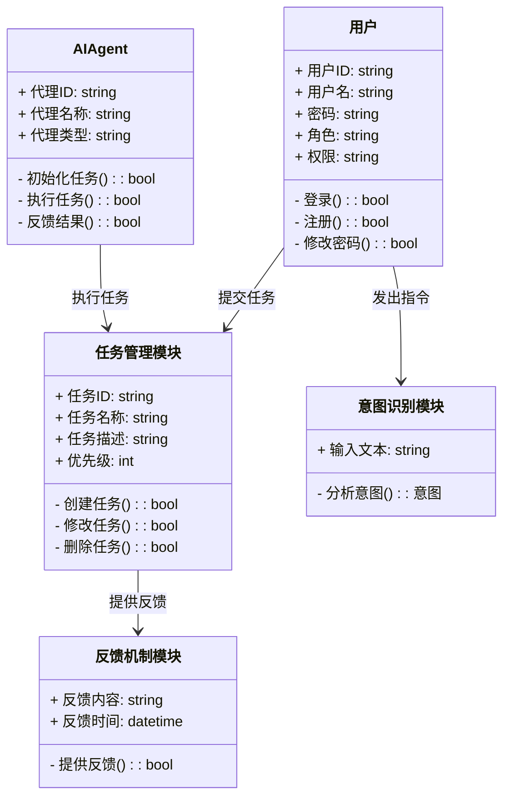
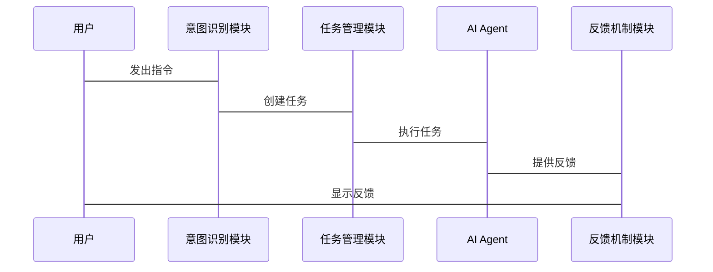

                 


# AI Agent与人类协作：界面设计与交互模式

## 关键词
AI Agent, 人类协作, 界面设计, 交互模式, 自然语言处理, 多模态交互, 任务分解

## 摘要
随着AI技术的快速发展，AI Agent在各个领域的应用越来越广泛。AI Agent与人类协作的界面设计和交互模式成为提升协作效率和用户体验的关键。本文从背景介绍、核心概念、算法原理、系统架构、项目实战和最佳实践等多方面详细探讨AI Agent与人类协作的界面设计与交互模式，结合具体案例和代码实现，为读者提供深入的分析和见解。

---

# 第一部分: AI Agent与人类协作的背景与概念

## 第1章: AI Agent与人类协作的背景

### 1.1 AI Agent的基本概念
AI Agent，即人工智能代理，是指能够感知环境并采取行动以实现目标的智能实体。与传统的被动工具不同，AI Agent具备主动性和智能性，能够通过学习和推理来优化任务执行。

#### 1.1.1 AI Agent的定义与特点
- **定义**：AI Agent是一种能够感知环境、执行任务并做出决策的智能系统。
- **特点**：
  - **自主性**：能够在没有外部干预的情况下自主决策。
  - **反应性**：能够实时感知环境变化并做出响应。
  - **目标导向性**：以实现特定目标为导向执行任务。

#### 1.1.2 AI Agent与传统AI的区别
| **特点** | **传统AI** | **AI Agent** |
|----------|------------|--------------|
| **自主性** | 依赖外部控制 | 自主决策      |
| **环境感知** | 仅处理输入数据 | 实时感知环境   |
| **目标导向** | 纯粹的数据处理 | 以目标为导向   |

#### 1.1.3 人类与AI Agent协作的必要性
AI Agent通过与人类协作，能够更高效地完成复杂任务。人类的创造力和判断力与AI Agent的数据处理能力和快速响应能力相结合，能够显著提升整体工作效率。

---

### 1.2 人类与AI Agent协作的界面设计
界面设计是AI Agent与人类协作的核心，直接影响用户体验和协作效率。

#### 1.2.1 界面设计的核心目标
- **目标1**：提升用户体验，使用户能够轻松与AI Agent互动。
- **目标2**：优化协作效率，确保AI Agent能够快速理解并执行任务。
- **目标3**：增强反馈机制，使用户能够实时了解AI Agent的执行情况。

#### 1.2.2 界面设计的原则与规范
1. **简洁性原则**：避免复杂的操作步骤，确保界面直观易用。
2. **直观性原则**：使用用户熟悉的交互方式，减少学习成本。
3. **反馈性原则**：提供及时的反馈信息，增强用户信任感。

#### 1.2.3 人类与AI Agent协作的界面特点
- **实时性**：支持实时互动，用户可以随时与AI Agent交流。
- **多模态性**：支持文本、语音、视觉等多种交互方式。
- **个性化**：根据用户需求和习惯提供定制化服务。

---

## 第2章: AI Agent协作界面的设计原则

### 2.1 用户需求分析
用户需求是界面设计的核心，只有深入了解用户需求，才能设计出符合用户习惯的协作界面。

#### 2.1.1 用户需求的层次化分析
- **用户目标**：用户希望通过协作完成什么任务。
- **用户角色**：用户在协作中的角色和权限。
- **用户行为**：用户在协作过程中的具体操作步骤。

#### 2.1.2 用户角色与权限的定义
- **用户角色**：根据用户职责划分不同的角色，例如普通用户、管理员等。
- **权限管理**：为不同角色分配相应的权限，确保协作过程中的数据安全。

#### 2.1.3 用户行为模式的分析
- **行为路径**：用户在协作过程中遵循的操作路径。
- **行为习惯**：用户在协作中的偏好和习惯。

### 2.2 界面设计的核心原则
界面设计需要遵循一系列原则，以确保协作界面的高效性和易用性。

#### 2.2.1 简洁性原则
协作界面应尽量简洁，避免冗余的功能和信息，确保用户能够快速上手。

#### 2.2.2 直观性原则
界面设计应直观反映任务逻辑，避免复杂的操作流程，使用户能够轻松完成任务。

#### 2.2.3 反馈性原则
协作界面应提供实时的反馈信息，确保用户能够了解AI Agent的执行状态，并在出现问题时及时调整。

### 2.3 交互模式的设计与优化
交互模式是协作界面的重要组成部分，直接影响用户体验和协作效率。

#### 2.3.1 单向交互与双向交互的对比
| **交互模式** | **单向交互** | **双向交互** |
|--------------|---------------|---------------|
| **特点**     | 用户输入指令，AI Agent执行任务 | 用户与AI Agent可以实时互动，任务执行过程中可以随时调整 |
| **适用场景** | 适用于简单任务 | 适用于复杂任务 |

#### 2.3.2 实时交互与非实时交互的优缺点
- **实时交互**：优点是响应速度快，缺点是可能占用较高的资源。
- **非实时交互**：优点是资源消耗低，缺点是响应速度较慢。

#### 2.3.3 交互流程的优化方法
- **简化流程**：去除不必要的操作步骤，优化交互流程。
- **增加反馈**：在关键步骤增加反馈信息，确保用户了解任务执行状态。

---

# 第二部分: AI Agent协作界面的核心概念与技术

## 第3章: AI Agent协作界面的核心概念

### 3.1 AI Agent的任务分解
任务分解是AI Agent协作界面设计中的重要环节，直接影响协作效率。

#### 3.1.1 任务分解的基本方法
- **层次化分解**：将任务分解为多个子任务，逐层细化。
- **优先级排序**：根据任务的重要性和紧急程度进行排序。

#### 3.1.2 任务优先级的确定
- **关键因素**：任务的重要性和紧急程度。
- **优先级排序**：高优先级任务优先执行。

#### 3.1.3 任务分配的策略
- **基于角色分配**：根据用户角色分配任务。
- **基于资源分配**：根据资源情况分配任务。

### 3.2 意图识别与自然语言处理
意图识别是AI Agent协作界面设计中的关键技术，能够帮助AI Agent准确理解用户的意图。

#### 3.2.1 意图识别的基本原理
意图识别通过分析用户的输入内容，识别用户的意图并将其转化为具体任务。

#### 3.2.2 自然语言处理在协作界面中的应用
- **语义分析**：通过自然语言处理技术分析用户的输入内容，提取语义信息。
- **意图分类**：将用户的意图分类到预定义的意图库中。

#### 3.2.3 意图识别的优化方法
- **数据增强**：通过数据增强技术提升意图识别的准确率。
- **模型优化**：优化意图识别模型的结构和参数。

### 3.3 反馈机制与用户满意度
反馈机制是AI Agent协作界面设计中的重要环节，能够提升用户满意度和协作效率。

#### 3.3.1 反馈机制的设计原则
- **及时性**：反馈信息应实时显示。
- **明确性**：反馈信息应清晰明了。

#### 3.3.2 用户满意度的评估指标
- **满意度调查**：通过问卷调查了解用户的满意度。
- **反馈分析**：通过用户的反馈信息分析协作界面的优缺点。

#### 3.3.3 反馈机制的优化策略
- **优化反馈内容**：确保反馈信息准确、具体。
- **增加反馈渠道**：提供多种反馈渠道，方便用户反馈意见。

## 第4章: AI Agent协作界面的核心技术

### 4.1 自然语言处理技术
自然语言处理技术是AI Agent协作界面设计中的核心技术，能够帮助AI Agent准确理解用户的意图。

#### 4.1.1 NLP技术的基本原理
自然语言处理技术通过分析文本数据，提取语义信息并生成相应的响应。

#### 4.1.2 NLP技术在协作界面中的应用
- **意图识别**：通过NLP技术识别用户的意图。
- **文本生成**：通过NLP技术生成自然的文本响应。

#### 4.1.3 NLP技术的优化方法
- **模型优化**：优化NLP模型的结构和参数。
- **数据增强**：通过数据增强技术提升模型的泛化能力。

### 4.2 多模态交互技术
多模态交互技术是AI Agent协作界面设计中的高级技术，能够提升用户体验和协作效率。

#### 4.2.1 多模态交互的基本概念
多模态交互是指通过多种感官渠道（如文本、语音、视觉）进行交互的技术。

#### 4.2.2 多模态交互在协作界面中的应用
- **语音交互**：通过语音识别技术实现语音交互。
- **视觉交互**：通过计算机视觉技术实现视觉交互。

#### 4.2.3 多模态交互的优化方法
- **模态融合**：将不同模态的信息进行融合，提升交互效果。
- **实时响应**：优化多模态交互的响应速度，提升用户体验。

---

# 第三部分: AI Agent协作界面的系统分析与架构设计

## 第5章: 系统分析与架构设计方案

### 5.1 问题场景介绍
AI Agent协作界面的设计需要考虑多种因素，包括用户需求、任务分解、意图识别等。

### 5.2 系统功能设计
系统功能设计是AI Agent协作界面设计的核心，包括任务管理、意图识别、反馈机制等功能。

#### 5.2.1 领域模型类图


#### 5.2.2 系统架构设计


### 5.3 系统接口设计
系统接口设计是AI Agent协作界面设计的重要部分，需要确保各个模块之间的接口清晰明确。

### 5.4 系统交互序列图


---

# 第四部分: AI Agent协作界面的项目实战

## 第6章: 项目实战

### 6.1 环境安装
项目实战需要安装以下环境和工具：
- **Python**：3.8及以上版本
- **TensorFlow**：2.0及以上版本
- **NLTK**：1.0及以上版本
- **Mermaid**：用于绘制图表

### 6.2 系统核心实现源代码
以下是协作界面的核心代码实现：

#### 6.2.1 意图识别模块
```python
import nltk
from nltk.classify import NaiveBayesClassifier
from nltk.corpus import names

# 数据准备
positive_reviews = names('positive_reviews.txt')
negative_reviews = names('negative_reviews.txt')

# 特征提取
def extract_features(word):
    return dict([(word, True)])

# 训练模型
training_data = [(extract_features(word), label) for word, label in zip(positive_reviews, ['positive']*len(positive_reviews) + negative_reviews, ['negative']*len(negative_reviews))]
classifier = NaiveBayesClassifier.train(training_data)

# 预测意图
def predict_intention(text):
    features = extract_features(text)
    return classifier.classify(features)
```

#### 6.2.2 任务管理模块
```python
class TaskManager:
    def __init__(self):
        self.tasks = []
    
    def create_task(self, task_name, task_description, priority):
        self.tasks.append({
            'task_name': task_name,
            'task_description': task_description,
            'priority': priority
        })
    
    def update_task(self, task_id, new_priority):
        task = self.tasks[task_id]
        task['priority'] = new_priority
    
    def delete_task(self, task_id):
        del self.tasks[task_id]
```

#### 6.2.3 反馈机制模块
```python
class FeedbackMechanism:
    def __init__(self):
        self.feedbacks = []
    
    def provide_feedback(self, feedback_content):
        self.feedbacks.append({
            'content': feedback_content,
            'timestamp': datetime.now()
        })
```

### 6.3 代码应用解读与分析
以上代码实现了AI Agent协作界面的核心功能模块，包括意图识别、任务管理和反馈机制。通过Python代码可以清晰地看到各个模块之间的交互和协作过程。

### 6.4 实际案例分析
通过一个简单的任务管理案例，我们可以看到AI Agent协作界面的实际应用效果。用户可以通过界面提交任务，AI Agent根据用户的意图分解任务并执行，同时提供实时反馈。

---

# 第五部分: AI Agent协作界面的最佳实践

## 第7章: 最佳实践

### 7.1 设计原则
- **以用户为中心**：始终以用户体验为核心，优化界面设计。
- **模块化设计**：将协作界面设计模块化，便于维护和扩展。
- **实时反馈**：提供实时的反馈信息，增强用户信任感。

### 7.2 注意事项
- **数据安全**：确保用户数据的安全性，防止数据泄露。
- **性能优化**：优化协作界面的性能，提升响应速度。
- **可扩展性**：设计协作界面时考虑未来的扩展需求。

### 7.3 未来趋势
随着AI技术的不断发展，AI Agent协作界面的设计将更加智能化和个性化。未来的协作界面将更加注重用户体验，同时支持更多的交互方式，如增强现实和虚拟现实等。

---

# 结语
AI Agent与人类协作的界面设计与交互模式是一个复杂而有趣的话题。通过本文的详细探讨，我们可以看到，AI Agent协作界面的设计需要综合考虑用户需求、任务分解、意图识别、反馈机制等多个方面。只有通过不断的优化和创新，才能设计出更加高效和人性化的协作界面，提升用户体验和协作效率。

作者：AI天才研究院/AI Genius Institute & 禅与计算机程序设计艺术 /Zen And The Art of Computer Programming

