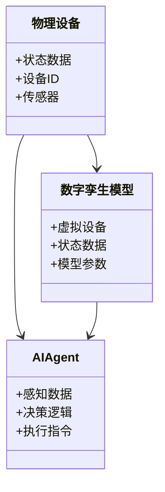
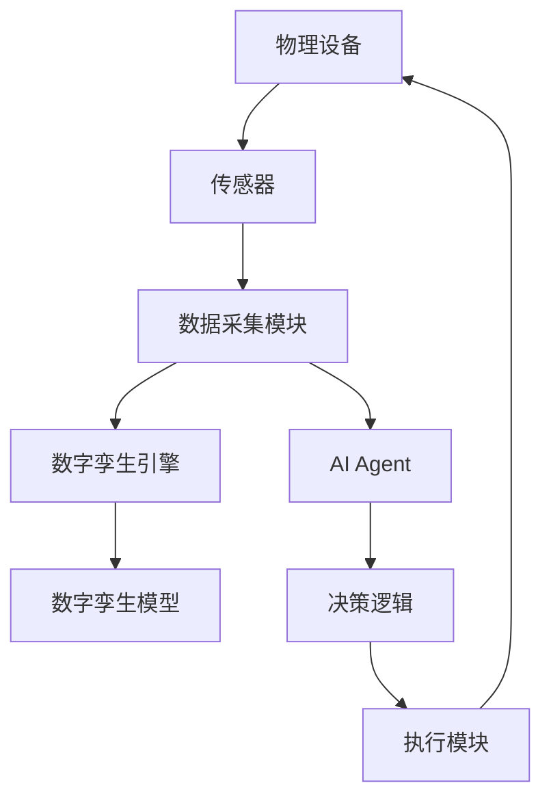
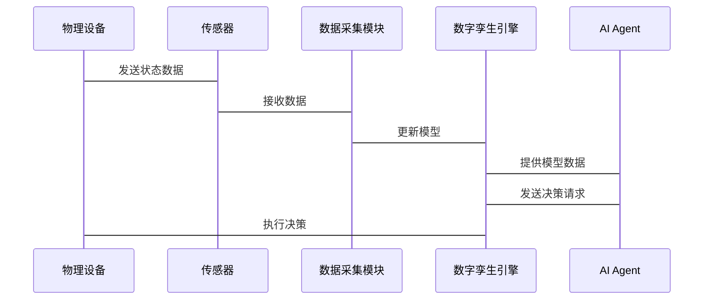

                 


# AI Agent与企业数字孪生技术的融合应用

> 关键词：AI Agent，企业数字孪生，融合应用，算法原理，系统架构

> 摘要：本文探讨了AI Agent与企业数字孪生技术的融合应用，分析了两者的背景、核心概念与原理，详细讲解了融合的算法原理与数学模型，提出了系统架构设计方案，并通过项目实战展示了融合应用的具体实现。最后，展望了技术趋势与最佳实践。

---

# 第一部分: AI Agent与企业数字孪生技术概述

# 第1章: AI Agent与企业数字孪生技术的背景与概念

## 1.1 AI Agent的基本概念

### 1.1.1 AI Agent的定义与特点
AI Agent（人工智能代理）是指能够感知环境、自主决策并执行任务的智能实体。其特点包括：
- **自主性**：能够独立执行任务，无需外部干预。
- **反应性**：能够实时感知环境变化并做出响应。
- **学习能力**：通过数据和经验不断优化自身行为。
- **协作性**：能够与其他系统或人类进行协作。

### 1.1.2 AI Agent的核心功能与应用场景
AI Agent的核心功能包括：
- **感知环境**：通过传感器或数据输入获取环境信息。
- **决策与推理**：基于感知信息进行逻辑推理和决策。
- **执行任务**：根据决策结果执行具体操作。

应用场景：
- 智能客服：通过自然语言处理与用户交互，解决用户问题。
- 自动化运维：监控系统运行状态，自动修复故障。
- 智能推荐：基于用户行为推荐个性化内容。

### 1.1.3 企业级AI Agent的特殊需求
企业级AI Agent需要满足以下需求：
- **高可用性**：保证在关键业务场景中的稳定运行。
- **可扩展性**：能够处理大规模数据和复杂任务。
- **安全性**：确保数据和操作的安全性，防止恶意攻击。

## 1.2 数字孪生技术的基本概念

### 1.2.1 数字孪生的定义与特点
数字孪生是指通过数字化技术，创建物理对象或系统的虚拟模型，并实时同步数据的技术。其特点包括：
- **实时性**：能够实时反映物理对象的状态。
- **动态性**：能够根据环境变化动态更新模型。
- **交互性**：用户可以通过虚拟模型与物理对象进行交互。

### 1.2.2 数字孪生在企业中的应用价值
数字孪生在企业中的应用价值包括：
- **优化运营**：通过虚拟模型模拟业务流程，优化运营效率。
- **降低成本**：通过预测性维护减少设备故障和维修成本。
- **创新设计**：通过虚拟原型进行产品设计和测试，缩短开发周期。

### 1.2.3 数字孪生与传统信息化系统的区别
传统信息化系统通常基于规则和静态数据，而数字孪生通过实时数据和动态模型，能够更准确地反映现实情况。

## 1.3 AI Agent与数字孪生的融合背景

### 1.3.1 数字化转型的驱动因素
企业数字化转型的驱动力包括：
- **技术进步**：人工智能、大数据、物联网等技术的快速发展。
- **市场竞争**：企业需要通过数字化手段提升竞争力。
- **客户需求**：客户对个性化和高效服务的需求不断增加。

### 1.3.2 AI Agent在企业数字化中的作用
AI Agent能够通过自动化和智能化手段，提升企业的数字化能力，例如：
- **智能客服**：提高客户满意度。
- **自动化运维**：减少人工干预，提高系统稳定性。

### 1.3.3 数字孪生与AI Agent融合的必要性
数字孪生需要实时数据和动态模型，而AI Agent能够通过智能化手段优化模型的性能，提升数字孪生的实用价值。

## 1.4 本章小结
本章介绍了AI Agent和数字孪生的基本概念、特点和应用场景，并分析了两者融合的背景和必要性，为后续内容奠定了基础。

---

# 第二部分: AI Agent与数字孪生的核心概念与联系

# 第2章: AI Agent与数字孪生的核心原理

## 2.1 AI Agent的核心原理

### 2.1.1 AI Agent的感知与决策机制
AI Agent通过传感器或数据输入感知环境，并基于感知信息进行逻辑推理和决策。决策过程通常包括以下几个步骤：
1. **感知环境**：获取环境数据。
2. **分析数据**：通过算法对数据进行分析。
3. **制定决策**：基于分析结果制定行动方案。
4. **执行任务**：根据决策结果执行具体操作。

### 2.1.2 基于大模型的自然语言处理能力
现代AI Agent通常基于大语言模型（如GPT）实现自然语言处理能力。这些模型通过大量的数据训练，能够理解和生成人类语言。

### 2.1.3 AI Agent的自主学习与进化能力
AI Agent能够通过强化学习等技术不断优化自身行为，提升决策能力。

## 2.2 数字孪生的核心原理

### 2.2.1 数字孪生的建模与仿真技术
数字孪生的核心是建立物理对象的虚拟模型，并通过实时数据更新模型状态。建模过程通常包括以下几个步骤：
1. **数据采集**：通过传感器获取物理对象的状态数据。
2. **模型构建**：基于数据建立虚拟模型。
3. **模型仿真**：通过模型模拟物理对象的行为。

### 2.2.2 数据驱动的动态更新机制
数字孪生通过实时数据更新虚拟模型，确保模型与物理对象保持一致。动态更新机制包括数据采集、数据处理和模型更新三个环节。

### 2.2.3 数字孪生的实时性与准确性
数字孪生的实时性依赖于数据采集和处理的速度，准确性则依赖于模型的精度和数据质量。

## 2.3 AI Agent与数字孪生的关联与区别

### 2.3.1 核心概念对比分析
| 核心概念 | AI Agent | 数字孪生 |
|----------|-----------|----------|
| 核心功能 | 感知与决策 | 建模与仿真 |
| 数据需求 | 高频实时数据 | 高精度静态数据 |
| 应用场景 | 智能交互、自动化运维 | 设备监控、流程优化 |

### 2.3.2 AI Agent与数字孪生的协同关系
AI Agent可以通过数字孪生模型获取实时数据，优化决策过程；数字孪生则可以通过AI Agent的智能分析能力，提升模型的准确性和实用性。

### 2.3.3 两者的互补性与融合优势
AI Agent与数字孪生的融合能够实现智能化与数字化的结合，提升企业的整体数字化能力。

## 2.4 本章小结
本章详细讲解了AI Agent和数字孪生的核心原理，并通过对比分析，明确了两者的关系与优势。

---

# 第三部分: AI Agent与数字孪生的算法原理与数学模型

# 第3章: AI Agent的算法原理

## 3.1 基于大模型的自然语言处理算法

### 3.1.1 Transformer模型的结构与原理
Transformer模型由编码器和解码器组成，编码器负责将输入序列映射到固定维度的向量，解码器负责将编码结果解码为输出序列。

### 3.1.2 注意力机制的实现细节
注意力机制通过计算输入序列中每个位置的权重，确定哪些位置的信息更重要。权重计算公式如下：
$$
\text{score}(i, j) = \frac{\exp(\text{similarity}(i, j))}{\sum_{k} \exp(\text{similarity}(i, k))}
$$

### 3.1.3 梯度下降与优化算法的选择
常用的优化算法包括随机梯度下降（SGD）和Adam优化器。Adam优化器通过自适应学习率调整，能够更快收敛。

## 3.2 AI Agent的决策算法

### 3.2.1 基于强化学习的决策过程
强化学习通过奖励机制训练AI Agent，使其在决策过程中不断优化行为策略。奖励函数定义如下：
$$
R(s, a) = \text{奖励值，根据状态}s和动作$a决定}
$$

### 3.2.2 状态空间与动作空间的建模
状态空间表示所有可能的状态，动作空间表示所有可能的动作。状态和动作通过马尔可夫决策过程（MDP）建模。

### 3.2.3 深度强化学习的数学模型
深度强化学习通过深度神经网络近似值函数，实现复杂环境下的决策。值函数定义为：
$$
V(s) = \mathbb{E}[R(s, a) + \gamma V(a)]
$$
其中，$\gamma$ 是折扣因子。

## 3.3 数学模型与公式

### 3.3.1 Transformer模型的损失函数
$$
\text{loss}(x, y) = \frac{1}{N}\sum_{i=1}^{N} (\text{预测值}_i - \text{真实值}_i)^2
$$

### 3.3.2 强化学习的策略梯度
策略梯度算法通过梯度上升方法优化策略，目标函数为：
$$
\theta = \theta + \alpha \nabla_{\theta} \text{log}(\pi(a|s))
$$
其中，$\alpha$ 是学习率，$\pi(a|s)$ 是策略函数。

---

# 第四部分: AI Agent与数字孪生的系统架构设计方案

# 第4章: AI Agent与数字孪生的系统架构

## 4.1 系统应用场景

### 4.1.1 智能制造
通过AI Agent与数字孪生的融合，实现生产设备的智能化监控和优化。

### 4.1.2 智慧物流
通过数字孪生模拟物流过程，AI Agent优化物流路径和资源分配。

## 4.2 项目介绍

### 4.2.1 项目目标
通过AI Agent与数字孪生的融合，实现企业数字化转型。

### 4.2.2 系统功能设计
系统功能包括：
1. **数据采集**：通过传感器获取设备状态数据。
2. **模型构建**：基于数据建立数字孪生模型。
3. **智能决策**：AI Agent通过模型进行决策和优化。

### 4.2.3 领域模型类图


### 4.2.4 系统架构图


### 4.2.5 系统接口设计
系统接口包括：
- 数据采集接口：用于采集物理设备的状态数据。
- 模型更新接口：用于更新数字孪生模型。
- 决策接口：用于AI Agent的决策请求。

### 4.2.6 系统交互序列图


## 4.3 本章小结
本章通过系统架构设计方案，展示了AI Agent与数字孪生融合的具体实现方式，为后续的项目实战奠定了基础。

---

# 第五部分: AI Agent与数字孪生的项目实战

# 第5章: 项目实战

## 5.1 环境安装

### 5.1.1 安装Python
```bash
# 安装Python
python --version
```

### 5.1.2 安装依赖库
```bash
pip install numpy
pip install matplotlib
pip install transformers
pip install pytorch
```

## 5.2 核心代码实现

### 5.2.1 数据采集模块
```python
import numpy as np

class Sensor:
    def __init__(self):
        self.data = []

    def read_data(self):
        # 生成随机数据
        return np.random.rand(10)
```

### 5.2.2 数字孪生引擎
```python
import numpy as np

class DigitalTwin:
    def __init__(self):
        self.model = None

    def update_model(self, data):
        # 更新模型参数
        self.model = data

    def get_state(self):
        return self.model
```

### 5.2.3 AI Agent
```python
import torch
import torch.nn as nn
import torch.optim as optim

class AI-Agent:
    def __init__(self):
        self.model = nn.Sequential(
            nn.Linear(10, 20),
            nn.ReLU(),
            nn.Linear(20, 5)
        )
        self.optimizer = optim.Adam(self.model.parameters(), lr=0.001)

    def decide(self, state):
        # 输入状态，输出动作
        with torch.no_grad():
            output = self.model(torch.tensor(state))
            return output.argmax().item()
```

## 5.3 代码应用解读与分析

### 5.3.1 数据采集模块
传感器模块通过随机数生成数据，模拟物理设备的状态。

### 5.3.2 数字孪生引擎
数字孪生引擎通过接收传感器数据，更新模型状态，并提供模型数据给AI Agent。

### 5.3.3 AI Agent
AI Agent通过神经网络模型，根据模型状态输出决策动作。神经网络的结构和参数决定了AI Agent的决策能力。

## 5.4 实际案例分析

### 5.4.1 案例背景
假设我们有一个智能工厂，需要通过AI Agent与数字孪生技术实现生产设备的智能化监控。

### 5.4.2 案例实现
1. 传感器采集设备状态数据。
2. 数字孪生引擎更新模型状态。
3. AI Agent根据模型状态输出决策指令。
4. 执行模块根据决策指令执行操作。

## 5.5 本章小结
本章通过具体的项目实战，展示了AI Agent与数字孪生技术的融合应用过程，帮助读者更好地理解技术实现。

---

# 第六部分: 未来展望与最佳实践

# 第6章: 未来展望与最佳实践

## 6.1 未来技术趋势

### 6.1.1 AI Agent的智能化提升
未来，AI Agent将更加智能化，能够处理更复杂的问题。

### 6.1.2 数字孪生的实时性优化
数字孪生技术将通过边缘计算等技术，进一步提升实时性。

### 6.1.3 融合应用的拓展
AI Agent与数字孪生的融合将拓展到更多领域，例如智慧城市、医疗健康等。

## 6.2 最佳实践 Tips

### 6.2.1 技术选型建议
选择合适的AI框架和数字孪生平台，确保系统的可扩展性和可维护性。

### 6.2.2 数据安全注意事项
确保数据的隐私性和安全性，防止数据泄露和滥用。

### 6.2.3 系统优化建议
通过监控和日志分析，不断优化系统性能和用户体验。

## 6.3 本章小结
本章展望了AI Agent与数字孪生技术的未来发展趋势，并提出了实践中的注意事项和优化建议。

---

# 作者：AI天才研究院/AI Genius Institute & 禅与计算机程序设计艺术 /Zen And The Art of Computer Programming

