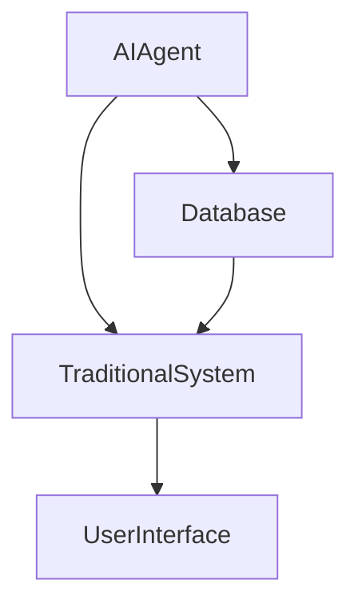
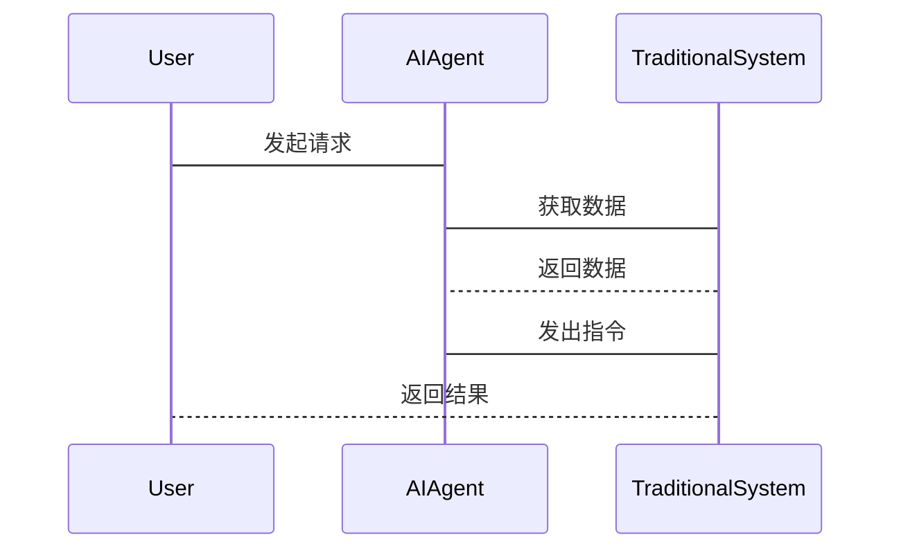

                 


# AI Agent与传统软件系统的协同工作

> 关键词：AI Agent，传统软件系统，协同工作，算法原理，系统架构，项目实战

> 摘要：AI Agent是一种能够感知环境并采取行动以实现目标的智能实体，而传统软件系统则是计算机科学中的基石。随着人工智能技术的快速发展，AI Agent与传统软件系统的协同工作变得越来越重要。本文将从AI Agent与传统软件系统的背景与基础开始，逐步深入分析其核心概念与协同机制、算法原理与实现方式、系统分析与架构设计，最后通过项目实战和最佳实践来总结和展望这一领域的未来发展方向。

---

## 第1章: AI Agent与传统软件系统概述

### 1.1 AI Agent的基本概念

#### 1.1.1 AI Agent的定义
AI Agent（人工智能代理）是一种能够感知环境、自主决策并采取行动以实现目标的智能实体。它可以是一个软件程序、一个机器人或任何能够与环境交互的智能系统。AI Agent的核心目标是通过感知和行动来优化其行为，以达到预定的目标。

#### 1.1.2 AI Agent的核心特点
- **自主性**：AI Agent能够在没有外部干预的情况下自主决策。
- **反应性**：AI Agent能够实时感知环境并快速做出反应。
- **目标导向**：AI Agent的行为以实现特定目标为导向。
- **学习能力**：许多AI Agent具备学习能力，能够通过经验改进其性能。

#### 1.1.3 AI Agent与传统软件系统的区别
| 属性 | AI Agent | 传统软件系统 |
|------|----------|---------------|
| 决策方式 | 基于学习和推理 | 基于预定义规则 |
| 环境感知 | 具备感知能力 | 依赖外部输入 |
| 自主性 | 高度自主 | 依赖人工干预 |
| 可扩展性 | 高 | 低 |

---

### 1.2 传统软件系统的特点

#### 1.2.1 传统软件系统的定义
传统软件系统是指基于预定义规则和逻辑，通过输入处理和输出结果来完成特定功能的计算机程序。它通常不具备自主决策能力，而是依赖于人工设定的规则和流程。

#### 1.2.2 传统软件系统的分类
- **单体系统**：功能单一，依赖外部输入，输出固定结果。
- **分布式系统**：多个模块协作完成任务，依赖于模块间的通信。
- **企业级系统**：复杂的业务逻辑，依赖于数据库和API交互。

#### 1.2.3 传统软件系统的优缺点
- **优点**：
  - 结构清晰，易于维护。
  - 依赖性低，运行稳定。
- **缺点**：
  - 缺乏自主性，无法适应复杂变化的环境。
  - 需要人工干预，效率较低。

---

### 1.3 AI Agent与传统软件系统协同工作的背景

#### 1.3.1 协同工作的意义
AI Agent与传统软件系统的协同工作能够结合两者的优点，弥补各自的不足。AI Agent能够提供智能化的决策支持，而传统软件系统则能够提供稳定的执行环境。

#### 1.3.2 协同工作的应用场景
- **智能客服**：AI Agent负责处理用户需求，传统系统负责执行订单。
- **自动驾驶**：AI Agent负责环境感知和决策，传统系统负责车辆控制。
- **智能推荐系统**：AI Agent负责分析用户行为，传统系统负责展示推荐结果。

#### 1.3.3 协同工作面临的挑战
- **数据共享**：如何高效地在AI Agent与传统系统之间共享数据。
- **系统兼容性**：如何确保AI Agent与传统系统的接口兼容。
- **性能优化**：如何提高协同工作的效率和稳定性。

---

## 第2章: AI Agent与传统软件系统的协同机制

### 2.1 协同工作的核心概念

#### 2.1.1 协同工作的定义
协同工作是指AI Agent与传统软件系统通过共享数据、接口和逻辑，共同完成特定任务的过程。它强调两者的协作与互补，而非简单的功能叠加。

#### 2.1.2 协同工作的核心要素
- **数据共享**：AI Agent与传统系统之间需要共享必要的数据。
- **接口设计**：AI Agent与传统系统之间的交互需要通过特定的接口。
- **逻辑协同**：AI Agent的决策逻辑与传统系统的执行逻辑需要协同。

#### 2.1.3 协同工作的实现方式
- **任务分解**：将整体任务分解为AI Agent和传统系统分别负责的部分。
- **数据共享**：通过数据库或API实现数据的共享与同步。
- **事件驱动**：通过事件触发AI Agent和传统系统的协同操作。

---

### 2.2 协同工作的核心概念原理

#### 2.2.1 AI Agent的决策机制
AI Agent的决策机制包括以下步骤：
1. **感知环境**：通过传感器或API获取环境数据。
2. **分析数据**：利用算法对数据进行分析和处理。
3. **制定决策**：基于分析结果，制定最优决策。
4. **执行决策**：通过接口将决策传递给传统系统。

#### 2.2.2 传统系统的执行机制
传统系统的执行机制包括以下步骤：
1. **接收指令**：通过接口接收AI Agent的决策指令。
2. **处理指令**：根据预定义的规则执行指令。
3. **反馈结果**：将执行结果反馈给AI Agent。

---

## 第3章: AI Agent与传统软件系统的算法原理

### 3.1 强化学习算法

#### 3.1.1 强化学习的定义
强化学习是一种机器学习算法，通过智能体与环境的交互，学习最优策略以最大化累积奖励。

#### 3.1.2 强化学习的数学模型
强化学习的核心公式是Q-learning，其数学模型如下：

$$ Q(s, a) = r + \gamma \max_{a'} Q(s', a') $$

其中：
- \( Q(s, a) \) 表示状态 \( s \) 下采取动作 \( a \) 的价值。
- \( r \) 表示立即奖励。
- \( \gamma \) 表示折扣因子。
- \( s' \) 表示下一个状态。

#### 3.1.3 强化学习的流程
1. **初始化**：初始化Q表或神经网络。
2. **环境感知**：通过传感器或API获取环境数据。
3. **决策制定**：基于当前状态，选择最优动作。
4. **执行动作**：将决策传递给传统系统。
5. **反馈结果**：接收环境的反馈并更新Q表或神经网络。

---

### 3.2 监督学习算法

#### 3.2.1 监督学习的定义
监督学习是一种机器学习算法，通过训练数据学习输入与输出之间的映射关系。

#### 3.2.2 监督学习的数学模型
监督学习的核心公式是线性回归，其数学模型如下：

$$ y = \theta x + b $$

其中：
- \( y \) 表示输出。
- \( \theta \) 表示权重。
- \( x \) 表示输入。
- \( b \) 表示偏置。

#### 3.2.3 监督学习的流程
1. **数据准备**：收集并标注训练数据。
2. **模型训练**：通过训练数据训练模型参数。
3. **模型预测**：将输入传递给模型，得到预测结果。
4. **结果反馈**：将预测结果传递给传统系统。

---

## 第4章: AI Agent与传统软件系统的系统分析与架构设计

### 4.1 系统分析

#### 4.1.1 系统应用场景
- **智能推荐系统**：AI Agent分析用户行为，传统系统展示推荐结果。
- **智能监控系统**：AI Agent分析监控数据，传统系统执行报警。

#### 4.1.2 系统功能设计
- **AI Agent模块**：负责数据分析和决策制定。
- **传统系统模块**：负责数据存储和结果展示。

---

### 4.2 系统架构设计

#### 4.2.1 系统架构图


#### 4.2.2 接口设计
- **AI Agent接口**：提供API供传统系统调用。
- **传统系统接口**：提供API供AI Agent调用。

---

### 4.3 系统交互流程

#### 4.3.1 交互流程图


---

## 第5章: AI Agent与传统软件系统的项目实战

### 5.1 环境安装

#### 5.1.1 系统需求
- Python 3.8+
- TensorFlow 2.0+
- Scikit-learn 0.24+

#### 5.1.2 安装依赖
```bash
pip install numpy
pip install tensorflow
pip install scikit-learn
```

---

### 5.2 核心代码实现

#### 5.2.1 AI Agent代码实现
```python
class AI-Agent:
    def __init__(self):
        self.model = self.build_model()

    def build_model(self):
        # 构建神经网络模型
        pass

    def perceive(self, data):
        # 接收数据并进行分析
        pass

    def decide(self, data):
        # 根据分析结果制定决策
        pass
```

#### 5.2.2 传统系统代码实现
```python
class TraditionalSystem:
    def __init__(self):
        self.db = self.connect_db()

    def connect_db(self):
        # 连接数据库
        pass

    def execute(self, instruction):
        # 执行指令
        pass
```

---

### 5.3 代码解读与分析

#### 5.3.1 AI Agent代码解读
- **构建模型**：使用神经网络模型进行训练，使其能够感知环境并制定决策。
- **感知环境**：通过API获取环境数据，并进行分析。
- **制定决策**：基于分析结果，制定最优决策并传递给传统系统。

#### 5.3.2 传统系统代码解读
- **连接数据库**：通过数据库连接模块与数据库建立连接。
- **执行指令**：根据AI Agent传递的指令，执行相应的操作。

---

### 5.4 实际案例分析

#### 5.4.1 案例背景
假设我们正在开发一个智能推荐系统，AI Agent负责分析用户行为，传统系统负责展示推荐结果。

#### 5.4.2 实施步骤
1. **数据收集**：收集用户的浏览和点击数据。
2. **模型训练**：训练推荐模型。
3. **决策制定**：根据模型预测结果，制定推荐策略。
4. **结果展示**：将推荐结果展示给用户。

---

## 第6章: AI Agent与传统软件系统的最佳实践

### 6.1 小结

#### 6.1.1 核心内容回顾
- AI Agent与传统软件系统的协同工作能够结合两者的优点。
- 强化学习和监督学习是实现协同工作的重要算法。
- 系统架构设计和接口设计是协同工作的关键。

#### 6.1.2 实践总结
- 系统设计时，需要充分考虑数据共享和接口兼容性。
- 算法实现时，需要结合具体场景选择合适的算法。
- 系统优化时，需要关注性能和稳定性。

---

### 6.2 注意事项

#### 6.2.1 系统性能
- 避免过度依赖AI Agent，导致传统系统性能下降。
- 优化数据共享机制，减少数据传输的延迟。

#### 6.2.2 数据安全
- 确保数据共享的安全性，防止数据泄露。
- 建立完善的数据加密机制。

#### 6.2.3 系统兼容性
- 确保AI Agent与传统系统的接口兼容。
- 定期更新系统接口，适应新的需求。

---

### 6.3 拓展阅读

#### 6.3.1 推荐书籍
- 《Deep Learning》
- 《Reinforcement Learning: Theory and Algorithms》

#### 6.3.2 推荐博客
- [AI-Agent与强化学习](https://example.com)
- [传统软件系统的架构设计](https://example.com)

---

作者：AI天才研究院 & 禅与计算机程序设计艺术

