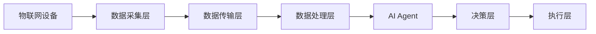
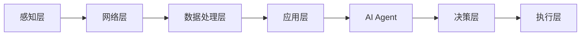

                 


# AI Agent与物联网的结合应用

> 关键词：AI Agent, 物联网, 智能系统, 数学模型, 强化学习, 系统架构, 项目实战

> 摘要：本文将详细探讨AI Agent与物联网的结合应用，从基本概念、核心原理、数学模型、系统架构到项目实战，全面解析两者的结合方式和实际应用。通过理论分析与实践案例的结合，揭示AI Agent如何赋能物联网，实现智能化的系统设计与优化。

---

# 第一部分: AI Agent与物联网的结合概述

## 第1章: AI Agent与物联网的概述

### 1.1 AI Agent的基本概念

#### 1.1.1 AI Agent的定义与分类

AI Agent（人工智能代理）是指在计算机系统中，能够感知环境、自主决策并采取行动以实现目标的智能实体。根据其智能水平和应用场景，AI Agent可以分为以下几类：

- **反应式Agent**：基于当前感知做出反应，不依赖于环境的历史信息。
- **认知式Agent**：具备推理、规划和学习能力，能够理解复杂环境并做出决策。
- **学习式Agent**：通过与环境的交互不断优化自身的行为策略。

#### 1.1.2 AI Agent的核心特征

AI Agent的核心特征包括：

1. **自主性**：能够自主决策和行动，无需外部干预。
2. **反应性**：能够实时感知环境并做出反应。
3. **目标导向性**：行为以实现特定目标为导向。
4. **学习能力**：通过与环境的交互不断优化自身行为。

#### 1.1.3 AI Agent与传统程序的区别

AI Agent与传统程序的主要区别在于其智能性和自主性。传统程序通常是基于规则的反应式系统，而AI Agent具备学习和推理能力，能够处理复杂和不确定的环境。

### 1.2 物联网的基本概念

#### 1.2.1 物联网的定义与架构

物联网（Internet of Things，IoT）是指通过各种信息传感设备，如传感器、射频识别（RFID）、全球定位系统（GPS）、红外感应器等，按照约定的协议，把任何物品与互联网连接起来，进行信息交换和通信，以实现智能化识别、定位、跟踪、监控和管理。

物联网的典型架构包括以下三个层次：

1. **感知层**：通过传感器和执行器与物理世界交互。
2. **网络层**：通过通信网络传输数据。
3. **应用层**：对数据进行处理和应用。

#### 1.2.2 物联网的关键技术

物联网的关键技术包括：

- **感知技术**：如传感器技术、RFID等。
- **通信技术**：如Wi-Fi、蓝牙、ZigBee等。
- **数据处理技术**：如大数据分析、边缘计算等。

#### 1.2.3 物联网的应用场景

物联网的应用场景非常广泛，包括智能家居、智慧城市、工业自动化、医疗健康等领域。

### 1.3 AI Agent与物联网的结合意义

#### 1.3.1 结合的必要性

随着物联网的快速发展，数据的产生量和复杂性不断增加，传统的基于规则的系统难以应对复杂的动态环境。AI Agent的引入可以弥补这一不足，通过智能化的决策和行动，提高系统的效率和灵活性。

#### 1.3.2 结合的优势

AI Agent与物联网的结合主要体现在以下几个方面：

1. **智能化决策**：通过AI Agent的自主决策能力，实现更高效的资源管理和优化。
2. **实时响应**：AI Agent能够实时感知环境并做出反应，提高系统的实时性。
3. **自适应能力**：AI Agent具备学习能力，能够适应环境的变化。

#### 1.3.3 结合的应用前景

AI Agent与物联网的结合将推动智能系统的广泛应用，如智能交通、智能医疗、智能农业等。通过两者的结合，可以实现更高效、更智能的系统设计。

---

## 第2章: AI Agent与物联网的核心概念与联系

### 2.1 AI Agent的核心原理

#### 2.1.1 智能体的感知与决策机制

AI Agent的感知机制通过传感器或其他信息源获取环境信息，决策机制基于感知信息和内部状态，选择最优行动方案。

#### 2.1.2 AI Agent的行动方式

AI Agent的行动方式包括：

1. **执行动作**：根据决策结果执行具体动作。
2. **与环境交互**：通过执行动作影响环境，获取新的感知信息。

#### 2.1.3 AI Agent的学习与自适应能力

AI Agent通过与环境的交互学习，优化自身的决策策略，提高系统的适应性和智能性。

### 2.2 物联网的核心技术

#### 2.2.1 感知层技术

感知层技术主要通过传感器获取环境数据，如温度、湿度、光照强度等。

#### 2.2.2 网络层技术

网络层技术负责数据的传输，包括有线和无线通信技术。

#### 2.2.3 应用层技术

应用层技术对数据进行处理和应用，如数据分析、决策支持等。

### 2.3 AI Agent与物联网的实体关系图



---

## 第3章: AI Agent与物联网的数学模型与算法原理

### 3.1 强化学习算法

#### 3.1.1 强化学习的定义

强化学习是一种机器学习范式，通过智能体与环境的交互，学习最优策略以最大化累积奖励。

#### 3.1.2 强化学习的数学模型

强化学习的核心是马尔可夫决策过程（MDP），定义如下：

- **状态空间**：$S$，表示环境的状态。
- **动作空间**：$A$，表示智能体可以执行的动作。
- **奖励函数**：$R: S \times A \rightarrow \mathbb{R}$，定义在状态-动作对上的奖励。
- **策略**：$\pi: S \rightarrow A$，定义智能体在状态$s$时选择动作$a$的概率分布。

#### 3.1.3 强化学习的算法实现

```python
class DQN:
    def __init__(self, state_space, action_space, gamma=0.99, epsilon=1.0):
        self.state_space = state_space
        self.action_space = action_space
        self.gamma = gamma
        self.epsilon = epsilon
        # 省略网络结构和其他参数

    def perceive(self, state, action, reward, next_state):
        # 将经验存储在经验回放池中
        pass

    def choose_action(self, state):
        # 根据epsilon-greedy策略选择动作
        if random.random() < self.epsilon:
            return random.choice(self.action_space)
        else:
            return self.predict(state)

    def train(self):
        # 从经验回放池中采样一批经验，更新神经网络
        pass
```

#### 3.1.4 强化学习的应用场景

在物联网中，强化学习可以应用于资源分配、路径规划等问题。

---

## 第4章: AI Agent与物联网的系统架构设计

### 4.1 系统整体架构

AI Agent与物联网的结合通常采用分层架构，包括感知层、网络层、数据处理层和应用层。

### 4.2 系统功能设计

系统功能设计包括数据采集、数据传输、数据处理和智能决策四个部分。

### 4.3 系统架构图



---

## 第5章: AI Agent与物联网的项目实战

### 5.1 环境搭建

需要安装Python、TensorFlow、Keras等工具。

### 5.2 核心代码实现

以下是一个简单的AI Agent实现：

```python
import numpy as np
import random

class AI_Agent:
    def __init__(self, state_dim, action_dim):
        self.state_dim = state_dim
        self.action_dim = action_dim
        # 初始化神经网络

    def perceive(self, state, action, reward, next_state):
        # 将经验存储在经验回放池中

    def choose_action(self, state):
        # 选择动作
        return random.choice(range(self.action_dim))

    def train(self):
        # 更新神经网络
        pass
```

### 5.3 系统功能实现

系统功能包括数据采集、数据传输、数据处理和智能决策。

### 5.4 系统测试与优化

通过实验验证系统的性能，并根据测试结果进行优化。

---

## 第6章: 总结与展望

### 6.1 当前的应用现状

AI Agent与物联网的结合已经在智能家居、智能交通等领域得到了广泛应用。

### 6.2 未来的发展趋势

未来，随着AI Agent的智能化和物联网的普及，两者的结合将更加深入，推动智能系统的进一步发展。

### 6.3 实际应用中的注意事项

在实际应用中，需要注意系统的实时性、安全性和可扩展性。

---

# 作者：AI天才研究院 & 禅与计算机程序设计艺术

---

通过以上思考过程，我们可以清晰地看到AI Agent与物联网的结合应用的各个方面，从理论到实践，从概念到实现，全面解析两者的结合方式和实际应用。

