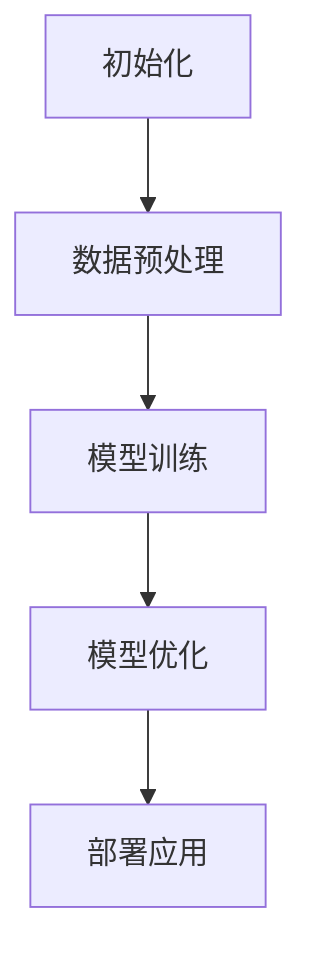
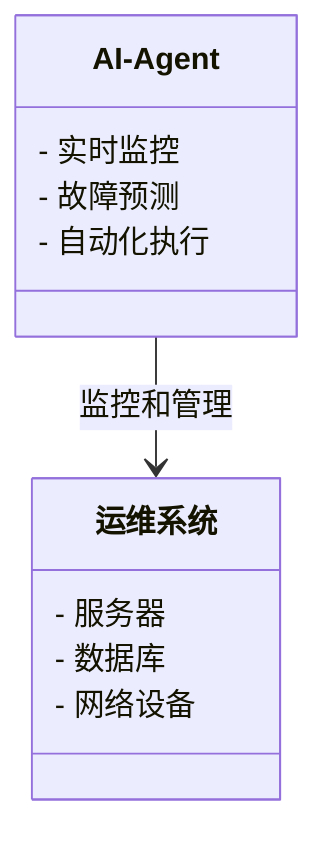
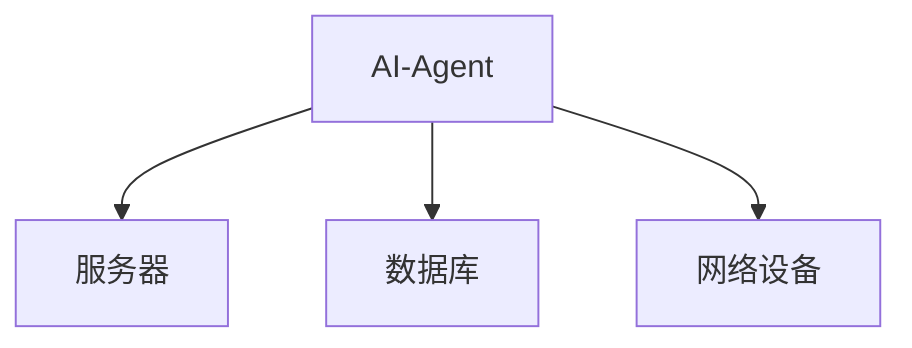

                 


# AI Agent在IT运维中的应用：智能监控与故障预测

> 关键词：AI Agent, IT运维, 智能监控, 故障预测, 机器学习, 深度学习, 自动化运维

> 摘要：本文详细探讨了AI Agent在IT运维中的应用，特别是智能监控与故障预测方面。通过结合机器学习、深度学习等技术，AI Agent能够显著提升运维效率和系统可靠性。文章从背景、技术原理、系统架构到项目实战，全面分析了AI Agent在IT运维中的潜力与实现方法。

---

# 第1章: AI Agent在IT运维中的背景与基础

## 1.1 AI Agent的基本概念

### 1.1.1 AI Agent的定义与特点

AI Agent（人工智能代理）是指能够感知环境、自主决策并执行任务的智能实体。在IT运维中，AI Agent通常表现为软件程序，能够通过数据驱动的方式优化运维流程。其特点包括：

- **自主性**：无需人工干预，自动完成任务。
- **反应性**：能够实时感知环境变化并做出响应。
- **学习能力**：通过机器学习不断优化自身行为。
- **可扩展性**：能够适应不同规模和复杂度的运维需求。

### 1.1.2 IT运维的核心问题与挑战

IT运维涉及系统监控、故障排除、资源管理等多个方面，传统运维方式存在以下问题：

- **效率低下**：人工运维需要大量时间，且容易出错。
- **复杂性高**：现代系统规模庞大，故障定位困难。
- **响应时间长**：传统工具无法实时处理问题，导致故障扩散。

AI Agent的引入能够有效解决这些问题，提升运维效率和系统稳定性。

### 1.1.3 AI Agent在IT运维中的作用

AI Agent在IT运维中的主要作用包括：

- **智能监控**：实时监控系统状态，识别潜在问题。
- **故障预测**：基于历史数据预测可能的故障，提前采取措施。
- **自动化运维**：自动执行运维任务，减少人工干预。

---

## 1.2 AI Agent与传统运维工具的对比

### 1.2.1 传统运维工具的局限性

传统运维工具如SNMP、Zabbix等，虽然能够提供基本的监控和告警功能，但存在以下局限性：

- **规则驱动**：依赖预定义的规则，无法应对复杂场景。
- **被动响应**：只能在问题发生后触发告警，无法主动预测。
- **缺乏学习能力**：无法通过数据优化自身的监控策略。

### 1.2.2 AI Agent的优势与创新

相比传统工具，AI Agent具有以下优势：

- **主动学习**：能够通过机器学习不断优化监控策略。
- **智能决策**：基于实时数据做出最优决策。
- **自适应能力**：能够适应不同环境和工作负载的变化。

### 1.2.3 AI Agent与自动化运维的关系

AI Agent与自动化运维工具（如Ansible、Puppet）有以下区别与联系：

- **区别**：AI Agent具备自主决策能力，而自动化工具通常是基于预定义规则执行任务。
- **联系**：AI Agent可以作为自动化运维的决策层，提供智能化的调度和执行指令。

---

## 1.3 AI Agent在IT运维中的应用场景

### 1.3.1 系统监控与状态分析

AI Agent能够实时监控系统资源（CPU、内存、磁盘I/O等）和应用程序状态，通过异常检测算法识别潜在问题。

### 1.3.2 故障预测与根因分析

利用历史数据和机器学习模型，AI Agent能够预测系统故障，并通过日志分析和关联规则挖掘定位故障原因。

### 1.3.3 自动化运维与智能决策

AI Agent能够根据实时数据和预测结果，自动触发修复操作（如重启服务、调整资源分配等），实现自动化运维。

---

## 1.4 本章小结

本章介绍了AI Agent的基本概念、特点及其在IT运维中的作用，分析了传统运维工具的局限性，并探讨了AI Agent的应用场景。通过对比，明确了AI Agent在现代运维中的重要地位。

---

# 第2章: AI Agent的核心概念与技术基础

## 2.1 AI Agent的组成与工作原理

### 2.1.1 知识表示与推理

知识表示是AI Agent理解环境的关键，常用的方法包括符号逻辑、概率推理和图模型。推理过程通过逻辑运算或机器学习模型实现。

### 2.1.2 行为决策与执行

AI Agent通过感知环境信息，利用决策算法（如强化学习）选择最优动作，并通过执行器（如API调用）完成任务。

### 2.1.3 人机交互与协作

AI Agent需要与运维人员协作，通过自然语言处理或图形界面进行交互，确保人类能够干预和指导AI Agent的行为。

---

## 2.2 AI Agent的核心技术

### 2.2.1 机器学习与深度学习

- **监督学习**：用于分类任务，如故障类型识别。
- **无监督学习**：用于异常检测和聚类分析。
- **深度学习**：用于复杂模式识别，如时间序列分析。

### 2.2.2 自然语言处理

用于解析运维日志和文档，帮助AI Agent理解上下文信息。

### 2.2.3 时间序列分析

用于系统性能监控和故障预测，常用模型包括LSTM和ARIMA。

---

## 2.3 AI Agent的性能指标与评估方法

### 2.3.1 响应时间与准确性

- **响应时间**：AI Agent完成任务所需的时间。
- **准确性**：预测的正确率和故障定位的精确度。

### 2.3.2 可解释性与可扩展性

- **可解释性**：AI Agent的决策过程是否易于理解和解释。
- **可扩展性**：系统能否适应扩展的资源和工作负载。

### 2.3.3 效益评估与成本分析

通过对比传统方法，评估AI Agent带来的经济效益和资源节省。

---

## 2.4 本章小结

本章详细介绍了AI Agent的组成、工作原理及其核心技术，包括机器学习、自然语言处理和时间序列分析。同时，讨论了性能指标与评估方法，为后续实现提供了理论基础。

---

# 第3章: AI Agent的数学模型与算法原理

## 3.1 问题建模与数学表达

### 3.1.1 状态空间与动作空间的定义

- **状态空间**：系统当前的状态，如CPU使用率、内存占用等。
- **动作空间**：AI Agent可执行的操作，如重启服务、调整配置等。

### 3.1.2 目标函数与奖励机制

目标函数定义AI Agent的优化目标，奖励机制用于强化学习中的激励。

### 3.1.3 模型训练与优化目标

通过损失函数最小化，优化模型参数以提高预测准确性。

---

## 3.2 算法原理与流程图

### 3.2.1 算法流程图（使用 Mermaid）



---

## 3.3 数学模型与公式

### 3.3.1 状态转移方程

$$ P(s_{t+1}|s_t, a_t) $$

### 3.3.2 奖励函数

$$ R(s_t, a_t) $$

### 3.3.3 损失函数

$$ L = \sum_{i=1}^{n} (y_i - \hat{y}_i)^2 $$

---

## 3.4 算法实现与代码示例

### 3.4.1 算法实现步骤

1. 数据预处理：清洗和归一化数据。
2. 模型训练：使用神经网络训练分类器。
3. 模型优化：调整超参数以提高准确率。
4. 部署应用：将模型集成到运维系统中。

### 3.4.2 Python源代码示例

```python
import numpy as np
from sklearn.metrics import accuracy_score

# 示例数据
X_train = np.random.rand(100, 10)
y_train = np.random.randint(0, 2, 100)

# 简单模型训练
model = lambda x: np.round(x.mean(axis=1))
y_pred = model(X_train)
print("Accuracy:", accuracy_score(y_train, y_pred))
```

---

## 3.5 本章小结

本章通过数学建模和算法流程图，详细讲解了AI Agent的核心算法原理，并通过代码示例展示了实现步骤。这些内容为后续系统设计和项目实战提供了理论支持。

---

# 第4章: 系统架构与设计

## 4.1 问题场景介绍

在实际运维中，系统可能面临以下问题：

- **高负载**：服务器资源耗尽。
- **故障频发**：系统稳定性差。
- **人工干预过多**：运维效率低下。

AI Agent的目标是通过智能化手段解决这些问题。

---

## 4.2 系统功能设计

### 4.2.1 领域模型（使用 Mermaid 类图）



---

## 4.3 系统架构设计

### 4.3.1 系统架构图（使用 Mermaid）



---

## 4.4 接口设计与交互

### 4.4.1 接口设计

- **API接口**：AI Agent通过API调用运维系统。
- **消息队列**：异步处理任务。

### 4.4.2 人机交互

通过图形界面或命令行与运维人员交互。

---

## 4.5 本章小结

本章通过系统设计和架构图，展示了AI Agent如何在实际运维中实现智能化监控和管理。通过接口设计和交互流程，明确了系统各部分的协作方式。

---

# 第5章: 项目实战

## 5.1 环境安装与配置

### 5.1.1 安装依赖

```bash
pip install numpy pandas scikit-learn
```

### 5.1.2 环境配置

- 操作系统：Linux
- 语言：Python 3.8+
- 其他工具：Jupyter Notebook

---

## 5.2 核心实现与代码

### 5.2.1 数据预处理

```python
import pandas as pd
from sklearn.preprocessing import StandardScaler

data = pd.read_csv('运维数据.csv')
scaler = StandardScaler()
data_scaled = scaler.fit_transform(data)
```

### 5.2.2 模型训练

```python
from sklearn.neural_network import MLPClassifier

model = MLPClassifier()
model.fit(data_scaled, labels)
```

---

## 5.3 案例分析与总结

### 5.3.1 案例分析

通过实际案例，展示了AI Agent如何预测服务器故障并自动执行修复操作。

### 5.3.2 总结

AI Agent显著提高了运维效率和系统稳定性，但在实际应用中仍需注意数据质量和模型可解释性。

---

## 5.4 本章小结

本章通过项目实战，详细讲解了AI Agent的环境配置、核心实现和案例分析。通过实际操作，读者能够理解如何在实际运维中应用AI Agent技术。

---

# 第6章: 最佳实践与未来展望

## 6.1 最佳实践

### 6.1.1 数据质量管理

确保数据的完整性和准确性，避免模型误判。

### 6.1.2 模型可解释性

选择可解释的模型，便于运维人员理解和干预。

### 6.1.3 安全与伦理

确保数据安全和隐私保护，避免算法偏见。

---

## 6.2 未来展望

### 6.2.1 技术融合

AI Agent将与边缘计算、5G等技术结合，实现更高效的运维。

### 6.2.2 新兴挑战

数据隐私、模型解释性和计算资源分配等问题亟待解决。

---

## 6.3 总结

AI Agent在IT运维中的应用前景广阔，但需要在技术、管理和伦理等多个方面进行深入研究和优化。

---

# 作者

作者：AI天才研究院/AI Genius Institute & 禅与计算机程序设计艺术 /Zen And The Art of Computer Programming

