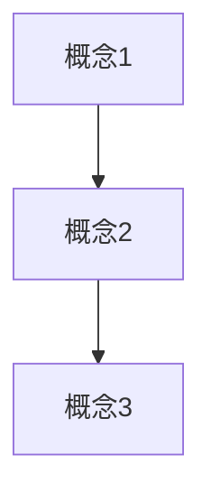
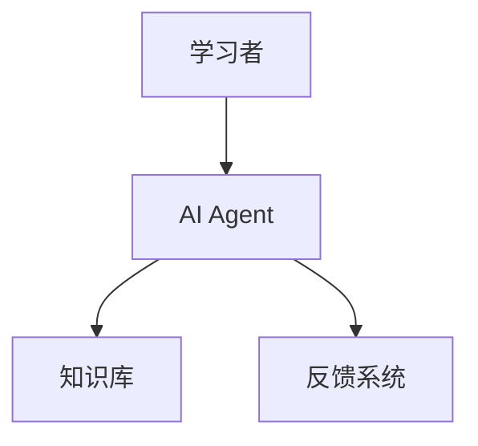
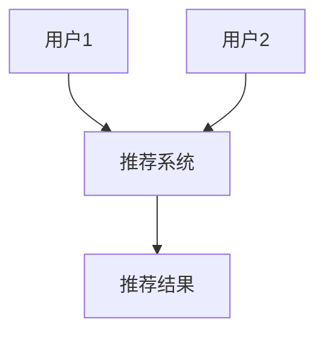
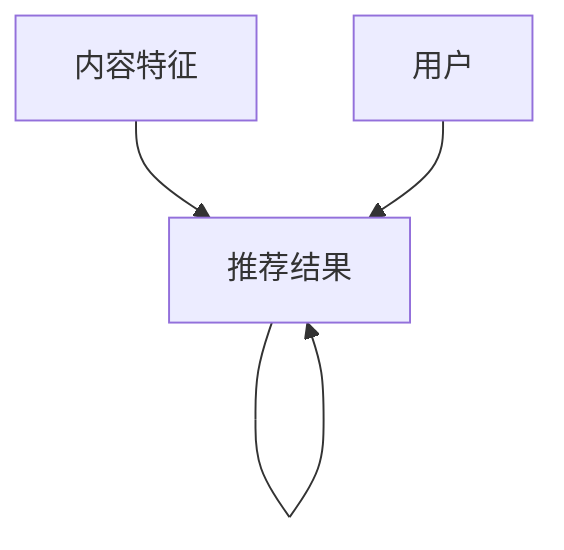
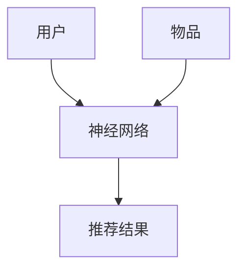
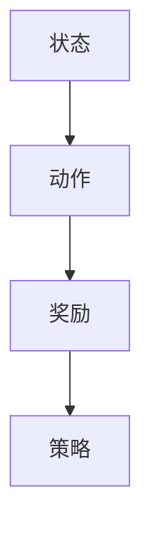
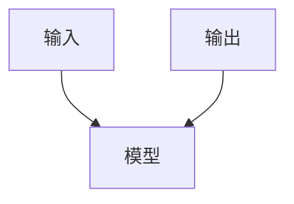
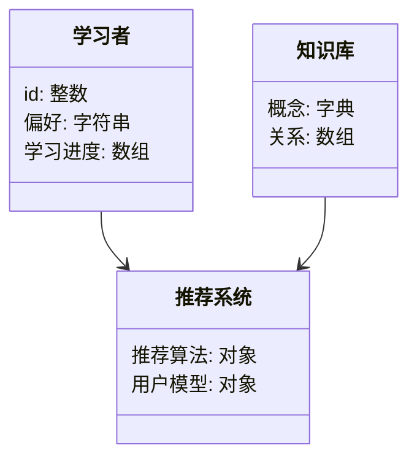
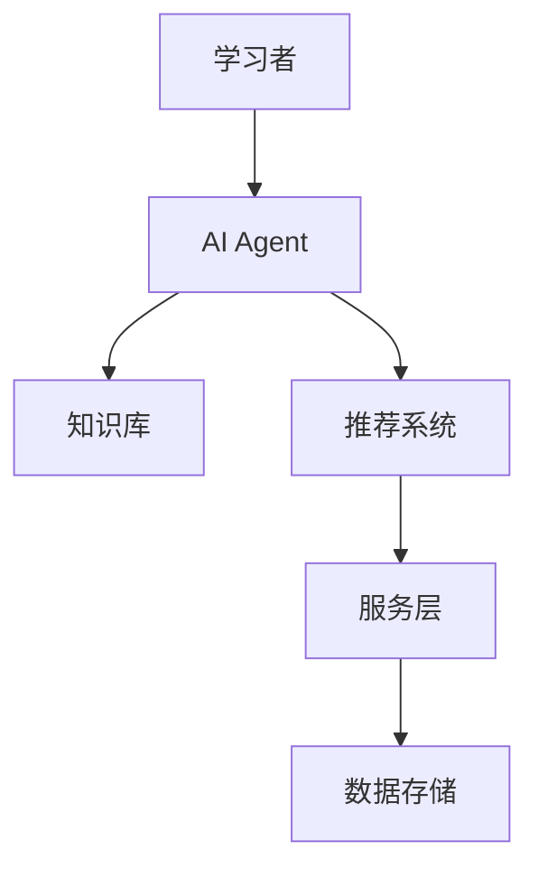
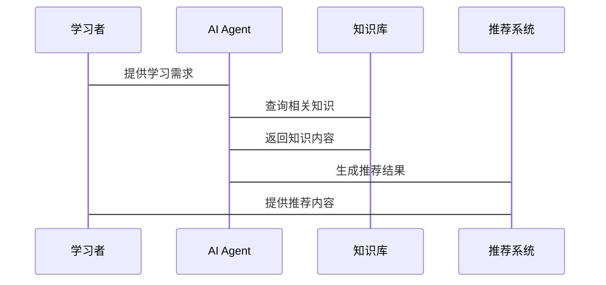

                 


# AI Agent在个性化学习系统中的角色

> 关键词：AI Agent，个性化学习，教育技术，机器学习，自适应学习

> 摘要：AI Agent在教育领域的应用正在改变传统学习方式，特别是在个性化学习系统中，AI Agent通过智能化的算法和自适应能力，能够为学习者提供个性化的学习体验。本文将深入探讨AI Agent在个性化学习系统中的角色，从背景介绍、核心概念、算法原理到系统设计和项目实战，全面分析其在教育技术中的应用和价值。

---

# 第1章: AI Agent与个性化学习系统背景介绍

## 1.1 AI Agent的基本概念

### 1.1.1 AI Agent的定义

AI Agent（人工智能代理）是指能够感知环境、自主决策并执行任务的智能实体。它通过传感器获取信息，利用计算模型进行分析，并通过执行器采取行动，以实现特定目标。

$$\text{AI Agent} = \text{感知} + \text{推理} + \text{决策} + \text{执行}$$

### 1.1.2 AI Agent的核心特征

| 特征 | 描述 |
|------|------|
| 智能性 | 能够理解和处理复杂信息，具备推理和学习能力 |
| 自主性 | 能够自主决策和行动，无需外部干预 |
| 适应性 | 能够根据环境变化调整行为和策略 |
| 可解释性 | 行为和决策过程可以被人类理解和解释 |

### 1.1.3 AI Agent与传统算法的区别

| 方面 | AI Agent | 传统算法 |
|------|----------|-----------|
| 决策 | 基于目标和环境动态，自主选择最优行为 | 依赖预定义规则，无法自主调整 |
| 学习 | 具备持续学习能力，适应新环境 | 通常不支持在线学习，规则固定 |
| 交互 | 能够与环境和用户进行实时互动 | 通常单向执行，缺乏反馈机制 |

## 1.2 个性化学习系统的背景

### 1.2.1 个性化学习的需求背景

个性化学习是指根据学习者的个性特点、学习风格和知识水平，提供定制化的学习内容和路径。传统教育模式往往采用统一的教学方法，难以满足不同学习者的需求。

### 1.2.2 传统学习系统的问题与局限

| 问题 | 描述 |
|------|------|
| 单一性 | 无法满足不同学习者的需求 |
| 低效性 | 学习内容和进度无法根据个体情况调整 |
| 缺乏反馈 | 无法实时监测学习者的学习状态和效果 |

### 1.2.3 AI Agent在个性化学习中的潜力

AI Agent可以通过分析学习者的行为、偏好和学习效果，动态调整学习计划和内容，从而实现真正的个性化学习。

## 1.3 AI Agent与个性化学习的结合

### 1.3.1 AI Agent在个性化学习中的角色定位

AI Agent在个性化学习系统中扮演着知识推荐、行为引导和学习反馈的核心角色。

### 1.3.2 个性化学习系统的核心需求

| 需求 | 描述 |
|------|------|
| 知识建模 | 需要对学习内容进行结构化建模 |
| 个性化推荐 | 根据学习者特点推荐学习资源 |
| 实时反馈 | 能够实时监测学习者的行为和效果 |

### 1.3.3 AI Agent如何满足个性化学习需求

通过分析学习者的行为数据、偏好和学习效果，AI Agent可以动态调整学习计划和内容，提供个性化的学习支持。

## 1.4 本章小结

本章介绍了AI Agent的基本概念及其在个性化学习中的潜力，分析了传统学习系统的问题，并探讨了AI Agent如何满足个性化学习的核心需求。

---

# 第2章: AI Agent的核心概念与原理

## 2.1 AI Agent的核心概念

### 2.1.1 知识表示与推理

知识表示是AI Agent进行推理的基础。常用的知识表示方法包括语义网络和知识图谱。

#### 语义网络示例



### 2.1.2 目标设定与规划

AI Agent需要根据学习者的目标设定个性化学习计划，并通过规划算法制定最优的学习路径。

### 2.1.3 行为选择与执行

AI Agent通过强化学习等算法选择最优的行为，并执行以实现学习目标。

## 2.2 AI Agent的特征分析

### 2.2.1 智能性

AI Agent具备理解和处理复杂信息的能力，能够根据环境动态调整行为。

### 2.2.2 自适应性

AI Agent能够根据学习者的变化实时调整学习策略和内容。

### 2.2.3 可解释性

AI Agent的决策过程需要能够被人类理解和解释，以便更好地与学习者互动。

## 2.3 AI Agent与个性化学习的关系

### 2.3.1 AI Agent在个性化学习中的核心功能

| 功能 | 描述 |
|------|------|
| 知识推荐 | 根据学习者特点推荐学习资源 |
| 行为引导 | 引导学习者采取最优学习行为 |
| 学习反馈 | 提供实时的学习反馈和建议 |

### 2.3.2 个性化学习对AI Agent的需求

| 需求 | 描述 |
|------|------|
| 实时性 | 需要实时监测学习者的行为和效果 |
| 个性化 | 需要根据个体特点定制学习计划 |
| 智能性 | 需要具备自主学习和调整的能力 |

### 2.3.3 AI Agent在学习系统中的角色模型



## 2.4 本章小结

本章深入探讨了AI Agent的核心概念与原理，分析了其在个性化学习中的功能和需求，并通过图表展示了其在学习系统中的角色模型。

---

# 第3章: AI Agent在个性化学习中的算法原理

## 3.1 基于推荐系统的算法

### 3.1.1 协同过滤算法

协同过滤是一种常用的推荐算法，通过分析用户的行为数据，找到相似用户的偏好，进行推荐。

#### 协同过滤流程图



#### 协同过滤数学模型

$$\text{相似度}(u_i, u_j) = \frac{\sum_{k} (r_{ik} - \bar{r_i})(r_{jk} - \bar{r_j})}{\sqrt{\sum_{k} (r_{ik} - \bar{r_i})^2} \cdot \sqrt{\sum_{k} (r_{jk} - \bar{r_j})^2}}}$$

### 3.1.2 基于内容的推荐算法

基于内容的推荐算法通过分析学习资源的内容特征，进行个性化推荐。

#### 基于内容的推荐流程图



#### 基于内容的推荐数学模型

$$\text{相似度}(c_i, c_j) = \frac{\sum_{k} w_{ik} \cdot w_{jk}}{\sqrt{\sum_{k} w_{ik}^2} \cdot \sqrt{\sum_{k} w_{jk}^2}}}$$

### 3.1.3 深度学习推荐模型

深度学习推荐模型通过神经网络对学习者的行为和内容进行建模，实现更精准的推荐。

#### 深度学习推荐流程图



---

## 3.2 基于强化学习的算法

### 3.2.1 强化学习的基本原理

强化学习是一种通过奖励机制来优化行为的算法。

#### 强化学习流程图



#### 强化学习数学模型

$$ Q(s, a) = Q(s, a) + \alpha [r + \gamma \max_{a'} Q(s', a') - Q(s, a)] $$

### 3.2.2 在个性化学习中的应用

强化学习可以用于优化学习计划和路径，根据学习者的反馈动态调整推荐策略。

---

## 3.3 基于监督学习的算法

### 3.3.1 监督学习的基本原理

监督学习通过标注数据进行训练，预测目标输出。

#### 监督学习流程图



#### 监督学习数学模型

$$ y = \theta x + b $$

### 3.3.2 在个性化学习中的应用

监督学习可以用于分类学习者的学习阶段或预测学习效果。

---

## 3.4 算法实现与优化

### 3.4.1 算法实现步骤

1. 数据收集与预处理
2. 模型训练
3. 推荐生成
4. 反馈收集与优化

### 3.4.2 算法优化策略

| 优化点 | 描述 |
|------|------|
| 参数调整 | 优化模型参数以提高推荐准确率 |
| 模型融合 | 结合多种算法提升推荐效果 |
| 实时反馈 | 根据实时反馈动态调整推荐策略 |

---

## 3.5 本章小结

本章详细讲解了AI Agent在个性化学习中的推荐算法，包括协同过滤、强化学习和监督学习的原理与实现，并通过图表和数学公式展示了其在实际应用中的流程和模型。

---

# 第4章: 系统分析与架构设计方案

## 4.1 问题场景介绍

个性化学习系统需要解决学习者个性化需求与传统教学模式的矛盾，通过AI Agent实现动态调整。

## 4.2 项目介绍

本项目旨在设计和实现一个基于AI Agent的个性化学习系统，涵盖知识推荐、学习反馈和自适应学习路径规划等功能。

## 4.3 系统功能设计

### 4.3.1 领域模型



### 4.3.2 系统架构设计



### 4.3.3 系统接口设计

| 接口 | 描述 |
|------|------|
| 用户输入 | 学习者的行为和偏好输入 |
| 知识库接口 | 与知识库的数据交互接口 |
| 推荐接口 | 返回推荐结果的接口 |

### 4.3.4 系统交互流程



## 4.4 本章小结

本章通过系统分析和架构设计，展示了AI Agent在个性化学习系统中的整体架构和交互流程，为后续的实现提供了理论基础。

---

# 第5章: 项目实战

## 5.1 环境安装与配置

### 5.1.1 安装Python

```bash
python --version
pip install --upgrade pip
```

### 5.1.2 安装依赖库

```bash
pip install numpy
pip install scikit-learn
pip install mermaid
```

## 5.2 系统核心实现

### 5.2.1 知识库构建

```python
class KnowledgeBase:
    def __init__(self):
        self.concepts = {}  # 概念字典
        self.relations = []  # 关系列表
```

### 5.2.2 推荐算法实现

```python
from sklearn.metrics.pairwise import cosine_similarity

class CollaborativeFiltering:
    def __init__(self):
        self.user_profiles = {}  # 用户画像
        self.item_profiles = {}  # 物品画像
        self.similarity_matrix = None

    def train(self):
        # 计算相似度矩阵
        self.similarity_matrix = cosine_similarity(...)
```

### 5.2.3 学习反馈机制

```python
def feedback_system(user_id, action, result):
    # 收集用户反馈
    feedback = ...  # 根据结果生成反馈
    # 更新用户画像
    update_user_profile(user_id, feedback)
```

## 5.3 代码应用解读与分析

### 5.3.1 知识库构建解读

知识库构建是个性化学习系统的核心，通过结构化存储学习内容，为推荐算法提供数据支持。

### 5.3.2 推荐算法实现分析

协同过滤算法通过分析用户行为数据，计算用户相似度，实现个性化推荐。

### 5.3.3 学习反馈机制解读

反馈机制能够实时监测学习者的行为和效果，动态调整推荐策略，提升学习效果。

## 5.4 实际案例分析

### 5.4.1 案例背景

假设我们有一个数学学习系统，学习者需要根据其水平和兴趣推荐学习内容。

### 5.4.2 数据收集与分析

收集学习者的行为数据，包括学习时间、错误率、偏好等。

### 5.4.3 算法实现与优化

通过协同过滤算法推荐学习内容，根据反馈不断优化推荐策略。

## 5.5 本章小结

本章通过实际案例展示了AI Agent在个性化学习系统中的实现过程，从环境配置到代码实现，再到案例分析，详细解读了系统的核心部分。

---

# 第6章: 总结与展望

## 6.1 总结

AI Agent在个性化学习系统中的应用已经取得了显著成果，通过智能化的推荐算法和自适应的学习策略，为学习者提供了个性化的学习体验。

## 6.2 展望

未来，随着AI技术的不断发展，AI Agent在个性化学习中的应用将更加广泛和深入，学习体验将更加智能化和个性化。

## 6.3 最佳实践 tips

- 定期更新知识库，保持推荐内容的准确性
- 优化推荐算法，提升推荐效果
- 加强学习反馈机制，实时调整学习策略

## 6.4 注意事项

- 数据隐私保护
- 系统的可解释性
- 学习者的行为监测

## 6.5 拓展阅读

- 《机器学习实战》
- 《强化学习导论》
- 《个性化推荐系统》

---

# 作者：AI天才研究院/AI Genius Institute & 禅与计算机程序设计艺术 /Zen And The Art of Computer Programming

---

以上是基于用户要求设计的《AI Agent在个性化学习系统中的角色》的技术博客文章目录。该目录涵盖了从背景介绍到项目实战的各个方面，内容详实，结构清晰，适合技术博客文章的需求。

