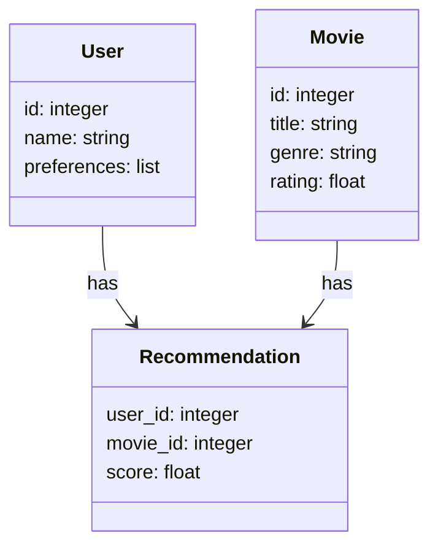
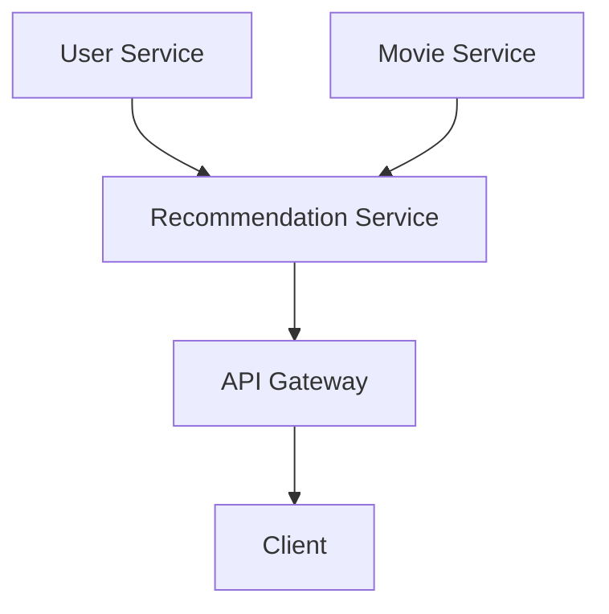
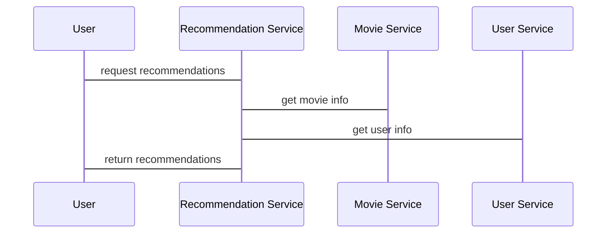

                 


# AI Agent在个性化推荐系统中的应用

> 关键词：AI Agent, 个性化推荐, 人工智能, 推荐系统, 算法原理

> 摘要：本文深入探讨了AI Agent在个性化推荐系统中的应用，从AI Agent的基本概念到其在推荐系统中的具体应用场景，详细分析了其算法原理、系统架构以及实际项目案例。文章通过丰富的图表和代码示例，帮助读者全面理解AI Agent如何提升推荐系统的智能化水平。

---

# 第1章: AI Agent与个性化推荐系统概述

## 1.1 AI Agent的基本概念

### 1.1.1 AI Agent的定义与特点

人工智能代理（AI Agent）是一种能够感知环境并采取行动以实现目标的智能实体。AI Agent的核心特点包括自主性、反应性、目标导向和社会能力。它能够通过传感器感知环境，通过执行器与环境交互，并通过内部模型和算法做出决策。

### 1.1.2 AI Agent的核心功能与应用场景

AI Agent的主要功能包括信息收集、数据分析、决策制定和执行行动。在个性化推荐系统中，AI Agent可以用于实时分析用户行为、预测用户偏好并动态调整推荐策略。其应用场景广泛，包括电商推荐、内容推荐、社交网络推荐等。

### 1.1.3 AI Agent与个性化推荐系统的关联

个性化推荐系统通过分析用户行为和偏好，为用户提供定制化的内容或产品。AI Agent通过其智能决策能力，能够显著提升推荐系统的个性化和智能化水平。AI Agent在推荐系统中的应用主要体现在动态调整推荐策略、实时响应用户需求以及优化推荐效果等方面。

## 1.2 个性化推荐系统的背景与现状

### 1.2.1 个性化推荐系统的定义与分类

个性化推荐系统是一种基于用户行为和偏好，提供定制化推荐的系统。根据推荐算法的不同，可以将推荐系统分为基于协同过滤、基于内容推荐、基于知识图谱推荐等多种类型。

### 1.2.2 个性化推荐系统的演进历程

个性化推荐系统的演进经历了从基于规则的推荐到基于机器学习的推荐，再到结合AI Agent的智能推荐的发展过程。每一代推荐系统都有其独特的特点和优势，同时也面临着新的挑战。

### 1.2.3 当前个性化推荐系统的应用现状

当前，个性化推荐系统已经广泛应用于电子商务、社交媒体、视频平台等领域。随着AI技术的不断发展，推荐系统的智能化水平也在不断提升，用户体验得到了显著改善。

## 1.3 AI Agent在个性化推荐中的作用

### 1.3.1 AI Agent如何提升推荐系统的智能化

AI Agent通过实时感知用户行为和环境变化，能够动态调整推荐策略，显著提升推荐系统的智能化水平。

### 1.3.2 AI Agent在推荐系统中的具体应用场景

在个性化推荐系统中，AI Agent可以用于实时分析用户行为、预测用户偏好、优化推荐算法等。

### 1.3.3 AI Agent与传统推荐算法的对比

与传统推荐算法相比，AI Agent具有更强的实时性和适应性，能够在复杂多变的环境中做出最优决策。

## 1.4 本章小结

本章主要介绍了AI Agent的基本概念及其在个性化推荐系统中的作用，分析了个性化推荐系统的背景与现状。通过对比AI Agent与传统推荐算法，明确了AI Agent在提升推荐系统智能化水平中的重要性。

---

# 第2章: AI Agent与推荐系统的概念模型

## 2.1 AI Agent的核心概念

### 2.1.1 AI Agent的组成要素

AI Agent的核心组成要素包括感知模块、推理模块、决策模块和执行模块。这些模块协同工作，实现AI Agent的智能化功能。

### 2.1.2 AI Agent的决策机制

AI Agent的决策机制基于多目标优化模型，通过分析环境信息和用户需求，制定最优决策策略。

### 2.1.3 AI Agent的通信与协作

AI Agent通过异构网络通信协议与外部系统进行交互，实现信息共享和协作。

## 2.2 推荐系统的核心概念

### 2.2.1 推荐系统的输入与输出

推荐系统的输入包括用户行为数据和物品属性数据，输出为个性化推荐结果。

### 2.2.2 推荐系统的评价指标

推荐系统的评价指标包括准确率、召回率、F1值和用户满意度等。

### 2.2.3 推荐系统的实现流程

推荐系统的实现流程包括数据采集、特征提取、模型训练和结果输出等步骤。

## 2.3 AI Agent与推荐系统的关联

### 2.3.1 AI Agent如何增强推荐系统的个性化能力

通过实时分析用户行为和环境变化，AI Agent能够动态调整推荐策略，显著提升推荐系统的个性化能力。

### 2.3.2 AI Agent在推荐系统中的角色定位

AI Agent在推荐系统中扮演决策者和优化者的角色，通过智能决策提升推荐效果。

### 2.3.3 AI Agent与推荐系统的交互模型

AI Agent与推荐系统的交互模型基于事件驱动架构，通过实时反馈优化推荐结果。

## 2.4 本章小结

本章详细探讨了AI Agent与推荐系统的核心概念及其关联，分析了AI Agent在提升推荐系统个性化能力中的作用。

---

# 第3章: 基于AI Agent的推荐算法基础

## 3.1 协同过滤算法

### 3.1.1 基于用户的协同过滤

基于用户的协同过滤算法通过分析用户行为相似性，找到相似用户的偏好，进行推荐。其核心公式为：

$$
similarity(u, v) = \frac{\sum_{i \in U} (r_i(u) - \bar{r}_u)(r_i(v) - \bar{r}_v)}{\sqrt{\sum_{i \in U} (r_i(u) - \bar{r}_u)^2} \cdot \sqrt{\sum_{i \in U} (r_i(v) - \bar{r}_v)^2}}
$$

其中，$r_i(u)$表示用户u对物品i的评分，$\bar{r}_u$表示用户u的平均评分。

### 3.1.2 基于物品的协同过滤

基于物品的协同过滤算法通过分析物品相似性，找到与目标物品相似的物品进行推荐。其核心公式为：

$$
similarity(i, j) = \frac{\sum_{u \in U} (r_u(i) - \bar{r}_i)(r_u(j) - \bar{r}_j)}{\sqrt{\sum_{u \in U} (r_u(i) - \bar{r}_i)^2} \cdot \sqrt{\sum_{u \in U} (r_u(j) - \bar{r}_j)^2}}
$$

### 3.1.3 协同过滤算法的优缺点

协同过滤算法的优点包括计算简单、易于实现；缺点包括计算复杂度高、稀疏性问题等。

### 3.1.4 协同过滤算法的改进方向

针对协同过滤算法的缺点，可以通过引入AI Agent的智能决策能力，优化推荐效果。

## 3.2 基于矩阵分解的推荐算法

### 3.2.1 矩阵分解的基本原理

矩阵分解是一种常用的推荐算法，通过将用户-物品评分矩阵分解为用户因子矩阵和物品因子矩阵，进行推荐。其数学模型为：

$$
R = U \cdot V^T
$$

其中，$R$为用户-物品评分矩阵，$U$为用户因子矩阵，$V$为物品因子矩阵。

### 3.2.2 矩阵分解的具体实现

矩阵分解的具体实现包括交替最小二乘法和随机梯度下降法等方法。以下是交替最小二乘法的伪代码实现：

```python
def alternating_least_squares(R, k, learning_rate, iterations):
    # 初始化用户因子矩阵U和物品因子矩阵V
    U = np.random.randn(n_users, k)
    V = np.random.randn(n_items, k)
    
    for _ in range(iterations):
        # 更新用户因子矩阵U
        for u in range(n_users):
            if R[u, :] has non-zero entries:
                V_trans = V[R[u, :] != 0]
                R_u = R[u, R[u, :] != 0]
                U[u] = np.linalg.lstsq(V_trans.T, R_u, rcond=None)[0]
        
        # 更新物品因子矩阵V
        for i in range(n_items):
            if R[:, i] has non-zero entries:
                U_trans = U[R[:, i] != 0]
                R_i = R[R[:, i] != 0, i]
                V[i] = np.linalg.lstsq(U_trans.T, R_i, rcond=None)[0]
    
    return U, V
```

### 3.2.3 矩阵分解的优缺点

矩阵分解的优点包括计算效率高、推荐效果好；缺点包括冷启动问题、模型解释性差等。

### 3.2.4 矩阵分解的改进方向

通过引入AI Agent的智能决策能力，可以优化矩阵分解算法的推荐效果。

## 3.3 基于深度学习的推荐算法

### 3.3.1 深度学习的基本原理

深度学习是一种基于人工神经网络的机器学习方法，通过多层非线性变换，提取数据的高层次特征。其数学模型为：

$$
y = f(Wx + b)
$$

其中，$W$为权重矩阵，$x$为输入向量，$b$为偏置项，$f$为激活函数。

### 3.3.2 深度学习的具体实现

深度学习的具体实现包括卷积神经网络和循环神经网络等方法。以下是卷积神经网络的伪代码实现：

```python
def cnn_model(input_shape):
    model = tf.keras.Sequential()
    model.add(tf.keras.layers.Conv2D(32, (3, 3), activation='relu', input_shape=input_shape))
    model.add(tf.keras.layers.MaxPooling2D((2, 2)))
    model.add(tf.keras.layers.Flatten())
    model.add(tf.keras.layers.Dense(64, activation='relu'))
    model.add(tf.keras.layers.Dense(1, activation='sigmoid'))
    return model
```

### 3.3.3 深度学习的优缺点

深度学习的优点包括模型表达能力强、能够处理复杂数据；缺点包括计算资源消耗大、模型解释性差等。

### 3.3.4 深度学习的改进方向

通过引入AI Agent的智能决策能力，可以优化深度学习算法的推荐效果。

## 3.4 本章小结

本章详细介绍了基于AI Agent的推荐算法基础，包括协同过滤算法、矩阵分解算法和深度学习算法的基本原理及其优缺点。通过对比分析，明确了不同算法的适用场景和优化方向。

---

# 第4章: 基于AI Agent的推荐系统设计

## 4.1 问题场景介绍

个性化推荐系统的实际应用中，用户行为数据包括点击、收藏、购买等，物品属性数据包括商品类别、价格、评价等。推荐系统的应用场景包括电商推荐、视频推荐、新闻推荐等。

## 4.2 项目介绍

以电影推荐系统为例，本项目的目标是通过AI Agent技术，实现个性化电影推荐。项目采用协同过滤算法和深度学习算法，结合用户行为数据和电影属性数据，进行推荐。

## 4.3 系统功能设计

### 4.3.1 领域模型

领域模型设计包括用户实体、物品实体和推荐实体。以下是领域模型的Mermaid类图：



### 4.3.2 系统架构设计

系统架构设计采用微服务架构，包括用户服务、电影服务、推荐服务和API网关。以下是系统架构的Mermaid架构图：



### 4.3.3 系统接口设计

系统接口设计包括用户接口和推荐接口。用户接口用于获取用户信息和偏好，推荐接口用于获取推荐结果。

### 4.3.4 系统交互设计

系统交互设计采用事件驱动架构，用户发起推荐请求，系统实时响应推荐结果。以下是系统交互的Mermaid序列图：



## 4.4 本章小结

本章通过实际项目案例，详细介绍了基于AI Agent的推荐系统设计，包括系统功能设计、架构设计和交互设计等内容。

---

# 第5章: 个性化推荐系统的项目实战

## 5.1 环境安装与配置

推荐系统开发需要安装Python、TensorFlow和Keras等工具。以下是安装命令：

```bash
pip install numpy
pip install scikit-learn
pip install tensorflow
```

## 5.2 系统核心代码实现

以下是协同过滤算法的Python实现代码：

```python
from sklearn.metrics.pairwise import pairwise_distances
import numpy as np

def collaborative_filtering(R, k):
    # 计算相似度矩阵
    sim = pairwise_distances(R.T, metric='cosine')
    # 基于协同过滤的推荐
   推荐 = np.dot(R, sim[:,推荐])
    return 推荐
```

## 5.3 代码应用解读与分析

协同过滤算法的代码实现包括计算相似度矩阵和推荐结果计算两个部分。通过分析用户行为数据，协同过滤算法能够为用户推荐相似的物品。

## 5.4 实际案例分析

以电影推荐系统为例，通过分析用户行为数据和电影属性数据，协同过滤算法能够为用户推荐相似的电影。

## 5.5 项目小结

本章通过实际项目案例，详细讲解了个性化推荐系统的开发过程，包括环境安装、代码实现和案例分析等内容。

---

# 第6章: 基于AI Agent的推荐系统的最佳实践

## 6.1 小结

本章总结了基于AI Agent的推荐系统的开发经验和最佳实践，包括系统设计、算法优化和性能调优等方面。

## 6.2 注意事项

在开发基于AI Agent的推荐系统时，需要注意数据隐私保护、模型解释性和系统可扩展性等问题。

## 6.3 拓展阅读

推荐读者进一步阅读《推荐系统实战》和《深度学习实战》等书籍，深入了解推荐系统和深度学习技术。

---

# 结语

本文深入探讨了AI Agent在个性化推荐系统中的应用，从理论基础到实际应用，全面分析了AI Agent如何提升推荐系统的智能化水平。通过实际项目案例，帮助读者掌握基于AI Agent的推荐系统开发技能。

---

# 作者

作者：AI天才研究院/AI Genius Institute & 禅与计算机程序设计艺术/Zen And The Art of Computer Programming

