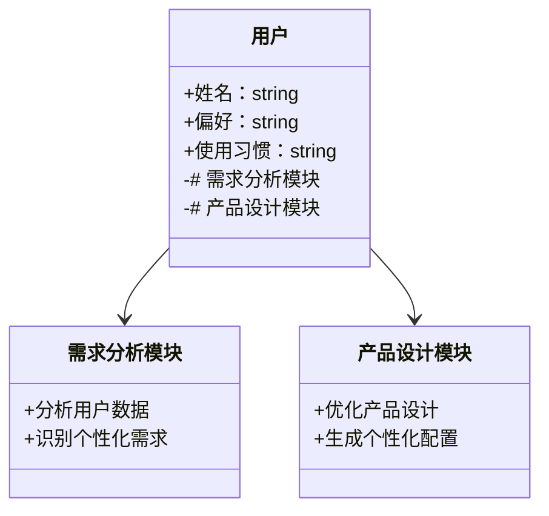
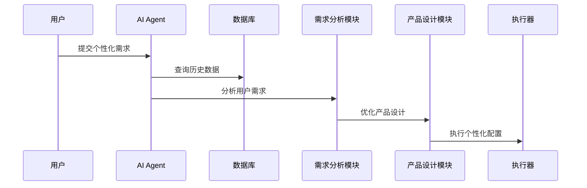

                 


# AI Agent在产品个性化定制中的创新应用

> 关键词：AI Agent, 产品个性化定制, 人工智能, 机器学习, 自然语言处理, 系统架构

> 摘要：本文探讨了AI Agent在产品个性化定制中的创新应用，分析了AI Agent的核心概念、算法原理以及在个性化定制中的应用场景。通过系统架构设计、项目实战和最佳实践，展示了AI Agent在产品个性化定制中的巨大潜力和实际价值。

---

# 第一部分: AI Agent与产品个性化定制的背景与概念

## 第1章: AI Agent的基本概念与技术背景

### 1.1 AI Agent的定义与核心特征

#### 1.1.1 什么是AI Agent
AI Agent（人工智能代理）是一种能够感知环境、自主决策并执行任务的智能体。它通过传感器获取信息，利用算法处理数据，并通过执行器与环境互动。AI Agent的核心目标是通过智能化决策和行动，帮助用户实现特定目标。

**AI Agent的三重特征**：
1. **智能性**：能够理解环境并做出合理决策。
2. **自主性**：无需外部干预，自主执行任务。
3. **适应性**：能够根据环境变化调整行为。

#### 1.1.2 AI Agent的核心特征
- **感知能力**：通过传感器或数据接口获取环境信息。
- **推理能力**：利用算法对信息进行分析和推理。
- **决策能力**：基于推理结果做出最优决策。
- **执行能力**：通过执行器或接口将决策转化为行动。

#### 1.1.3 AI Agent与传统软件代理的区别
| 特性             | 传统软件代理             | AI Agent               |
|------------------|--------------------------|------------------------|
| 智能性           | 无智能性，遵循固定规则     | 具备智能性，能自主决策   |
| 学习能力         | 无学习能力               | 具备学习能力，能优化决策 |
| 适应性           | 无适应性，固定功能         | 具备适应性，能动态调整   |

### 1.2 产品个性化定制的背景与需求

#### 1.2.1 个性化定制的定义
个性化定制是指根据用户的需求和偏好，量身定制产品或服务的过程。个性化定制的目标是满足用户的独特需求，提升用户体验和满意度。

#### 1.2.2 当前市场对个性化定制的需求
- **用户需求多样化**：用户对产品的需求日益多样化，传统标准化产品难以满足。
- **市场竞争加剧**：企业通过个性化定制来提升竞争力，差异化产品。
- **技术进步支持**：人工智能和大数据技术的发展为个性化定制提供了技术支持。

#### 1.2.3 个性化定制的技术挑战
- **数据获取与处理**：如何高效获取并处理大量用户数据。
- **算法复杂性**：个性化定制需要复杂的算法来分析用户需求。
- **实时性要求**：个性化定制需要快速响应用户需求。

### 1.3 AI Agent在产品个性化定制中的应用前景

#### 1.3.1 AI Agent如何实现个性化定制
AI Agent通过感知用户行为、分析用户需求、优化产品设计，实现个性化定制。例如，AI Agent可以分析用户的使用习惯，推荐个性化的产品配置。

#### 1.3.2 AI Agent在个性化定制中的优势
- **智能化**：AI Agent能够自主分析用户需求，提供个性化解决方案。
- **高效性**：通过机器学习算法，AI Agent能够快速处理大量数据，提供实时反馈。
- **适应性**：AI Agent能够根据用户反馈不断优化产品设计。

#### 1.3.3 应用AI Agent的潜在价值与挑战
- **潜在价值**：提升用户体验，降低企业成本，提高市场竞争力。
- **技术挑战**：如何处理复杂的用户需求，确保AI Agent的决策准确性。

### 1.4 本章小结
本章介绍了AI Agent的基本概念和核心特征，分析了产品个性化定制的背景与需求，探讨了AI Agent在个性化定制中的应用前景。

---

## 第2章: AI Agent的核心概念与技术原理

### 2.1 AI Agent的核心概念

#### 2.1.1 AI Agent的定义与分类
AI Agent可以根据智能性、学习能力、决策能力等维度进行分类。常见的分类包括：
- **反应式AI Agent**：基于当前环境信息做出反应。
- **认知式AI Agent**：具备推理、规划能力，能够处理复杂任务。
- **学习式AI Agent**：能够通过学习优化决策。

#### 2.1.2 AI Agent的决策机制
AI Agent的决策机制包括感知、推理和执行三个步骤：
1. **感知**：通过传感器或数据接口获取环境信息。
2. **推理**：利用算法对信息进行分析和推理。
3. **执行**：根据推理结果做出决策并执行行动。

#### 2.1.3 AI Agent的智能体架构
AI Agent的智能体架构通常包括以下组件：
- **感知器**：负责获取环境信息。
- **推理器**：负责分析和推理信息。
- **决策器**：负责做出决策。
- **执行器**：负责执行决策。

### 2.2 AI Agent的关键技术

#### 2.2.1 机器学习与深度学习
机器学习是AI Agent的核心技术之一。通过训练模型，AI Agent能够从数据中学习规律，并做出预测和决策。深度学习则通过多层神经网络，进一步提升模型的复杂性和表达能力。

#### 2.2.2 自然语言处理
自然语言处理（NLP）是AI Agent与用户交互的重要技术。通过NLP，AI Agent能够理解用户的自然语言输入，并生成相应的文本输出。

#### 2.2.3 强化学习与决策树
强化学习是一种通过试错优化决策的技术。决策树是一种基于树状结构的决策方法，能够帮助AI Agent在复杂环境中做出最优决策。

### 2.3 AI Agent与产品个性化定制的关系

#### 2.3.1 AI Agent如何支持个性化定制
AI Agent通过分析用户数据、预测用户需求，为个性化定制提供技术支持。例如，AI Agent可以根据用户的购买历史，推荐个性化的产品配置。

#### 2.3.2 个性化定制对AI Agent的需求
个性化定制需要AI Agent具备强大的数据处理能力、推理能力和学习能力。用户需求的多样性和复杂性，要求AI Agent能够快速适应变化。

#### 2.3.3 AI Agent在个性化定制中的角色
AI Agent在个性化定制中扮演决策者和执行者的角色。它不仅需要分析用户需求，还需要根据需求优化产品设计，并通过执行器实现个性化定制。

### 2.4 本章小结
本章详细讲解了AI Agent的核心概念和关键技术，分析了AI Agent在个性化定制中的角色和作用。

---

## 第3章: AI Agent在产品个性化定制中的创新应用

### 3.1 个性化定制的核心问题

#### 3.1.1 个性化需求的识别与分析
个性化需求的识别与分析是个性化定制的第一步。通过分析用户数据，AI Agent能够准确识别用户的个性化需求。

#### 3.1.2 个性化定制的实现过程
个性化定制的实现过程包括需求分析、产品设计、生产制造和交付使用四个阶段。AI Agent在每个阶段都发挥重要作用。

#### 3.1.3 个性化定制的评估与优化
个性化定制的效果需要通过用户反馈和数据分析进行评估。AI Agent可以根据评估结果，不断优化产品设计和生产流程。

### 3.2 AI Agent在个性化定制中的应用场景

#### 3.2.1 智能推荐系统
AI Agent可以通过分析用户数据，推荐个性化的产品配置。例如，AI Agent可以根据用户的使用习惯，推荐适合的个性化功能模块。

#### 3.2.2 个性化内容生成
AI Agent可以通过自然语言处理技术，生成个性化的产品描述和推荐内容。例如，AI Agent可以根据用户的偏好，生成个性化的营销文案。

#### 3.2.3 个性化服务设计
AI Agent可以通过分析用户需求，设计个性化的产品服务流程。例如，AI Agent可以根据用户的反馈，优化产品的售后服务流程。

### 3.3 AI Agent在产品设计中的创新

#### 3.3.1 数据驱动的个性化设计
AI Agent可以通过机器学习技术，分析用户数据，为产品设计提供数据支持。例如，AI Agent可以通过分析用户的行为数据，优化产品的界面设计。

#### 3.3.2 AI Agent的自适应能力
AI Agent具备自适应能力，能够根据用户反馈，不断优化产品设计。例如，AI Agent可以根据用户的使用反馈，动态调整产品的功能模块。

#### 3.3.3 个性化定制的实时反馈与优化
AI Agent可以通过实时反馈，优化个性化定制的过程。例如，AI Agent可以通过实时监测用户的使用数据，优化产品的性能参数。

### 3.4 本章小结
本章探讨了AI Agent在产品个性化定制中的创新应用，分析了智能推荐系统、个性化内容生成和个性化服务设计等应用场景。

---

## 第4章: AI Agent的算法原理与数学模型

### 4.1 AI Agent的核心算法

#### 4.1.1 强化学习算法
强化学习是一种通过试错优化决策的技术。AI Agent通过与环境的交互，不断优化决策策略。例如，Q-learning算法是一种常用的强化学习算法。

**Q-learning算法公式**：
$$ Q(s, a) = r + \gamma \max_{a'} Q(s', a') $$

其中，\( s \) 是当前状态，\( a \) 是当前动作，\( r \) 是奖励，\( \gamma \) 是折扣因子，\( s' \) 是下一状态。

#### 4.1.2 监督学习算法
监督学习是一种通过标签数据训练模型的技术。AI Agent可以通过监督学习，预测用户的个性化需求。例如，线性回归和决策树是常用的监督学习算法。

**线性回归公式**：
$$ y = \beta_0 + \beta_1 x + \epsilon $$

其中，\( y \) 是目标变量，\( x \) 是自变量，\( \beta_0 \) 和 \( \beta_1 \) 是回归系数，\( \epsilon \) 是误差项。

#### 4.1.3 聚类与分类算法
聚类和分类算法可以帮助AI Agent分析用户数据，识别用户群体和需求。例如，K-means算法是一种常用的聚类算法。

**K-means算法步骤**：
1. 初始化K个质心。
2. 计算每个数据点到质心的距离。
3. 将数据点分配到最近的质心。
4. 重新计算质心。
5. 重复步骤2-4，直到质心不再变化。

### 4.2 AI Agent的决策树模型

#### 4.2.1 决策树的基本原理
决策树是一种基于树状结构的分类和回归方法。AI Agent可以通过决策树分析用户需求，做出最优决策。

**决策树构建过程**：
1. 选择最优特征进行分裂。
2. 递归构建子树。
3. 停止分裂条件：叶子节点满足停止条件。

#### 4.2.2 决策树的构建过程
1. **特征选择**：选择能够最好地分割数据的特征。
2. **数据分割**：根据选择的特征将数据分割成子集。
3. **递归构建**：对子集递归构建决策树。
4. **剪枝**：为了防止过拟合，进行剪枝处理。

### 4.3 本章小结
本章详细讲解了AI Agent的核心算法，包括强化学习、监督学习、聚类与分类算法，以及决策树模型。

---

## 第5章: 系统分析与架构设计方案

### 5.1 问题场景介绍

#### 5.1.1 系统场景介绍
个性化定制系统需要支持用户个性化需求的识别、产品设计和生产制造。AI Agent在系统中负责数据分析、决策优化和执行控制。

#### 5.1.2 系统目标与范围
系统目标：实现产品个性化定制，提升用户体验和满意度。
系统范围：包括用户需求分析、产品设计优化和生产制造控制。

### 5.2 系统功能设计

#### 5.2.1 领域模型（mermaid类图）


#### 5.2.2 系统架构设计（mermaid架构图）


#### 5.2.3 系统接口设计
系统接口设计包括用户接口、数据接口和执行器接口。用户接口用于与用户交互，数据接口用于获取和处理数据，执行器接口用于控制执行器。

#### 5.2.4 系统交互设计（mermaid序列图）


### 5.3 本章小结
本章详细描述了系统分析与架构设计方案，包括系统场景、功能设计、架构设计和交互设计。

---

## 第6章: 项目实战

### 6.1 环境安装与配置

#### 6.1.1 系统环境要求
- 操作系统：Linux/Windows/MacOS
- Python版本：3.6以上
- 依赖库：numpy, pandas, scikit-learn, nltk, matplotlib

#### 6.1.2 安装步骤
```bash
pip install numpy pandas scikit-learn nltk matplotlib
```

### 6.2 核心代码实现

#### 6.2.1 需求分析模块
```python
import numpy as np
from sklearn.tree import DecisionTreeClassifier
from sklearn.model_selection import train_test_split

# 数据加载
data = np.loadtxt('user_data.csv', delimiter=',')
X = data[:, :-1]  # 特征
y = data[:, -1]   # 标签

# 数据分割
X_train, X_test, y_train, y_test = train_test_split(X, y, test_size=0.2)

# 模型训练
clf = DecisionTreeClassifier()
clf.fit(X_train, y_train)

# 预测
y_pred = clf.predict(X_test)
print("预测准确率:", np.mean(y_pred == y_test))
```

#### 6.2.2 产品设计模块
```python
import numpy as np
from sklearn.cluster import KMeans

# 数据加载
data = np.loadtxt('product_data.csv', delimiter=',')
X = data[:, :-1]  # 特征
y = data[:, -1]   # 标签

# 数据分割
X_train, X_test, y_train, y_test = train_test_split(X, y, test_size=0.2)

# 模型训练
kmeans = KMeans(n_clusters=3)
kmeans.fit(X_train)

# 预测
y_pred = kmeans.predict(X_test)
print("预测准确率:", np.mean(y_pred == y_test))
```

#### 6.2.3 交互设计模块
```python
import nltk
from nltk.chat import Chat, ChatBot

# 定义聊天机器人
bot = ChatBot("AI Agent")

# 定义响应函数
def respond(msg):
    return "感谢您的反馈！我们会持续优化产品设计。"

# 启动聊天机器人
bot conversation Loop:
    msg = input("用户：")
    print("AI Agent:", respond(msg))
```

### 6.3 案例分析与实际应用

#### 6.3.1 案例分析
以电子产品个性化定制为例，AI Agent可以根据用户的使用习惯和偏好，推荐个性化的产品配置。

#### 6.3.2 实际应用
AI Agent在个性化定制中的实际应用包括智能推荐系统、个性化内容生成和个性化服务设计。

### 6.4 项目小结
本章通过项目实战，展示了AI Agent在产品个性化定制中的具体应用，包括环境配置、代码实现和案例分析。

---

## 第7章: 最佳实践与注意事项

### 7.1 小结与总结

#### 7.1.1 小结
AI Agent在产品个性化定制中具有巨大的潜力和应用价值。通过智能化决策和自主执行，AI Agent能够有效满足用户的个性化需求。

#### 7.1.2 总结
本文详细探讨了AI Agent在产品个性化定制中的创新应用，分析了其核心概念、算法原理和系统架构。通过项目实战和案例分析，展示了AI Agent在个性化定制中的具体应用。

### 7.2 注意事项

#### 7.2.1 数据隐私与安全
个性化定制需要处理大量用户数据，必须注意数据隐私和安全问题。

#### 7.2.2 算法优化与性能提升
AI Agent的算法复杂性较高，需要不断优化算法，提升系统性能。

#### 7.2.3 用户反馈与系统迭代
个性化定制需要根据用户反馈不断优化，实现系统的持续迭代。

### 7.3 拓展阅读与进一步思考

#### 7.3.1 拓展阅读
推荐阅读以下书籍和论文：
- 《人工智能：一种现代的方法》
- 《机器学习实战》
- 《自然语言处理入门》

#### 7.3.2 进一步思考
AI Agent在个性化定制中的应用前景广阔，未来可以通过多模态学习、强化学习等技术进一步提升系统性能。

### 7.4 本章小结
本章总结了AI Agent在个性化定制中的应用，并提出了注意事项和拓展阅读建议。

---

# 结语
AI Agent在产品个性化定制中的应用前景广阔，随着人工智能技术的不断进步，AI Agent将为个性化定制带来更多的创新和价值。通过本文的探讨，我们相信AI Agent将成为个性化定制的重要工具，推动产品设计和用户体验的持续优化。

---

# 作者：AI天才研究院/AI Genius Institute & 禅与计算机程序设计艺术 /Zen And The Art of Computer Programming

