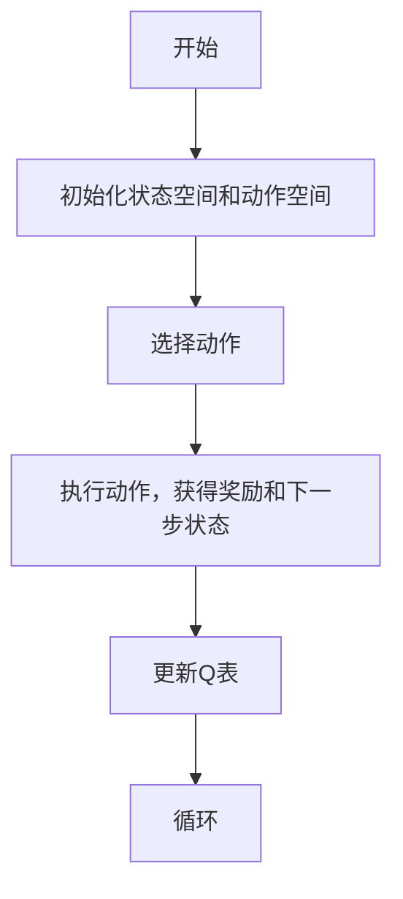
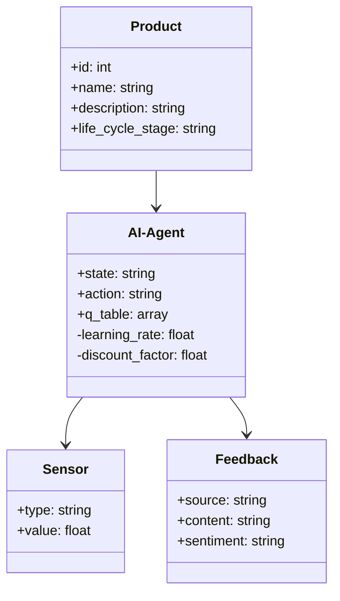
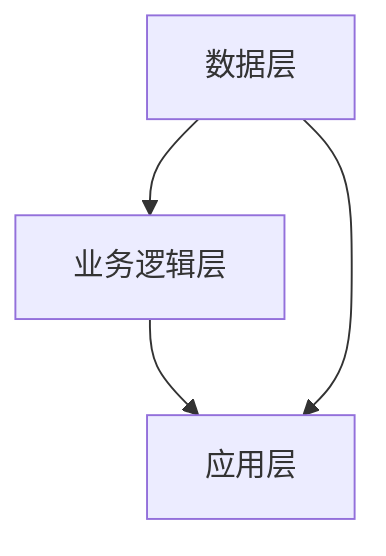
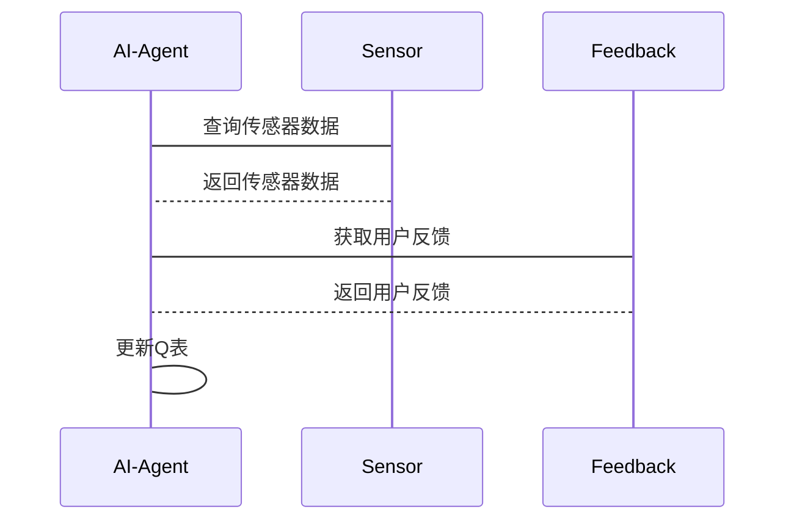

                 


# AI Agent在产品生命周期管理中的全面应用

## 关键词：AI Agent，产品生命周期管理，智能制造，数字化转型，人工智能，软件架构

## 摘要：  
随着人工智能技术的快速发展，AI Agent（人工智能代理）在产品生命周期管理中的应用日益广泛。本文从AI Agent的核心概念出发，结合产品生命周期管理的各个阶段，详细探讨了AI Agent在需求分析、设计优化、生产监控和用户反馈等环节中的具体应用。通过分析AI Agent的算法原理、系统架构设计以及实际项目案例，本文揭示了AI Agent如何通过智能化手段提升产品生命周期管理的效率与精准度，为企业实现数字化转型提供了重要参考。

---

# 第1章: AI Agent与产品生命周期管理概述

## 1.1 AI Agent的基本概念

### 1.1.1 AI Agent的定义  
AI Agent（人工智能代理）是一种能够感知环境、做出决策并执行任务的智能实体。它通过与环境交互，利用数据和算法来优化目标的实现。AI Agent可以是软件程序、机器人或其他智能系统。

### 1.1.2 AI Agent的核心特征  
1. **自主性**：AI Agent能够独立运行，无需外部干预。  
2. **反应性**：能够实时感知环境变化并做出响应。  
3. **目标导向性**：通过设定目标来优化决策和行动。  
4. **学习能力**：通过数据和反馈不断优化自身性能。  

### 1.1.3 AI Agent与传统软件代理的区别  
| 特性         | 传统软件代理                     | AI Agent                        |  
|--------------|---------------------------------|---------------------------------|  
| 智能性       | 依赖预设规则                     | 具备学习能力                     |  
| 决策方式     | 线性规则驱动                     | 数据驱动，支持复杂决策         |  
| 适应性       | 固定模式                        | 能够动态调整策略                |  

## 1.2 产品生命周期管理的背景

### 1.2.1 产品生命周期的定义  
产品生命周期（Product Life Cycle，PLC）是指产品从概念提出、设计、生产、销售到退市的全过程。它包括需求分析、设计开发、生产制造、市场推广和退市回收等阶段。

### 1.2.2 传统产品生命周期管理的挑战  
1. **数据孤岛**：不同部门间信息不通，导致效率低下。  
2. **决策延迟**：依赖人工分析，难以快速响应市场变化。  
3. **成本高昂**：传统方法依赖大量人工劳动，管理成本高。  

### 1.2.3 数字化与智能化对产品生命周期管理的影响  
随着人工智能和大数据技术的发展，产品生命周期管理逐步向智能化方向转型。AI Agent能够通过数据驱动的方式优化各个环节，显著提升效率和精准度。

## 1.3 AI Agent在产品生命周期管理中的应用价值

### 1.3.1 提高效率与精准度  
AI Agent能够快速处理海量数据，帮助企业在产品设计和生产阶段做出更优决策。  

### 1.3.2 降低管理成本  
通过自动化处理和优化决策，AI Agent减少了对大量人工的依赖，从而降低了管理成本。  

### 1.3.3 提升用户体验与市场响应速度  
AI Agent能够实时分析用户反馈，快速调整产品策略，从而提升用户体验并加快市场响应速度。  

---

# 第2章: AI Agent在产品生命周期管理中的核心概念

## 2.1 AI Agent的核心原理

### 2.1.1 感知层：数据采集与分析  
AI Agent通过传感器、数据库和API接口等渠道采集环境数据，并利用自然语言处理（NLP）和机器学习算法进行分析。  

### 2.1.2 决策层：基于数据的智能决策  
AI Agent通过强化学习和监督学习等算法，基于感知层的数据生成最优决策。  

### 2.1.3 执行层：自动化操作与反馈  
AI Agent根据决策层的指令执行具体操作，并通过反馈机制不断优化自身的决策模型。  

## 2.2 产品生命周期管理的系统模型

### 2.2.1 产品需求分析阶段  
- **需求采集**：通过市场调研和用户反馈采集需求数据。  
- **需求分析**：利用AI Agent对需求数据进行分类和优先级排序。  

### 2.2.2 产品设计与开发阶段  
- **设计优化**：AI Agent通过参数优化算法辅助设计师进行最优设计。  
- **开发测试**：利用自动化测试工具快速验证设计方案。  

### 2.2.3 产品生产与交付阶段  
- **生产监控**：AI Agent实时监控生产线状态，预测并解决潜在问题。  
- **交付优化**：通过智能物流系统实现高效配送。  

### 2.2.4 产品维护与退市阶段  
- **维护管理**：AI Agent根据用户反馈优化产品维护策略。  
- **退市回收**：通过数据驱动的方式制定产品退市计划。  

## 2.3 AI Agent与产品生命周期管理的结合

### 2.3.1 AI Agent在需求分析中的应用  
- **需求预测**：利用时间序列分析预测市场需求。  
- **用户画像构建**：通过聚类分析和关联规则挖掘构建用户画像。  

### 2.3.2 AI Agent在设计优化中的应用  
- **参数优化**：基于遗传算法优化产品设计参数。  
- **风险评估**：利用蒙特卡洛模拟评估设计风险。  

### 2.3.3 AI Agent在生产监控中的应用  
- **实时监控**：通过工业物联网（IIoT）实时监控生产状态。  
- **异常检测**：利用异常检测算法识别生产中的异常情况。  

### 2.3.4 AI Agent在用户反馈中的应用  
- **情感分析**：通过NLP技术分析用户反馈的情感倾向。  
- **反馈闭环**：利用反馈数据优化产品功能和用户体验。  

## 2.4 核心概念对比表  

| 阶段         | 特征                     | AI Agent作用                     | 传统方法区别                     |  
|--------------|--------------------------|----------------------------------|----------------------------------|  
| 需求分析     | 数据采集与分析           | 提供精准的需求预测               | 依赖人工调研，效率低下           |  
| 产品设计     | 参数优化与风险评估       | 辅助设计师优化设计方案           | 需要反复试验，耗时较长           |  
| 产品生产     | 实时监控与异常检测       | 提高生产效率，降低缺陷率         | 依赖人工检查，效率较低           |  
| 用户反馈     | 情感分析与反馈闭环       | 提升用户体验，优化产品功能       | 反馈处理缓慢，缺乏闭环机制       |  

---

## 第3章: AI Agent的算法原理与实现

## 3.1 强化学习算法在AI Agent中的应用

### 3.1.1 强化学习的基本原理  
强化学习是一种通过试错机制优化决策的算法。AI Agent通过与环境交互，不断学习最优策略。  

### 3.1.2 Q-learning算法的实现  
以下是一个经典的Q-learning算法实现：

```python
import numpy as np

class QLearningAgent:
    def __init__(self, state_space, action_space, alpha=0.1, gamma=0.9):
        self.state_space = state_space
        self.action_space = action_space
        self.alpha = alpha
        self.gamma = gamma
        self.q_table = np.zeros((state_space, action_space))
    
    def choose_action(self, state):
        return np.argmax(self.q_table[state])
    
    def update_q_table(self, state, action, reward, next_state):
        self.q_table[state, action] = self.q_table[state, action] * (1 - self.alpha) + self.alpha * (reward + self.gamma * np.max(self.q_table[next_state]))
```

### 3.1.3 算法流程图  


---

## 第4章: 系统分析与架构设计

## 4.1 项目介绍

### 4.1.1 项目背景  
本项目旨在通过AI Agent优化某智能家电产品的生命周期管理。  

### 4.1.2 项目目标  
1. 实现产品需求分析的智能化。  
2. 优化产品设计阶段的参数优化。  
3. 提高生产阶段的实时监控能力。  

## 4.2 系统功能设计

### 4.2.1 功能模块划分  
1. **需求分析模块**：负责采集和分析用户需求数据。  
2. **设计优化模块**：基于强化学习优化产品设计参数。  
3. **生产监控模块**：实时监控生产线状态并预测异常情况。  

### 4.2.2 领域模型类图  


## 4.3 系统架构设计

### 4.3.1 分层架构设计  


### 4.3.2 接口设计  
| 接口名称 | 接口描述           | 输入参数                  | 输出参数                  |  
|----------|--------------------|---------------------------|---------------------------|  
| get_state | 获取当前状态       | -                         | 当前状态信息               |  
| execute_action | 执行动作         | 动作编号                  | 执行结果                  |  
| update_policy | 更新策略         | 状态、动作、奖励、下一步状态 | 更新后的策略信息          |  

### 4.3.3 交互流程图  


---

## 第5章: 项目实战与案例分析

## 5.1 环境配置

### 5.1.1 系统需求  
1. Python 3.8及以上版本  
2. NumPy、Pandas、TensorFlow等库  

### 5.1.2 安装依赖  
```bash
pip install numpy pandas tensorflow
```

## 5.2 核心代码实现

### 5.2.1 需求分析模块  
```python
import pandas as pd

class DemandAnalyzer:
    def __init__(self):
        self.data = pd.DataFrame()
    
    def collect_data(self, source):
        if source == 'market':
            self.data = pd.read_csv('market_trend.csv')
        elif source == 'user':
            self.data = pd.read_csv('user_feedback.csv')
    
    def analyze(self):
        return self.data.describe()
```

### 5.2.2 设计优化模块  
```python
import numpy as np

class DesignOptimizer:
    def __init__(self, parameters):
        self.parameters = parameters
    
    def optimize(self):
        # 使用遗传算法优化设计参数
        pass
```

### 5.2.3 生产监控模块  
```python
import tensorflow as tf

class ProductionMonitor:
    def __init__(self):
        self.model = tf.keras.Sequential([tf.keras.layers.Dense(1, input_shape=(10,))])
    
    def train(self):
        self.model.compile(optimizer='adam', loss='mean_squared_error')
        self.model.fit(x_train, y_train, epochs=10)
    
    def predict(self, input_data):
        return self.model.predict(input_data)
```

## 5.3 代码解读与分析  
1. **需求分析模块**：通过数据描述分析用户需求，生成需求报告。  
2. **设计优化模块**：使用遗传算法优化设计参数，减少开发周期。  
3. **生产监控模块**：利用神经网络预测生产中的潜在问题，提前采取措施。  

## 5.4 案例分析  
以智能家电产品的生命周期管理为例，详细分析AI Agent在各个阶段的具体应用，并对比传统方法的效率和成本差异。

---

## 第6章: 最佳实践与总结

## 6.1 小结  
本文详细探讨了AI Agent在产品生命周期管理中的应用，涵盖了需求分析、设计优化、生产监控和用户反馈等多个环节。通过算法原理和系统架构设计的分析，展现了AI Agent如何通过智能化手段提升产品管理的效率和精准度。

## 6.2 注意事项  
1. 数据质量对AI Agent的性能至关重要，需确保数据的准确性和完整性。  
2. 在实际应用中，需注意模型的可解释性问题，避免“黑箱”决策。  

## 6.3 拓展阅读  
1. 《强化学习入门》  
2. 《人工智能在工业制造中的应用》  
3. 《产品生命周期管理的数字化转型》  

---

## 作者：AI天才研究院/AI Genius Institute & 禅与计算机程序设计艺术/Zen And The Art of Computer Programming

