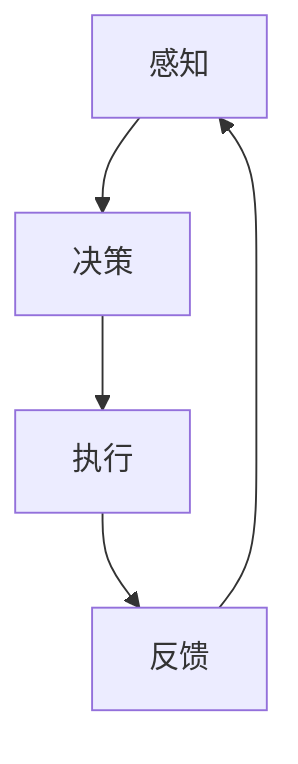
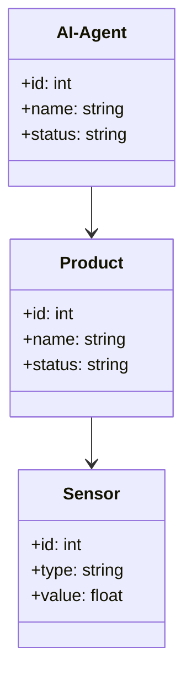
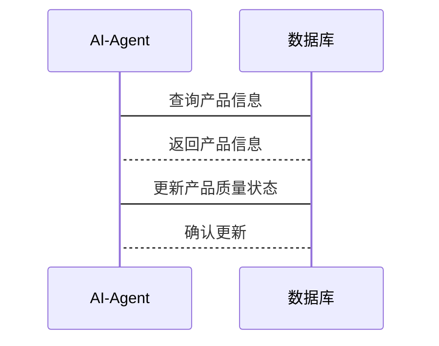

                 


# AI Agent在产品质量控制与追溯系统中的应用

## 关键词：AI Agent，产品质量控制，追溯系统，多智能体系统，强化学习

## 摘要：  
本文探讨了AI Agent在产品质量控制与追溯系统中的应用，详细分析了AI Agent的核心概念、技术原理、系统设计以及实际应用案例。通过对比分析和案例研究，展示了AI Agent如何提升产品质量控制的效率和准确性，并为未来的研究方向提供了有价值的参考。

---

# 第1章: AI Agent与产品质量控制概述

## 1.1 AI Agent的基本概念

### 1.1.1 AI Agent的定义与特点

AI Agent（人工智能代理）是指能够感知环境、自主决策并执行任务的智能实体。其核心特点包括：

- **自主性**：能够自主决策，无需人工干预。
- **反应性**：能够实时感知环境变化并做出响应。
- **主动性**：主动采取行动以实现目标。
- **社会性**：能够与其他智能体或人类进行协作与竞争。

### 1.1.2 AI Agent在产品质量控制中的作用

AI Agent通过实时监控生产过程中的数据，识别潜在缺陷，并提出优化建议，从而提升产品质量。此外，AI Agent还能通过追溯系统快速定位问题根源，减少召回成本。

## 1.2 产品质量控制与追溯系统

### 1.2.1 产品质量控制的定义与重要性

产品质量控制是指通过技术手段对产品生产过程中的各个环节进行监控，确保最终产品符合质量标准。其重要性体现在减少缺陷产品数量、降低生产成本、提升客户满意度等方面。

### 1.2.2 追溯系统的核心功能与实现方式

追溯系统通过记录产品生命周期中的所有信息，实现对产品来源、生产过程和销售流向的追踪。其实现方式包括：

- **数据采集**：通过传感器、RFID标签等设备采集数据。
- **数据存储**：将数据存储在数据库中，支持快速查询。
- **数据分析**：利用AI技术对数据进行分析，识别异常情况。

### 1.2.3 AI Agent在质量控制与追溯中的应用前景

AI Agent能够通过实时数据分析，快速识别生产过程中的异常情况，并通过追溯系统定位问题根源，从而实现精准的质量控制。

## 1.3 本章小结

本章介绍了AI Agent的基本概念及其在产品质量控制中的作用，阐述了追溯系统的核心功能与实现方式，并探讨了AI Agent在质量控制与追溯中的应用前景。

---

# 第2章: AI Agent的核心概念

## 2.1 多智能体系统与单智能体系统的对比

### 2.1.1 多智能体系统的定义与特点

多智能体系统由多个相互协作的智能体组成，能够共同完成复杂的任务。其特点包括：

- **分布式智能**：每个智能体独立决策。
- **协作性**：智能体之间可以通过通信协作完成任务。
- **动态性**：系统能够适应环境的变化。

### 2.1.2 单智能体系统的定义与特点

单智能体系统由一个中心智能体负责决策和执行任务。其特点包括：

- **集中控制**：决策过程集中化。
- **简单性**：系统结构简单，易于管理。

### 2.1.3 对比分析

| 特性           | 多智能体系统         | 单智能体系统         |
|----------------|--------------------|--------------------|
| **智能体数量** | 多个               | 单个               |
| **协作性**      | 高                 | 低                 |
| **灵活性**      | 高                 | 低                 |
| **复杂性**      | 高                 | 低                 |

通过对比分析可以看出，多智能体系统在复杂任务中更具优势，而单智能体系统在简单任务中更为高效。

## 2.2 知识表示与推理

### 2.2.1 知识表示的定义与方法

知识表示是将现实世界中的知识转化为计算机可以理解的形式。常用的方法包括：

- **谓词逻辑**：通过谓词和逻辑连接词表示知识。
- **语义网络**：通过节点和边表示概念及其关系。
- **描述逻辑**：通过本体论描述概念及其属性。

### 2.2.2 推理机制的类型与应用

推理机制是AI Agent根据已有知识进行推导的过程。常见的推理类型包括：

- **逻辑推理**：基于逻辑规则进行推导。
- **概率推理**：基于概率论进行推导。
- **模糊推理**：基于模糊逻辑进行推导。

### 2.2.3 本体论与知识图谱

本体论是一种形式化知识表示方法，用于描述概念及其关系。知识图谱是一种基于本体论的知识表示形式，广泛应用于语义搜索和数据集成。

## 2.3 强化学习与决策

### 2.3.1 强化学习的基本原理

强化学习是一种通过试错方式学习策略的方法。智能体通过与环境交互，获得奖励或惩罚，从而优化决策策略。

### 2.3.2 决策树与策略网络的对比

决策树是一种基于树状结构的决策方法，适用于离散决策问题。策略网络是一种基于神经网络的决策方法，适用于连续决策问题。

| 特性           | 决策树            | 策略网络          |
|----------------|------------------|------------------|
| **适用性**      | 离散决策问题      | 连续决策问题      |
| **复杂性**      | 低               | 高               |
| **可解释性**    | 高               | 低               |

### 2.3.3 本章小结

本章介绍了多智能体系统、知识表示与推理以及强化学习与决策的核心概念，并通过对比分析帮助读者理解不同方法的优缺点。

---

# 第3章: AI Agent在产品质量控制中的技术实现

## 3.1 AI Agent的工作流程

### 3.1.1 感知

AI Agent通过传感器、摄像头等设备感知环境信息，并将其转化为数据。

### 3.1.2 决策

AI Agent根据感知到的信息，结合知识库和推理引擎，生成决策策略。

### 3.1.3 执行

AI Agent根据决策结果，通过执行机构（如机器人手臂）完成任务。

### 3.1.4 反馈

AI Agent通过反馈机制，不断优化决策策略，提升执行效率。

### 3.1.5 总结

通过Mermaid流程图展示AI Agent的工作流程：



## 3.2 数学模型与算法

### 3.2.1 贝叶斯网络

贝叶斯网络是一种概率推理模型，适用于处理不确定性问题。其基本公式为：

$$P(A|B) = \frac{P(B|A)P(A)}{P(B)}$$

### 3.2.2 支持向量机

支持向量机（SVM）是一种监督学习算法，适用于分类和回归问题。其核心思想是通过构建超平面实现数据分类。

### 3.2.3 随机森林

随机森林是一种集成学习算法，适用于分类和回归问题。其核心思想是通过组合多个决策树的结果，提升模型的准确性和稳定性。

## 3.3 本章小结

本章详细介绍了AI Agent在产品质量控制中的技术实现，包括工作流程和数学模型，并通过Mermaid流程图和数学公式帮助读者理解相关技术。

---

# 第4章: 系统设计与实现

## 4.1 问题场景分析

### 4.1.1 质量控制场景

在制造业中，AI Agent可以用于实时监控生产线上的产品质量，识别潜在缺陷。

### 4.1.2 追溯系统场景

在追溯系统中，AI Agent可以用于快速定位问题产品的来源和流向。

## 4.2 系统功能设计

### 4.2.1 领域模型设计

通过Mermaid类图展示领域模型：



### 4.2.2 系统架构设计

通过Mermaid架构图展示系统架构：


### 4.2.3 接口设计与交互流程

通过Mermaid序列图展示系统交互流程：



## 4.3 本章小结

本章通过问题场景分析、领域模型设计和系统架构设计，详细展示了AI Agent在产品质量控制与追溯系统中的系统设计与实现。

---

# 第5章: 项目实战

## 5.1 环境安装

### 5.1.1 安装Python与相关库

安装Python和必要的库（如NumPy、Pandas、Scikit-learn等）。

```bash
pip install numpy pandas scikit-learn
```

### 5.1.2 安装AI框架

安装TensorFlow或PyTorch框架。

```bash
pip install tensorflow
```

## 5.2 核心代码实现

### 5.2.1 数据预处理

```python
import pandas as pd

data = pd.read_csv('product_data.csv')
```

### 5.2.2 模型训练

```python
from sklearn.tree import DecisionTreeClassifier

model = DecisionTreeClassifier()
model.fit(X_train, y_train)
```

### 5.2.3 模型预测

```python
y_pred = model.predict(X_test)
```

## 5.3 案例分析与解读

### 5.3.1 案例分析

分析某汽车制造厂的质量控制数据，识别潜在缺陷。

### 5.3.2 代码应用解读

解读核心代码的功能和实现原理，帮助读者理解AI Agent在实际项目中的应用。

## 5.4 项目小结

总结项目实施的经验和教训，为读者提供实际操作的指导。

---

# 第6章: 案例分析与应用

## 6.1 案例分析

### 6.1.1 制造业中的应用

AI Agent用于实时监控生产线上的产品质量，识别潜在缺陷。

### 6.1.2 零售业中的应用

AI Agent用于追踪商品的来源和流向，确保供应链的透明性。

## 6.2 本章小结

本章通过具体案例分析，展示了AI Agent在不同行业中的应用，帮助读者理解其广泛的应用前景。

---

# 第7章: 挑战与未来展望

## 7.1 当前技术的局限性

### 7.1.1 数据隐私问题

AI Agent需要处理大量的敏感数据，如何保护数据隐私是一个重要挑战。

### 7.1.2 计算资源限制

AI Agent的运行需要大量的计算资源，如何在资源受限的环境中实现高效运行是一个挑战。

## 7.2 未来发展方向

### 7.2.1 边缘计算

通过边缘计算实现AI Agent的本地化部署，减少数据传输延迟。

### 7.2.2 人机协作

探索人机协作的新型模式，提升AI Agent与人类协作的效率和效果。

### 7.2.3 可持续发展

研究AI Agent在可持续发展中的应用，如减少资源浪费和能源消耗。

## 7.3 本章小结

本章分析了当前技术的局限性和未来发展方向，为读者提供了有价值的参考。

---

# 第8章: 总结与展望

## 8.1 全文总结

本文系统地探讨了AI Agent在产品质量控制与追溯系统中的应用，详细分析了其核心概念、技术原理和系统设计，并通过案例分析展示了其实际应用价值。

## 8.2 对未来的展望

随着AI技术的不断发展，AI Agent在产品质量控制与追溯系统中的应用前景将更加广阔。未来的研究方向包括边缘计算、人机协作和可持续发展等方面。

---

# 作者：AI天才研究院/AI Genius Institute & 禅与计算机程序设计艺术 /Zen And The Art of Computer Programming

---

通过以上章节的详细阐述，希望本文能够为读者提供全面而深入的关于AI Agent在产品质量控制与追溯系统中的应用的知识。

