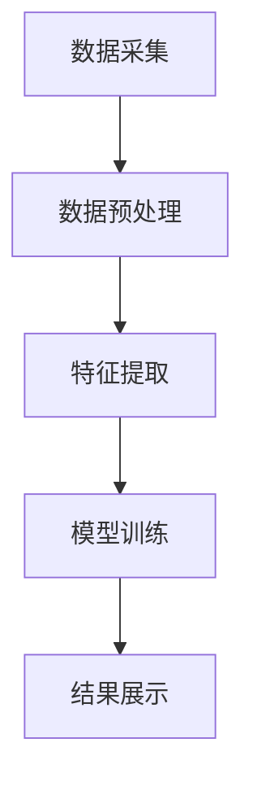
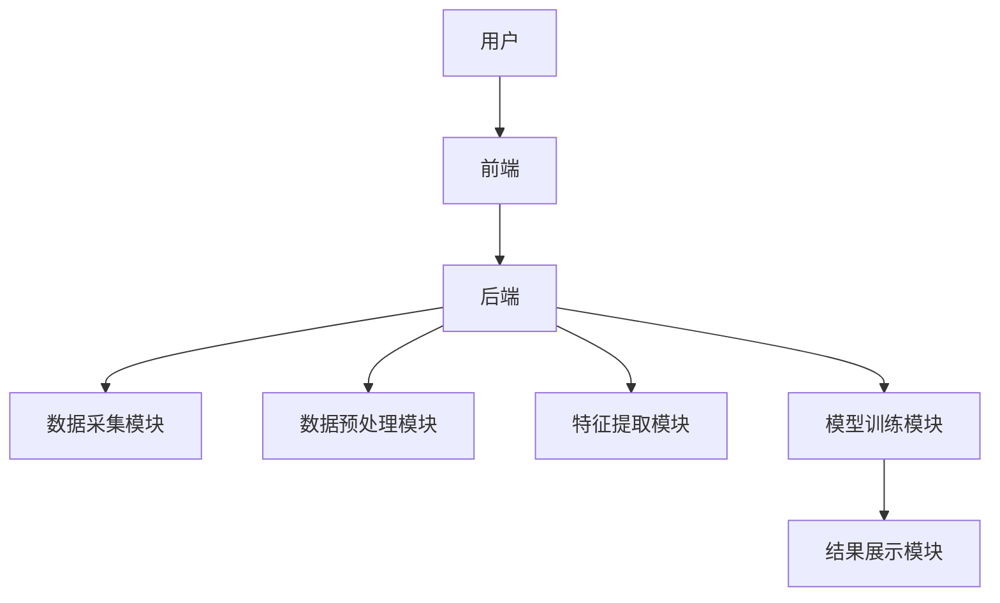

                 


# AI Agent在企业专利分析与技术趋势预测中的应用

## 关键词：AI Agent, 企业专利分析, 技术趋势预测, 自然语言处理, 机器学习, 专利文本挖掘

## 摘要：  
随着人工智能技术的快速发展，AI Agent（人工智能代理）在企业专利分析与技术趋势预测中的应用越来越广泛。本文将从AI Agent的基本概念出发，深入探讨其在专利分析中的技术基础、算法原理、系统架构以及实际应用场景。通过结合自然语言处理（NLP）、机器学习（ML）等技术，本文将详细阐述如何利用AI Agent提高专利分析的效率与准确性，并为企业技术研发与战略规划提供有力支持。  

---

# 第一部分: AI Agent在企业专利分析与技术趋势预测中的应用概述

## 第1章: AI Agent与企业专利分析概述  

### 1.1 AI Agent的基本概念与核心原理  
AI Agent是一种能够感知环境、自主决策并执行任务的智能体。其核心特征包括：  
1. **自主性**：无需外部干预，自主完成任务。  
2. **反应性**：能够实时感知环境变化并做出反应。  
3. **目标导向**：基于预设目标或学习目标执行任务。  
4. **学习能力**：通过数据学习优化自身行为。  

在企业专利分析中，AI Agent主要用于自动化处理专利数据、提取关键信息、预测技术趋势等任务。  

### 1.2 企业专利分析的背景与重要性  
专利分析是企业技术研发和知识产权管理的重要工具。通过分析专利数据，企业可以：  
1. **了解技术动态**：掌握行业技术发展趋势和竞争对手的专利布局。  
2. **优化技术研发**：基于专利数据指导技术研发方向，避免重复劳动。  
3. **保护知识产权**：通过专利分析识别潜在风险，制定合理的知识产权保护策略。  

### 1.3 AI Agent在专利分析中的应用价值  
AI Agent通过自动化和智能化的方式，显著提升了专利分析的效率与精度。其主要价值体现在：  
1. **提高分析效率**：自动化处理海量专利数据，缩短分析周期。  
2. **增强分析深度**：利用机器学习模型挖掘隐含信息，发现潜在技术关联。  
3. **支持决策制定**：基于分析结果为企业技术研发和战略规划提供数据支持。  

### 1.4 本章小结  
本章介绍了AI Agent的基本概念、核心原理以及其在企业专利分析中的应用价值。通过AI Agent的引入，企业可以更高效地处理专利数据，挖掘技术趋势，从而提升技术研发效率和竞争力。

---

# 第二部分: AI Agent在企业专利分析中的技术基础

## 第2章: 自然语言处理技术在专利分析中的应用  

### 2.1 自然语言处理技术概述  
自然语言处理（NLP）是AI Agent处理文本数据的核心技术。NLP的主要任务包括：  
1. **文本分割**：将专利文本划分为句子、词语等基本单位。  
2. **词性标注**：识别文本中每个词语的词性（名词、动词等）。  
3. **实体识别**：提取专利文本中的技术术语、公司名称等实体。  
4. **语义分析**：理解文本的语义含义，提取关键信息。  

#### 2.1.1 NLP技术在专利分析中的优势  
- **高效性**：自动化处理大量专利文本，节省时间和成本。  
- **准确性**：通过算法优化，提高信息提取的准确性。  
- **灵活性**：适用于不同语言和领域的专利分析。  

### 2.2 专利文本的特征与处理方法  
专利文本具有专业性强、术语复杂、文本结构多样等特点。为了有效处理专利文本，需要进行以下预处理：  
1. **文本清洗**：去除无用字符（如标点符号、停用词等）。  
2. **分词与标注**：对文本进行分词和词性标注。  
3. **实体识别**：提取专利中的技术术语和关键实体。  

#### 2.2.1 专利文本的分词与实体识别  
以中文专利文本为例，假设我们有以下专利摘要：  
“本发明提供一种基于深度学习的图像识别方法，适用于智能手机的拍照功能。”  

通过分词和实体识别，可以提取以下信息：  
- **技术领域**：图像识别  
- **应用场景**：智能手机拍照功能  

### 2.3 基于NLP的专利分类与检索  
专利分类是专利分析的重要步骤。通过NLP技术，可以实现基于关键词或语义的专利自动分类。  

#### 2.3.1 专利分类的基本原理  
专利分类通常基于文本相似度。常用的相似度计算方法包括：  
1. **余弦相似度**：衡量两个向量的夹角，值越小相似度越高。  
   $$ \text{余弦相似度} = \frac{\vec{A} \cdot \vec{B}}{|\vec{A}| |\vec{B}|} $$  
2. **Jaccard相似度**：衡量两个集合的交集与并集的比例。  

通过计算专利文本的相似度，可以实现自动分类和检索。

---

## 第3章: 机器学习在专利趋势预测中的应用  

### 3.1 机器学习的基本概念与技术框架  
机器学习是AI Agent实现专利趋势预测的核心技术。其主要任务包括：  
1. **特征提取**：从专利数据中提取关键特征（如技术领域、申请时间等）。  
2. **模型训练**：基于历史数据训练预测模型。  
3. **结果预测**：利用模型预测未来的技术趋势。  

#### 3.1.1 机器学习在专利趋势预测中的优势  
- **数据驱动**：通过大量历史数据训练模型，提高预测准确性。  
- **动态适应**：模型可以根据最新数据动态优化预测结果。  
- **多维度分析**：能够同时考虑技术、市场、法律等多个因素的影响。  

### 3.2 专利趋势预测的特征分析  
专利趋势预测的关键在于选择合适的特征。常用的特征包括：  
1. **技术领域**：专利所属的技术领域（如人工智能、物联网等）。  
2. **申请时间**：专利的申请时间及其分布。  
3. **申请人信息**：专利的申请人（如公司、个人等）。  
4. **引用情况**：专利被引用的次数和引用来源。  

#### 3.2.1 专利趋势预测的特征选择  
以人工智能领域的专利为例，假设我们有以下数据：  
| 专利编号 | 申请人 | 技术领域 | 申请时间 | 被引用次数 |  
|----------|--------|----------|----------|------------|  
| P1       | 公司A  | 深度学习 | 2020年   | 50         |  
| P2       | 公司B  | 图像识别 | 2021年   | 30         |  
| P3       | 公司A  | 自然语言处理 | 2022年 | 70         |  

通过分析这些数据，可以发现公司A在深度学习领域的专利申请量较高，且被引用次数较多，说明该领域未来可能持续热门。

### 3.3 基于机器学习的专利趋势预测方法  
常用的专利趋势预测方法包括回归分析、分类算法和聚类算法。  

#### 3.3.1 基于回归分析的专利趋势预测  
回归分析是一种常用的预测方法。例如，可以通过线性回归模型预测未来某技术领域的专利申请量。  

#### 3.3.2 基于分类算法的专利趋势预测  
分类算法适用于预测专利的类型或技术领域的归属。例如，可以使用随机森林算法对专利进行分类。  

#### 3.3.3 基于聚类算法的专利趋势预测  
聚类算法适用于发现专利的潜在关联。例如，可以通过K-means算法将专利分为若干簇，分析各簇的技术发展趋势。  

---

# 第三部分: AI Agent在企业专利分析中的算法原理  

## 第4章: 基于文本挖掘的专利分析算法  

### 4.1 文本挖掘的基本原理  
文本挖掘是通过计算机技术从文本数据中提取有用信息的过程。其主要步骤包括：  
1. **数据预处理**：清洗和标准化数据。  
2. **特征提取**：提取文本的关键特征。  
3. **模式识别**：发现文本中的模式和关联。  

#### 4.1.1 文本挖掘的核心技术  
- **关键词提取**：通过TF-IDF（词频-逆文档频率）提取文本中的关键词。  
  $$ \text{TF-IDF} = \text{TF} \times \text{IDF} $$  
- **主题建模**：通过LDA（隐含主题模型）发现文本的主题分布。  

---

## 第5章: 基于机器学习的专利趋势预测算法  

### 5.1 机器学习模型的选择与优化  
选择合适的机器学习模型是专利趋势预测的关键。常用模型包括：  
1. **线性回归**：适用于连续型预测任务。  
2. **支持向量机（SVM）**：适用于分类任务。  
3. **随机森林**：适用于分类和回归任务。  

#### 5.1.1 机器学习模型的训练与优化  
通过交叉验证和网格搜索等方法，可以优化模型的参数，提高预测精度。  

---

## 第6章: 基于深度学习的专利分析与趋势预测  

### 6.1 深度学习的基本概念与技术框架  
深度学习是一种基于人工神经网络的机器学习技术。其主要优势在于能够处理非结构化数据（如文本、图像等）。  

#### 6.1.1 深度学习在专利分析中的应用  
- **文本表示**：通过词嵌入（如Word2Vec）将文本转化为向量形式。  
- **序列建模**：通过循环神经网络（RNN）处理序列数据。  

---

# 第四部分: 系统架构与项目实战  

## 第7章: AI Agent驱动的专利分析与趋势预测系统  

### 7.1 系统功能设计  
AI Agent驱动的专利分析系统主要包括以下功能模块：  
1. **数据采集**：从专利数据库中获取专利数据。  
2. **数据预处理**：清洗和标准化数据。  
3. **特征提取**：提取专利文本的关键特征。  
4. **模型训练**：基于历史数据训练预测模型。  
5. **结果展示**：生成可视化报告和预测结果。  

#### 7.1.1 系统功能模块的实体关系图  


### 7.2 系统架构设计  
系统架构采用模块化设计，主要包括前端和后端两部分。  

#### 7.2.1 系统架构图  


### 7.3 系统接口设计  
系统接口采用RESTful API设计，支持以下操作：  
1. **获取专利数据**：`GET /patents`  
2. **训练预测模型**：`POST /train`  
3. **生成预测报告**：`GET /predictions`  

---

## 第8章: 项目实战与案例分析  

### 8.1 项目环境安装  
需要安装以下工具和库：  
1. Python 3.8+  
2. TensorFlow  
3. scikit-learn  
4. NLTK  

### 8.2 系统核心实现源代码  
以下是基于Python的专利分析系统核心代码：  

#### 8.2.1 数据预处理代码  
```python
import nltk
from sklearn.feature_extraction.text import TfidfVectorizer

# 示例专利文本
patents = [
    "本发明提供一种基于深度学习的图像识别方法，适用于智能手机的拍照功能。",
    "本发明涉及自然语言处理技术，主要用于智能音箱的语音交互系统。"
]

# 分词与TF-IDF计算
vectorizer = TfidfVectorizer()
tfidf_matrix = vectorizer.fit_transform(patents)
```

#### 8.2.2 模型训练代码  
```python
from sklearn.model import LinearRegression

# 示例特征与目标
X = [[2020, 2021, 2022]]  # 特征：申请年份
y = [100, 150, 200]      # 目标：专利申请量

# 训练线性回归模型
model = LinearRegression()
model.fit(X, y)

# 预测2023年的专利申请量
预测结果 = model.predict([[2023]])
print(预测结果)
```

---

## 第9章: 最佳实践与注意事项  

### 9.1 最佳实践  
1. **数据质量**：确保专利数据的完整性和准确性。  
2. **模型优化**：通过交叉验证和网格搜索优化模型性能。  
3. **结果解释**：结合业务背景解释模型预测结果。  

### 9.2 注意事项  
1. **数据隐私**：注意专利数据的隐私保护，避免数据泄露。  
2. **模型局限性**：机器学习模型可能无法捕捉所有潜在因素，需结合人工分析。  
3. **技术更新**：定期更新模型和数据，保持预测结果的准确性。  

---

## 第10章: 总结与展望  

### 10.1 本章总结  
本文详细探讨了AI Agent在企业专利分析与技术趋势预测中的应用，介绍了相关技术基础、算法原理和系统架构。通过实际案例分析，展示了如何利用AI Agent提高专利分析的效率与准确性。  

### 10.2 未来展望  
随着人工智能技术的不断发展，AI Agent在专利分析中的应用将更加广泛。未来的研究方向包括：  
1. **多模态分析**：结合文本、图像等多种数据源进行专利分析。  
2. **实时监控**：实现对专利数据的实时监控和动态预测。  
3. **知识图谱构建**：通过知识图谱技术构建专利知识网络，支持更复杂的分析任务。  

---

## 作者：AI天才研究院/AI Genius Institute & 禅与计算机程序设计艺术 /Zen And The Art of Computer Programming

