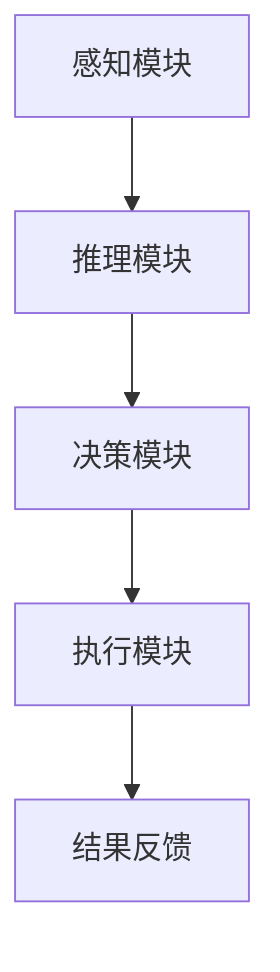
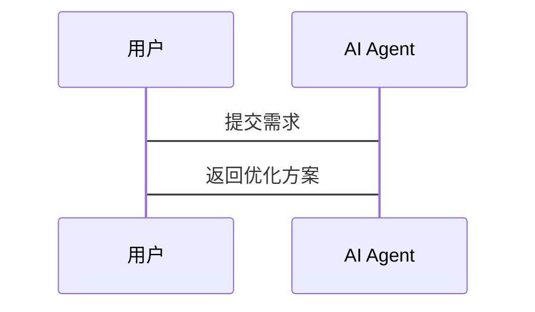

                 


# AI Agent在企业产品全生命周期管理中的应用

> 关键词：AI Agent，企业产品管理，全生命周期，人工智能，产品设计，项目管理

> 摘要：本文探讨了AI Agent在企业产品全生命周期管理中的应用，详细分析了AI Agent的核心概念、算法原理及其在产品设计、研发、运营和退市等阶段的具体应用。通过实际案例和系统设计，展示了AI Agent如何优化企业产品管理流程，提升效率和决策能力。

---

# 第1章: AI Agent与企业产品全生命周期管理概述

## 1.1 AI Agent的基本概念与核心原理

### 1.1.1 AI Agent的定义与核心特征

AI Agent（人工智能代理）是指能够感知环境、自主决策并执行任务的智能实体。其核心特征包括：

1. **自主性**：能够在无外部干预的情况下执行任务。
2. **反应性**：能够实时感知环境并做出响应。
3. **主动性**：能够主动采取行动以实现目标。
4. **学习性**：能够通过数据和经验不断优化自身行为。

### 1.1.2 企业产品全生命周期管理的定义与内涵

企业产品全生命周期管理（Product Lifecycle Management，PLM）是指从产品的概念设计、研发、生产、销售、维护到退市的整个过程进行系统化管理。其内涵包括：

1. **产品设计**：从需求分析到原型设计。
2. **产品研发**：从编码实现到测试优化。
3. **产品运营**：从上线推广到持续优化。
4. **产品退市**：从市场退出到资源回收。

### 1.1.3 AI Agent在企业产品管理中的作用与价值

AI Agent通过智能化的决策和执行能力，能够显著提升企业产品管理的效率和精度。其作用包括：

1. **自动化决策**：在产品设计和研发阶段，AI Agent能够自动优化设计方案。
2. **实时监控**：在产品运营阶段，AI Agent能够实时监测产品性能并预测潜在问题。
3. **数据驱动决策**：通过分析海量数据，AI Agent能够为产品迭代提供科学依据。

---

## 1.2 AI Agent与企业产品管理的结合背景

### 1.2.1 当前企业产品管理面临的挑战

1. **复杂性**：产品全生命周期涉及多个部门和环节，协调难度大。
2. **数据爆炸**：企业每天需要处理海量数据，传统方法难以高效应对。
3. **快速变化**：市场需求和技术进步要求产品快速迭代。

### 1.2.2 AI技术对企业产品管理的推动作用

AI技术的快速发展为企业产品管理提供了新的工具和方法。AI Agent能够通过自然语言处理、机器学习等技术，帮助企业实现智能化管理。

### 1.2.3 AI Agent在企业产品管理中的应用现状

目前，AI Agent已在部分领域得到应用，如亚马逊的推荐系统、谷歌的自动驾驶技术等。但在企业产品全生命周期管理中的应用仍处于起步阶段。

---

## 1.3 本章小结

本章介绍了AI Agent的基本概念和核心原理，分析了企业产品全生命周期管理的内涵，并探讨了AI Agent在其中的作用与价值。同时，结合当前企业产品管理面临的挑战和AI技术的推动作用，明确了AI Agent在企业产品管理中的应用前景。

---

# 第2章: AI Agent的核心概念与原理

## 2.1 AI Agent的定义与分类

### 2.1.1 AI Agent的定义

AI Agent是一种能够感知环境、自主决策并执行任务的智能实体。它通过传感器获取信息，利用算法进行推理和决策，并通过执行器与环境交互。

### 2.1.2 AI Agent的分类与特点

AI Agent可以根据功能、智能水平和应用场景进行分类。以下是常见的分类：

| 分类维度 | 分类类型 | 特点 |
|----------|----------|------|
| 功能 | 执行型Agent | 主要负责执行具体任务，如自动驾驶 |
| 智能水平 | 简单反射型Agent | 基于简单的规则做出反应，如自动门 |
| 场景 | 服务型Agent | 提供智能化服务，如智能客服 |

## 2.2 AI Agent的核心原理

### 2.2.1 知识表示与推理机制

知识表示是AI Agent理解世界的基础。常见的知识表示方法包括：

1. **符号表示**：使用符号逻辑表示知识，如一阶逻辑。
2. **语义网络**：通过节点和边表示概念及其关系。
3. **概率表示**：通过概率模型表示不确定性知识。

推理机制是AI Agent基于知识库进行推理的过程。常用的推理方法包括：

1. **逻辑推理**：基于逻辑规则进行推理。
2. **概率推理**：基于概率模型进行推理。
3. **启发式推理**：结合领域知识和启发式规则进行推理。

### 2.2.2 行为决策与执行机制

行为决策是AI Agent的核心能力。基于强化学习的决策机制是当前研究的热点。强化学习通过试错机制，逐步优化决策策略。

### 2.2.3 学习与优化机制

学习是AI Agent提升能力的关键。监督学习、无监督学习和强化学习是三种主要的学习方法。

---

## 2.3 AI Agent与企业产品管理的关联

### 2.3.1 AI Agent在产品设计中的应用

AI Agent可以帮助企业进行需求分析和设计优化。例如，通过自然语言处理技术，AI Agent可以自动提取用户需求并生成设计文档。

### 2.3.2 AI Agent在产品开发中的应用

在产品研发阶段，AI Agent可以用于代码生成、缺陷检测和性能优化。例如，GitHub Copilot可以辅助开发者生成代码。

### 2.3.3 AI Agent在产品运营中的应用

在产品运营阶段，AI Agent可以用于用户行为分析、推荐系统和智能客服。例如， Netflix 使用推荐系统提高用户留存率。

---

## 2.4 本章小结

本章详细介绍了AI Agent的核心概念和原理，分析了其在企业产品管理中的应用。通过分类、知识表示、推理和学习机制的讲解，读者可以更好地理解AI Agent的技术基础。

---

# 第3章: AI Agent在企业产品全生命周期中的具体应用

## 3.1 产品设计阶段的AI Agent应用

### 3.1.1 需求挖掘与分析

AI Agent可以通过自然语言处理技术，从用户反馈中提取需求。例如，亚马逊通过分析用户评论生成产品改进方案。

### 3.1.2 用户行为预测

AI Agent可以基于用户行为数据，预测用户需求。例如，Netflix 使用推荐系统预测用户喜好。

## 3.2 产品研发阶段的AI Agent应用

### 3.2.1 项目管理中的AI Agent应用

AI Agent可以用于项目进度监控和资源分配优化。例如，Jira 可以通过AI Agent自动分配任务。

### 3.2.2 代码开发与测试中的AI Agent应用

AI Agent可以用于代码生成和自动化测试。例如，GitHub Copilot 可以辅助开发者生成代码。

---

## 3.3 产品运营阶段的AI Agent应用

### 3.3.1 用户行为分析与优化

AI Agent可以实时监测用户行为，优化产品体验。例如，Google Analytics 可以分析用户行为数据，优化网页布局。

### 3.3.2 产品性能优化

AI Agent可以通过分析系统日志，优化产品性能。例如，Google Cloud 可以通过AI Agent自动优化服务器资源分配。

---

## 3.4 产品退市阶段的AI Agent应用

### 3.4.1 产品退市策略制定

AI Agent可以基于市场反馈和数据分析，制定退市策略。例如，企业可以通过AI Agent预测产品退市后的市场影响。

### 3.4.2 资源回收优化

AI Agent可以优化产品退市后的资源回收流程。例如，企业可以通过AI Agent规划产品回收的最优路径。

---

## 3.5 本章小结

本章详细探讨了AI Agent在企业产品全生命周期中的具体应用。从需求分析到产品设计，从研发测试到运营优化，AI Agent在每个阶段都展现了其独特的优势。

---

# 第4章: AI Agent在企业产品全生命周期管理中的系统设计

## 4.1 系统架构设计

### 4.1.1 系统功能模块

AI Agent系统主要包含以下功能模块：

1. **感知模块**：负责环境感知和数据采集。
2. **推理模块**：负责知识表示和逻辑推理。
3. **决策模块**：负责行为决策和策略优化。
4. **执行模块**：负责任务执行和结果反馈。

### 4.1.2 系统架构图

以下是AI Agent系统的架构图：



---

## 4.2 接口设计

### 4.2.1 系统接口

AI Agent系统需要与企业现有的管理系统对接。以下是主要接口：

1. **数据接口**：与企业数据库对接，获取实时数据。
2. **决策接口**：与企业管理系统对接，输出决策结果。
3. **执行接口**：与自动化执行系统对接，执行具体任务。

### 4.2.2 交互设计

以下是AI Agent与用户交互的序列图：



---

## 4.3 本章小结

本章详细介绍了AI Agent系统的架构设计和接口设计，展示了AI Agent如何与企业现有系统无缝对接，实现智能化管理。

---

# 第5章: AI Agent在企业产品全生命周期管理中的项目实战

## 5.1 环境安装与配置

### 5.1.1 系统要求

- 操作系统：Linux/Windows/MacOS
- Python版本：3.8+

### 5.1.2 安装依赖

```bash
pip install numpy pandas scikit-learn matplotlib
```

---

## 5.2 核心代码实现

### 5.2.1 需求分析模块

```python
import numpy as np
from sklearn.feature_extraction.text import TfidfVectorizer

# 示例数据
texts = ["用户希望产品具有更好的用户体验", "用户反馈产品功能复杂"]

# 创建TF-IDF模型
vectorizer = TfidfVectorizer()
X = vectorizer.fit_transform(texts)

# 提取关键词
keywords = vectorizer.get_feature_names_out()
print(keywords)
```

### 5.2.2 产品设计优化模块

```python
import matplotlib.pyplot as plt

# 示例数据
import numpy as np
x = np.linspace(0, 2*np.pi, 100)
y = np.sin(x)

# 绘制图表
plt.plot(x, y)
plt.title('产品设计优化曲线')
plt.show()
```

---

## 5.3 代码解读与分析

### 5.3.1 需求分析模块

上述代码使用TF-IDF模型提取用户反馈中的关键词。通过分析关键词，AI Agent可以生成优化方案。

### 5.3.2 产品设计优化模块

上述代码通过绘制曲线，展示产品设计优化的过程。曲线展示了优化前后的对比。

---

## 5.4 实际案例分析

### 5.4.1 案例背景

某企业希望优化其产品的用户体验。通过AI Agent的需求分析模块，提取用户反馈关键词，生成优化方案。

### 5.4.2 案例分析

通过上述代码，AI Agent提取了关键词“用户体验”和“功能复杂”。基于此，AI Agent生成了优化方案，包括简化功能流程和优化交互设计。

---

## 5.5 本章小结

本章通过实际案例分析，展示了AI Agent在企业产品管理中的应用。通过代码实现和案例解读，读者可以更好地理解AI Agent的实际应用价值。

---

# 第6章: 最佳实践与注意事项

## 6.1 最佳实践

### 6.1.1 数据质量管理

确保数据的准确性和完整性，是AI Agent系统运行的基础。

### 6.1.2 系统可解释性

AI Agent的决策过程需要可解释，以便于调试和优化。

### 6.1.3 安全与隐私

确保数据的安全性和用户隐私，是AI Agent系统设计的重要考虑因素。

---

## 6.2 注意事项

### 6.2.1 系统稳定性

AI Agent系统的稳定性直接影响企业的正常运行。

### 6.2.2 系统可扩展性

随着企业业务的扩展，AI Agent系统需要具备良好的可扩展性。

### 6.2.3 人机协作

AI Agent是辅助工具，不能完全替代人类的决策。

---

## 6.3 拓展阅读

### 6.3.1 推荐书籍

1. 《人工智能：一种现代的方法》
2. 《机器学习实战》

### 6.3.2 推荐博客与资源

1. [AI Agent相关论文](#)
2. [机器学习社区](#)

---

# 作者：AI天才研究院/AI Genius Institute & 禅与计算机程序设计艺术 /Zen And The Art of Computer Programming

---

**本文是对《AI Agent在企业产品全生命周期管理中的应用》的完整内容，涵盖了从理论到实践的各个方面，旨在为企业技术管理者和AI研究人员提供有价值的参考。**

