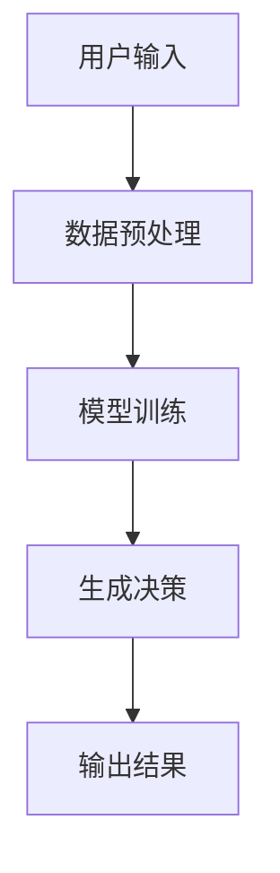
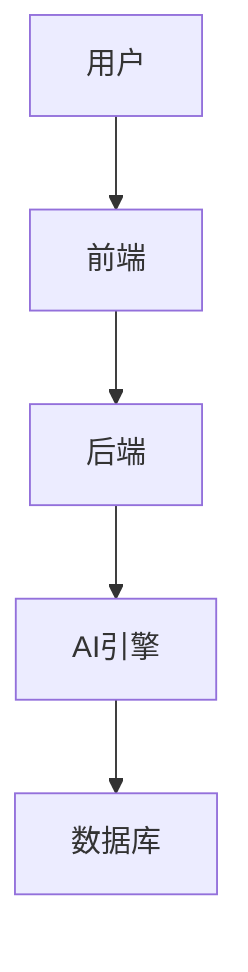

                 


# AI Agent在企业产品全生命周期管理中的端到端应用

**关键词**：AI Agent, 企业产品全生命周期, 端到端应用, 智能管理, 技术实现

**摘要**：随着人工智能技术的快速发展，AI Agent（人工智能代理）在企业产品全生命周期管理中的应用越来越广泛。本文将从AI Agent的核心原理出发，详细探讨其在产品规划、开发、测试、运营等各个阶段的具体应用，并通过实际案例分析，展示AI Agent如何提升企业产品管理的效率和质量。文章还涵盖了系统架构设计、算法原理等内容，为读者提供全面的技术视角。

---

# 第一部分: AI Agent与企业产品全生命周期管理概述

## 第1章: AI Agent的基本概念与应用背景

### 1.1 AI Agent的核心概念

AI Agent（人工智能代理）是一种能够感知环境、自主决策并执行任务的智能实体。它通过传感器获取信息，利用算法进行分析和推理，从而做出最优决策并执行操作。AI Agent的关键特征包括自主性、反应性、主动性、社会性以及学习能力。

### 1.2 企业产品全生命周期管理

企业产品全生命周期管理（Product Lifecycle Management, PLM）是指从产品规划、设计、开发、测试、生产、销售到维护的整个过程的管理。传统的PLM依赖于人工操作，效率低下且容易出错。AI Agent的应用能够显著提升各个环节的效率和准确性。

### 1.3 AI Agent在企业中的应用背景

随着市场竞争的加剧和技术的进步，企业对产品管理的智能化要求不断提高。AI Agent凭借其强大的数据处理和决策能力，成为企业优化产品管理流程的重要工具。通过AI Agent，企业能够实现跨部门协作、实时监控和智能反馈，从而提高整体运营效率。

---

## 第2章: AI Agent的核心原理与技术

### 2.1 AI Agent的决策机制

AI Agent的决策机制是其核心之一。基于规则的决策系统通过预设规则进行判断，适用于简单场景；基于机器学习的决策系统通过数据训练模型，适用于复杂场景；强化学习则通过奖励机制优化决策过程。本文将重点介绍基于机器学习的决策机制。

#### 2.1.1 基于机器学习的决策流程

1. 数据收集与预处理：从企业系统中获取相关数据，进行清洗和特征提取。
2. 模型训练：使用训练数据训练分类或回归模型。
3. 决策推理：根据输入的数据，模型生成决策结果。

#### 2.1.2 决策流程的Mermaid图示



### 2.2 AI Agent的通信与协作

多智能体系统中，AI Agent需要通过通信协议进行协作。常见的通信协议包括基于REST的API和消息队列（如Kafka）。协作机制涉及任务分配、状态同步和冲突解决。

#### 2.2.1 多智能体协作的挑战与解决方案

- **挑战**：任务分配的公平性、状态同步的实时性、冲突解决的复杂性。
- **解决方案**：采用分布式架构，利用区块链技术实现状态同步，使用协商算法解决冲突。

### 2.3 AI Agent的学习与自适应能力

AI Agent的学习能力使其能够不断优化自身行为。在线学习适用于实时数据更新，离线学习则适合批量数据处理。知识表示通常使用图结构，推理过程基于符号逻辑。

#### 2.3.1 在线学习与离线学习对比

| 特性         | 在线学习       | 离线学习       |
|--------------|----------------|----------------|
| 数据来源     | 实时数据流     | 批量历史数据   |
| 计算资源     | 较低           | 较高           |
| 响应速度     | 快             | 较慢           |

---

## 第3章: 企业产品全生命周期中的AI Agent应用

### 3.1 产品规划与设计阶段

#### 3.1.1 基于AI Agent的需求分析

AI Agent通过自然语言处理（NLP）技术分析用户反馈，生成需求文档。例如，使用GPT模型分析用户评论，提取关键需求。

#### 3.1.2 自动化需求文档生成

AI Agent可以根据提取的需求生成结构化的文档，减少人工工作量。例如，使用模板引擎结合NLP生成的产品需求说明书。

### 3.2 产品开发与测试阶段

#### 3.2.1 AI驱动的代码生成

AI Agent可以根据需求描述自动生成代码片段。例如，使用GitHub Copilot生成API接口代码。

#### 3.2.2 自动化测试用例生成

AI Agent可以根据历史测试数据自动生成测试用例，提高测试效率。例如，使用遗传算法生成覆盖不同场景的测试用例。

### 3.3 产品运营与维护阶段

#### 3.3.1 智能监控与故障诊断

AI Agent可以实时监控系统运行状态，预测潜在故障。例如，使用时间序列分析预测服务器负载。

---

## 第4章: 系统架构与技术实现

### 4.1 系统架构设计

企业产品管理系统的架构包括前端、后端和AI引擎。前端提供用户界面，后端处理业务逻辑，AI引擎负责决策和学习。

#### 4.1.1 系统架构的Mermaid图



### 4.2 系统实现细节

#### 4.2.1 AI Agent的核心代码实现

```python
class AIAssistant:
    def __init__(self):
        self.model = load_model()  # 加载训练好的模型
        self.data_processor = DataProcessor()

    def process_request(self, request):
        processed_data = self.data_processor.preprocess(request)
        prediction = self.model.predict(processed_data)
        return self.generate_response(prediction)
```

### 4.3 算法原理

#### 4.3.1 基于机器学习的决策算法

模型训练过程如下：

1. 数据预处理：清洗数据，提取特征。
2. 模型训练：使用随机森林或神经网络模型。
3. 模型评估：通过交叉验证评估模型性能。

数学公式：损失函数为均方误差（MSE）。

$$ \text{Loss} = \frac{1}{n}\sum_{i=1}^{n}(y_i - \hat{y_i})^2 $$

---

## 第5章: 项目实战与最佳实践

### 5.1 项目实战

#### 5.1.1 环境安装与配置

安装必要的库：

```bash
pip install transformers pandas scikit-learn
```

#### 5.1.2 核心代码实现

实现一个简单的AI Agent：

```python
from transformers import pipeline

# 初始化模型
model = pipeline("text-classification", model="facebook/roberta-base")

# 处理输入
input_text = "用户需求：提高产品性能"
result = model(input_text)
print(result)
```

### 5.2 最佳实践

- **小结**：AI Agent的应用显著提升了企业产品管理的效率和准确性。
- **注意事项**：确保数据安全，选择合适的AI模型，定期更新模型。
- **拓展阅读**：深入学习强化学习和分布式系统知识。

---

# 第六部分: 结论

AI Agent在企业产品全生命周期管理中的应用前景广阔。通过智能化的决策和协作，企业能够更高效地管理产品，提升竞争力。未来，随着AI技术的不断发展，AI Agent将在更多领域发挥重要作用。

---

**作者：AI天才研究院 & 禅与计算机程序设计艺术**

