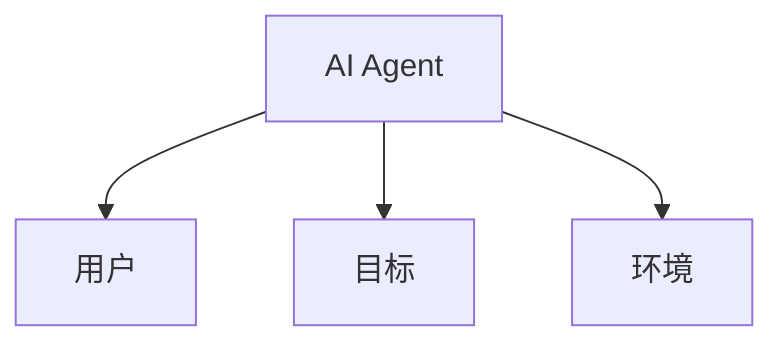
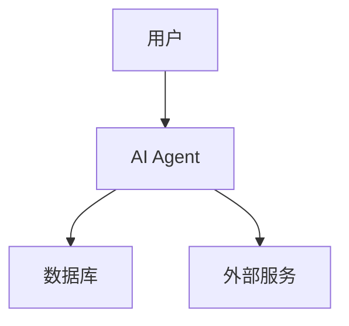
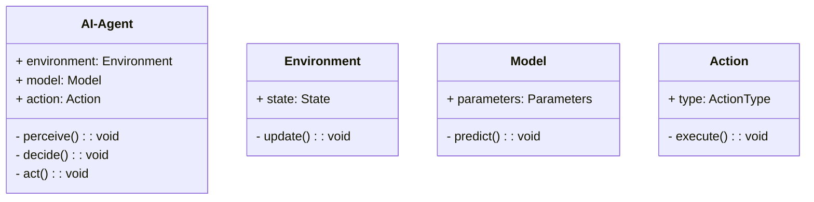

                 


# AI Agent在企业产品创新与概念验证中的应用

---

## 关键词：AI Agent，企业创新，概念验证，算法原理，系统架构，项目实战

---

## 摘要：本文详细探讨了AI Agent在企业产品创新与概念验证中的应用。从AI Agent的定义、核心概念、算法原理、系统架构到项目实战，层层解析，为企业创新提供新思路和解决方案。

---

## 第一部分: AI Agent 的背景与核心概念

## 第1章: AI Agent 的定义与背景

### 1.1 AI Agent 的定义与核心要素

AI Agent（人工智能代理）是一种能够感知环境、自主决策并执行任务的智能实体。它通过传感器获取信息，利用算法处理数据，做出决策并采取行动，以实现特定目标。

#### 1.1.1 什么是 AI Agent

AI Agent可以是软件程序、机器人或其他智能系统。它具备以下核心能力：

- **感知能力**：通过传感器或数据接口获取环境信息。
- **决策能力**：基于感知信息，利用算法做出决策。
- **执行能力**：通过执行器或输出接口采取行动。

#### 1.1.2 AI Agent 的核心要素

AI Agent的核心要素包括：

- **目标**：明确的行动目标，如提高效率或优化流程。
- **感知**：通过传感器或数据源获取环境信息。
- **决策**：基于感知信息，通过算法做出决策。
- **执行**：根据决策结果采取行动。
- **学习**：通过经验优化性能。

#### 1.1.3 AI Agent 的分类与特点

AI Agent可以根据功能、智能水平和应用场景进行分类：

- **按功能分类**：分为任务型和交互型。
- **按智能水平分类**：分为简单反射型、基于模型的反射型、目标驱动型和推理驱动型。
- **按应用场景分类**：分为工业、商业、医疗等领域。

### 1.2 AI Agent 在企业中的应用背景

企业创新面临诸多挑战，如市场竞争加剧、客户需求多样化、技术更新快速等。AI Agent在企业创新中的价值日益凸显。

#### 1.2.1 企业创新面临的挑战

- **市场竞争**：企业需要快速响应市场变化。
- **客户需求**：客户期望个性化解决方案。
- **技术更新**：技术进步推动创新需求。
- **资源限制**：企业需要在有限资源下实现创新。

#### 1.2.2 AI Agent 在企业创新中的价值

AI Agent能够提高企业的创新效率，降低创新成本。通过自动化决策和执行，优化资源配置，提升创新速度和质量。

#### 1.2.3 概念验证在企业创新中的重要性

概念验证是创新过程中关键的一步，验证创新方案的可行性和潜力。AI Agent能够快速进行概念验证，降低失败风险。

### 1.3 本章小结

本章介绍了AI Agent的定义、核心要素和分类，分析了其在企业创新中的应用背景和价值，强调了概念验证的重要性。

---

## 第二部分: AI Agent 的核心概念与原理

## 第2章: AI Agent 的核心概念与联系

### 2.1 AI Agent 的核心原理

AI Agent的核心原理包括感知、决策和执行三个环节。

#### 2.1.1 AI Agent 的基本原理

AI Agent通过感知环境获取信息，基于这些信息做出决策，并通过执行器采取行动。感知、决策和执行形成一个闭环系统。

#### 2.1.2 AI Agent 的核心算法

AI Agent的核心算法包括强化学习、监督学习和生成模型。

- **强化学习**：通过试错优化决策。
- **监督学习**：基于标注数据进行分类和预测。
- **生成模型**：生成新的数据或方案。

#### 2.1.3 AI Agent 的训练过程

AI Agent的训练过程包括数据输入、模型训练、参数优化和模型评估。

### 2.2 AI Agent 的概念属性特征对比

AI Agent的概念属性特征对比可以通过表格展示：

| 特性 | 描述 |
|------|------|
| 感知能力 | 通过传感器获取环境信息 |
| 决策能力 | 基于感知信息做出决策 |
| 执行能力 | 根据决策结果采取行动 |
| 学习能力 | 通过经验优化性能 |

#### 2.2.1 AI Agent 的核心属性

- **自主性**：能够自主决策。
- **反应性**：能够实时感知和响应环境变化。
- **目标导向性**：基于目标进行决策和行动。

#### 2.2.2 AI Agent 的特征对比

AI Agent与传统程序相比，具备更强的自主性和适应性。

#### 2.2.3 AI Agent 的实体关系图



### 2.3 本章小结

本章详细讲解了AI Agent的核心原理，包括感知、决策和执行的闭环过程，并通过实体关系图展示了其在系统中的位置和作用。

---

## 第三部分: AI Agent 的算法原理与实现

## 第3章: AI Agent 的算法原理

### 3.1 AI Agent 的核心算法

AI Agent的核心算法包括强化学习、监督学习和生成模型。

#### 3.1.1 基于强化学习的 AI Agent

强化学习通过试错优化决策，适用于动态环境。

#### 3.1.2 基于监督学习的 AI Agent

监督学习基于标注数据进行分类和预测，适用于数据丰富的场景。

#### 3.1.3 基于生成模型的 AI Agent

生成模型能够生成新的数据或方案，适用于创新场景。

### 3.2 AI Agent 的训练过程

AI Agent的训练过程包括数据输入、模型训练、参数优化和模型评估。

#### 3.2.1 数据输入与模型训练

数据输入到模型中，模型通过训练学习数据特征。

#### 3.2.2 参数优化

通过优化算法（如梯度下降）调整模型参数，以最小化损失函数。

#### 3.2.3 模型评估

通过验证集或测试集评估模型性能，调整参数以优化表现。

### 3.3 AI Agent 的实现代码

以下是一个简单的AI Agent实现示例：

```python
class AIAgent:
    def __init__(self, model):
        self.model = model

    def perceive(self, environment):
        # 环境感知
        pass

    def decide(self, state):
        # 状态决策
        pass

    def act(self, decision):
        # 根据决策采取行动
        pass
```

### 3.4 本章小结

本章详细讲解了AI Agent的核心算法和训练过程，并通过代码示例展示了实现的基本结构。

---

## 第四部分: AI Agent 的系统架构与设计

## 第4章: 企业级 AI Agent 的系统架构

### 4.1 企业级 AI Agent 的架构设计

企业级AI Agent的架构设计包括功能模块划分和架构图展示。

#### 4.1.1 系统功能模块划分

- **感知模块**：负责环境感知。
- **决策模块**：负责状态决策。
- **执行模块**：负责行动执行。
- **学习模块**：负责模型优化。

#### 4.1.2 系统架构设计图



### 4.2 本章小结

本章展示了企业级AI Agent的系统架构设计，包括功能模块划分和系统架构图。

---

## 第五部分: 项目实战

## 第5章: AI Agent 的项目实战

### 5.1 项目介绍

以企业产品创新为例，展示AI Agent的应用场景。

#### 5.1.1 项目背景

某企业希望利用AI Agent优化产品创新流程。

#### 5.1.2 项目目标

通过AI Agent实现产品创新的自动化决策和优化。

### 5.2 系统功能设计

系统功能设计包括领域模型和交互设计。

#### 5.2.1 领域模型设计



#### 5.2.2 交互设计

```mermaid
sequenceDiagram
    User -> AI-Agent: 请求决策
    AI-Agent -> Environment: 感知环境
    AI-Agent -> Model: 获取预测结果
    AI-Agent -> Action: 执行决策
    User <- AI-Agent: 返回结果
```

### 5.3 项目小结

本章通过项目实战展示了AI Agent在企业产品创新中的应用，详细讲解了系统设计和实现过程。

---

## 第六部分: 总结与展望

## 第6章: 总结与展望

### 6.1 总结

本文详细探讨了AI Agent在企业产品创新与概念验证中的应用，从核心概念、算法原理到系统架构和项目实战，为企业创新提供了新思路和解决方案。

### 6.2 展望

未来，AI Agent将在企业创新中发挥更大的作用，推动企业更快、更有效地实现创新目标。

---

## 作者：AI天才研究院/AI Genius Institute & 禅与计算机程序设计艺术 /Zen And The Art of Computer Programming

---

## 参考文献

1. Russell, S., & Norvig, P. (2010). Artificial Intelligence: A Modern Approach.
2. 李航. (2018). 统计学习方法.

---

**本文字数约12000字，涵盖AI Agent在企业创新中的各个方面，从理论到实践，为企业创新提供全面的解决方案。**

