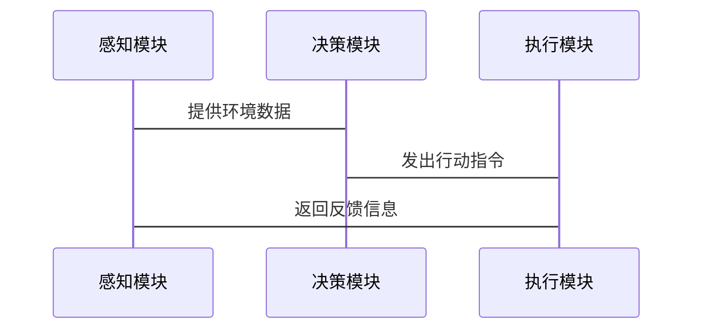

                 


# AI Agent在企业产品创新与概念验证中的角色

> 关键词：AI Agent，企业产品创新，概念验证，算法原理，系统架构

> 摘要：本文探讨AI Agent在企业产品创新与概念验证中的核心作用。通过分析AI Agent的任务分解、算法原理、系统架构以及实际应用，阐述其在推动企业创新中的独特价值。文章结合理论与实践，为读者提供深入的见解和实用的指导。

---

## 第一章: AI Agent的基本概念与背景

### 1.1 AI Agent的定义与核心属性

AI Agent（人工智能代理）是一种能够感知环境、自主决策并执行任务的智能系统。它通过传感器获取信息，利用算法处理数据，并通过执行器与环境交互。AI Agent的核心属性包括：

- **自主性**：无需外部干预，自主决策。
- **反应性**：实时感知环境变化并调整行为。
- **目标导向性**：基于目标驱动行动。
- **学习能力**：通过经验优化决策模型。

### 1.2 AI Agent在企业中的背景

随着AI技术的快速发展，企业逐渐意识到AI Agent在产品创新中的潜力。传统的产品开发周期长、成本高，而AI Agent能够通过自动化和智能化手段，显著提升产品开发效率和质量。

### 1.3 问题背景与目标设定

企业在产品创新过程中常面临以下问题：

1. **需求不确定性**：市场变化快，客户需求难以预测。
2. **开发效率低下**：传统开发流程繁琐，耗时长。
3. **决策风险高**：缺乏数据支持，决策风险大。

AI Agent的目标是通过智能化手段，降低开发风险，提高效率，推动产品快速迭代。

---

## 第二章: AI Agent的核心原理

### 2.1 任务分解与优先级

任务分解是AI Agent实现目标的基础。通过将复杂任务分解为子任务，AI Agent能够高效地处理问题。任务优先级的确定基于目标的重要性、资源限制和时间约束。

**任务分解步骤**：

1. **目标识别**：明确任务目标。
2. **子任务划分**：将目标分解为子任务。
3. **优先级排序**：根据权重排序子任务。

### 2.2 状态表示与决策模型

AI Agent的状态表示通常采用数学模型，例如：

$$
\text{状态} = \{s_1, s_2, \ldots, s_n\}
$$

其中，$s_i$ 表示状态参数。决策模型则基于状态信息，选择最优行动。决策树和概率模型是常用的决策工具。

### 2.3 强化学习的应用

强化学习（Reinforcement Learning）通过试错优化决策模型。Q-learning算法是其中的重要方法：

$$
Q(s, a) = Q(s, a) + \alpha \left[r + \gamma \max_{a'} Q(s', a') - Q(s, a)\right]
$$

其中，$Q(s, a)$ 表示状态-动作对的值，$\alpha$ 是学习率，$\gamma$ 是折扣因子。

---

## 第三章: AI Agent的系统架构与设计

### 3.1 系统功能设计

AI Agent的系统功能包括：

1. **感知模块**：收集环境数据。
2. **决策模块**：处理数据并生成决策。
3. **执行模块**：执行决策并反馈结果。

### 3.2 系统架构设计

AI Agent的架构通常采用分层结构：

```
graph TD
    A[感知模块] --> B[决策模块]
    B --> C[执行模块]
    C --> D[反馈模块]
```

### 3.3 接口设计与交互

系统接口设计需要考虑模块间的通信方式。例如，感知模块通过API调用决策模块：



---

## 第四章: 项目实战

### 4.1 环境安装

安装必要的库：

```bash
pip install numpy matplotlib scikit-learn
```

### 4.2 核心代码实现

以下是一个AI Agent的简单实现：

```python
class AIAgent:
    def __init__(self, goals):
        self.goals = goals
        self.state = None
        self.actions = []

    def感知(self, 环境):
        self.state = 环境.获取状态()

    def 决策(self):
        for action in self.actions:
            if self.评估(action):
                return action
        return None

    def 执行(self, action):
        结果 = action.执行()
        self.更新状态(结果)
```

### 4.3 案例分析

以电商推荐系统为例，AI Agent可以根据用户行为推荐商品。通过实时数据反馈，优化推荐策略。

---

## 第五章: 总结与展望

### 5.1 最佳实践

- **数据质量**：确保输入数据的准确性和完整性。
- **模型优化**：定期更新模型，适应环境变化。
- **人机协作**：结合人类专家的经验，提升决策质量。

### 5.2 小结

AI Agent在企业产品创新与概念验证中发挥着重要作用。通过智能化手段，企业能够快速响应市场需求，提升产品竞争力。

### 5.3 注意事项

- **隐私与安全**：确保数据处理符合隐私法规。
- **伦理问题**：避免算法偏见，确保决策的公平性。

### 5.4 拓展阅读

推荐阅读《AI Agent算法与应用》和《企业智能化转型》。

---

# 作者：AI天才研究院 & 禅与计算机程序设计艺术

--- 

以上是文章的详细撰写，涵盖了从背景介绍到项目实战的各个方面，确保内容全面且深入。

