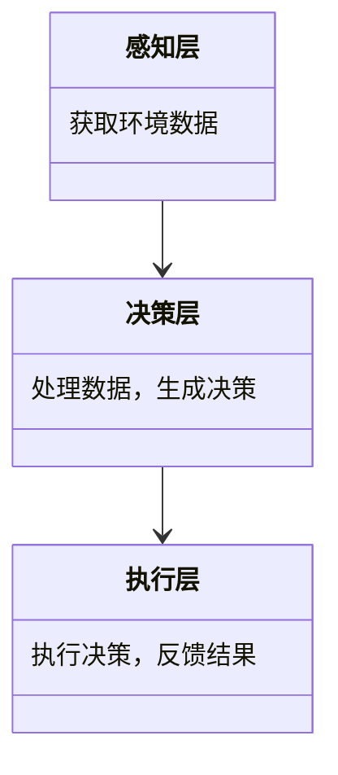
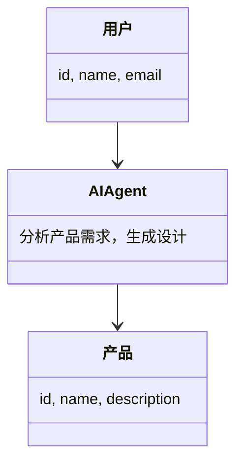
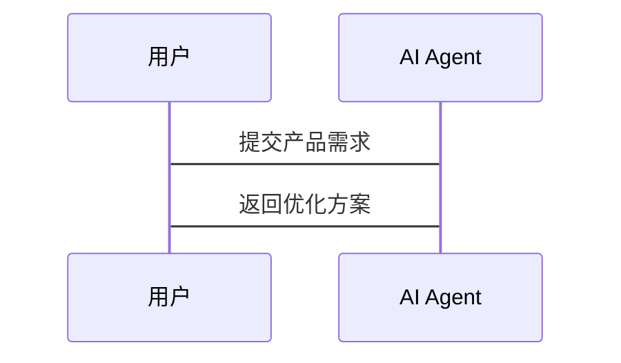

                 


# AI Agent在企业产品开发与创新中的角色

## 关键词：
- AI Agent
- 企业产品开发
- 创新
- 人工智能
- 软件架构

## 摘要：
本文探讨AI Agent在企业产品开发与创新中的角色，分析其核心原理、系统架构及实际应用案例。通过详细讲解AI Agent的技术基础、算法原理和系统设计，结合具体项目实战，为企业利用AI Agent提供理论支持和实践指导。

---

# 第一部分: AI Agent 的背景与概念

## 第1章: AI Agent 的基本概念

### 1.1 AI Agent 的定义与特征

#### 1.1.1 什么是 AI Agent
AI Agent（人工智能代理）是一种能够感知环境并采取行动以实现目标的智能实体。它通过传感器获取信息，利用计算模型做出决策，并通过执行器与环境交互。AI Agent可以是软件程序、机器人或其他智能系统。

#### 1.1.2 AI Agent 的核心特征
| 特征 | 描述 |
|------|------|
| 自主性 | 能够独立决策和行动 |
| 反应性 | 能够实时感知并响应环境变化 |
| 目标导向 | 以实现特定目标为导向 |
| 学习能力 | 能够通过经验改进性能 |

#### 1.1.3 AI Agent 与传统软件的区别
| 方面 | 传统软件 | AI Agent |
|------|----------|----------|
| 行为模式 | 静态、被动 | 动态、主动 |
| 决策机制 | 硬编码逻辑 | 动态学习和优化 |
| 交互方式 | 单向 | 双向互动 |

### 1.2 AI Agent 在企业中的角色

#### 1.2.1 企业产品开发中的 AI Agent
AI Agent在产品开发中的应用包括需求分析、设计优化和开发辅助。例如，AI Agent可以通过分析市场数据生成产品需求，或通过模拟测试优化产品设计。

#### 1.2.2 企业创新中的 AI Agent
AI Agent可以辅助创新思维，生成创意，并优化创新项目的管理。例如，AI Agent可以通过分析行业趋势提出创新方向，或通过模拟团队协作优化项目流程。

---

## 第二部分: AI Agent 的核心原理与技术

## 第2章: AI Agent 的核心原理

### 2.1 AI Agent 的决策机制

#### 2.1.1 状态空间与动作空间
AI Agent在决策过程中需要考虑当前状态和可能的动作。状态空间表示所有可能的状态，动作空间表示所有可能的动作。

#### 2.1.2 决策树与概率模型
决策树是一种树状结构，用于表示可能的决策路径。概率模型（如马尔可夫决策过程）用于估计不同决策的概率和结果。

#### 2.1.3 强化学习在 AI Agent 中的应用
强化学习是一种通过试错机制优化决策的算法。AI Agent通过与环境交互，学习最优策略。

### 2.2 AI Agent 的知识表示

#### 2.2.1 知识图谱的构建
知识图谱是一种结构化的知识表示形式，用于存储实体及其关系。AI Agent可以通过知识图谱进行推理和决策。

#### 2.2.2 知识表示的多样性
知识可以以多种方式表示，如规则、概率、语义网络等。AI Agent需要根据任务需求选择合适的表示方式。

#### 2.2.3 知识推理与更新
知识推理是通过逻辑推理或统计方法从现有知识中推导出新的知识。知识更新是根据新信息动态更新知识库。

---

## 第三部分: AI Agent 的算法原理

## 第3章: AI Agent 的算法原理

### 3.1 强化学习算法

#### 3.1.1 Q-learning 算法
Q-learning是一种基于值函数的强化学习算法，通过更新Q值表来学习最优策略。其数学公式为：

$$ Q(s, a) \leftarrow Q(s, a) + \alpha [r + \max Q(s', a') - Q(s, a)] $$

其中，\( \alpha \) 是学习率，\( r \) 是奖励，\( s' \) 是下一个状态。

#### 3.1.2 Deep Q-Networks (DQN)
DQN结合了深度学习和Q-learning，通过神经网络近似Q值函数。其架构包括输入层、隐藏层和输出层。

#### 3.1.3 策略梯度方法
策略梯度方法直接优化策略，通过计算梯度更新参数。其数学公式为：

$$ \theta \leftarrow \theta + \alpha \nabla_\theta J(\theta) $$

其中，\( J(\theta) \) 是目标函数，\( \alpha \) 是步长。

### 3.2 生成式模型

#### 3.2.1 GAN 在 AI Agent 中的应用
GAN（生成对抗网络）由生成器和判别器组成，通过对抗训练生成高质量数据。其损失函数为：

$$ \mathcal{L} = \mathbb{E}_{z \sim p_z}[\log D(G(z))] + \mathbb{E}_{x \sim p_x}[\log(1 - D(x))] $$

#### 3.2.2 变量自回归模型 (VAE)
VAE通过重参数化技巧生成数据，其概率模型表示为：

$$ p(x) = \int p(x|z) p(z) dz $$

其中，\( z \) 是 latent variable。

#### 3.2.3 大语言模型在生成任务中的应用
大语言模型（如GPT）通过预训练参数生成自然语言文本，适用于创意写作和文本生成任务。

---

## 第四部分: AI Agent 的系统分析与架构设计

## 第4章: AI Agent 的系统架构

### 4.1 系统架构设计

#### 4.1.1 分层架构
分层架构将系统划分为感知层、决策层和执行层，每层负责不同的功能。其类图如下：



#### 4.1.2 微服务架构
微服务架构将系统功能分解为独立的服务，通过API进行通信。其架构图如下：

```mermaid
graph TD
    A[用户] --> API Gateway
    API Gateway --> Service1
    Service1 --> Service2
    Service2 --> Database
```

### 4.2 系统功能设计

#### 4.2.1 领域模型
领域模型描述系统的功能模块及其关系。类图如下：



#### 4.2.2 系统交互流程
系统交互流程描述用户与AI Agent的交互过程。序列图如下：



---

## 第五部分: 项目实战

## 第5章: 项目实战

### 5.1 智能客服系统

#### 5.1.1 环境安装
安装Python和相关库：
```bash
pip install numpy matplotlib tensorflow
```

#### 5.1.2 系统核心实现
实现一个简单的智能客服系统：
```python
class AI_Agent:
    def __init__(self):
        self.model = self.build_model()

    def build_model(self):
        # 定义神经网络模型
        pass

    def analyze_request(self, request):
        # 分析请求并生成响应
        pass
```

#### 5.1.3 代码应用解读
代码实现了一个AI Agent，包括模型构建和请求分析功能。模型构建部分使用了深度神经网络，请求分析部分通过自然语言处理技术生成响应。

#### 5.1.4 实际案例分析
通过具体案例分析AI Agent在智能客服中的应用，展示其如何优化客户服务流程。

---

## 第六部分: 最佳实践与小结

## 第6章: 最佳实践

### 6.1 实际应用中的注意事项

#### 数据隐私
在企业应用中，必须注意数据隐私问题，确保数据的合法使用和保护。

#### 模型可解释性
复杂的AI模型可能导致决策过程不透明，需要提高模型的可解释性，以便更好地理解和信任AI Agent的决策。

#### 持续优化
AI Agent需要通过持续学习和优化，以适应不断变化的环境和需求。

### 6.2 未来发展趋势

#### 人机协作
未来的AI Agent将更加注重人机协作，与人类共同完成任务，而不是完全替代人类。

#### 多模态交互
AI Agent将支持更多形式的交互方式，如视觉、听觉和触觉，提供更丰富的用户体验。

#### 自适应系统
AI Agent将具备更强的自适应能力，能够根据环境变化动态调整策略和行为。

### 6.3 小结

本文全面探讨了AI Agent在企业产品开发与创新中的角色，从基本概念到算法原理，再到系统设计和项目实战，为企业应用AI Agent提供了理论支持和实践指导。通过持续学习和优化，AI Agent将在未来的企业中发挥越来越重要的作用。

---

## 作者信息

作者：AI天才研究院/AI Genius Institute & 禅与计算机程序设计艺术 /Zen And The Art of Computer Programming

