                 


# AI Agent在企业产品生命周期管理与优化中的全面应用

## 关键词：AI Agent，企业产品生命周期，智能化管理，优化应用，技术实现

## 摘要：  
随着人工智能技术的快速发展，AI Agent（人工智能代理）在企业产品生命周期管理中的应用日益广泛。本文系统地探讨了AI Agent在企业产品生命周期管理中的核心概念、算法原理、系统架构、应用场景及最佳实践。通过详细分析AI Agent如何赋能产品设计、开发、市场和运营等阶段，本文揭示了AI Agent在提升企业产品管理效率、优化产品性能和用户体验中的巨大潜力。文章还结合实际案例，展示了AI Agent在企业产品生命周期管理中的具体实现和应用效果，为企业智能化管理提供了重要的参考和指导。

---

# 第一部分：AI Agent与企业产品生命周期管理概述

## 第1章：AI Agent与企业产品生命周期管理概述

### 1.1 AI Agent的基本概念与特点

#### 1.1.1 AI Agent的定义与核心特征
AI Agent（人工智能代理）是一种能够感知环境、自主决策并执行任务的智能实体。与传统自动化工具相比，AI Agent具有以下核心特征：
- **自主性**：能够在无外部干预的情况下独立执行任务。
- **反应性**：能够实时感知环境变化并做出响应。
- **学习能力**：通过数据和经验不断优化自身的决策能力。
- **适应性**：能够根据环境变化动态调整行为策略。

#### 1.1.2 AI Agent与传统自动化工具的区别
| 特性 | AI Agent | 传统自动化工具 |
|------|-----------|----------------|
| 决策能力 | 强大，基于实时数据和模型 | 较弱，依赖预设规则 |
| 学习能力 | 具备，能够优化行为 | 无学习能力 |
| 灵活性 | 高，能够适应复杂环境 | 较低，难以应对非结构化问题 |

#### 1.1.3 AI Agent在企业中的应用潜力
AI Agent能够赋能企业的多个领域，包括产品管理、客户服务、供应链优化等。在产品生命周期管理中，AI Agent可以通过自动化决策和优化建议，显著提升企业的产品管理效率和竞争力。

---

### 1.2 企业产品生命周期管理的核心要素

#### 1.2.1 产品生命周期的四个阶段
企业产品生命周期通常分为以下四个阶段：
1. **引入阶段**：产品设计与开发。
2. **增长阶段**：产品推广与市场拓展。
3. **成熟阶段**：产品稳定与优化。
4. **衰退阶段**：产品退市与替换。

#### 1.2.2 产品管理的关键环节
产品管理的关键环节包括：
- **需求分析**：识别用户需求并转化为产品功能。
- **开发管理**：协调开发团队完成产品开发。
- **市场推广**：制定并执行市场推广策略。
- **运营优化**：监控产品表现并进行持续优化。

#### 1.2.3 产品生命周期管理的挑战与优化方向
- **挑战**：
  - 产品需求变更频繁，导致开发周期延长。
  - 市场变化迅速，传统管理方法难以快速响应。
  - 数据孤岛问题严重，难以实现全生命周期的协同管理。
- **优化方向**：
  - 引入智能化工具提升管理效率。
  - 实现跨部门数据共享与协同。
  - 建立动态反馈机制，快速响应市场变化。

---

### 1.3 AI Agent在企业产品生命周期管理中的应用背景

#### 1.3.1 传统产品管理的痛点分析
传统产品管理面临以下痛点：
- **效率低下**：人工处理大量重复性任务，效率低且容易出错。
- **决策滞后**：依赖人工分析，难以快速做出最优决策。
- **数据孤岛**：各部门数据分散，难以形成统一的决策依据。

#### 1.3.2 AI技术对企业产品管理的赋能
AI技术通过以下方式赋能企业产品管理：
- **自动化**：AI Agent能够自动处理重复性任务，如需求分析、数据整理等。
- **智能化决策**：基于实时数据和机器学习模型，AI Agent能够提供精准的决策支持。
- **动态优化**：AI Agent能够根据市场反馈动态调整产品策略。

#### 1.3.3 AI Agent在产品生命周期管理中的价值
AI Agent通过以下方式为产品生命周期管理带来价值：
- **缩短开发周期**：通过自动化任务和智能决策，显著缩短产品开发周期。
- **提升决策精度**：基于海量数据和机器学习模型，提供更精准的决策支持。
- **增强用户体验**：通过实时反馈和个性化推荐，提升用户的使用体验。

---

## 1.4 本章小结
本章从AI Agent的基本概念和特点出发，详细介绍了企业产品生命周期管理的核心要素及其面临的挑战。通过分析AI Agent在企业产品管理中的应用背景，揭示了AI Agent在提升产品管理效率和优化产品表现中的巨大潜力。

---

# 第二部分：AI Agent的核心概念与原理

## 第2章：AI Agent的核心概念与原理

### 2.1 AI Agent的核心概念

#### 2.1.1 AI Agent的定义与分类
AI Agent可以根据应用场景和能力分为以下几类：
- **简单反射型Agent**：基于预设规则执行任务，适用于简单场景。
- **基于模型的反射型Agent**：基于内部模型理解和决策，适用于复杂场景。
- **目标驱动型Agent**：以特定目标为导向，主动规划和执行任务。
- **效用驱动型Agent**：通过最大化效用函数实现目标优化。

#### 2.1.2 AI Agent的主要特征
- **感知能力**：通过传感器或数据输入感知环境状态。
- **决策能力**：基于感知信息和目标函数做出决策。
- **执行能力**：通过执行器或API将决策转化为具体行动。
- **学习能力**：通过机器学习算法优化自身行为策略。

#### 2.1.3 AI Agent与AI模型的关系
AI Agent通常基于特定的AI模型构建，如强化学习模型、监督学习模型等。AI模型为AI Agent提供决策支持，而AI Agent则为AI模型提供实时数据和执行反馈，形成闭环优化。

---

### 2.2 AI Agent的算法原理

#### 2.2.1 强化学习（Reinforcement Learning）在AI Agent中的应用
强化学习是一种通过试错机制优化决策策略的算法。AI Agent通过与环境交互，不断探索最优策略。

**强化学习流程图**：
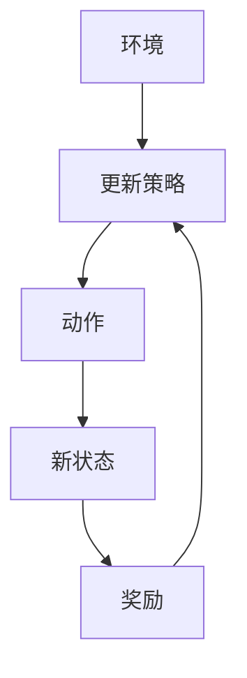

#### 2.2.2 监督学习（Supervised Learning）在AI Agent中的应用
监督学习是一种基于标记数据训练预测模型的算法。AI Agent可以通过监督学习模型预测最优决策。

**监督学习流程图**：
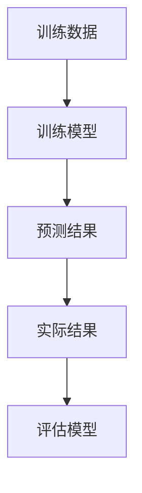

#### 2.2.3 联合学习（Federated Learning）在AI Agent中的应用
联合学习是一种在分布式数据源上训练共享模型的算法。AI Agent可以通过联合学习实现数据隐私保护下的模型优化。

---

### 2.3 AI Agent的数学模型与公式

#### 2.3.1 强化学习的Q-learning公式
Q-learning是一种经典的强化学习算法，其更新公式如下：
$$ Q(s, a) = r + \gamma \max_{a'} Q(s', a') $$

其中：
- \( Q(s, a) \) 表示状态 \( s \) 下执行动作 \( a \) 的价值。
- \( r \) 表示获得的奖励。
- \( \gamma \) 表示折扣因子，用于平衡当前奖励和未来奖励。

#### 2.3.2 监督学习的线性回归模型
线性回归是一种常用的监督学习算法，其数学模型如下：
$$ y = \beta_0 + \beta_1 x + \epsilon $$

其中：
- \( y \) 表示目标变量。
- \( x \) 表示自变量。
- \( \beta_0 \) 和 \( \beta_1 \) 表示回归系数。
- \( \epsilon \) 表示误差项。

---

### 2.4 AI Agent的实体关系图（ER图）

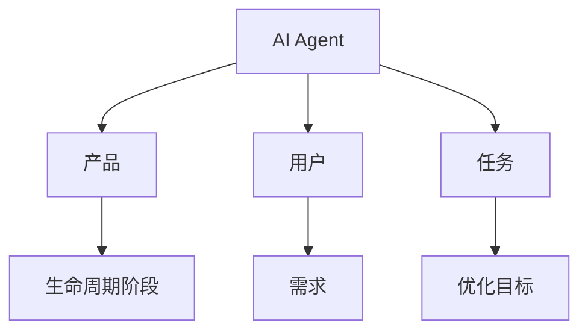

---

## 2.5 本章小结
本章从AI Agent的核心概念出发，详细介绍了其主要特征和分类。通过强化学习、监督学习和联合学习的算法原理，揭示了AI Agent的数学模型和实现机制。最后，通过ER图展示了AI Agent与企业产品生命周期管理的实体关系。

---

# 第三部分：AI Agent在企业产品生命周期管理中的应用场景

## 第3章：AI Agent在产品设计与开发阶段的应用

### 3.1 产品需求分析与生成

#### 3.1.1 基于AI Agent的需求挖掘
AI Agent可以通过分析用户反馈、市场数据和竞争产品信息，自动挖掘潜在需求。

**需求挖掘流程图**：
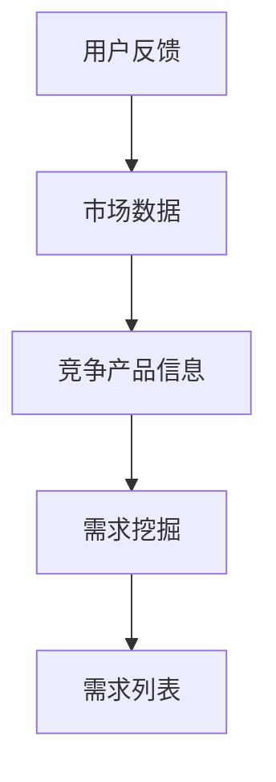

#### 3.1.2 自动化需求生成
AI Agent可以根据挖掘的需求生成详细的产品需求文档（PRD）。

---

## 3.2 产品开发与测试

### 3.2.1 自动化开发流程管理
AI Agent可以自动分配任务、跟踪进度并协调开发资源。

**自动化开发流程管理流程图**：
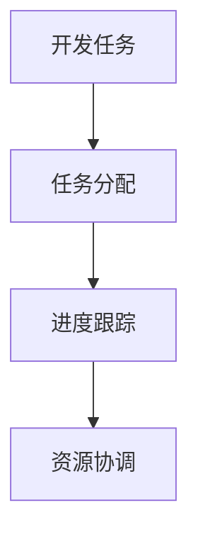

### 3.2.2 智能化测试与优化
AI Agent可以通过自动化测试工具实时监控产品质量，并提供优化建议。

---

## 第4章：AI Agent在产品市场与运营阶段的应用

### 4.1 市场预测与产品定位

#### 4.1.1 市场需求预测
AI Agent可以通过分析历史销售数据和市场趋势，预测未来市场需求。

**市场需求预测流程图**：
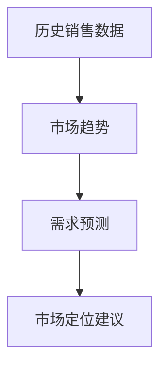

#### 4.1.2 竞争对手分析
AI Agent可以通过爬取竞争对手的产品信息，生成竞争分析报告。

---

### 4.2 客户行为分析与产品优化

#### 4.2.1 用户行为分析
AI Agent可以通过分析用户行为数据，识别用户痛点并优化产品设计。

**用户行为分析流程图**：
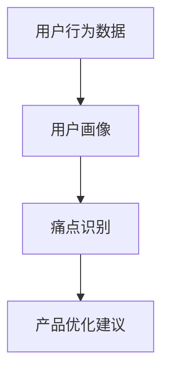

#### 4.2.2 产品性能优化
AI Agent可以通过实时监控产品性能数据，动态调整产品参数以优化用户体验。

---

## 第5章：AI Agent在产品退市与优化阶段的应用

### 5.1 产品退市策略优化

#### 5.1.1 市场反馈分析
AI Agent可以通过分析用户反馈和市场数据，制定产品退市策略。

**市场反馈分析流程图**：
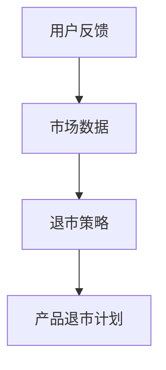

#### 5.1.2 产品替换方案推荐
AI Agent可以根据市场趋势和用户需求，推荐替代产品方案。

---

## 5.2 产品优化与迭代

### 5.2.1 用户反馈闭环
AI Agent可以通过实时反馈机制，快速响应用户需求并优化产品功能。

---

## 5.3 数据驱动的持续优化

#### 5.3.1 数据分析与洞察
AI Agent可以通过数据分析工具，提取产品生命周期中的关键洞察。

#### 5.3.2 智能化迭代优化
AI Agent可以通过机器学习模型，实现产品的智能化迭代优化。

---

## 5.4 本章小结
本章探讨了AI Agent在产品市场与运营阶段的应用场景，包括市场需求预测、用户行为分析、产品优化与迭代等方面。通过实际案例分析，展示了AI Agent在提升企业产品管理效率和优化产品表现中的巨大潜力。

---

# 第四部分：AI Agent的系统架构与实现

## 第6章：AI Agent的系统架构与实现

### 6.1 系统架构设计

#### 6.1.1 系统功能模块
- **需求分析模块**：负责挖掘和生成产品需求。
- **开发管理模块**：负责任务分配和进度跟踪。
- **市场分析模块**：负责市场需求预测和竞争分析。
- **用户反馈模块**：负责实时监控用户行为并提供优化建议。

#### 6.1.2 系统架构图
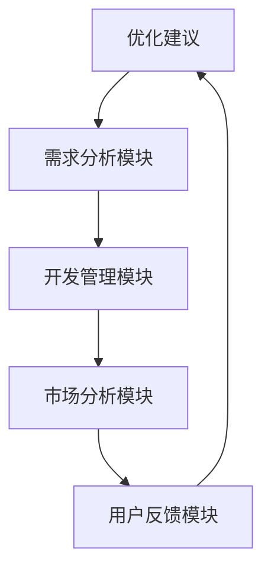

### 6.2 系统接口设计

#### 6.2.1 API接口定义
- **需求分析API**：用于接收用户需求并返回需求文档。
- **开发管理API**：用于分配任务和跟踪进度。
- **市场分析API**：用于获取市场数据并返回预测结果。
- **用户反馈API**：用于收集用户行为数据并返回优化建议。

---

### 6.3 系统交互序列图

#### 6.3.1 产品需求生成
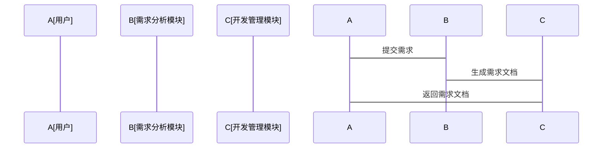

#### 6.3.2 用户反馈闭环
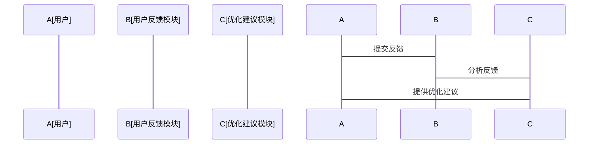

---

## 6.4 本章小结
本章详细介绍了AI Agent的系统架构与实现，包括功能模块设计、系统架构图、API接口定义和系统交互序列图。通过系统化的架构设计，确保了AI Agent在企业产品生命周期管理中的高效运行和协同优化。

---

# 第五部分：AI Agent的项目实战与最佳实践

## 第7章：AI Agent的项目实战与最佳实践

### 7.1 项目实战

#### 7.1.1 环境安装
- **Python**：安装Python 3.8及以上版本。
- **库依赖**：安装numpy、pandas、scikit-learn、tensorflow等库。

#### 7.1.2 系统核心实现

##### 7.1.2.1 强化学习代码实现
```python
import numpy as np
import gym

env = gym.make('CartPole-v0')
env.seed(1)

class Agent:
    def __init__(self, state_space, action_space):
        self.state_space = state_space
        self.action_space = action_space
        self.q_table = np.zeros((state_space, action_space))

    def act(self, state):
        return np.argmax(self.q_table[state])

    def learn(self, state, action, reward, next_state):
        self.q_table[state][action] = reward + np.max(self.q_table[next_state])

agent = Agent(env.observation_space.shape[0], env.action_space.n)
for episode in range(100):
    state = env.reset()
    for _ in range(1000):
        action = agent.act(state)
        next_state, reward, done, _ = env.step(action)
        agent.learn(state, action, reward, next_state)
        state = next_state
        if done:
            break
env.close()
```

##### 7.1.2.2 监督学习代码实现
```python
from sklearn.linear_model import LinearRegression
import numpy as np

# 生成训练数据
X = np.linspace(0, 10, 20).reshape(-1, 1)
y = 2 * X + 1 + np.random.randn(20)

# 训练模型
model = LinearRegression()
model.fit(X, y)

# 预测
new_X = np.array([[5]])
print(model.predict(new_X))
```

#### 7.1.3 案例分析与应用解读
通过上述代码实现，展示了AI Agent在产品需求生成和开发管理中的具体应用。强化学习代码实现了CartPole环境下的最优策略，监督学习代码实现了简单的线性回归预测。

---

### 7.2 最佳实践

#### 7.2.1 项目实施的关键成功因素
- **数据质量**：确保数据的完整性和准确性。
- **算法选择**：根据具体场景选择合适的算法。
- **系统集成**：确保AI Agent与现有系统的无缝集成。

#### 7.2.2 项目实施的注意事项
- **数据隐私**：注意数据的隐私保护和合规性。
- **系统稳定性**：确保系统的高可用性和容错能力。
- **团队协作**：加强跨团队协作，确保项目顺利推进。

---

## 7.3 本章小结
本章通过具体的项目实战，展示了AI Agent在企业产品生命周期管理中的实现过程和应用效果。通过总结最佳实践，为企业实施AI Agent提供了重要的参考和指导。

---

# 第六部分：总结与展望

## 第8章：总结与展望

### 8.1 本章总结
本文系统地探讨了AI Agent在企业产品生命周期管理中的核心概念、算法原理、系统架构、应用场景及最佳实践。通过详细分析AI Agent在产品设计、开发、市场和运营等阶段的具体应用，揭示了AI Agent在提升企业产品管理效率和优化产品表现中的巨大潜力。

---

### 8.2 未来展望
随着AI技术的不断进步，AI Agent在企业产品生命周期管理中的应用将更加广泛和深入。未来的研究方向包括：
- **多Agent协作**：研究多Agent协作优化的理论与方法。
- **强化学习优化**：探索强化学习在动态环境中的应用。
- **边缘计算结合**：研究AI Agent与边缘计算的结合应用。

---

## 作者：AI天才研究院/AI Genius Institute & 禅与计算机程序设计艺术 /Zen And The Art of Computer Programming

---

**感谢您的耐心阅读，希望本文能为您提供有价值的信息和启发！**

