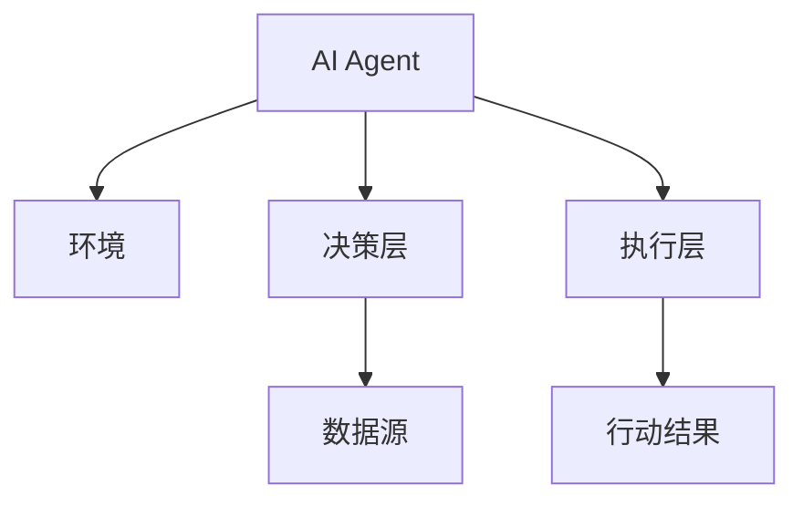
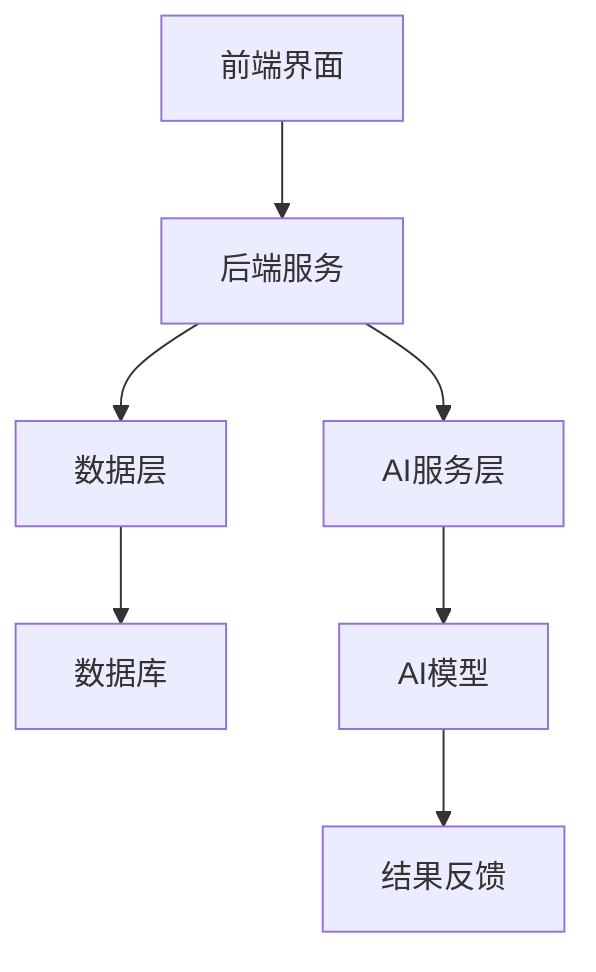
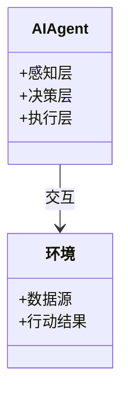
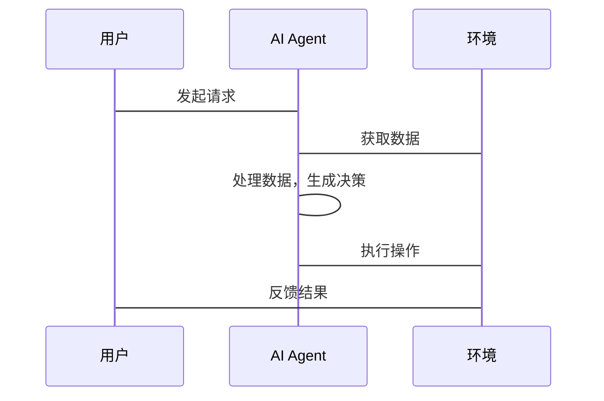

                 


# AI Agent在企业产品生命周期管理与优化中的应用

## 关键词：AI Agent, 企业产品生命周期, 产品优化, 强化学习, 系统架构

## 摘要：本文详细探讨了AI Agent在企业产品生命周期管理与优化中的应用，从背景、核心概念、算法原理、系统架构、项目实战到最佳实践，全面解析AI Agent如何助力企业实现产品管理的智能化与高效化。

---

# 第一部分: AI Agent与企业产品生命周期管理概述

## 第1章: AI Agent的基本概念与背景

### 1.1 AI Agent的定义与特点

#### 1.1.1 AI Agent的定义
AI Agent（人工智能代理）是一种能够感知环境、自主决策并执行任务的智能实体。它可以基于输入的数据做出决策，并通过执行操作来实现目标。

#### 1.1.2 AI Agent的核心特点
- **自主性**: AI Agent能够在没有外部干预的情况下自主运作。
- **反应性**: 能够实时感知环境变化并做出相应反应。
- **学习能力**: 通过数据和经验不断优化自身的决策能力。
- **协作性**: 可以与其他AI Agent或系统协同工作。

#### 1.1.3 AI Agent与传统规则引擎的区别
| 特性         | 传统规则引擎                          | AI Agent                          |
|--------------|--------------------------------------|-----------------------------------|
| 决策方式     | 基于预定义规则                        | 基于数据和模型学习                |
| 灵活性       | 较低，规则固定                        | 较高，能够适应环境变化            |
| 复杂性       | 较低，适用于简单场景                  | 较高，适用于复杂场景              |
| 学习能力     | 无学习能力                            | 具备学习能力                      |

### 1.2 企业产品生命周期管理的背景

#### 1.2.1 企业产品生命周期的定义
企业产品生命周期是指产品从设计、生产、销售到维护、淘汰的整个过程。它包括以下几个阶段：
1. **设计阶段**: 产品概念设计、需求分析、原型开发。
2. **生产阶段**: 产品制造、质量控制。
3. **销售阶段**: 市场推广、销售、客户支持。
4. **维护阶段**: 产品更新、bug修复、功能优化。

#### 1.2.2 传统产品生命周期管理的挑战
- **效率低下**: 传统的产品管理流程依赖人工操作，效率较低。
- **数据孤岛**: 各部门之间数据分散，难以实现高效协同。
- **决策滞后**: 依赖人工分析，难以快速响应市场变化。

#### 1.2.3 AI Agent在产品生命周期管理中的应用前景
AI Agent可以通过自动化决策、实时监控和数据分析，显著提升企业产品管理的效率和质量。

---

## 第2章: AI Agent在企业产品生命周期管理中的应用背景

### 2.1 企业产品管理的现状与挑战

#### 2.1.1 传统产品管理的痛点
- **需求分析复杂**: 需要整合客户反馈、市场趋势等多方面信息。
- **设计周期长**: 传统设计流程依赖人工迭代，效率较低。
- **生产成本高**: 由于缺乏实时优化，生产成本难以降低。

#### 2.1.2 数据驱动的产品管理需求
随着大数据技术的发展，企业越来越依赖数据驱动的决策。AI Agent可以通过实时数据分析，为企业产品管理提供支持。

#### 2.1.3 AI技术对企业产品管理的推动作用
- **提升效率**: AI Agent可以自动化处理大量数据，缩短产品设计和生产周期。
- **降低成本**: 通过优化资源配置，降低生产成本。
- **增强客户体验**: 实时监控客户需求，提供个性化服务。

---

## 第3章: AI Agent的核心概念与原理

### 3.1 AI Agent的基本原理

#### 3.1.1 感知层: 数据采集与处理
AI Agent通过传感器、数据库等渠道采集环境数据，并进行清洗、预处理等操作。

#### 3.1.2 决策层: 策略生成与优化
AI Agent基于感知层提供的数据，利用算法生成最优决策策略。

#### 3.1.3 执行层: 行动执行与反馈
AI Agent根据决策层生成的策略，执行具体操作，并将结果反馈到感知层。

### 3.2 AI Agent与企业产品生命周期的关系

#### 3.2.1 产品设计阶段的AI Agent应用
- **需求分析**: 通过自然语言处理技术分析客户反馈，提取产品需求。
- **设计优化**: 利用强化学习优化产品设计参数。

#### 3.2.2 生产阶段的AI Agent应用
- **质量控制**: 通过计算机视觉技术实时监控生产过程，检测产品缺陷。
- **生产优化**: 利用预测性维护技术，优化设备使用效率。

#### 3.2.3 销售与维护阶段的AI Agent应用
- **销售预测**: 利用时间序列分析预测市场需求。
- **客户支持**: 通过自然语言处理技术提供智能客服支持。

### 3.3 AI Agent的核心算法与技术

#### 3.3.1 基于强化学习的AI Agent算法
- **算法原理**: AI Agent通过与环境交互，不断优化策略，以最大化累积奖励。
- **应用场景**: 产品设计优化、生产过程控制等。

#### 3.3.2 基于监督学习的AI Agent算法
- **算法原理**: AI Agent通过监督学习模型，基于历史数据进行预测和分类。
- **应用场景**: 销售预测、客户行为分析等。

#### 3.3.3 基于知识图谱的AI Agent算法
- **算法原理**: 利用知识图谱技术，构建企业产品知识库，辅助决策。
- **应用场景**: 产品需求分析、知识问答等。

---

## 第4章: AI Agent的核心概念与联系

### 4.1 AI Agent的核心概念原理

#### 4.1.1 感知层的实现原理
AI Agent通过传感器、数据库等渠道采集数据，并进行清洗、预处理等操作。

#### 4.1.2 决策层的实现原理
AI Agent基于感知层提供的数据，利用算法生成最优决策策略。

#### 4.1.3 执行层的实现原理
AI Agent根据决策层生成的策略，执行具体操作，并将结果反馈到感知层。

### 4.2 AI Agent的核心概念联系

#### 4.2.1 实体关系图


---

## 第5章: AI Agent在企业产品生命周期管理中的应用

### 5.1 产品设计阶段的AI Agent应用

#### 5.1.1 需求分析
- **自然语言处理技术**: 通过分析客户反馈，提取产品需求。
- **案例分析**: 某公司通过AI Agent分析客户需求，成功设计出市场需求的产品。

#### 5.1.2 设计优化
- **强化学习算法**: 利用强化学习优化产品设计参数。
- **案例分析**: 某汽车制造商通过AI Agent优化汽车设计，降低风阻系数。

### 5.2 生产阶段的AI Agent应用

#### 5.2.1 质量控制
- **计算机视觉技术**: 通过图像识别技术检测产品缺陷。
- **案例分析**: 某电子产品制造商通过AI Agent实现生产线上的实时质量监控。

#### 5.2.2 生产优化
- **预测性维护技术**: 通过预测设备状态，优化设备使用效率。
- **案例分析**: 某制造企业通过AI Agent实现设备的预测性维护，减少停机时间。

### 5.3 销售与维护阶段的AI Agent应用

#### 5.3.1 销售预测
- **时间序列分析**: 通过历史销售数据预测未来市场需求。
- **案例分析**: 某零售企业通过AI Agent预测销售趋势，优化库存管理。

#### 5.3.2 客户支持
- **自然语言处理技术**: 提供智能客服支持，解决客户问题。
- **案例分析**: 某软件公司通过AI Agent实现24/7智能客服，提升客户满意度。

---

## 第6章: AI Agent在企业产品生命周期管理中的系统架构

### 6.1 系统架构设计



### 6.2 系统功能设计

#### 6.2.1 领域模型设计


#### 6.2.2 系统接口设计
- **输入接口**: 数据采集接口、用户请求接口。
- **输出接口**: 决策结果输出、执行结果反馈。

#### 6.2.3 系统交互流程


---

## 第7章: 项目实战

### 7.1 环境安装

```bash
pip install tensorflow keras scikit-learn
```

### 7.2 核心代码实现

#### 7.2.1 强化学习算法实现
```python
import numpy as np
import gym

env = gym.make('CartPole-v1')
observation_space = env.observation_space.shape[0]
action_space = env.action_space.n

# 初始化参数
learning_rate = 0.01
gamma = 0.99

# 策略网络
model = Sequential()
model.add(Dense(24, input_dim=observation_space, activation='relu'))
model.add(Dense(action_space, activation='softmax'))

# 编译模型
model.compile(optimizer=Adam(lr=learning_rate), loss='sparse_categorical_crossentropy')

# 训练过程
for episode in range(1000):
    state = env.reset()
    done = False
    while not done:
        action = np.argmax(model.predict(state.reshape(1,-1)))
        next_state, reward, done, _ = env.step(action)
        target = reward + gamma * np.max(model.predict(next_state.reshape(1,-1)))
        target = target if not done else target
        loss = model.train_on_batch(state.reshape(1,-1), [target])
```

#### 7.2.2 算法分析
- **算法优势**: 通过强化学习，AI Agent可以在复杂环境中自主学习，优化决策策略。
- **数学模型**: 强化学习的数学模型可以表示为：
  $$
  Q(s, a) = Q(s, a) + \alpha \times (r + \gamma \max Q(s', a') - Q(s, a))
  $$

---

## 第8章: 最佳实践与小结

### 8.1 最佳实践

#### 8.1.1 数据质量的重要性
- 确保数据的准确性和完整性，是AI Agent正常运行的基础。

#### 8.1.2 模型的可解释性
- 在关键业务场景中，选择可解释性较强的AI Agent算法，便于问题排查和优化。

#### 8.1.3 系统的可扩展性
- 设计时考虑系统的可扩展性，以便未来业务发展时能够方便地扩展功能。

### 8.2 注意事项

- **数据隐私**: 注意保护企业数据隐私，防止数据泄露。
- **算法选择**: 根据具体场景选择合适的算法，避免盲目追求最先进的技术。
- **系统监控**: 实时监控系统的运行状态，及时发现和解决问题。

### 8.3 拓展阅读

- **推荐书籍**: 《深度学习》、《强化学习入门》。
- **在线资源**: 推荐访问[OpenAI官网](https://www.openai.com/)，获取最新的AI技术动态。

---

## 作者

作者：AI天才研究院/AI Genius Institute & 禅与计算机程序设计艺术 /Zen And The Art of Computer Programming

