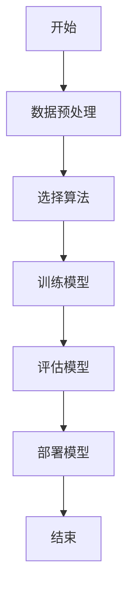
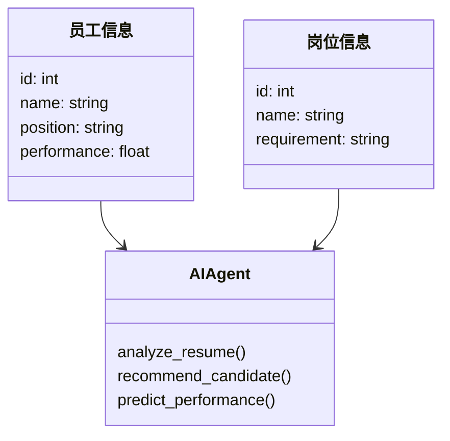
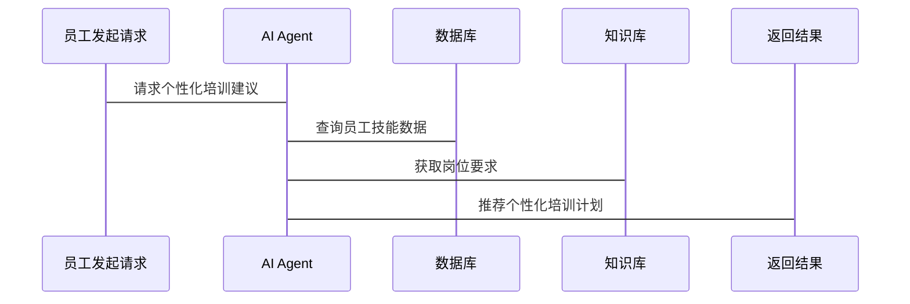

                 


# AI Agent在企业人力资源管理中的全面应用

> 关键词：AI Agent，企业人力资源管理，人工智能，算法原理，系统架构，项目实战

> 摘要：本文系统阐述了AI Agent在企业人力资源管理中的全面应用，从背景介绍、核心概念、算法原理、系统架构到项目实战，深入剖析了AI Agent如何助力企业实现高效、智能的人力资源管理。文章结合实际案例和代码实现，全面展示了AI Agent在招聘、培训、绩效管理等场景中的具体应用，并对未来的发展趋势进行了展望。

---

# 第一部分: AI Agent在企业人力资源管理中的背景与基础

## 第1章: AI Agent与企业人力资源管理的背景

### 1.1 AI Agent的基本概念与技术背景
- 1.1.1 AI Agent的定义与核心特征
  - 定义：AI Agent（人工智能代理）是指能够感知环境、自主决策并执行任务的智能实体。
  - 核心特征：自主性、反应性、目标导向、社交能力。
- 1.1.2 企业人力资源管理的数字化转型趋势
  - 从传统人工管理到数字化、智能化的转变。
  - 数字化转型的核心驱动力：数据化、自动化、智能化。
- 1.1.3 AI Agent在企业HR中的应用价值
  - 提高效率：自动化处理招聘、考勤、绩效等任务。
  - 数据驱动：基于大数据分析优化决策。
  - 个性化服务：为员工提供定制化的职业发展建议。

### 1.2 问题背景与问题描述
- 1.2.1 传统企业人力资源管理的痛点
  - 信息孤岛：各部门数据分散，难以统一管理。
  - 低效重复：招聘、培训等流程耗时且效率低。
  - 人为误差：主观判断可能导致决策偏差。
- 1.2.2 AI Agent如何解决这些问题
  - 自动化流程：AI Agent可以自动处理简历筛选、面试安排等任务。
  - 数据整合：通过AI Agent整合企业内部数据，实现数据驱动的决策。
  - 智能辅助：AI Agent可以为HR提供决策支持，减少人为误差。
- 1.2.3 问题解决的边界与外延
  - AI Agent的应用边界：招聘、培训、绩效管理等具体场景。
  - 外延：AI Agent还可以延伸至员工体验、文化管理等领域。

### 1.3 AI Agent在企业HR中的核心要素
- 1.3.1 数据驱动的决策支持
  - 数据来源：员工数据、绩效数据、招聘数据等。
  - 数据分析：通过机器学习模型预测员工离职风险。
- 1.3.2 智能交互与自动化流程
  - 自然语言处理：AI Agent可以与员工进行智能对话，解答疑问。
  - 自动化流程：AI Agent可以自动处理招聘流程中的重复性任务。
- 1.3.3 个性化员工体验
  - AI Agent可以根据员工需求提供个性化的职业发展建议。
  - 通过AI Agent实现员工满意度的实时监测。

### 1.4 本章小结
- 本章介绍了AI Agent的基本概念、技术背景以及在企业HR管理中的应用价值，指出了AI Agent可以解决的传统HR管理中的痛点，并总结了AI Agent在企业HR管理中的核心要素。

---

# 第二部分: AI Agent的核心概念与技术原理

## 第2章: AI Agent的核心概念与技术架构

### 2.1 AI Agent的核心原理
- 2.1.1 基于规则的AI Agent
  - 通过预定义的规则进行决策。
  - 适用于规则明确的场景，如招聘中的简历筛选。
- 2.1.2 基于知识的AI Agent
  - 利用知识图谱进行推理和决策。
  - 适用于需要复杂推理的场景，如岗位匹配。
- 2.1.3 基于学习的AI Agent
  - 通过机器学习模型进行预测和决策。
  - 适用于需要数据驱动的场景，如离职风险预测。

### 2.2 AI Agent的模型与算法
- 2.2.1 基于规则的模型
  - 示例：规则定义为“如果申请人的学历为本科且工作经验为3年以上，则符合岗位要求”。
- 2.2.2 基于知识图谱的模型
  - 使用图嵌入技术（如Word2Vec）将知识图谱中的实体和关系表示为向量。
  - 示例：通过知识图谱推理出最适合岗位的候选人。
- 2.2.3 基于机器学习的模型
  - 使用深度学习模型（如神经网络）进行分类、回归等任务。
  - 示例：通过训练好的模型预测员工的绩效表现。

### 2.3 AI Agent在企业HR中的技术架构
- 2.3.1 数据层
  - 数据存储：结构化数据（如员工信息、绩效数据）和非结构化数据（如简历、面试记录）。
  - 数据处理：数据清洗、特征提取。
- 2.3.2 业务逻辑层
  - 规则引擎：基于预定义规则进行决策。
  - 机器学习模型：基于训练好的模型进行预测。
- 2.3.3 用户交互层
  - 自然语言处理（NLP）：通过对话式交互为员工提供服务。
  - 图形界面：提供可视化的人机交互界面。

### 2.4 AI Agent与传统HR系统的对比
- 2.4.1 功能对比
  | 功能 | 传统HR系统 | AI Agent |
  |------|------------|----------|
  | 招聘 | 简单筛选简历 | 智能匹配候选人 |
  | 培训 | 提供培训课程 | 自动推荐个性化培训计划 |
  | 绩效管理 | 计算绩效分数 | 预测绩效并提供建议 |
- 2.4.2 技术实现对比
  - 传统HR系统：基于规则的简单逻辑。
  - AI Agent：结合规则、知识和机器学习的复杂逻辑。
- 2.4.3 优劣势分析
  - AI Agent的优势：智能、高效、个性化。
  - AI Agent的劣势：需要大量数据支持，算法复杂。

### 2.5 本章小结
- 本章详细讲解了AI Agent的核心原理、模型与算法，并从技术架构的角度对比了AI Agent与传统HR系统的区别，总结了AI Agent在企业HR管理中的技术优势。

---

# 第三部分: AI Agent的算法原理与数学模型

## 第3章: AI Agent的算法原理

### 3.1 基于规则的AI Agent算法
- 3.1.1 规则定义与匹配
  - 示例：定义规则“如果申请人的学历为硕士且工作经验为5年以上，则标记为优先候选人”。
- 3.1.2 规则的动态更新
  - 基于反馈机制动态调整规则权重。

### 3.2 基于知识图谱的AI Agent算法
- 3.2.1 知识抽取与构建
  - 使用NLP技术从企业文档中抽取知识。
  - 示例：从岗位描述中抽取关键词构建岗位知识图谱。
- 3.2.2 知识推理与匹配
  - 使用图遍历算法（如BFS、DFS）进行推理。
  - 示例：通过知识图谱推理出最适合岗位的候选人。

### 3.3 基于机器学习的AI Agent算法
- 3.3.1 机器学习模型的训练与部署
  - 示例：使用神经网络模型训练员工绩效预测模型。
- 3.3.2 模型评估与优化
  - 使用准确率、召回率等指标评估模型性能。
  - 示例：通过交叉验证优化模型参数。

### 3.4 算法流程图（mermaid）


### 3.5 数学模型与公式
- 3.5.1 基于规则的模型
  - 示例：规则匹配公式：
  $$ \text{匹配结果} = \sum_{i=1}^{n} \text{规则}_i \times \text{权重}_i $$
- 3.5.2 基于知识图谱的模型
  - 示例：图嵌入公式：
  $$ \text{向量表示} = \text{Word2Vec}(\text{实体}) $$
- 3.5.3 基于机器学习的模型
  - 示例：神经网络模型：
  $$ y = \sigma(wx + b) $$
  其中，$\sigma$ 为激活函数，$w$ 为权重，$x$ 为输入，$b$ 为偏置。

### 3.6 本章小结
- 本章详细讲解了基于规则、知识图谱和机器学习的AI Agent算法，通过流程图和数学公式展示了算法的实现过程，并通过具体案例分析了算法的应用场景。

---

# 第四部分: 系统分析与架构设计方案

## 第4章: 系统分析与架构设计

### 4.1 系统应用场景
- 招聘管理
  - AI Agent自动筛选简历，匹配候选人。
- 培训管理
  - AI Agent根据员工技能缺口推荐个性化培训计划。
- 绩效管理
  - AI Agent预测员工绩效并提供建议。

### 4.2 系统功能设计
- 领域模型（mermaid类图）


### 4.3 系统架构设计
- 系统架构图（mermaid架构图）
```mermaid
docker
client -- "发送请求" --> AI Agent
AI Agent -- "调用API" --> 数据库
数据库 --> "返回数据" --> AI Agent
AI Agent -- "返回结果" --> client
```

### 4.4 系统接口设计
- API接口：
  - POST /analyze_resume
  - POST /recommend_candidate
  - POST /predict_performance

### 4.5 系统交互流程（mermaid序列图）


### 4.6 本章小结
- 本章从系统设计的角度分析了AI Agent在企业HR管理中的应用场景，并通过类图、架构图和序列图展示了系统的功能设计和交互流程。

---

# 第五部分: 项目实战

## 第5章: 项目实战

### 5.1 环境安装与配置
- 安装Python环境
  - 使用Anaconda安装Python 3.8及以上版本。
- 安装依赖库
  - `pip install numpy pandas scikit-learn transformers`

### 5.2 核心代码实现
- 示例代码：基于机器学习的招聘推荐系统
```python
import pandas as pd
from sklearn.model

