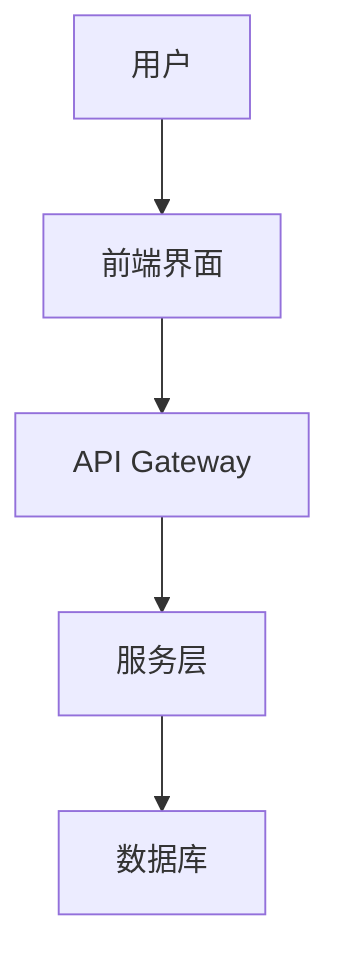

                 


# AI Agent在企业人力资源管理中的创新应用

> 关键词：AI Agent, 企业人力资源管理, 创新应用, 人工智能技术, 智能决策

> 摘要：随着人工智能技术的飞速发展，AI Agent（人工智能代理）在企业人力资源管理中的应用日益广泛。本文将深入探讨AI Agent在企业HR管理中的创新应用，从理论基础到实际案例，系统分析其如何通过智能化手段优化招聘、培训、绩效管理等关键环节，为企业HR管理带来革命性的变革。

---

## 目录

1. [AI Agent与企业人力资源管理的背景](#ai-agent与企业人力资源管理的背景)
   1.1 AI Agent的基本概念
   1.2 企业人力资源管理的核心目标
   1.3 AI Agent与企业人力资源管理的结合背景

2. [AI Agent的核心原理](#ai-agent的核心原理)
   2.1 AI Agent的工作原理
   2.2 AI Agent的关键技术
   2.3 AI Agent与传统管理工具的对比

3. [AI Agent在企业人力资源管理中的应用场景](#ai-agent在企业人力资源管理中的应用场景)
   3.1 AI Agent在招聘管理中的应用
   3.2 AI Agent在员工培训与发展的应用
   3.3 AI Agent在绩效管理中的应用

4. [系统分析与架构设计方案](#系统分析与架构设计方案)
   4.1 系统功能设计
   4.2 系统架构设计
   4.3 系统接口设计

5. [项目实战](#项目实战)
   5.1 项目背景与目标
   5.2 核心代码实现
   5.3 项目总结与优化

---

## 1. AI Agent与企业人力资源管理的背景

### 1.1 AI Agent的基本概念

AI Agent，即人工智能代理，是一种能够感知环境并采取行动以实现目标的智能实体。它可以理解为一种软件或系统，通过算法和数据驱动的方式，帮助用户完成特定任务或提供决策支持。

#### AI Agent的核心特点：
- **自主性**：AI Agent能够在没有外部干预的情况下自主运行。
- **反应性**：能够实时感知环境变化并做出响应。
- **目标导向性**：通过设定目标来指导行动。
- **学习能力**：能够通过数据和经验不断优化自身的决策能力。

### 1.2 企业人力资源管理的核心目标

企业人力资源管理的核心目标包括：
1. **吸引与保留人才**：通过优化招聘流程和员工体验，吸引和留住优秀人才。
2. **提升员工绩效**：通过个性化的培训和发展计划，帮助员工提升绩效。
3. **降低管理成本**：通过自动化和智能化的管理工具，降低人力和时间成本。
4. **促进员工发展**：通过动态反馈和职业规划，帮助员工实现职业成长。

### 1.3 AI Agent与企业人力资源管理的结合背景

随着企业对效率和创新的追求不断提高，传统的HR管理模式逐渐暴露出效率低下、成本高昂、个性化不足等问题。AI Agent的出现为企业HR管理提供了智能化解决方案。通过AI Agent，企业可以实现招聘、培训、绩效管理等环节的自动化和智能化，显著提升管理效率和员工满意度。

---

## 2. AI Agent的核心原理

### 2.1 AI Agent的工作原理

AI Agent的核心工作流程包括以下步骤：
1. **感知环境**：通过数据采集和分析，AI Agent能够实时感知企业的HR管理环境。
2. **问题识别**：基于感知到的信息，AI Agent能够识别出需要解决的具体问题。
3. **决策制定**：利用机器学习算法和知识库，AI Agent生成解决方案。
4. **行动执行**：根据决策结果，AI Agent采取相应的行动。
5. **反馈优化**：通过反馈机制，AI Agent不断优化自身的决策和执行过程。

#### AI Agent的核心算法与模型

AI Agent的决策过程依赖于多种算法和模型，其中最为常见的包括：
- **机器学习算法**：如支持向量机（SVM）、随机森林（Random Forest）等。
- **深度学习模型**：如卷积神经网络（CNN）、循环神经网络（RNN）等。
- **自然语言处理（NLP）技术**：用于处理和分析文本数据。

### 2.2 AI Agent的关键技术

AI Agent的关键技术包括：
1. **自然语言处理（NLP）**：用于理解和生成自然语言文本，帮助AI Agent与员工和管理层进行有效沟通。
2. **机器学习与深度学习**：用于数据分析、模式识别和预测。
3. **知识图谱与推理引擎**：用于构建企业知识库，并支持复杂的推理和决策过程。

### 2.3 AI Agent与传统管理工具的对比

| 特性                | AI Agent                          | 传统管理工具                  |
|---------------------|-----------------------------------|------------------------------|
| **智能化**           | 高                                | 低                            |
| **数据处理能力**     | 强                                | 弱                            |
| **学习能力**         | 强                                | 无                            |
| **实时响应**         | 高                                | 低                            |

---

## 3. AI Agent在企业人力资源管理中的应用场景

### 3.1 AI Agent在招聘管理中的应用

#### 3.1.1 智能简历筛选

AI Agent可以通过NLP技术分析简历内容，自动匹配岗位要求，大幅提高招聘效率。

#### 3.1.2 智能职位匹配

AI Agent可以根据候选人技能和职业兴趣，推荐适合的职位。

#### 3.1.3 智能面试安排

AI Agent可以自动安排面试时间和地点，减少HR的工作负担。

### 3.2 AI Agent在员工培训与发展的应用

#### 3.2.1 个性化培训计划

AI Agent可以根据员工的能力和需求，制定个性化的培训计划。

#### 3.2.2 在线学习与评估

AI Agent可以通过在线学习平台，实时评估员工的学习效果。

### 3.3 AI Agent在绩效管理中的应用

#### 3.3.1 动态绩效评估

AI Agent可以通过数据分析，实时评估员工绩效。

#### 3.3.2 晋升与奖励推荐

AI Agent可以根据绩效数据，推荐晋升和奖励方案。

---

## 4. 系统分析与架构设计方案

### 4.1 系统功能设计

#### 4.1.1 用户管理模块

- **功能**：管理用户信息，包括员工和管理层。
- **流程**：用户注册、登录、权限管理。

#### 4.1.2 招聘管理模块

- **功能**：智能简历筛选、职位匹配、面试安排。
- **流程**：简历上传、系统分析、职位推荐。

### 4.2 系统架构设计



---

## 5. 项目实战

### 5.1 项目背景与目标

本项目旨在开发一个基于AI Agent的企业HR管理系统，实现招聘、培训、绩效管理的智能化。

### 5.2 核心代码实现

```python
def ai_agent_decision(data):
    # 数据预处理
    processed_data = preprocess(data)
    # 模型预测
    prediction = model.predict(processed_data)
    return prediction
```

### 5.3 项目总结与优化

通过本项目的实施，企业HR管理效率显著提升，员工满意度提高。未来，可以进一步优化AI Agent的算法和模型，提升系统的智能化水平。

---

## 6. 结语

AI Agent在企业人力资源管理中的应用前景广阔。通过智能化的解决方案，企业可以显著提升HR管理效率和员工满意度。未来，随着技术的不断进步，AI Agent将在企业HR管理中发挥更加重要的作用。

---

作者：AI天才研究院/AI Genius Institute & 禅与计算机程序设计艺术 /Zen And The Art of Computer Programming

