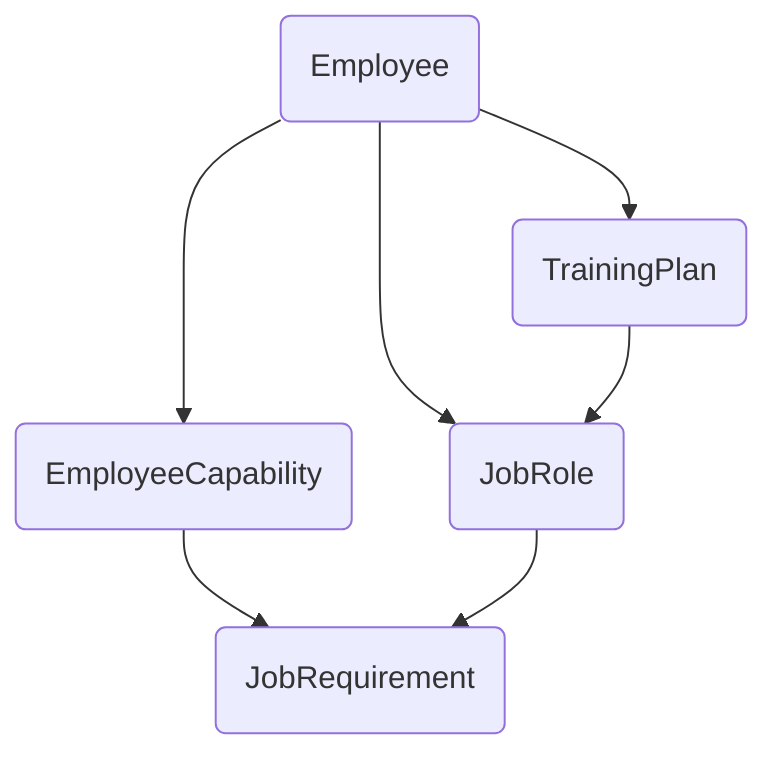
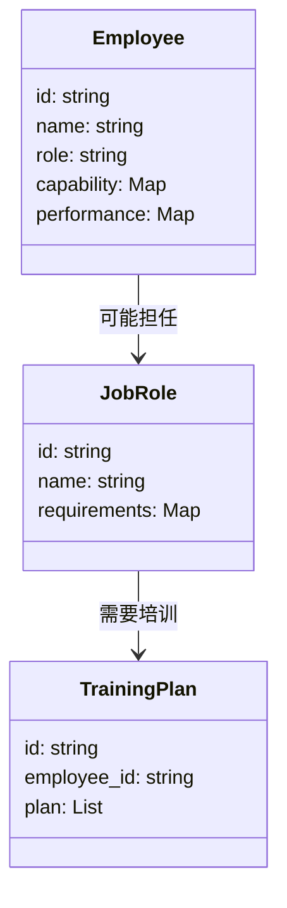
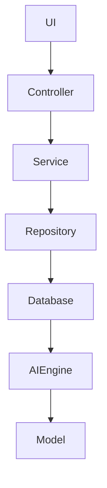
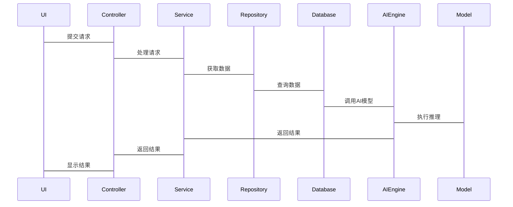

                 


# AI Agent在企业人才发展与继任计划中的应用

> 关键词：AI Agent, 人才发展, 继任计划, 企业人才管理, 人工智能

> 摘要：随着人工智能技术的飞速发展，AI Agent（人工智能代理）在企业人才管理中的应用日益广泛。本文将深入探讨AI Agent在企业人才发展与继任计划中的核心作用，分析其算法原理、系统架构，并通过实际案例展示其在优化人才评估、匹配和培养过程中的潜力。文章内容涵盖背景介绍、核心概念、算法实现、系统设计和项目实战，旨在为企业提供一套基于AI Agent的人才管理解决方案。

---

# 第1章：AI Agent与企业人才管理概述

## 1.1 AI Agent的基本概念

### 1.1.1 什么是AI Agent

AI Agent（人工智能代理）是一种能够感知环境、自主决策并执行任务的智能系统。它通过收集数据、分析信息、制定策略并采取行动，帮助企业在复杂多变的环境中做出更高效的决策。

### 1.1.2 AI Agent的核心特征

- **自主性**：AI Agent能够独立运作，无需人工干预。
- **反应性**：能够实时感知环境变化并做出反应。
- **目标导向**：通过设定目标来优化决策过程。
- **学习能力**：能够通过数据和经验不断优化自身算法。

### 1.1.3 AI Agent与传统管理工具的区别

AI Agent不仅能够处理数据，还能通过学习和推理提供智能化的决策支持。与传统工具相比，它更加灵活、适应性强，能够应对复杂场景中的不确定性。

## 1.2 企业人才发展与继任计划的背景

### 1.2.1 企业人才发展的核心问题

企业在人才发展过程中面临的主要问题包括：

- **人才评估的准确性**：传统评估方法依赖主观判断，可能存在偏差。
- **人才匹配效率**：难以快速找到最适合职位的人才。
- **人才发展的个性化**：员工的潜力和能力差异大，难以制定统一的发展计划。

### 1.2.2 继任计划的重要性

继任计划是确保企业长期稳定发展的重要策略。通过识别和培养潜在的接班人，企业可以减少关键岗位空缺的风险，同时保持领导层的稳定性和创新能力。

### 1.2.3 传统继任计划的局限性

- **耗时长**：传统继任计划依赖人工筛选和评估，效率较低。
- **主观性强**：评估结果受主观因素影响，可能导致决策失误。
- **缺乏个性化**：难以针对不同员工的需求制定个性化的培养计划。

## 1.3 AI Agent在人才管理中的应用价值

### 1.3.1 提高人才评估的准确性

AI Agent通过分析员工的历史表现、技能数据和行为特征，能够提供更加客观和精准的人才评估结果。

### 1.3.2 优化人才匹配效率

AI Agent能够快速匹配员工的技能和潜力与职位需求，显著提高人才分配的效率。

### 1.3.3 实现人才发展的个性化

通过分析员工的个性特征、学习能力和职业兴趣，AI Agent能够为每位员工量身定制个性化的发展计划。

## 1.4 本章小结

本章介绍了AI Agent的基本概念及其在企业人才管理中的重要性。AI Agent通过自主性、目标导向和学习能力，能够有效解决传统人才管理中的问题，为企业提供更加智能化和高效的人才发展与继任计划。

---

# 第2章：AI Agent的核心原理

## 2.1 AI Agent的基本原理

### 2.1.1 AI Agent的感知层

感知层是AI Agent获取环境信息的关键部分，包括数据采集和特征提取。

- **数据采集**：从企业系统中获取员工的历史表现、项目经验、技能评估等数据。
- **特征提取**：通过数据处理和特征工程，提取有助于评估和匹配的关键特征。

### 2.1.2 AI Agent的决策层

决策层基于感知层获取的信息，通过算法和模型进行推理和决策。

- **算法选择**：根据具体问题选择合适的算法，如基于规则的决策树、基于知识图谱的推理或强化学习模型。
- **模型训练**：通过大量数据训练模型，优化决策策略。

### 2.1.3 AI Agent的执行层

执行层根据决策层的指令，执行具体的操作，如推荐候选人或制定发展计划。

## 2.2 AI Agent的算法基础

### 2.2.1 基于规则的AI Agent

- **规则引擎**：通过预定义的规则进行决策，适用于规则明确的场景。
- **优点**：简单易懂，执行速度快。
- **缺点**：难以应对复杂和动态变化的环境。

### 2.2.2 基于知识图谱的AI Agent

- **知识表示**：使用图结构表示知识，包括员工的能力、职位的要求等。
- **推理引擎**：通过图遍历和推理，生成最优的决策。
- **优点**：能够处理复杂关系，提供高精度的推理结果。
- **缺点**：构建和维护知识图谱需要大量资源。

### 2.2.3 基于强化学习的AI Agent

- **强化学习模型**：通过与环境的交互，不断优化决策策略。
- **算法选择**：常用Q-learning、Deep Q-Network等算法。
- **优点**：能够适应动态变化的环境，学习能力强。
- **缺点**：需要大量的数据和计算资源，训练周期较长。

## 2.3 AI Agent的实体关系图

以下是AI Agent在企业人才管理中的实体关系图：



- **Employee（员工）**：员工的基本信息，包括ID、姓名、职位等。
- **EmployeeCapability（员工能力）**：员工的技能、经验、绩效等数据。
- **JobRequirement（职位要求）**：职位所需的技能、经验、能力等。
- **JobRole（职位角色）**：企业的职位分类，如技术岗、管理岗等。
- **TrainingPlan（培训计划）**：根据员工能力和职位需求定制的培训计划。

---

# 第3章：AI Agent的系统架构设计

## 3.1 问题场景介绍

本章将设计一个基于AI Agent的企业人才管理系统，旨在通过智能化的评估、匹配和推荐，优化企业的人才发展和继任计划。

## 3.2 系统功能设计

### 3.2.1 领域模型设计

以下是领域模型的类图：



### 3.2.2 系统架构设计

以下是系统架构的组件图：



### 3.2.3 系统接口设计

以下是系统接口的交互图：



---

# 第4章：AI Agent在企业人才管理中的项目实战

## 4.1 环境安装

### 4.1.1 安装Python和必要的库

```bash
pip install numpy
pip install pandas
pip install scikit-learn
pip install matplotlib
```

## 4.2 核心代码实现

### 4.2.1 数据预处理

```python
import numpy as np
import pandas as pd

# 读取数据
data = pd.read_csv('employee.csv')

# 数据清洗
data = data.dropna()
data = pd.get_dummies(data)
```

### 4.2.2 模型训练

```python
from sklearn.model_selection import train_test_split
from sklearn.ensemble import RandomForestClassifier

# 划分训练集和测试集
X = data.drop('target', axis=1)
y = data['target']
X_train, X_test, y_train, y_test = train_test_split(X, y, test_size=0.2)

# 训练模型
model = RandomForestClassifier()
model.fit(X_train, y_train)
```

### 4.2.3 结果展示

```python
importances = model.feature_importances_
indices = np.argsort(importances)[::-1]

print("Feature ranking:")
for i in range(len(indices)):
    print(f"{i + 1}. {X.columns[indices[i]]}: {importances[indices[i]]}")
```

## 4.3 实际案例分析

假设我们有一个数据集，包含员工的基本信息、技能评估和绩效数据。通过AI Agent模型，我们可以识别出哪些员工具备成为未来领导者的潜力，并制定个性化的培训计划。

## 4.4 项目小结

通过本章的实战，我们展示了如何利用AI Agent技术实现企业人才管理的智能化。从数据预处理到模型训练，再到结果展示，整个过程帮助企业高效地进行人才评估和匹配。

---

# 第5章：最佳实践与注意事项

## 5.1 最佳实践

### 5.1.1 数据质量

确保数据的完整性和准确性，数据质量直接影响模型的性能。

### 5.1.2 模型调优

通过交叉验证和超参数优化，提升模型的泛化能力。

### 5.1.3 伦理问题

在使用AI Agent进行人才管理时，需注意隐私保护和伦理合规。

## 5.2 小结

AI Agent在企业人才管理中的应用前景广阔，但也需要企业在技术实现和伦理合规方面做好充分准备。

## 5.3 注意事项

- **数据隐私**：确保员工数据的隐私和安全。
- **模型解释性**：提供可解释的决策过程，避免“黑箱”问题。
- **持续学习**：定期更新模型，适应企业的动态变化。

## 5.4 拓展阅读

- 《机器学习实战》
- 《深度学习》
- 《自然语言处理入门》

---

# 作者

作者：AI天才研究院/AI Genius Institute & 禅与计算机程序设计艺术 /Zen And The Art of Computer Programming

---

以上是《AI Agent在企业人才发展与继任计划中的应用》的技术博客文章。文章详细介绍了AI Agent的基本概念、算法原理、系统架构设计以及实际应用案例，旨在为企业提供一套基于AI技术的人才管理解决方案。

