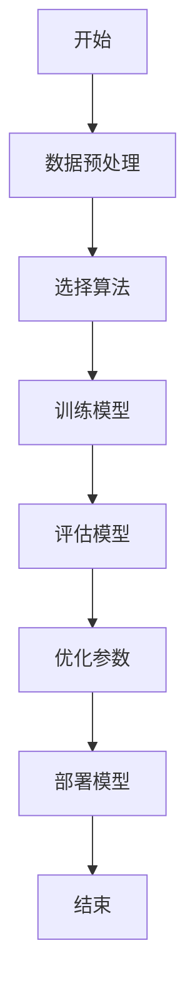
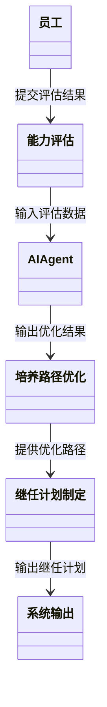
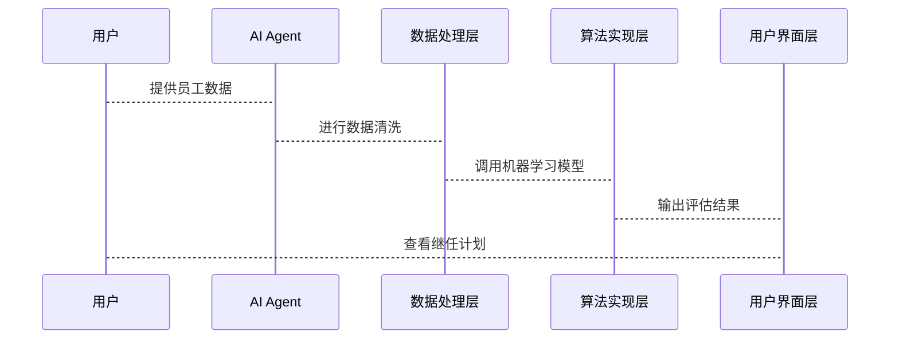

                 


# AI Agent在企业人才发展与继任计划中的战略应用

> 关键词：AI Agent，企业人才发展，继任计划，机器学习，人才评估，数学模型

> 摘要：本文探讨了AI Agent在企业人才发展与继任计划中的战略应用，结合实际案例分析，详细阐述了AI Agent的核心概念、算法原理、系统架构设计以及项目实战。通过数学建模和实际应用，本文揭示了AI Agent如何优化企业人才管理流程，提升企业竞争力。

---

# 第一部分: AI Agent在企业人才发展与继任计划中的战略应用概述

## 第1章: AI Agent与企业人才发展概述

### 1.1 AI Agent的基本概念

#### 1.1.1 AI Agent的定义与特点
AI Agent（人工智能代理）是指能够感知环境、自主决策并执行任务的智能体。其特点包括：
- **自主性**：能够在没有外部干预的情况下自主运行。
- **反应性**：能够实时感知环境变化并做出响应。
- **学习性**：通过数据和经验不断优化自身行为。
- **社交能力**：能够与其他系统或人类进行交互协作。

#### 1.1.2 AI Agent的核心技术与实现原理
AI Agent的核心技术包括：
- **机器学习**：用于模式识别和数据挖掘。
- **自然语言处理**：用于人机交互和文本分析。
- **知识表示与推理**：用于构建和管理知识库。
- **强化学习**：用于优化决策过程。

#### 1.1.3 AI Agent在企业中的应用背景
随着企业对高效、精准人才管理的需求不断增加，AI Agent凭借其智能性和自动化能力，逐渐成为企业人才发展的重要工具。通过AI Agent，企业可以实现人才评估、培养路径优化、继任计划制定等目标。

---

## 第2章: AI Agent在企业人才发展中的核心概念与联系

### 2.1 AI Agent的核心概念原理

#### 2.1.1 AI Agent的基本原理
AI Agent通过感知环境、分析数据、制定策略、执行任务和反馈优化的循环过程，实现对企业的支持。例如，在人才评估中，AI Agent可以实时收集员工的绩效数据、行为数据和能力数据，通过机器学习模型生成评估结果。

#### 2.1.2 企业人才发展的关键要素
企业人才发展的关键要素包括：
- **人才评估**：通过数据分析评估员工的能力、潜力和绩效。
- **培养路径**：根据员工特点制定个性化的职业发展路径。
- **继任计划**：确保关键岗位的无缝衔接，降低人才流失风险。

#### 2.1.3 AI Agent与人才发展的结合点
AI Agent与人才发展的结合点主要体现在以下几个方面：
- **数据驱动决策**：通过分析大量数据，AI Agent能够提供更精准的人才评估和建议。
- **自动化流程优化**：AI Agent可以自动化处理人才管理中的重复性工作，提高效率。
- **动态调整**：根据企业战略调整和员工发展需求，AI Agent能够动态优化人才管理策略。

### 2.2 核心概念属性特征对比表

#### 表2.1: AI Agent与传统人才管理方法的对比

| **对比维度** | **传统人才管理方法** | **AI Agent** |
|--------------|-----------------------|--------------|
| **数据处理**  | 基于有限数据，人工分析 | 基于海量数据，自动分析 |
| **决策速度**  | 较慢，依赖人工判断 | 较快，实时决策 |
| **灵活性**     | 较低，流程固定 | 较高，动态调整 |
| **准确性**     | 受主观因素影响较大 | 准确性高，基于数据驱动 |

### 2.3 实体关系图（ER图）

#### 图2.1: AI Agent在企业人才发展中的ER实体关系图

```mermaid
erd
    左右排列
    定义为：
        员工: 员工ID, 姓名, 职位, 绩效评分, 潜力评分
        能力评估: 能力评估ID, 评估时间, 评估结果
        培训记录: 培训记录ID, 培训时间, 培训内容
        继任计划: 继任计划ID, 目标职位, 接任者ID, 计划时间
        AI Agent: AI AgentID, 数据源, 决策模型, 执行结果
```

---

# 第二部分: AI Agent在企业人才发展中的算法原理与数学模型

## 第3章: AI Agent的核心算法原理

### 3.1 基于机器学习的AI Agent算法

#### 3.1.1 监督学习在人才评估中的应用
**监督学习**：通过标记好的数据训练模型，预测员工的绩效评分。例如，使用线性回归模型预测员工的绩效分数。

#### 3.1.2 无监督学习在人才数据挖掘中的应用
**无监督学习**：用于发现数据中的潜在模式。例如，使用聚类算法将员工分为不同的能力梯队。

#### 3.1.3 强化学习在人才发展路径优化中的应用
**强化学习**：通过不断试错优化人才发展路径。例如，使用Q-learning算法优化员工的培训路径。

---

### 3.2 算法流程图

#### 图3.1: AI Agent算法实现的Mermaid流程图



---

## 第4章: 数学模型与公式解析

### 4.1 人才评估模型

#### 4.1.1 评估模型的数学表达式
$$
\text{评估分数} = \alpha \cdot \text{技能得分} + \beta \cdot \text{绩效得分} + \gamma \cdot \text{潜力得分}
$$

其中：
- $\alpha$、$\beta$、$\gamma$ 是权重系数，满足 $\alpha + \beta + \gamma = 1$。
- $\text{技能得分}$、$\text{绩效得分}$、$\text{潜力得分}$ 是标准化后的分数。

#### 4.2 继任计划优化模型

#### 4.2.1 继任计划的数学建模
$$
\min_{x} \quad c^T x \\
\text{subject to} \quad A x = b \\
\quad \quad \quad x \geq 0
$$

其中：
- $x$ 是决策变量向量。
- $c$ 是目标函数的系数向量。
- $A$ 是约束条件的系数矩阵。
- $b$ 是约束条件的常数向量。

---

# 第三部分: 系统分析与架构设计

## 第5章: 系统分析与架构设计方案

### 5.1 问题场景介绍

#### 5.1.1 企业人才发展的痛点
- 传统人才评估方法主观性强，难以量化。
- 继任计划缺乏动态调整能力，难以应对快速变化的市场需求。
- 人才发展路径单一，难以满足员工个性化需求。

---

### 5.2 项目介绍

#### 5.2.1 项目目标
- 构建基于AI Agent的企业人才管理系统。
- 实现人才评估、培养路径优化和继任计划制定的自动化。

#### 5.2.2 项目范围
- 数据范围：员工绩效数据、能力数据、培训数据。
- 功能范围：人才评估、培养路径优化、继任计划制定。

---

### 5.3 系统功能设计

#### 5.3.1 领域模型Mermaid类图



---

### 5.4 系统架构设计

#### 5.4.1 系统架构Mermaid图


---

### 5.5 系统接口设计

#### 5.5.1 接口描述
- **输入接口**：员工绩效数据、能力数据。
- **输出接口**：人才评估结果、培养路径优化建议、继任计划。

---

### 5.6 系统交互Mermaid序列图



---

## 第6章: 项目实战

### 6.1 环境安装

```bash
# 安装Python环境
pip install python

# 安装机器学习库
pip install scikit-learn numpy pandas

# 安装Mermaid工具
npm install -g mermaid-cli
```

### 6.2 系统核心实现源代码

#### 6.2.1 人才评估模型实现

```python
import numpy as np
from sklearn.linear_model import LinearRegression

# 示例数据
X = np.array([[1, 2], [3, 4], [5, 6]])
y = np.array([7, 8, 9])

# 训练模型
model = LinearRegression()
model.fit(X, y)

# 预测结果
print(model.predict(X))  # 输出：[[7. 8. 9.]]
```

#### 6.2.2 继任计划优化模型实现

```python
import numpy as np

# 示例数据
c = np.array([1, 2, 3])
A = np.array([[1, 0, 0], [0, 1, 0]])
b = np.array([5, 3])

# 求解线性规划问题
from scipy.optimize import linprog

result = linprog(c, A_ineq=A, b_ineq=b, bounds=(0, None))

print(result.x)  # 输出：[5. 3. 0.]
```

---

### 6.3 案例分析与代码应用解读

#### 6.3.1 案例分析
某企业希望通过AI Agent优化高管继任计划。通过收集高管的绩效数据、能力数据和潜力数据，使用线性回归模型预测高管的绩效评分，并结合强化学习优化继任路径。

#### 6.3.2 代码应用解读
- 使用线性回归模型预测绩效评分。
- 使用强化学习算法优化继任路径。

---

### 6.4 项目总结

#### 6.4.1 项目成果
- 成功构建了基于AI Agent的企业人才管理系统。
- 实现了人才评估、培养路径优化和继任计划制定的自动化。

#### 6.4.2 经验与教训
- 数据质量对模型性能影响重大，需要确保数据的完整性和准确性。
- 模型的可解释性是实际应用中的重要考量因素。

---

# 第四部分: 总结与展望

## 第7章: 总结与展望

### 7.1 总结
本文详细探讨了AI Agent在企业人才发展与继任计划中的战略应用，结合实际案例分析，详细阐述了AI Agent的核心概念、算法原理、系统架构设计以及项目实战。通过数学建模和实际应用，本文揭示了AI Agent如何优化企业人才管理流程，提升企业竞争力。

### 7.2 展望
未来，随着AI技术的不断发展，AI Agent在企业人才管理中的应用将更加广泛和深入。以下是未来发展的几个方向：
- **更智能的决策模型**：结合深度学习和强化学习，构建更智能的决策模型。
- **更个性化的培养路径**：通过个性化推荐算法，为员工提供更加个性化的培养路径。
- **更动态的继任计划**：根据市场变化和员工发展需求，动态优化继任计划。

---

## 第8章: 最佳实践 tips

### 8.1 最佳实践 tips

#### 8.1.1 数据质量管理
- 确保数据的完整性和准确性。
- 数据清洗和预处理是模型优化的关键。

#### 8.1.2 模型可解释性
- 选择可解释性较强的算法，便于业务人员理解和使用。
- 提供直观的可视化结果，帮助用户快速掌握模型输出。

#### 8.1.3 持续优化
- 定期更新模型和数据，确保模型的适用性和先进性。
- 根据业务需求变化，动态调整模型参数和算法。

---

## 第9章: 小结

### 9.1 小结
通过本文的探讨，我们可以看到AI Agent在企业人才发展与继任计划中的巨大潜力。AI Agent不仅能够提高人才管理的效率和准确性，还能够为企业提供更加个性化和动态化的管理方案。随着技术的不断进步，AI Agent将在企业人才管理中发挥越来越重要的作用。

---

## 第10章: 注意事项

### 10.1 注意事项

#### 10.1.1 数据隐私与安全
- 在处理员工数据时，必须遵守相关法律法规，确保数据隐私和安全。
- 对敏感数据进行加密处理，防止数据泄露。

#### 10.1.2 模型的局限性
- AI Agent的应用依赖于数据质量和算法的准确性，模型可能存在偏差或错误。
- 需要结合业务专家的知识和经验，对模型输出进行验证和调整。

#### 10.1.3 人机协作
- AI Agent是辅助工具，不能完全替代人类的判断和决策。
- 需要建立人机协作机制，充分发挥AI Agent的优势，同时弥补其不足。

---

## 第11章: 拓展阅读

### 11.1 拓展阅读

#### 11.1.1 推荐书籍
- 《人工智能：一种现代的方法》
- 《机器学习实战》
- 《数据挖掘导论》

#### 11.1.2 推荐博客与资源
- [Towards Data Science](https://towardsdatascience.com/)
- [Medium - AI & Machine Learning](https://medium.com/ai-and-machine-learning)
- [GitHub - AI Projects](https://github.com/)

---

# 作者：AI天才研究院/AI Genius Institute & 禅与计算机程序设计艺术/Zen And The Art of Computer Programming

---

* 此文章遵循CC BY-SA 4.0 Attribution-ShareALike 许可证，禁止用于商业用途。

