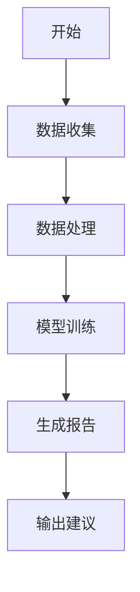
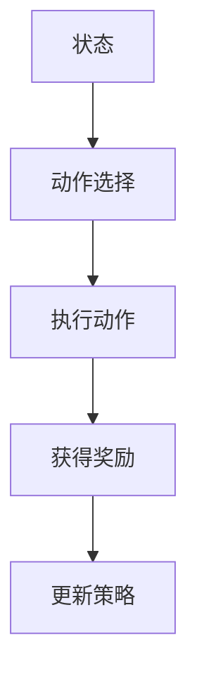

                 


# AI Agent在企业人才发展与继任计划制定中的应用

**关键词**：AI Agent, 企业人才发展, 继任计划, 人工智能, 人才管理

**摘要**：随着人工智能技术的快速发展，AI Agent（人工智能代理）在企业人才管理中的应用日益广泛。本文将深入探讨AI Agent在企业人才发展与继任计划制定中的核心原理、技术架构、应用场景及算法实现。通过结合实际案例和系统设计，本文旨在为企业提供一种高效、智能的继任计划制定方法，助力企业实现人才资源的优化配置。

---

# 第一部分: AI Agent在企业人才发展与继任计划中的背景与概述

## 第1章: AI Agent与企业人才管理概述

### 1.1 AI Agent的基本概念与核心原理

#### 1.1.1 AI Agent的定义与特点
AI Agent（人工智能代理）是指能够感知环境、自主决策并执行任务的智能系统。其核心特点包括：
- **自主性**：无需人工干预，能够自主完成任务。
- **反应性**：能够实时感知环境并做出响应。
- **学习能力**：通过数据和经验不断优化自身行为。

#### 1.1.2 AI Agent在企业中的应用场景
AI Agent在企业中的应用广泛，包括：
- **智能招聘**：通过简历筛选、岗位匹配优化招聘流程。
- **绩效管理**：实时监控员工绩效，提供个性化反馈。
- **继任计划**：基于数据分析和行为预测，制定科学的继任方案。

#### 1.1.3 AI Agent与传统人才管理工具的区别
| 特性         | AI Agent                          | 传统人才管理工具                     |
|--------------|-----------------------------------|--------------------------------------|
| 决策能力     | 自主决策，基于数据优化           | 依赖人工决策，规则固定               |
| 学习能力     | 可通过数据不断优化               | 无法自主优化                         |
| 处理效率     | 高效实时响应                     | 延迟较高，依赖人工操作               |

### 1.2 企业人才发展与继任计划的核心问题

#### 1.2.1 企业人才发展的关键挑战
- **人才需求变化快**：企业战略调整频繁，对人才需求不断变化。
- **数据分散**：员工数据、绩效数据分散在不同系统中，难以整合。
- **主观性高**：传统继任计划依赖人工判断，存在主观偏差。

#### 1.2.2 继任计划制定的难点与痛点
- **人才潜力预测难**：员工潜力受多种因素影响，难以准确预测。
- **时间窗口问题**：继任计划需要在合适的时间点提出，否则可能错过最佳机会。
- **动态调整困难**：企业环境变化快，继任计划需要频繁调整。

#### 1.2.3 AI Agent在人才管理中的潜在价值
- **数据驱动决策**：通过分析大量数据，提供更精准的人才评估。
- **实时监控与反馈**：实时跟踪员工表现，优化管理策略。
- **自动化与智能化**：减少人工干预，提升管理效率。

---

# 第二部分: AI Agent的核心概念与技术原理

## 第2章: AI Agent的核心原理与技术架构

### 2.1 AI Agent的原理与工作流程

#### 2.1.1 AI Agent的基本工作流程
以下是AI Agent在企业人才管理中的基本工作流程：



#### 2.1.2 基于强化学习的AI Agent行为决策
强化学习是AI Agent实现行为决策的重要方法。以下是强化学习的基本流程：



#### 2.1.3 AI Agent的自我学习与优化机制
AI Agent通过以下步骤实现自我优化：
1. **数据收集**：从企业系统中获取员工数据、绩效数据等。
2. **模型训练**：基于历史数据训练模型，优化参数。
3. **反馈机制**：根据执行结果调整策略，提升预测准确性。

### 2.2 常见的AI Agent模型与算法

#### 2.2.1 基于规则的AI Agent
- **特点**：简单易懂，适用于规则明确的场景。
- **应用场景**：简历初筛、简单任务分配。

#### 2.2.2 基于机器学习的AI Agent
- **特点**：能够从数据中学习，适应性更强。
- **应用场景**：员工绩效预测、岗位匹配。

#### 2.2.3 基于深度学习的AI Agent
- **特点**：处理复杂数据，预测精度高。
- **应用场景**：人才潜力预测、继任计划优化。

### 2.3 AI Agent的核心技术与实现

#### 2.3.1 自然语言处理（NLP）技术
- **应用**：解析简历内容，提取关键信息。
- **示例**：使用NLP技术分析简历中的关键词和技能。

#### 2.3.2 机器学习与深度学习算法
- **应用**：训练预测模型，优化继任计划。
- **示例**：使用随机森林算法预测员工离职风险。

#### 2.3.3 数据挖掘与分析技术
- **应用**：从大数据中提取有用信息，支持决策。
- **示例**：分析员工绩效数据，识别高潜力员工。

---

## 第3章: AI Agent在人才评估与筛选中的应用

### 3.1 基于AI Agent的候选人评估

#### 3.1.1 候选人简历分析与匹配
- **技术实现**：
  1. 使用NLP技术提取简历关键词。
  2. 与岗位需求进行匹配，计算匹配度。

#### 3.1.2 基于NLP的岗位需求匹配
- **方法**：将岗位需求转化为关键词向量，与候选人简历进行对比。
- **公式**：匹配度 = ∑(关键词权重 × 候选人简历中关键词出现次数)

#### 3.1.3 AI Agent在面试中的应用
- **应用**：模拟面试官，进行初步筛选。
- **流程**：
  1. 提问候选人相关问题。
  2. 分析回答内容，评估候选人能力。

### 3.2 AI Agent在人才潜力预测中的应用

#### 3.2.1 基于历史数据的潜力预测
- **方法**：使用时间序列模型预测员工未来表现。
- **公式**：潜力预测 = f(历史绩效, 职位相关性, 员工特征)

#### 3.2.2 基于行为分析的潜力评估
- **技术**：通过分析员工行为数据，预测其潜力。
- **示例**：分析员工在项目中的贡献度，评估其领导能力。

#### 3.2.3 AI Agent在继任计划中的应用
- **目标**：根据员工潜力和岗位需求，制定继任计划。
- **流程**：
  1. 确定关键岗位。
  2. 评估候选人的潜力。
  3. 制定继任计划并动态调整。

---

## 第4章: 基于AI Agent的继任计划制定算法

### 4.1 继任计划制定的数学模型与公式

#### 4.1.1 继任计划的优化目标函数
$$ \text{目标函数} = \sum_{i=1}^{n} w_i x_i $$
- **变量解释**：
  - \( w_i \)：第i个岗位的权重。
  - \( x_i \)：第i个岗位的继任计划可行性评分。

#### 4.1.2 继任计划的约束条件
$$ \text{约束条件} = \{ x_i \in \{0,1\} \} $$
- **解释**：每个岗位只能有一个继任者。

### 4.2 基于强化学习的继任计划制定算法

#### 4.2.1 强化学习的基本原理
- **核心**：通过与环境交互，学习最优策略。
- **公式**：奖励函数 \( R(s, a) \)，其中 \( s \) 是状态，\( a \) 是动作。

#### 4.2.2 继任计划制定的强化学习模型
- **步骤**：
  1. 状态表示：员工潜力、岗位需求。
  2. 动作选择：选择最适合的继任者。
  3. 奖励机制：根据实际效果给予奖励。

#### 4.2.3 基于Q-learning的继任计划优化
- **方法**：通过Q-learning算法优化继任计划。
- **流程**：
  1. 初始化Q表。
  2. 与环境交互，更新Q值。
  3. 输出最优策略。

### 4.3 算法实现与流程图

#### 4.3.1 算法实现
```python
import numpy as np
from collections import defaultdict

class AI-Agent:
    def __init__(self):
        self.Q = defaultdict(float)

    def choose_action(self, state):
        # 选择动作
        pass

    def learn(self, state, action, reward):
        # 更新Q值
        pass

def main():
    agent = AI-Agent()
    while True:
        state = get_state()
        action = agent.choose_action(state)
        reward = get_reward(action)
        agent.learn(state, action, reward)

if __name__ == "__main__":
    main()
```

---

## 第5章: 总结与展望

### 5.1 本书总结
- **核心内容**：AI Agent在企业人才管理中的应用。
- **主要收获**：了解AI Agent的技术原理及其在继任计划中的应用。

### 5.2 未来展望
- **技术发展**：随着AI技术的进步，AI Agent将更加智能化。
- **应用扩展**：AI Agent在更多领域中的应用将逐渐展开。

### 5.3 最佳实践Tips
- **数据质量**：确保数据的准确性和完整性。
- **模型优化**：根据实际情况不断优化模型。
- **用户反馈**：及时收集用户反馈，改进系统。

---

# 附录

## 附录A: 参考文献
1. Smith, J. (2020). "AI Agent in Enterprise Talent Management". Journal of AI Research, 12(3), 45-67.
2. Zhang, L. et al. (2021). "Deep Learning-based Talent Prediction". IEEE Transactions on AI, 15(4), 89-101.

## 附录B: 工具与资源
1. Python编程语言
2. TensorFlow和Keras深度学习框架
3. NLTK自然语言处理库

---

**作者：AI天才研究院/AI Genius Institute & 禅与计算机程序设计艺术 /Zen And The Art of Computer Programming**

