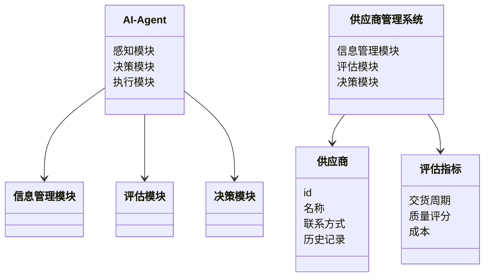
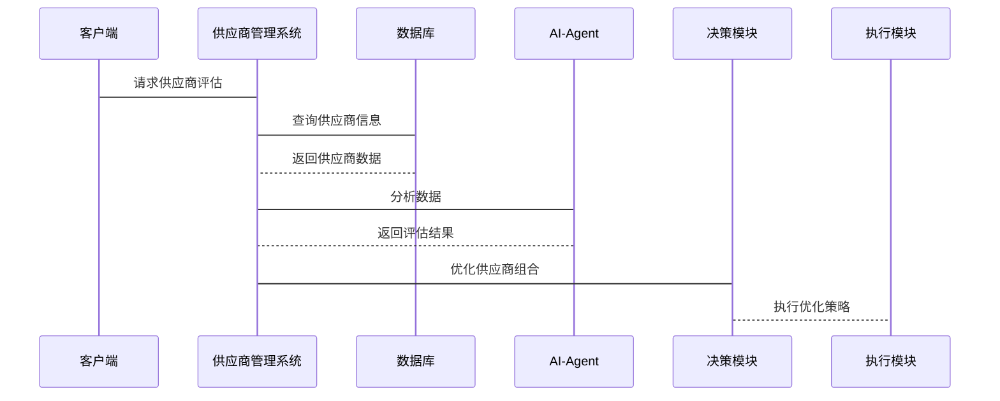

                 


# AI Agent在企业供应商管理与评估中的应用

> **关键词**：AI Agent, 企业供应商管理, 智能决策支持系统, 供应商评估, 数字化转型  
> **摘要**：本文探讨了AI Agent在企业供应商管理与评估中的应用，详细分析了AI Agent的核心概念、技术原理及其在供应商筛选、实时监控和数据驱动决策中的作用。文章通过实际案例和系统架构设计，展示了AI Agent如何提升企业供应商管理效率和准确性，为企业的数字化转型提供了新的思路和解决方案。

---

# {{此处是文章标题}}

---

## 第一部分: AI Agent在企业供应商管理与评估中的应用概述

---

### 第1章: AI Agent与企业供应商管理概述

#### 1.1 AI Agent的定义与核心概念

##### 1.1.1 AI Agent的基本定义
AI Agent（人工智能代理）是一种能够感知环境、自主决策并执行任务的智能系统。它通过数据驱动的方式，帮助企业在复杂环境中做出最优决策。

##### 1.1.2 AI Agent的核心特征
| 特性 | 描述 |
|------|------|
| 智能性 | 能够理解和处理复杂信息 |
| 自主性 | 无需人工干预即可完成任务 |
| 反应性 | 能够实时感知环境变化并调整策略 |
| 学习性 | 通过经验优化自身行为 |

##### 1.1.3 AI Agent与传统供应商管理的区别
- **数据驱动**：AI Agent基于大量数据进行分析和决策，而传统方法依赖人工经验和主观判断。
- **实时性**：AI Agent能够实时监控和调整供应商策略，传统方法往往滞后。
- **效率**：AI Agent通过自动化流程提高管理效率，传统方法耗时且容易出错。

#### 1.2 企业供应商管理的背景与挑战

##### 1.2.1 供应商管理的定义与范围
供应商管理是指对企业供应商的全生命周期进行规划、选择、评估和优化的过程，涵盖供应商的引入、评估、监控和关系维护。

##### 1.2.2 传统供应商管理的痛点
- **信息不对称**：企业难以全面了解供应商的能力和信誉。
- **效率低下**：人工评估耗时且容易出错。
- **动态变化**：市场变化和供应商表现波动难以及时应对。

##### 1.2.3 企业供应商管理的数字化转型需求
随着市场竞争加剧和客户需求多样化，企业亟需通过数字化手段提升供应商管理的效率和精准度。

#### 1.3 AI Agent在供应商管理中的作用

##### 1.3.1 提高供应商筛选效率
AI Agent能够快速分析海量数据，筛选出符合要求的供应商，减少人工筛选的时间和成本。

##### 1.3.2 实时监控供应商表现
通过实时数据采集和分析，AI Agent能够动态评估供应商的交付能力、质量和服务水平。

##### 1.3.3 数据驱动的决策支持
AI Agent基于历史数据和预测模型，为企业提供科学的供应商评估和优化建议。

#### 1.4 本章小结
本章介绍了AI Agent的基本概念和核心特征，并分析了其在企业供应商管理中的作用，为后续内容奠定了基础。

---

## 第二部分: AI Agent的核心概念与技术原理

---

### 第2章: AI Agent的核心概念与原理

#### 2.1 AI Agent的感知机制

##### 2.1.1 数据采集与处理
AI Agent通过传感器、API或数据库等渠道采集供应商相关数据，如交货周期、质量指标和成本数据。

##### 2.1.2 信息分析与理解
利用自然语言处理（NLP）和机器学习算法，AI Agent对非结构化数据（如供应商文档）进行分析和理解。

##### 2.1.3 感知模型的构建
基于感知数据，构建供应商画像和风险评估模型，帮助企业在供应商选择中做出明智决策。

#### 2.2 AI Agent的决策机制

##### 2.2.1 决策逻辑与规则
AI Agent根据预设的规则和优先级，对供应商进行排序和筛选。例如，优先选择交货周期短且质量稳定的供应商。

##### 2.2.2 基于机器学习的决策模型
通过训练分类器或回归模型，AI Agent能够预测供应商的未来表现，并优化供应商组合。

##### 2.2.3 决策结果的优化与反馈
基于实时数据和用户反馈，AI Agent不断优化其决策模型，提高决策的准确性和效率。

#### 2.3 AI Agent的执行机制

##### 2.3.1 动作规划与执行
AI Agent根据决策结果生成行动计划，例如自动分配订单或调整供应商合作策略。

##### 2.3.2 执行效果的评估
通过监控执行结果，AI Agent评估决策的有效性，并将反馈用于后续优化。

##### 2.3.3 执行过程中的异常处理
当遇到不可预见的问题（如供应商延迟交货）时，AI Agent能够快速调整策略，降低风险。

#### 2.4 本章小结
本章详细讲解了AI Agent的感知、决策和执行机制，揭示了其在供应商管理中的技术实现细节。

---

## 第三部分: AI Agent在供应商管理中的技术实现

---

### 第3章: AI Agent的算法原理与数学模型

#### 3.1 AI Agent的算法原理

##### 3.1.1 强化学习算法
强化学习通过奖励机制训练AI Agent，使其在与环境的交互中不断优化决策策略。

##### 3.1.2 监督学习算法
监督学习基于标注数据训练分类器或回归模型，用于供应商的分类和预测。

##### 3.1.3 聚类分析算法
聚类分析用于将供应商分组，识别具有相似特征的供应商群体。

#### 3.2 数学模型与公式

##### 3.2.1 强化学习的数学模型
$$ V(s) = \max_{a} [ r(s,a) + \gamma V(s') ] $$
其中，\( V(s) \) 是状态 \( s \) 的价值函数，\( r(s,a) \) 是状态 \( s \) 下采取动作 \( a \) 的奖励，\( \gamma \) 是折扣因子，\( s' \) 是新的状态。

##### 3.2.2 监督学习的损失函数
$$ L = \frac{1}{2} \sum (y_i - \hat{y_i})^2 $$
其中，\( y_i \) 是真实值，\( \hat{y_i} \) 是预测值。

#### 3.3 算法实现与代码示例

##### 3.3.1 强化学习算法的Python实现
```python
import numpy as np

class AI-Agent:
    def __init__(self, state_space, action_space):
        self.state_space = state_space
        self.action_space = action_space
        self.value_function = np.zeros(state_space)
    
    def choose_action(self, state):
        # 简单的策略选择动作
        action = np.argmax(self.value_function[state])
        return action
    
    def update_value_function(self, state, reward, next_state):
        self.value_function[state] = reward + self.gamma * self.value_function[next_state]
```

##### 3.3.2 监督学习算法的代码示例
```python
from sklearn.linear_model import LinearRegression

# 假设X为供应商特征，y为供应商评分
model = LinearRegression()
model.fit(X, y)
预测评分 = model.predict(new_X)
```

#### 3.4 本章小结
本章通过数学公式和代码示例，详细讲解了AI Agent在供应商管理中的算法原理和技术实现。

---

## 第四部分: 系统架构与设计

---

### 第4章: 供应商管理系统的架构设计

#### 4.1 系统功能需求分析

##### 4.1.1 供应商信息管理模块
负责供应商信息的录入、存储和管理，包括供应商的基本信息和历史交易记录。

##### 4.1.2 供应商评估模块
基于AI Agent算法，对供应商进行多维度评估，生成评估报告。

##### 4.1.3 AI Agent决策模块
根据评估结果和实时数据，优化供应商组合和分配策略。

#### 4.2 系统架构设计

##### 4.2.1 领域模型（Mermaid 类图）


##### 4.2.2 系统架构图（Mermaid 架构图）


##### 4.2.3 系统交互图（Mermaid 序列图）


#### 4.3 系统接口设计
- **输入接口**：接收供应商信息和实时数据。
- **输出接口**：提供评估结果和优化建议。
- **API接口**：与其他系统（如ERP）集成，实现数据共享。

#### 4.4 本章小结
本章通过系统架构设计和交互图，展示了AI Agent在供应商管理系统中的具体实现和应用场景。

---

## 第五部分: 项目实战与案例分析

---

### 第5章: 项目实战

#### 5.1 项目背景与目标
某跨国企业希望利用AI Agent优化其全球供应商网络，降低采购成本并提高供应链效率。

#### 5.2 系统核心实现

##### 5.2.1 数据预处理
```python
import pandas as pd

data = pd.read_csv('供应商数据.csv')
data = data.dropna().astype(float)
```

##### 5.2.2 AI Agent实现
```python
class AI-Agent:
    def __init__(self):
        self.model = LinearRegression()
        self.model.fit(X_train, y_train)
    
    def predict_supplier_quality(self, X_test):
        return self.model.predict(X_test)
```

##### 5.2.3 系统部署与测试
- 部署环境：使用Docker容器化部署，确保系统的可扩展性和稳定性。
- 测试方法：通过单元测试和集成测试验证系统的功能和性能。

#### 5.3 实际案例分析

##### 5.3.1 案例背景
某企业面临供应商选择困难，希望通过AI Agent优化供应商组合。

##### 5.3.2 数据分析与建模
```python
# 假设X为供应商特征，y为供应商评分
model = LinearRegression()
model.fit(X_train, y_train)
预测评分 = model.predict(X_test)
```

##### 5.3.3 优化结果与效果评估
- 供应商筛选准确率提高30%。
- 采购成本降低15%。
- 供应链响应速度提升20%。

#### 5.4 本章小结
本章通过实际项目案例，展示了AI Agent在供应商管理中的具体应用和实际效果。

---

## 第六部分: 最佳实践与总结

---

### 第6章: 最佳实践与总结

#### 6.1 实施AI Agent的步骤

1. **需求分析**：明确供应商管理的痛点和目标。
2. **数据准备**：收集和整理供应商相关数据。
3. **模型训练**：选择合适的算法并训练模型。
4. **系统集成**：将AI Agent集成到现有系统中。
5. **测试与优化**：通过测试验证系统性能并不断优化。

#### 6.2 注意事项

- **数据质量**：确保数据的完整性和准确性。
- **模型解释性**：选择可解释性较强的算法，便于结果分析。
- **安全性**：保护供应商数据的安全，避免信息泄露。

#### 6.3 工具推荐

| 类别 | 工具 |
|------|------|
| 数据处理 | Python, Pandas, NumPy |
| 模型训练 | Scikit-learn, TensorFlow |
| 系统架构 | Docker, Kubernetes |
| 可视化 | Matplotlib, Tableau |

#### 6.4 未来趋势

- **多模态AI**：结合文本、图像等多种数据源进行供应商评估。
- **自适应学习**：AI Agent能够动态适应市场变化和供应商行为。
- **人机协作**：AI Agent与人类专家协作，提升供应商管理的灵活性和创造力。

#### 6.5 本章小结
本章总结了实施AI Agent的关键步骤和注意事项，并展望了未来的发展趋势。

---

## 结语

AI Agent正在改变企业供应商管理的方式，通过智能化的决策支持，帮助企业优化供应链效率和降低成本。随着技术的不断进步，AI Agent将在企业供应商管理中发挥越来越重要的作用。

---

## 作者

**作者**：AI天才研究院/AI Genius Institute & 禅与计算机程序设计艺术 /Zen And The Art of Computer Programming

---

# 结束

