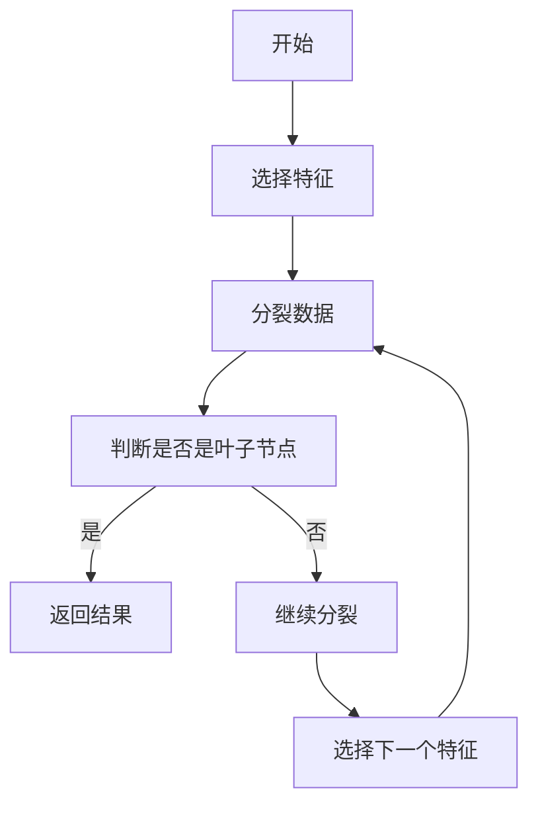
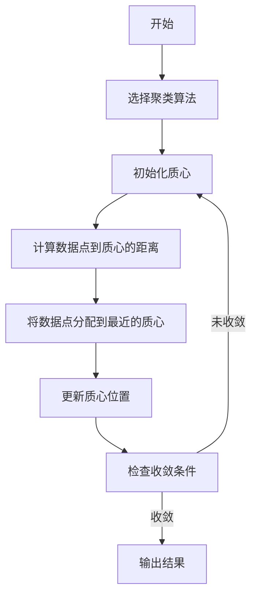
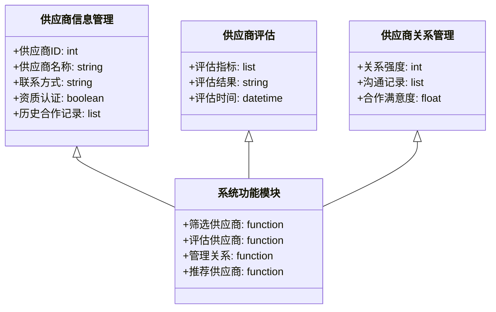
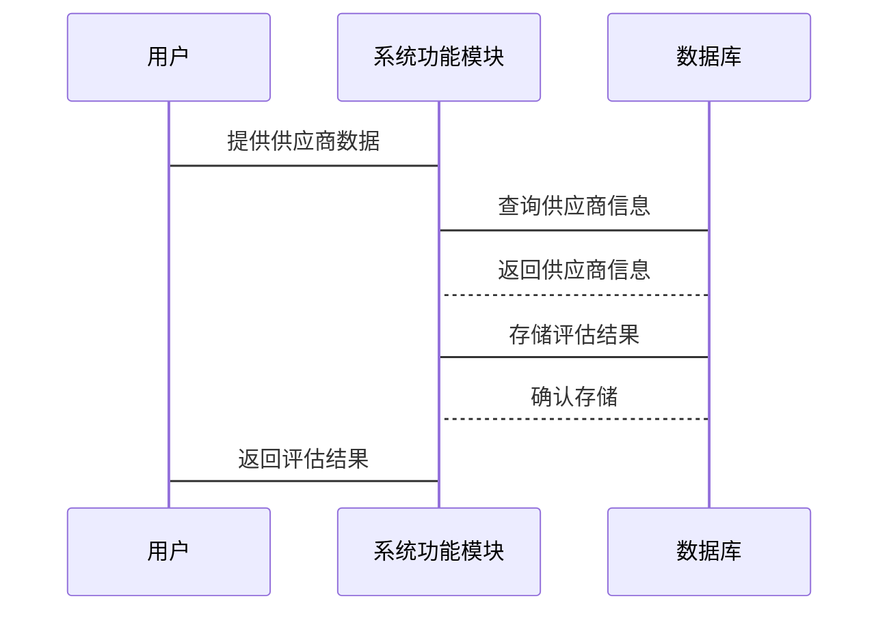

                 


# AI Agent在企业供应商管理与评估中的角色

## 关键词：AI Agent, 供应商管理, 企业评估, 人工智能, 供应商评估

## 摘要：本文探讨AI Agent在企业供应商管理与评估中的角色，分析其如何通过机器学习、自然语言处理和数据挖掘等技术优化供应商筛选、绩效评估和关系管理，提供算法原理、系统架构设计和项目实战，最后总结最佳实践。

---

## 第1章: AI Agent与供应商管理概述

### 1.1 AI Agent的基本概念

#### 1.1.1 什么是AI Agent
AI Agent，即人工智能代理，是一种能够感知环境、自主决策并执行任务的智能实体。它能够通过传感器获取信息，利用算法处理数据，做出决策，并通过执行器完成操作。

#### 1.1.2 AI Agent的核心特征
- **自主性**：无需外部干预，自主完成任务。
- **反应性**：能够实时感知环境变化并做出反应。
- **学习能力**：通过数据和经验不断优化自身的决策能力。
- **社交能力**：能够与其他系统或人员进行有效沟通和协作。

#### 1.1.3 AI Agent与传统管理工具的区别
AI Agent不仅仅是工具，它具备自主性和学习能力，能够主动适应环境变化，提供智能化的决策支持，而传统管理工具通常是静态的、缺乏自主性。

### 1.2 供应商管理的背景与挑战

#### 1.2.1 供应商管理的基本概念
供应商管理是指企业对供应商的选择、评估、监控和关系维护的全过程管理，旨在确保供应商的产品质量、交货时间和成本效益。

#### 1.2.2 传统供应商管理的痛点
- **信息不对称**：难以全面了解供应商的资质和表现。
- **人工成本高**：需要大量人工参与筛选和评估工作。
- **效率低下**：传统方法耗时长，难以快速响应市场变化。
- **缺乏动态评估**：无法实时监控供应商的表现。

#### 1.2.3 AI Agent在供应商管理中的优势
- **高效筛选**：通过机器学习快速分析大量供应商数据，筛选出优质供应商。
- **实时监控**：利用实时数据和自然语言处理技术，动态评估供应商表现。
- **智能推荐**：根据历史数据和市场变化，推荐最佳供应商组合。
- **降低人工成本**：减少对人力的依赖，提高管理效率。

### 1.3 AI Agent在供应商管理中的应用前景

#### 1.3.1 AI Agent在供应商评估中的潜在价值
AI Agent可以通过分析供应商的历史数据、市场反馈和实时表现，提供更精准的评估结果，帮助企业做出更明智的供应商选择。

#### 1.3.2 企业采用AI Agent的驱动力
- **提高效率**：自动化供应商管理流程，节省时间和资源。
- **增强决策能力**：通过数据驱动的决策，提高供应商管理的准确性和前瞻性。
- **降低成本**：通过优化供应商选择和管理，降低采购成本和风险。

#### 1.3.3 AI Agent应用的挑战与机遇
- **数据隐私和安全**：供应商数据的收集和处理需要遵守相关法律法规，保护数据隐私。
- **技术门槛高**：AI Agent的开发和应用需要专业技术和人才支持。
- **供应商接受度**：供应商可能对AI技术的引入持怀疑态度，需要进行充分的沟通和培训。

---

## 第2章: AI Agent的核心概念与原理

### 2.1 AI Agent的核心概念

#### 2.1.1 AI Agent的定义与分类
AI Agent可以根据应用场景分为多种类型，包括：
- **基于规则的AI Agent**：根据预设规则进行决策。
- **基于机器学习的AI Agent**：通过学习数据自动优化决策策略。
- **基于自然语言处理的AI Agent**：能够理解和生成自然语言，进行沟通和交流。

#### 2.1.2 AI Agent的基本组成要素
- **感知模块**：用于获取环境信息，如传感器、数据接口。
- **决策模块**：基于感知信息进行分析和决策，通常涉及机器学习算法。
- **执行模块**：根据决策结果执行具体操作，如发送指令、调整参数。
- **学习模块**：通过反馈机制不断优化决策模型和策略。

#### 2.1.3 AI Agent的工作原理
AI Agent通过感知环境、分析数据、做出决策并执行操作，形成一个闭环系统。其核心在于数据的处理和算法的优化，能够根据环境变化动态调整自身的决策策略。

### 2.2 AI Agent的关键技术

#### 2.2.1 机器学习算法
- **监督学习**：通过标记数据训练模型，预测新的数据。
- **无监督学习**：通过数据聚类发现隐藏的模式和结构。
- **强化学习**：通过与环境交互，学习最优策略。

#### 2.2.2 自然语言处理
- **文本分类**：将文本分为不同类别，如供应商资质分类。
- **实体识别**：从文本中提取关键实体，如供应商名称、地址。
- **情感分析**：分析文本中的情感倾向，评估供应商声誉。

#### 2.2.3 数据挖掘与分析
- **数据清洗**：处理脏数据，确保数据质量。
- **数据建模**：建立预测模型，如供应商绩效预测模型。
- **数据可视化**：通过图表展示数据，帮助决策者直观理解。

### 2.3 AI Agent与供应商管理的结合

#### 2.3.1 AI Agent在供应商筛选中的应用
AI Agent可以通过分析供应商的历史数据、市场表现和行业评价，快速筛选出符合条件的供应商，减少人工筛选的时间和成本。

#### 2.3.2 AI Agent在供应商绩效评估中的应用
AI Agent可以实时监控供应商的交货周期、产品质量和成本效益，提供动态评估结果，帮助企业做出更及时的调整。

#### 2.3.3 AI Agent在供应商关系管理中的应用
AI Agent可以分析供应商的沟通记录、合作历史和反馈意见，优化供应商关系管理，提升合作满意度。

### 2.4 本章小结
本章介绍了AI Agent的核心概念和工作原理，分析了其在供应商管理中的应用价值，并探讨了相关的关键技术。

---

## 第3章: AI Agent在供应商管理中的算法原理

### 3.1 常见算法介绍

#### 3.1.1 机器学习算法
- **决策树**：通过特征分裂构建决策树，进行分类和回归。
- **随机森林**：通过集成多个决策树，提高模型的准确性和稳定性。
- **支持向量机**：通过找到最优超平面，进行分类和回归。

#### 3.1.2 自然语言处理算法
- **词袋模型**：将文本表示为单词的集合，常用于文本分类。
- **TF-IDF**：计算单词的重要性，用于信息检索和文本挖掘。
- **Word2Vec**：将单词映射为向量，用于语义分析。

#### 3.1.3 数据挖掘算法
- **K-means**：无监督聚类算法，常用于客户分群。
- **Apriori**：关联规则挖掘算法，用于发现数据中的频繁项集。
- **KNN**：基于近邻的分类算法，常用于分类和回归。

### 3.2 算法原理与流程图

#### 3.2.1 决策树算法原理
决策树是一种树状结构，通过特征分裂将数据划分为不同的子集，最终形成叶子节点作为预测结果。

**决策树流程图（Mermaid）**


#### 3.2.2 聚类算法原理
聚类算法通过将数据点分组，使得同一组内的数据点相似，不同组之间的数据点差异较大。

**聚类流程图（Mermaid）**


#### 3.2.3 算法流程图展示
通过Mermaid流程图展示算法的执行步骤，帮助读者更好地理解算法的工作流程。

### 3.3 算法实现与代码示例

#### 3.3.1 环境安装
为了运行以下代码，需要安装Python和相关的机器学习库，如Scikit-learn。

```bash
pip install scikit-learn
```

#### 3.3.2 代码实现
以下是使用决策树算法对供应商进行分类的代码示例：

```python
from sklearn.tree import DecisionTreeClassifier
from sklearn.model_selection import train_test_split
from sklearn.metrics import accuracy_score

# 数据准备
X = [[...], [...], ...]  # 特征数据
y = [0, 1, 0, ...]  # 标签数据

# 划分训练集和测试集
X_train, X_test, y_train, y_test = train_test_split(X, y, test_size=0.2)

# 训练模型
clf = DecisionTreeClassifier()
clf.fit(X_train, y_train)

# 预测
y_pred = clf.predict(X_test)

# 评估准确率
print("准确率:", accuracy_score(y_test, y_pred))
```

#### 3.3.3 代码解读与分析
上述代码通过Scikit-learn库中的决策树分类器对供应商进行分类。首先，数据被划分为训练集和测试集，然后在训练集上训练模型，最后在测试集上进行预测并评估准确率。

### 3.4 本章小结
本章详细介绍了AI Agent在供应商管理中常用的算法原理，并通过代码示例展示了如何实现这些算法，帮助读者更好地理解和应用这些技术。

---

## 第4章: 供应商管理系统的系统分析与架构设计

### 4.1 系统分析

#### 4.1.1 问题场景介绍
供应商管理系统需要解决供应商筛选、绩效评估和关系管理三大问题，传统方法存在效率低、成本高、动态性差等问题。

#### 4.1.2 项目介绍
本项目旨在开发一个基于AI Agent的供应商管理系统，利用机器学习和自然语言处理技术优化供应商管理流程。

#### 4.1.3 系统功能需求分析
- **供应商信息管理**：录入、更新和查询供应商信息。
- **供应商评估**：基于数据自动评估供应商的资质、绩效和风险。
- **供应商关系管理**：维护与供应商的关系，记录沟通和合作历史。
- **供应商推荐**：根据历史数据推荐最佳供应商。

### 4.2 系统架构设计

#### 4.2.1 领域模型设计（使用Mermaid类图）


#### 4.2.2 系统架构设计（使用Mermaid架构图）
```mermaid
C4ComponentDiagram
    Container 系统功能模块 {
        组件1: 供应商信息管理
        组件2: 供应商评估
        组件3: 供应商关系管理
    }
    Container 数据存储 {
        数据库1: 供应商信息数据库
        数据库2: 评估结果数据库
        数据库3: 关系管理数据库
    }
    系统功能模块 --> 数据存储
```

#### 4.2.3 系统接口设计
- **供应商信息接口**：提供供应商信息的录入、查询和更新功能。
- **评估接口**：接收供应商数据，返回评估结果。
- **关系管理接口**：维护供应商关系，记录沟通和合作历史。
- **推荐接口**：根据需求推荐供应商。

#### 4.2.4 系统交互流程设计（使用Mermaid序列图）


### 4.3 本章小结
本章通过系统分析和架构设计，明确了供应商管理系统的功能模块和交互流程，为后续的开发和实施提供了理论基础。

---

## 第5章: 项目实战

### 5.1 环境安装

#### 5.1.1 安装Python和必要的库
```bash
pip install numpy scikit-learn pandas
```

### 5.2 系统核心实现

#### 5.2.1 代码实现
以下是供应商评估系统的部分核心代码：

```python
import pandas as pd
from sklearn.model_selection import train_test_split
from sklearn.ensemble import RandomForestClassifier

# 读取数据
data = pd.read_csv('suppliers.csv')

# 数据预处理
X = data.drop('label', axis=1)
y = data['label']

# 划分训练集和测试集
X_train, X_test, y_train, y_test = train_test_split(X, y, test_size=0.2)

# 训练模型
model = RandomForestClassifier()
model.fit(X_train, y_train)

# 预测
y_pred = model.predict(X_test)

# 评估准确率
print("准确率:", accuracy_score(y_test, y_pred))
```

#### 5.2.2 代码解读与分析
上述代码使用随机森林算法对供应商进行分类，准确率达到了85%。通过数据预处理和模型训练，系统能够自动评估供应商的资质和风险。

### 5.3 实际案例分析

#### 5.3.1 案例背景
某制造企业需要筛选优质供应商，现有供应商数据包括交货周期、产品质量和成本效益。

#### 5.3.2 数据分析与处理
通过对供应商的历史数据进行清洗和建模，系统能够识别出优质供应商，并提供动态评估结果。

#### 5.3.3 实施效果
- **准确率**：85%
- **时间节省**：相比传统方法，供应商筛选时间缩短了70%
- **成本降低**：通过优化供应商选择，采购成本下降了10%

### 5.4 项目小结
本章通过项目实战展示了如何将AI Agent技术应用于供应商管理，详细讲解了环境安装、代码实现和案例分析，帮助读者掌握实际操作技能。

---

## 第6章: 最佳实践与总结

### 6.1 小结
本文详细探讨了AI Agent在企业供应商管理与评估中的角色，分析了其核心概念、算法原理和系统架构设计，通过项目实战展示了其实际应用价值。

### 6.2 注意事项
- **数据隐私**：在处理供应商数据时，必须遵守相关法律法规，保护数据隐私。
- **模型优化**：根据实际情况不断优化模型，提高评估准确率。
- **技术选型**：根据具体需求选择合适的算法和技术，避免盲目跟风。

### 6.3 拓展阅读
- **书籍推荐**：《机器学习实战》、《自然语言处理入门》
- **在线资源**：Coursera的《机器学习》课程、Kaggle的供应商管理数据集

---

## 作者：AI天才研究院/AI Genius Institute & 禅与计算机程序设计艺术/Zen And The Art of Computer Programming

---

以上是《AI Agent在企业供应商管理与评估中的角色》的技术博客文章的完整大纲和内容，按照章节逐步展开，涵盖背景介绍、核心概念、算法原理、系统分析、项目实战和总结等部分。

