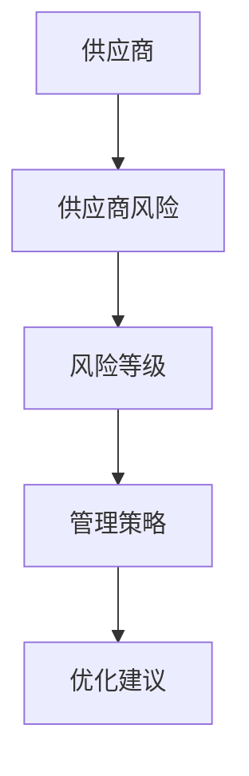
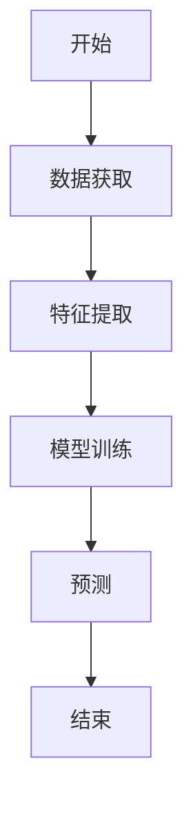
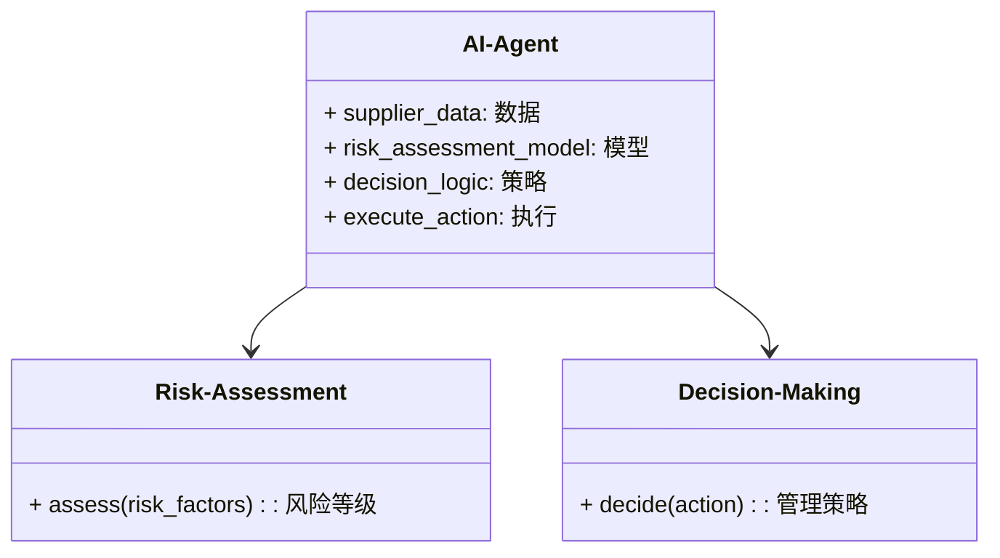
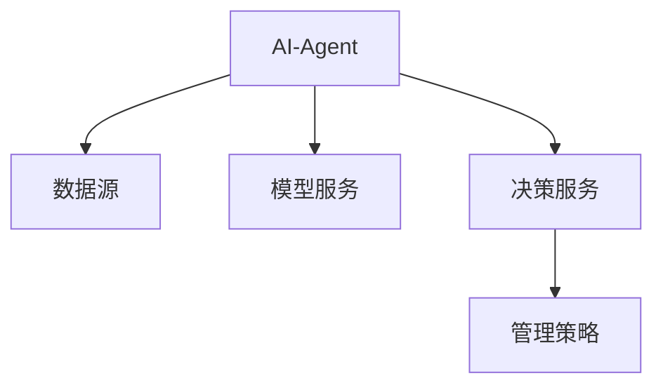
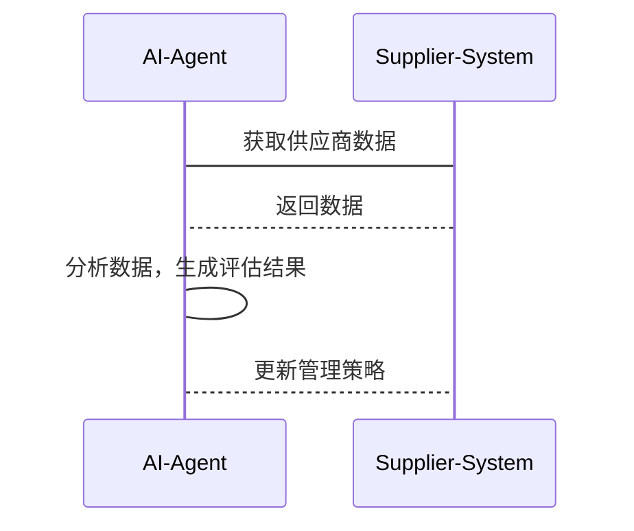

                 


# AI Agent在企业供应商风险评估与动态管理中的应用

## 关键词
AI Agent, 供应商风险评估, 动态管理, 企业供应链, 人工智能, 机器学习

## 摘要
本文深入探讨了AI Agent在企业供应商风险评估与动态管理中的应用，从背景介绍、核心概念、算法原理、系统架构到项目实战，详细阐述了AI Agent如何优化供应商管理。通过Mermaid图表和Python代码示例，本文展示了AI Agent在实际应用中的强大能力，并总结了最佳实践和未来发展方向。

---

# 第一章: 背景介绍

## 1.1 问题背景

### 1.1.1 企业供应商管理的重要性
现代企业的供应链管理中，供应商是关键环节。供应商的稳定性直接影响企业的运营效率和成本。有效的供应商管理需要实时监控和动态调整。

### 1.1.2 传统供应商管理的局限性
传统方法依赖人工经验，存在信息滞后、评估不全面等问题。面对市场波动和供应商状况的变化，传统方法难以及时应对。

### 1.1.3 AI Agent的应用价值
AI Agent能够实时收集和分析数据，提供动态评估和决策支持，显著提升供应商管理的效率和准确性。

## 1.2 问题描述

### 1.2.1 供应商风险的多样性和复杂性
供应商风险包括信用风险、交付风险和合规风险，这些风险相互交织，增加了管理的难度。

### 1.2.2 动态管理的挑战
市场环境变化快，供应商状况动态更新，传统静态评估方法难以适应。

### 1.2.3 现有解决方案的不足
现有工具依赖规则引擎，缺乏智能化和动态调整能力，无法应对复杂的供应商风险。

## 1.3 问题解决

### 1.3.1 AI Agent的核心作用
AI Agent通过实时数据处理、智能分析和自主决策，优化供应商管理流程。

### 1.3.2 技术驱动的管理优化
利用机器学习和自然语言处理技术，AI Agent能够从多源数据中提取有价值的信息，提高评估精度。

### 1.3.3 数据驱动的决策支持
通过数据建模和预测分析，AI Agent提供科学的决策支持，帮助企业在供应商管理中做出最优选择。

## 1.4 边界与外延

### 1.4.1 AI Agent的应用边界
AI Agent主要用于风险评估和管理，不涵盖企业供应链的其他方面，如生产调度。

### 1.4.2 与传统管理工具的区分
传统工具依赖规则和人工判断，AI Agent则基于数据驱动和智能算法，提供自动化和动态化的解决方案。

### 1.4.3 与其他企业管理系统的关系
AI Agent可与ERP、CRM等系统集成，形成协同效应，提升整体供应链管理能力。

## 1.5 概念结构与核心要素

### 1.5.1 AI Agent的基本构成
AI Agent由感知层、决策层和执行层组成，分别负责数据采集、模型计算和策略执行。

### 1.5.2 供应商风险评估的关键要素
包括供应商的历史表现、财务状况、行业声誉和合规记录等多维度数据。

### 1.5.3 动态管理的核心机制
基于实时数据流，AI Agent持续评估供应商风险，动态调整管理策略，确保供应链的稳定性和高效性。

---

# 第二章: 核心概念与联系

## 2.1 AI Agent的工作原理

### 2.1.1 信息收集与处理
AI Agent通过API和数据仓库获取供应商的历史交易数据、市场动态等信息，进行清洗和预处理。

### 2.1.2 风险评估模型
基于机器学习算法，AI Agent构建分类模型，将供应商分为不同风险等级，生成评估报告。

### 2.1.3 动态调整机制
根据实时数据和评估结果，AI Agent自动调整供应商权重，优化供应链布局，降低整体风险。

## 2.2 核心概念对比

| 特性          | 基于规则的传统方法 | AI Agent驱动的方法 |
|---------------|-------------------|---------------------|
| 数据来源      | 结构化数据         | 结构化+非结构化数据 |
| 处理方式      | 简单规则匹配      | 复杂模型计算         |
| 决策能力      | 有限              | 强大                |

## 2.3 实体关系图



---

# 第三章: 算法原理讲解

## 3.1 算法选择与流程



## 3.2 代码实现

### 3.2.1 数据预处理

```python
import pandas as pd
from sklearn.model_selection import train_test_split
from sklearn.ensemble import RandomForestClassifier
from sklearn.metrics import accuracy_score

# 加载数据
data = pd.read_csv('suppliers.csv')
X = data.drop('risk_level', axis=1)
y = data['risk_level']

# 划分训练集和测试集
X_train, X_test, y_train, y_test = train_test_split(X, y, test_size=0.2)

# 训练模型
model = RandomForestClassifier()
model.fit(X_train, y_train)

# 预测与评估
y_pred = model.predict(X_test)
print("Accuracy:", accuracy_score(y_test, y_pred))
```

### 3.2.2 模型优化

```python
# 调整超参数
from sklearn.model_selection import GridSearchCV

param_grid = {'n_estimators': [10, 20, 30], 'max_depth': [None, 10, 20]}
grid_search = GridSearchCV(model, param_grid, cv=5)
grid_search.fit(X_train, y_train)

best_model = grid_search.best_estimator_
print("Best Parameters:", grid_search.best_params_)
```

## 3.3 数学模型与公式

### 3.3.1 决策树算法
决策树通过信息增益构建树结构，公式如下：

$$
\text{信息增益}(D, A) = H(D) - H(D|A)
$$

其中，\( H(D) \)是数据集D的熵，\( H(D|A) \)是基于特征A的条件熵。

### 3.3.2 随机森林
随机森林通过集成学习提升模型鲁棒性，公式如下：

$$
\text{预测概率} = \frac{\sum_{i=1}^{n} \text{树i的预测结果}}{n}
$$

其中，\( n \)是树的数量。

---

# 第四章: 系统分析与架构设计方案

## 4.1 应用场景介绍

### 4.1.1 供应商风险监控
实时监控供应商的信用状况、交付能力和合规性，识别潜在风险。

### 4.1.2 动态管理
根据实时数据动态调整供应商权重和采购策略，优化供应链效率。

## 4.2 功能设计

### 4.2.1 领域模型



### 4.2.2 系统架构



### 4.2.3 接口设计
API接口定义：

```json
{
    "input": {
        "type": "object",
        "properties": {
            "supplier_id": { "type": "string" },
            "data": { "type": "object" }
        }
    },
    "output": {
        "type": "object",
        "properties": {
            "risk_level": { "type": "integer" },
            "management_strategy": { "type": "string" }
        }
    }
}
```

### 4.2.4 交互流程



---

# 第五章: 项目实战

## 5.1 环境安装

```bash
pip install pandas scikit-learn mermaid4j
```

## 5.2 核心实现

### 5.2.1 数据处理

```python
import pandas as pd
from sklearn.ensemble import RandomForestClassifier

# 加载数据
data = pd.read_csv('suppliers.csv')
X = data.drop(columns=['risk_level'])
y = data['risk_level']

# 划分数据集
X_train, X_test, y_train, y_test = train_test_split(X, y, test_size=0.2)

# 训练模型
model = RandomForestClassifier()
model.fit(X_train, y_train)

# 预测与评估
y_pred = model.predict(X_test)
print(f"Accuracy: {accuracy_score(y_test, y_pred)}")
```

### 5.2.2 模型部署

```python
from flask import Flask, request, jsonify

app = Flask(__name__)
model = RandomForestClassifier()
model.fit(X_train, y_train)

@app.route('/predict', methods=['POST'])
def predict():
    data = request.json
    prediction = model.predict([[data['feature']]])
    return jsonify({'risk_level': int(prediction[0])})
```

## 5.3 案例分析

### 5.3.1 数据分析
分析历史供应商数据，识别高风险供应商，优化采购策略。

### 5.3.2 算法优化
通过调整模型参数，提高预测准确率，增强评估效果。

### 5.3.3 系统优化
优化接口设计，提升系统响应速度，确保实时性。

---

# 第六章: 最佳实践与小结

## 6.1 最佳实践

### 6.1.1 数据质量
确保数据准确性和完整性，提升模型性能。

### 6.1.2 模型选择
根据业务需求选择合适的算法，平衡准确率和效率。

### 6.1.3 系统维护
定期更新模型，监控系统运行状态，及时修复问题。

## 6.2 小结
AI Agent通过智能化手段优化供应商管理，提升企业供应链的稳定性和竞争力。

## 6.3 注意事项
- 数据隐私和安全问题
- 模型的可解释性
- 系统的实时性和稳定性

## 6.4 拓展阅读
推荐书籍和论文，深入学习AI在供应链管理中的应用。

---

# 作者

作者：AI天才研究院/AI Genius Institute & 禅与计算机程序设计艺术 /Zen And The Art of Computer Programming

---

以上是《AI Agent在企业供应商风险评估与动态管理中的应用》的完整目录大纲和文章内容。通过逐步分析和详细讲解，本文为企业提供了AI Agent在供应商管理中的实用指导和解决方案。

